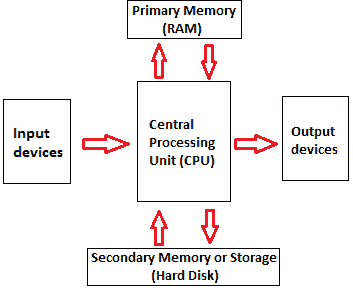

# 计算机组件

> 原文：<https://www.javatpoint.com/computer-components>

下面给出了 5 个主要的计算机组件:

*   输入设备
*   中央处理器
*   输出设备
*   主存储器
*   辅助存贮器

计算机组件的操作如下所示:

**1)输入:**是将原始数据、指令和信息输入计算机的过程。它是在输入设备的帮助下进行的。

**2)存储:**计算机有一级存储器和二级存储器来存储数据和指令。它在将数据发送到中央处理器进行处理之前存储数据，并在将其显示为输出之前存储处理后的数据。

**3)处理:**是将原始数据转化为有用信息的过程。这个过程由计算机的中央处理器执行。它从存储器中取出原始数据，对其进行处理，然后将处理后的数据发送回存储器。

**4)输出:**是通过显示器、打印机、扬声器等输出设备呈现处理后的数据的过程。

**5)控制:**该操作由作为中央处理器一部分的控制单元执行。控制单元确保所有基本操作以正确的方式和顺序执行。