# 输入设备

> 原文：<https://www.javatpoint.com/input-devices>

输入设备使用户能够向计算机发送数据、信息或控制信号。计算机的中央处理器接收输入并对其进行处理以产生输出。

**一些流行的输入设备有:**

1.  [键盘](#Keyboard)
2.  [鼠标](#Mouse)
3.  [扫描仪](#Scanner)
4.  [操纵杆](#Joystick)
5.  [光笔](#LightPen)
6.  [数字化仪](#Digitizer)
7.  [麦克风](#Microphone)
8.  [磁性墨水字符识别(MICR)](#MICR)
9.  [光学字符阅读器(OCR)](#OCR)
10.  [数码相机](#DigitalCamera)
11.  [划桨](#Paddle)
12.  [方向盘](#SteeringWheel)
13.  [手势识别设备](#GestureRecognition)
14.  [光炮](#LightGun)
15.  [触摸板](#TouchPad)
16.  [远程](#Remote)
17.  [触摸屏](#TouchScreen)
18.  [VR](#VR)
19.  网络摄像头
20.  [生物识别设备](#BiometricDevices)

* * *

## 1)键盘

[键盘](https://www.javatpoint.com/computer-shortcut-keys)是一种基本输入设备，用于通过按键将数据输入计算机或任何其他电子设备。它有不同的字母、数字、字符和功能按键。键盘通过[通用串行总线](https://www.javatpoint.com/usb-full-form)或蓝牙无线通信设备连接到电脑。

**键盘类型:**根据使用的地区和语言，可以有不同类型的键盘。一些常见的键盘类型如下:

**i) QWERTY 键盘:**

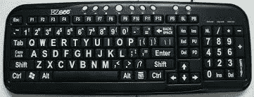

它是现代电脑最常用的键盘。它以最上面一排按钮的前六个字母命名，甚至在不使用拉丁字母的国家也很流行。它如此受欢迎，以至于有些人认为它是唯一一种与计算机一起用作输入设备的键盘。

**ii) AZERTY 键盘:**

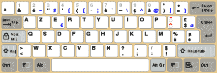

它被认为是标准的法语键盘。它是在法国开发的 QWERTY 布局的替代布局，主要用于法国和其他欧洲国家。一些国家已经制造了自己版本的 AZERTY。

它的名字来源于键盘左上角的前六个字母。AZERTY 键盘中的 Q 和 W 键与 QWERTY 键盘中的 A 和 Z 键互换。此外，在 AZERTY 键盘中，M 键位于 L 键的左侧。

AZERTY 键盘与 QWERTY 键盘的区别不仅在于字母的位置，还在于许多其他方面，例如，它强调重音，这是写法语等欧洲语言所必需的。

**iii) DVORAK 键盘:**

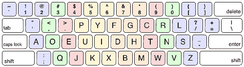

开发这种键盘布局是为了通过减少打字时的手指移动来提高打字速度。最常用的字母被放在一排，以提高打字质量。

* * *

## 2)鼠标

鼠标是一种手持输入设备，用于在屏幕上移动光标或指针。它被设计成在平坦的表面上使用，并且通常在它们之间具有左右按钮和滚轮。笔记本电脑配有一个可以像鼠标一样工作的触摸板。它允许您通过在触摸板上移动手指来控制光标或指针的移动。一些鼠标带有集成的功能，如额外的按钮来执行不同的按钮。

老鼠是道格拉斯·C·恩格尔巴特在 1963 年发明的。早期的鼠标在设备下面集成了一个滚球作为运动传感器。现代鼠标设备采用光学技术，通过可见或不可见的光束控制光标移动。鼠标根据计算机的类型和鼠标的类型通过不同的端口连接到计算机。

### 鼠标的常见类型:

**i)轨迹球鼠标:**

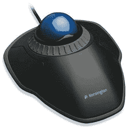

它是一个固定的输入设备，具有球机制来移动屏幕上的指针或光标。球半插入设备中，可以用手指、拇指或手掌轻松滚动，以在屏幕上移动指针。这个装置有传感器来检测球的旋转。它保持静止；你不需要在操作面上移动它。因此，如果您的桌面空间有限，不需要像鼠标一样移动它，这是一款理想的设备。

**ii)机械鼠标:**

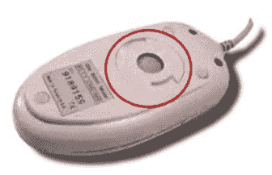

它有一个球和几个滚轮系统来跟踪它的运动。这是一种有绳的鼠标。机械鼠标可用于高性能。缺点是它们容易将灰尘带入机械装置，因此需要定期清洁。

**iii)光学鼠标:**

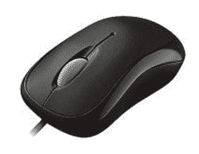

光学鼠标使用光学电子设备来跟踪其运动。它比机械鼠标更可靠，也需要更少的维护。然而，它的性能会受到操作表面的影响。为了获得最佳效果，应该使用普通的无光泽鼠标垫。粗糙的表面可能会给光学识别系统带来问题，而光滑的表面可能会错误地反射光线，从而导致跟踪问题。

**iv)无绳或无线鼠标:**

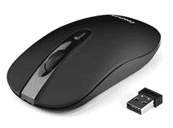

顾名思义，这种类型的鼠标没有线缆，而是使用 IrDA(红外)或无线电(蓝牙或 Wi-Fi)等无线技术来控制光标的移动。它用于改善使用鼠标的体验。它使用电池作为电源。

* * *

## 3)扫描仪

扫描仪使用图片和文本页面作为输入。它扫描图片或文档。然后，扫描的图片或文档被转换成数字格式或文件，并作为输出显示在屏幕上。它使用光学字符识别技术将图像转换成数字图像。扫描仪的一些常见类型如下:

**扫描仪类型:**

**i)平板扫描仪:**

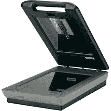

它有一块玻璃和一个移动的光学 CIS 或 CCD 阵列。灯光照亮窗格，然后图像被放置在玻璃窗格上。光线穿过玻璃窗格，扫描文档，从而生成其数字副本。扫描透明幻灯片时，您需要一个透明适配器。

**ii)手持扫描仪:**

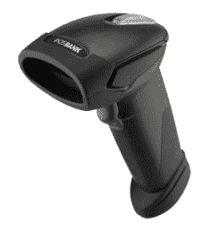

它是一种小型手动扫描设备，用手拿着，在要扫描的平面图像上滚动。使用这种设备的缺点是扫描时手要稳；否则，它可能会扭曲图像。其中一个常用的手持扫描仪是条形码扫描仪，你会看到在购物商店。

**iii) Sheetfed 扫描仪:**

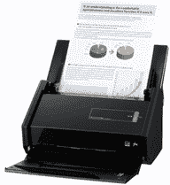

在该扫描仪中，文档被插入扫描仪中提供的插槽中。该扫描仪的主要部件包括送纸器、扫描模块和校准纸。光线在扫描仪中不移动。相反，文档在扫描仪中移动。适用于扫描单页文档，不适用于书籍、杂志等厚物件。

**iv)鼓式扫描仪:**

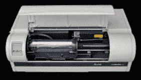

鼓式扫描仪有一个光电倍增管(PMT)来扫描图像。它没有像平板扫描仪那样的电荷耦合器件。光电倍增管对光极其敏感。图像放在玻璃管上，光线穿过图像，产生图像的反射，由光电倍增管捕获并处理。这些扫描仪分辨率高，适合进行详细扫描。

**v)相片扫描器:**

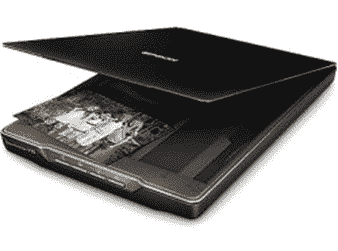

它是用来扫描照片的。它具有扫描照片所需的高分辨率和色深。一些照片扫描仪带有用于清理和修复旧照片的内置软件。

* * *

## 4)操纵杆

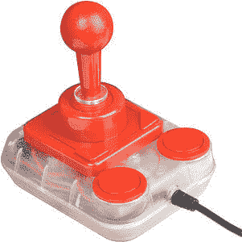

操纵杆也是像鼠标一样的定点输入设备。它是由一根带有球形底座的棍子组成的。底座安装在一个插座中，可以让操纵杆自由移动。操纵杆的移动控制着屏幕上的光标或指针。

第一个操纵杆是由美国海军研究实验室的 C. B .米里克发明的。操纵杆可以是不同的类型，例如位移操纵杆、手指操作操纵杆、手动操纵杆、等轴操纵杆等等。在操纵杆中，除非是垂直的，否则光标会一直朝着操纵杆的方向移动，而在鼠标中，光标只有在鼠标移动时才会移动。

* * *

## 5)光笔

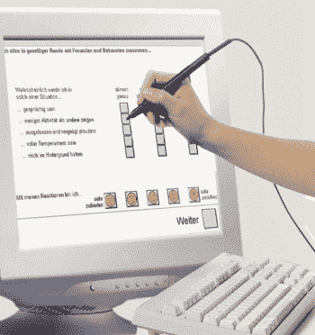

光笔是一种看起来像笔的计算机输入设备。光笔的尖端包含一个光敏检测器，使用户能够指向或选择显示屏上的对象。它的光敏头检测物体位置，并向[中央处理器](https://www.javatpoint.com/central-processing-unit)发送相应的信号。它与[液晶](https://www.javatpoint.com/lcd-full-form)屏幕不兼容，所以今天没有使用。如果需要，它还可以帮助您在屏幕上绘图。第一支光笔发明于 1955 年左右，是麻省理工学院旋风项目的一部分。

* * *

## 6)数字化仪

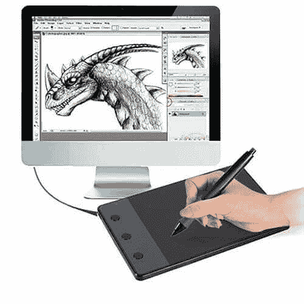

数字化仪是一种计算机输入设备，具有平坦的表面，通常带有手写笔。它使用户能够使用手写笔绘制图像和图形，就像我们用铅笔在纸上绘图一样。数字化仪上绘制的图像或图形出现在计算机监视器或显示屏上。该软件将触摸输入转换成线条，还可以将手写文本转换成打字文字。

它可以用来从胶带纸上捕捉手写签名和数据或图像。此外，它还用于接收图纸形式的信息，并将输出发送到计算机辅助设计应用程序和软件，如 [AutoCAD](https://www.javatpoint.com/autocad) 。因此，它允许您将手绘图像转换为适合计算机处理的格式。

* * *

## 7)麦克风

麦克风是用于输入声音的计算机输入设备。它接收声音振动，并将其转换成音频信号或发送到记录介质。音频信号被转换成数字数据并存储在计算机中。麦克风还使用户能够与他人远程通信。它还用于向演示文稿添加声音，并与网络摄像头一起用于视频会议。麦克风可以用不同的方式捕捉音频波；因此，下面描述了三种最常见的类型:

**i)动态:**

它是最常用的麦克风，设计简单。它有一个由金属线圈包裹的磁铁，磁铁前端有一个薄片。薄板将声波中的振动传递给线圈，再由线圈传递给电线，电线将声音像电信号一样传递出去。

**ii)冷凝器:**

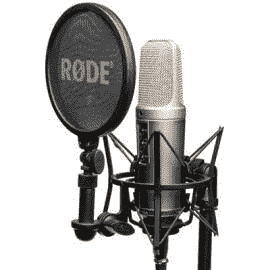

它是为录音而设计的，具有非常灵敏和平坦的频率响应。它有一个叫做振膜的前板和一个平行于前板的后板。当声音撞击振膜时，它振动振膜并改变两个板之间的距离。距离的变化以电信号的形式传递。

**iii)色带:**

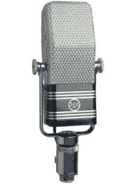

它以其可靠性而闻名。它有一条由铝、硬铝或纳米薄膜制成的薄带，悬浮在磁场中。声波引起色带的振动，从而产生与振动速度成正比的电压。电压作为电信号传输。早期的带状麦克风有一个变压器来增加输出电压，但现代的带状麦克风带有先进的磁铁来产生强信号。

* * *

## 8)磁性墨水字符识别(MICR)

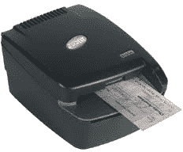

MICR 电脑的输入装置被设计用来读取用磁性墨水打印的文本。MICR 是一种字符识别技术，它利用了对磁场敏感的特殊磁化墨水。它被广泛用于银行处理支票和其他安全问题严重的组织。它可以在一分钟内百分之百准确地处理 300 张支票。支票(MICR 号)底部的细节用磁性墨水书写。带有 MICR 碳粉的激光打印机可用于打印磁性墨水。

该设备读取详细信息并发送到计算机进行处理。用磁性墨水打印的文件需要通过磁化墨水的机器，然后磁性信息被转换成字符。

* * *

## 9)光学字符阅读器

光学字符识别计算机输入设备旨在将手写、打字或打印文本的扫描图像转换为数字文本。它广泛用于办公室和图书馆将文件和书籍转换成电子文件。

它使用扫描仪处理和复制文档的物理形式。复制文档后，光学字符识别软件会将文档转换为双色(黑白)版本，称为位图。然后对亮区和暗区进行分析，选择暗区作为字符，亮区作为背景。它广泛用于将法律或历史文件的硬拷贝转换为 pdf。如果需要，可以编辑转换后的文档，就像我们编辑在 ms word 中创建的文档一样。

* * *

## 10)数码相机:

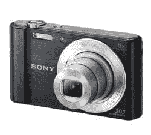

它是一种数字设备，因为它以数字方式捕获图像和记录视频，然后将它们存储在存储卡上。它配备了图像传感器芯片来捕捉图像，这与传统相机使用的胶片不同。除此之外，连接到电脑的相机也可以称为数码相机。

它有光电传感器来记录通过镜头进入相机的光线。当光线照射到光电传感器上时，每个传感器都会返回电流，用于产生图像。

* * *

## 11)桨:

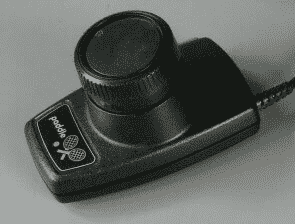

它是一种简单的输入设备，广泛应用于游戏中。它是一个用手握着的轮子，看起来像立体声音响上的音量旋钮，用于增加或减少音量。拨片来回移动或控制光标或游戏中的任何其他对象。它被广泛用作操纵杆的替代品。除此之外，术语“桨”还指许多设计用于控制电子设备、计算机等中的功能的手持设备。

* * *

## 12)方向盘:

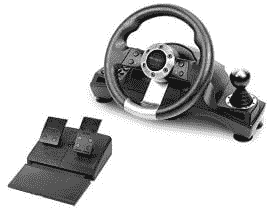

它在赛车游戏等赛车视频游戏中用作输入设备，或者在驾驶程序中用作驾驶车辆的虚拟模拟器。它像真正的方向盘一样工作，允许你右转或左转。方向盘可以配备加速和制动踏板装置以及换挡机构。因此，它使赛车游戏更具冒险性和娱乐性。

* * *

## 13)手势识别设备:

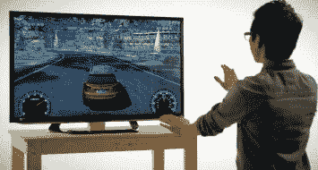

这些设备采用人类手势作为输入。有许多这样的设备可以对手势做出反应。例如，Kinect 就是这样一种设备，它可以观察玩家身体的运动，并将这些运动解释为视频游戏的输入。此功能在某些平板电脑和智能手机中也可用，在这些设备中，您可以执行某些任务，如使用手指手势拍照，如滑动、捏等。

* * *

## 14)光炮:

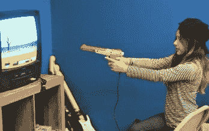

顾名思义，它是一种定点输入设备，旨在指向和拍摄视频游戏或街机等屏幕上的目标。这种光炮第一次在麻省理工学院的“呼尔温德”计算机上使用。当枪指向屏幕上的目标并扣动扳机时，屏幕会空白几分之一秒。在此期间，枪管中的光电二极管决定了枪的指向。例如，在猎鸭游戏中射鸭子。

## 15)触摸板:

它通常作为鼠标的替代品出现在笔记本电脑中。它允许你用手指移动或控制屏幕上的光标。就像鼠标一样，它也有两个左右点击的按钮。使用触摸板，您可以执行使用鼠标完成的所有任务，例如选择屏幕上的对象、复制、粘贴、删除、打开文件或文件夹等。

* * *

## 16)远程:

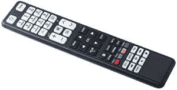

这是一个[硬件设备](https://www.javatpoint.com/hardware)，设计用于控制设备的功能，例如，电视遥控器，可用于在不离开座位的情况下从远处改变频道、增加或降低音量。第一台无绳电视遥控器是由齐尼思的罗伯特·阿德勒博士于 1956 年发明的。遥控器发送电磁波与设备通信。这些波可以是红外线、无线电波等。

* * *

## 17)触摸屏:

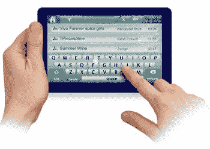

它是智能手机、平板电脑等设备的显示屏。，允许用户通过手指与设备交互或向设备提供输入。如今，大多数电子设备都配备了触摸屏，作为鼠标导航图形用户界面的替代品。例如，通过触摸，您可以解锁手机、打开电子邮件、打开文件、播放视频等。除此之外，它还用于许多设备，如照相机、汽车[全球定位系统](https://www.javatpoint.com/gps-full-form)、健身器等。

触摸屏的概念最早是由 E.A .约翰逊在 1965 年提出并发表的。第一个触摸屏是由欧洲核子研究中心工程师弗兰克·贝克和本特·斯顿普在 20 世纪 70 年代初开发的。

* * *

## 18)虚拟现实:

虚拟现实代表虚拟现实。它是由计算机生成的人工或虚拟环境。人可以使用诸如耳机、手套、头戴式耳机等一些输入设备来与该人工环境的虚拟对象交互。例如，他或她可以发现自己走在沙滩上，看足球比赛，在空中行走，等等。，而实际上并没有做这一切。

* * *

## 19)网络摄像头:

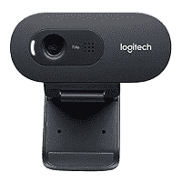

任何连接到电脑的摄像头都称为网络摄像头。电脑上提供的内置摄像头也可以视为网络摄像头。它是一种输入设备，因为它可以拍照，如果需要，还可以用来录制视频。图片和视频存储在[计算机内存](https://www.javatpoint.com/computer-memory)中，如果需要可以显示在屏幕上。虽然它的工作原理与数码相机几乎相同，但它不同于数码相机，因为它旨在拍摄紧凑的数码照片，这些照片可以轻松上传到网页上，并通过互联网与其他人共享。

* * *

## 20)生物识别设备:

[生物特征识别](https://www.javatpoint.com/biometrics-tutorial)是指通过指纹、眼角膜、面部结构等生物特征来识别一个人的过程。这是通过使用生物识别设备来完成的，这些设备根据其扫描特征和能力可以是不同的类型，例如:

**i)面部扫描仪:**

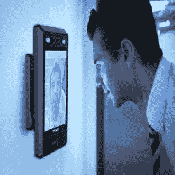

它旨在通过扫描一个人的脸来识别他或她的身份。它测量一个人的脸。例如，眼睛、鼻子和嘴巴之间的距离等。，相应地，它确认了一个人的身份。除此之外，区分一个人的照片和真实的人也足够聪明。

**ii)手动扫描仪:**

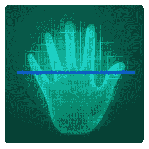

一个人的手也可以用来验证他或她的身份，因为每个人的手掌上都有一个独特的静脉图案，就像指纹一样。这个设备利用了这个特性；它通过扫描手掌来识别一个人。它利用红外线扫描静脉的模式和血液流动。手掌比指纹更独特。

**iii)指纹扫描仪:**

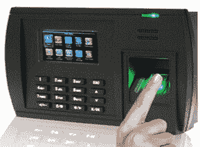

它扫描指纹来识别人或进行生物认证。这种设备的开发是为了记住这样一个事实，即世界上没有两个人可以有相同的指纹。它在公司中被广泛用作指纹考勤系统来标记员工的出勤情况。这种类型的扫描仪捕捉手指上的谷和脊的图案，并将其存储在内存或数据库中。当你将手指按在给定的空间上时，它会使用其模式匹配软件来验证身份。

**iv)视网膜或虹膜扫描仪:**

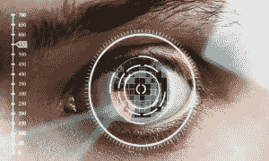

它扫描人眼睛的视网膜或虹膜来确认身份。这种设备比其他设备更安全，因为它几乎不可能复制视网膜或虹膜。它通过绘制眼睛的视网膜血管图案来工作。视网膜的血管更容易吸收光线，也可以通过适当的光照来识别。

在这次扫描中，一束低能红外光通过扫描仪的目镜照射到视网膜上。然后，该软件捕获视网膜中的血管网络，并使用它来验证一个人的身份。

**v)语音扫描仪:**

它记录了一个人的声音，并将其数字化，以创建一个独特的声波纹或模板。声纹存储在数据库中，用于验证一个人的声音以确认他或她的身份。此人需要用创建语音模板时使用的正常或相同的声音说话。它不太可靠，因为使用磁带录音会被误用。

* * *