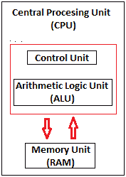

# 中央处理器

> 原文：<https://www.javatpoint.com/central-processing-unit>

中央处理器也称为处理器、中央处理器或微处理器。它执行计算机的所有重要功能。它接收来自硬件和活动软件的指令，并相应地产生输出。它存储所有重要的程序，如操作系统和应用软件。中央处理器还帮助输入和输出设备相互通信。由于中央处理器的这些特性，它通常被称为计算机的大脑。

中央处理器安装或插入主板上的中央处理器插座。此外，它还配备了一个散热器来吸收和散发热量，以保持中央处理器的冷却和平稳运行。

通常，中央处理器有三个组件:

*   算术逻辑单元
*   控制部件
*   存储器或存储单元

**控制单元:**它是控制单元中的电路，利用电信号指示计算机系统执行已经存储的指令。它从内存中取出指令，然后解码并执行这些指令。因此，它控制和协调计算机所有部分的功能。控制单元的主要任务是维护和调节处理器中的信息流。它不参与处理和存储数据。

**ALU:** 它是算术逻辑单元，执行算术和逻辑功能。算术函数包括加法、减法、乘法、除法和比较。逻辑功能主要包括数据的选择、比较和合并。一个中央处理器可能包含多个算术逻辑单元。此外，算术逻辑单元可以用来维护定时器，帮助运行计算机。

**存储器或存储单元/寄存器:**称为随机存取存储器(RAM)。它临时存储数据、程序以及处理的中间和最终结果。因此，它充当了一个临时存储区域，暂时保存数据，用于运行计算机。

## 什么是中央处理器时钟速度？

CPU 或处理器的时钟速度是指它一秒钟可以处理的指令数量。它以千兆赫为单位。例如，一个时钟速度为 4.0 GHz 的 CPU 意味着它可以在一秒钟内处理 40 亿条指令。

## 中央处理器的类型:

CPU 大多由英特尔和 AMD 制造，它们各自制造自己的 CPU 类型。在现代，市场上有很多类型的中央处理器。一些基本类型的中央处理器描述如下:

**单核 CPU:** 单核是最古老的计算机 CPU 类型，使用于上世纪 70 年代。它只有一个核心来处理不同的操作。它一次只能启动一个操作；当多个程序运行时，CPU 会在不同的数据流集之间来回切换。因此，它不适合多任务处理，因为如果运行多个应用程序，性能会降低。这些 CPU 的性能主要取决于时钟速度。它仍然用于各种设备，如智能手机。

**双核 CPU:** 顾名思义，双核 CPU 在单个集成电路(IC)中包含两个核心。尽管每个内核都有自己的控制器和缓存，但它们链接在一起作为一个单元工作，因此可以比单核处理器执行得更快，并且可以比单核处理器更有效地处理多任务。

**四核 CPU:** 这种类型的 CPU 在一个集成电路(IC)或芯片中配备了两个双核处理器。因此，四核处理器是一种包含四个独立单元(称为内核)的芯片。这些内核读取并执行中央处理器的指令。内核可以同时运行多条指令，从而提高与并行处理兼容的程序的整体速度。

四核中央处理器使用一种技术，允许四个独立的处理单元(核心)在单个芯片上并行运行。因此，通过在单个中央处理器中集成多个内核，可以在不提高时钟速度的情况下产生更高的性能。然而，只有当计算机软件支持多处理时，性能才会提高。支持多处理的软件将处理负载分配给多个处理器，而不是一次使用一个处理器。

## 中央处理器的历史:

**自 CPU 发明至今，CPU 发展的一些重要事件如下:**

*   1823 年，Jons Jackob Berzelius 男爵发现硅是迄今为止中央处理器的主要组成部分。
*   1903 年，尼古拉·特斯拉获得了门或开关的专利，它们是电子逻辑电路。
*   1947 年 12 月，约翰·巴丁、威廉姆·肖克利和沃尔特·布拉顿在贝尔实验室发明了第一个晶体管，并于 1948 年获得专利。
*   1958 年，罗伯特·诺伊斯和杰克·基尔比研制出第一个工作的集成电路。
*   1960 年，IBM 在纽约建立了第一个大规模生产晶体管的工厂。
*   1968 年，罗伯特·诺伊斯和戈登·摩尔成立了英特尔公司。
*   AMD(高级微器件)成立于 1969 年 5 月。
*   1971 年，英特尔在特德·霍夫的帮助下推出了第一款微处理器——英特尔 4004。
*   1972 年，英特尔推出了 8008 处理器；1976 年推出英特尔 8086，1979 年 6 月发布英特尔 8088。
*   1979 年，16/32 位处理器摩托罗拉 68000 发布。后来，它被用作苹果麦金塔和阿米加电脑的处理器。
*   1987 年，孙推出了处理器。
*   1991 年 3 月，AMD 推出了 AM386 微处理器系列。
*   1993 年 3 月，英特尔发布了奔腾处理器。1995 年，Cyrix 推出 Cx5x86 处理器，与英特尔奔腾处理器展开竞争。
*   1999 年 1 月，英特尔推出了赛扬 366 兆赫和 400 兆赫处理器。
*   2005 年 4 月，AMD 推出了第一款双核处理器。
*   2006 年，英特尔推出了酷睿 2 双核处理器。
*   2007 年，英特尔推出了不同类型的酷睿 2 四核处理器。
*   2008 年 4 月，英特尔推出了第一个英特尔凌动处理器系列 Z5xx 系列。它们是带有 200 兆赫图形处理器的单核处理器。
*   2009 年 9 月，英特尔发布了首款四核酷睿 i5 台式机处理器。
*   2010 年 1 月，英特尔发布了酷睿 2 四核处理器 Q9500、首款酷睿 i3 和 i5 移动处理器、首款酷睿 i3 和 i5 台式机处理器等众多处理器。同年 7 月，它发布了首款六核酷睿 i7 台式机处理器。
*   2017 年 6 月，英特尔推出首款酷睿 i9 台式机处理器。
*   2018 年 4 月，英特尔发布了首款酷睿 i9 移动处理器。

* * *