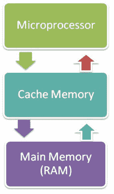

# 高速缓冲存储器

> 原文：<https://www.javatpoint.com/cache-memory>

高速缓冲存储器是一种高速存储器，它的大小很小，但比主存储器(RAM)快。中央处理器可以比主存储器更快地访问它。因此，它被用来与高速中央处理器同步并提高其性能。

高速缓冲存储器只能由中央处理器访问。它可以是主存储器的保留部分，也可以是中央处理器外部的存储设备。它保存着中央处理器经常使用的数据和程序。因此，它确保每当中央处理器需要数据时，数据都可以立即供中央处理器使用。换句话说，如果中央处理器在高速缓冲存储器中找到所需的数据或指令，它不需要访问主存储器(随机存取存储器)。因此，通过充当内存和中央处理器之间的缓冲区，它加快了系统性能。

## 高速缓冲存储器的类型:

**L1:** 是一级缓存，称为一级缓存或 L1 缓存。在这种类型的高速缓冲存储器中，少量内存存在于中央处理器内部。如果一个中央处理器有四个内核(四核中央处理器)，那么每个内核都有自己的一级缓存。由于内存存在于中央处理器中，因此它可以以与中央处理器相同的速度工作。该内存的大小从 2KB 到 64 KB 不等。L1 高速缓存还具有两种类型的高速缓存:指令高速缓存，用于存储中央处理器所需的指令，以及数据高速缓存，用于存储中央处理器所需的数据。

**L2:** 该缓存称为二级缓存或 L2 缓存。这个二级缓存可能在中央处理器内部，也可能在中央处理器外部。一个 CPU 的所有内核都可以有自己独立的二级缓存，或者它们可以共享一个 l 2 缓存。万一是在 CPU 外面，就用非常高速的总线和 CPU 连接。该缓存的内存大小在 256 KB 到 512 KB 的范围内。就速度而言，它们比 L1 缓存慢。

**L3:** 被称为三级缓存或 L3 缓存。并非所有处理器中都有此缓存；一些高端处理器可能有这种类型的缓存。该缓存用于增强 1 级和 2 级缓存的性能。它位于中央处理器之外，由中央处理器的所有内核共享。它的内存大小从 1 MB 到 8 MB 不等。虽然它比 L1 和 L2 缓存慢，但比随机存取存储器快。

## 高速缓存如何与 CPU 协同工作？

当中央处理器需要数据时，首先，它会在 L1 缓存中查找。如果它在 L1 找不到任何东西，它会在 L2 的缓存中寻找。如果再次在 L2 缓存中找不到数据，它会查找三级缓存。如果在高速缓冲存储器中发现数据，则称之为高速缓存命中。相反，如果在缓存中找不到数据，则称为缓存未命中。

如果数据在任何高速缓冲存储器中都不可用，它会在随机存取存储器中查找。如果随机存取存储器也没有数据，那么它将从硬盘驱动器获得该数据。

因此，当计算机第一次启动时，或者应用程序第一次打开时，数据在缓存或内存中不可用。在这种情况下，中央处理器直接从硬盘驱动器获取数据。此后，当你启动计算机或打开一个应用程序时，中央处理器可以从高速缓冲存储器或随机存取存储器中获取数据。

* * *