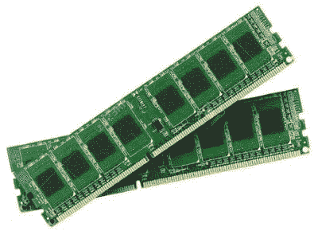
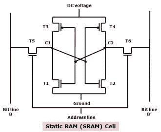
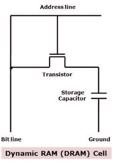
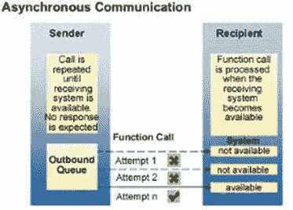
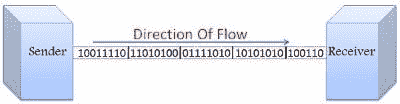
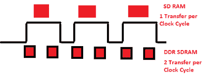
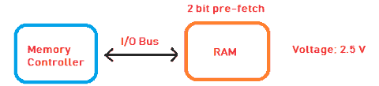
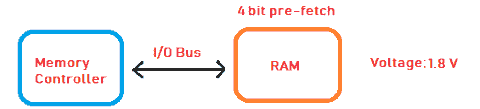
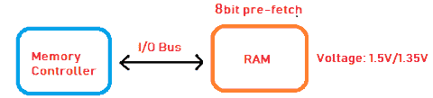
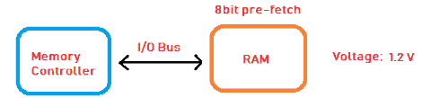

# 什么是内存？

> 原文：<https://www.javatpoint.com/ram>

随机存取存储器，代表随机存取存储器，是一种硬件设备，通常位于计算机主板上，充当中央处理器的内部存储器。当你打开电脑时，它允许中央处理器存储数据、程序和程序结果。它是计算机的读写存储器，这意味着信息可以写入其中，也可以从中读取。

RAM 是易失性存储器，这意味着它不会永久存储数据或指令。当您打开计算机时，硬盘上的数据和指令存储在内存中，例如，当计算机重新启动时，当您打开程序时，操作系统和程序通常从硬盘或固态硬盘加载到内存中。中央处理器利用这些数据来执行所需的任务。一旦你关闭计算机，内存就会丢失数据。所以，只要电脑开着，数据就会一直保存在内存中，而当电脑关机时，数据就会丢失。将数据加载到内存中的好处是，从内存中读取数据比从硬盘中读取要快得多。

简单来说，我们可以说 RAM 像人？s 短期记忆，而硬盘存储就像一个人的长期记忆。短期记忆会短时间记住事情，而长期记忆会长时间记住。短期记忆可以用储存在大脑中的信息来刷新？的长期记忆。电脑也是这样工作的；当 Ram 充满时，处理器会转到硬盘，用新数据覆盖 RAM 中的旧数据。它就像一张可重复使用的草稿纸，你可以在上面写笔记、数字等。，用铅笔。如果你用完了纸上的空间，你可能会抹掉你不再需要的东西；RAM 的行为也是这样的，RAM 中不必要的数据在填满时会被删除，并被当前操作所需的硬盘中的新数据所取代。

随机存取存储器以芯片的形式单独安装在主板上，或者以连接到主板的小板上的几个芯片的形式出现。它是计算机的主存储器。与硬盘、固态硬盘、光驱等其他存储器相比，读写速度更快。

计算机的性能主要取决于内存的大小或存储容量。如果它没有足够的内存(随机存取存储器)来运行操作系统和软件程序，将导致性能下降。所以，电脑内存越多，工作速度就越快。存储在内存中的信息是随机存取的，而不是像在光盘或硬盘上那样按顺序存取。所以，它的访问时间要快得多。

## 内存的历史:

*   第一种类型的内存是在 1947 年推出的威廉姆斯管。它被用在阴极射线管中，数据以带电点的形式存储在脸上。
*   第二种类型的随机存取存储器是 1947 年发明的磁芯存储器。它由微小的金属环和连接每个环的电线组成。一个环存储一位数据，可以随时访问。
*   我们今天所知的内存，即固态存储器，是由罗伯特·丹纳德于 1968 年在国际商用机器公司托马斯·沃森研究中心发明的。它被特别称为动态随机存取存储器(DRAM)，并且具有存储数据位的晶体管。需要持续的电源来维持每个晶体管的状态。
*   1969 年 10 月，英特尔推出了第一款 DRAM——英特尔 1103。这是它的第一个商用动态随机存取存储器。
*   1993 年，三星推出了 KM48SL2000 同步 DRAM (SDRAM)。
*   1996 年，复员方案特别提款权已经上市。
*   1999 年，RDRAM 可用于计算机。
*   2003 年，DDR2 SDRAM 开始销售。
*   2007 年 6 月，DDR3 SDRAM 开始销售。
*   2014 年 9 月，DDR4 上市。

## 内存类型:

集成内存芯片有两种类型:

1.  静态随机存取存储器:
2.  动态随机存取存储器:

这两种类型的内存都是易失性的，因为当电源关闭时，它们都会丢失内容。

**1)静态 RAM:**

静态随机存取存储器是一种随机存取存储器，它保持数据位的状态，或者只要通电就能保存数据。它由存储单元组成，被称为静态随机存取存储器，因为它不需要定期刷新，因为它不需要电源来防止泄漏，不像动态随机存取存储器。所以，它比 DRAM 快。

它有一个特殊的晶体管排列，构成一个触发器，一种存储单元。一个存储单元存储一位数据。大多数现代静态随机存取存储器存储单元由六个互补金属氧化物半导体晶体管制成，但缺少电容器。静态随机存取存储器芯片中的存取时间可以低至 10 纳秒。然而，动态随机存取存储器中的存取时间通常保持在 50 纳秒以上。

此外，它的周期时间比动态随机存取存储器的周期时间短得多，因为它在访问之间不会暂停。由于使用静态随机存取存储器的这些优点，它主要用于系统高速缓冲存储器、高速寄存器和小型存储体，如显卡上的帧缓冲器。

静态随机存取存储器速度很快，因为其电路的六晶体管配置保持电流在一个方向或另一个方向(0 或 1)流动。0 或 1 状态可以立即写入和读取，无需等待电容充满或耗尽。早期的异步静态随机存取存储器芯片顺序执行读写操作，但现代的同步静态随机存取存储器芯片重叠读写操作。

静态随机存取存储器的缺点是，在存储空间(内存)相同的情况下，它的存储单元比动态随机存取存储器的存储单元占用更多的芯片空间，因为它的部件比动态随机存取存储器多。因此，每个芯片的内存更少。

**2)动态内存:**

动态随机存取存储器也是由存储单元组成的。它是一种集成电路，由数百万个晶体管和电容组成，体积非常小，每个晶体管与一个电容排成一行，形成一个非常紧凑的存储单元，因此数百万个晶体管可以放在一个存储芯片上。因此，动态随机存取存储器的存储单元具有一个晶体管和一个电容器，并且每个单元在集成电路内的电容器中表示或存储一位数据。

电容将这一位信息或数据保存为 0 或 1。同样存在于单元中的晶体管充当开关，允许存储芯片上的电路读取电容器并改变其状态。

电容器需要定期刷新，以保持电容器中的电荷。这就是它被称为动态随机存取存储器的原因，因为它需要不断刷新以维护其数据，否则它会忘记它保存的是什么。这是通过将存储器放置在每秒重写数据几百次的刷新电路上来实现的。动态随机存取存储器的存取时间约为 60 纳秒。

我们可以说电容器就像一个储存电子的盒子。储存一个？1?在存储单元中，盒子里充满了电子。然而，储存一个？0?，它是空的。缺点是盒子有一个漏洞。几毫秒后，满箱就变成了空的。因此，为了使动态内存工作，中央处理器或内存控制器必须在所有电容放电之前对其进行充电。为了实现这一点，内存控制器读取内存，然后将其写回来。这被称为刷新内存，这个过程每秒钟会自动继续数千次。因此，这种类型的内存需要一直动态刷新。

## 动态随机存取存储器的类型:

**i)异步 DRAM:**

这种类型的动态随机存取存储器与中央处理器时钟不同步。因此，这种内存的缺点是，中央处理器无法知道从输入输出总线上的内存中获取数据的确切时间。下一代随机存取存储器克服了这一限制，它被称为同步动态随机存取存储器。

**ii)同步 DRAM:**

同步动态随机存取存储器(SDRAM)于 1996 年末开始出现。在软件随机存取存储器中，随机存取存储器与中央处理器时钟同步。它允许中央处理器或者确切地说是内存控制器知道确切的时钟周期或定时或者数据在总线上可用的周期数。因此，中央处理器不需要进行存储器访问，从而可以提高存储器的读写速度。SDRAM 也被称为单数据速率 SDRAM (SDR SDRAM)，因为数据只在时钟周期的每个上升沿传输。请参见以下描述中的图像。

**㈢DDR SDRAM:**

下一代同步动态随机存取存储器被称为 DDR 随机存取存储器。它是为了克服特别提款权的局限性而开发的，并于 2000 年初用于个人电脑存储器。在 DDR SDRAM (DDR RAM)中，数据在每个时钟周期内传输两次；在周期的正沿(上升沿)和负沿(下降沿)期间。所以，它被称为双数据速率 SDRAM。

有不同代的 DDR SDRAM，包括 DDR1、DDR2、DDR3 和 DDR4。如今，我们在台式机、笔记本电脑、手机等内部使用的内存。，大多不是 DDR3 就是 DDR4 RAM。复员方案特别提款权的类型:

**a) DDR1 SDRAM:**

DDR1 SDRAM 是 SDRAM 的第一个高级版本。在这个随机存取存储器中，电压从 3.3 伏降低到 2.5 伏。数据在时钟周期的上升沿和下降沿传输。因此，在每个时钟周期中，预取 2 位，而不是 1 位，这通常称为 2 位预取。它主要工作在 133 兆赫至 200 兆赫的范围内。

此外，输入输出总线的数据速率是时钟频率的两倍，因为数据在上升沿和下降沿传输。因此，如果一个 DDR1 内存运行在 133 兆赫，数据速率将是两倍，每秒 266 兆传输。

㈡DDR 2 SDRAM:

它是 DDR1 的高级版本。它工作在 1.8 V 而不是 2.5V。由于每个周期内预取的位数增加，其数据速率是上一代的两倍；预取 4 位而不是 2 位。这个内存的内部总线宽度增加了一倍。例如，如果输入输出总线是 64 位宽，它的内部总线宽度将等于 128 位。因此，单个周期可以处理双倍的数据量。

㈢DDR 3 SDRAM:

在这个版本中，电压从 1.8 V 进一步降低到 1.5 V。由于预取的位数从 4 位增加到 8 位，数据速率比上一代随机存取存储器提高了一倍。我们可以说 RAM 的内部数据总线宽度比上一代增加了 2 倍。

**iv） DDR4 SDRAM：**

在这个版本中，工作电压从 1.5 V 进一步降低到 1.2 V，但可以预取的位数与上一代相同；每个周期 8 位。内存的内部时钟频率是以前版本的两倍。如果工作在 400 兆赫，输入输出总线的时钟频率将是 4 倍，即 1600 兆赫，传输速率将等于每秒 3200 兆传输。

静态内存和动态内存的区别:

| 静态随机存取储存器 | 动态随机存取存储器 |
| 它是一个静态内存，因为它不需要重复刷新。 | 这是一个动态内存，因为它需要不断刷新，否则会丢失数据。 |
| 它的存储单元由 6 个晶体管组成。因此，它的单元比相同物理尺寸的动态随机存取存储器占用更多的芯片空间，提供更少的存储容量(内存)。 | 它的存储单元由一个晶体管和一个电容器组成。因此，它的单元比相同物理尺寸的 SRM 占用更少的芯片空间，并提供更多的内存。 |
| 它比动态随机存取存储器更贵，位于处理器上或处理器和主存储器之间。 | 它比静态随机存取存储器便宜，并且大部分位于主板上。 |
| 它具有较低的访问时间，例如 10 纳秒。所以，它比 DRAM 快。 | 它具有更高的访问时间，例如超过 50 纳秒。所以，它比 SRAM 慢。 |
| 它将信息存储在双稳态锁存电路中。它需要常规电源，因此功耗更大。 | 信息或每一位数据都存储在集成电路内的独立电容中，因此功耗更低。 |
| 它比动态随机存取存储器更快，因为它的存储单元不需要刷新，并且总是可用的。因此，它主要用于各种设备的中央处理器和高速缓冲存储器中的寄存器。 | 它不如静态随机存取存储器快，因为它的存储单元是连续刷新的。但是，它仍然用在主板上，因为它制造起来更便宜，并且需要更少的空间。 |
| 它的周期时间更短，因为它不需要在访问和刷新之间暂停。 | 它的周期时间比静态随机存取存储器的周期时间长。 |
| 例如:中央处理器中的 L2 和勒缓存。 | 例如:手机、电脑等中的 DDR3、DDR4。 |
| 大小范围从 1 MB 到 16MB。 | 智能手机的大小从 1 GB 到 3 GB 不等，笔记本电脑的大小从 4GB 到 16GB 不等。 |

* * *