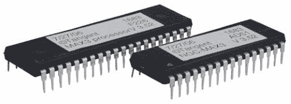
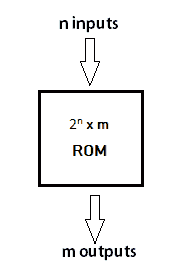
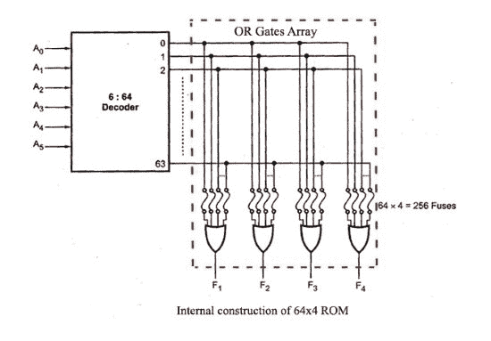

# 什么是 ROM？

> 原文：<https://www.javatpoint.com/rom>

只读存储器，代表只读存储器，是一种永久性存储信息的存储设备或存储介质。它也是计算机的主要存储单元，与随机存取存储器一起。它被称为只读存储器，因为我们只能读取存储在上面的程序和数据，而不能在上面写入。它仅限于阅读永久存储在单元中的单词。

只读存储器的制造商在制造只读存储器时将程序装入只读存储器。在此之后，ROM 的内容不能被更改，这意味着您以后不能对其内容进行重新编程、重写或擦除。但是，有一些类型的只读存储器可以修改数据。

只读存储器包含特殊的内部电子保险丝，可以针对特定的互连模式(信息)进行编程。存储在芯片中的二进制信息由设计者指定，然后在制造时嵌入单元中，以形成所需的互连图案(信息)。一旦模式(信息)建立，即使电源关闭，它也会留在设备内。因此，它是一个非易失性存储器，因为它保存信息，即使在电源关闭或您关闭计算机时。

当位存储在设备的硬件配置中时，信息以位的形式通过称为编程只读存储器的过程被添加到随机存取存储器中。所以，只读存储器是一种可编程逻辑器件。

只读存储器的一个简单例子是视频游戏控制台中使用的盒式磁带，它允许系统运行许多游戏。永久存储在个人电脑和其他电子设备上的数据，如智能手机、平板电脑、电视、交流电等。也是 ROM 的一个例子。

例如，当您启动电脑时，屏幕不会立即出现。因为在启动过程中启动计算机需要存储在只读存储器中的启动指令，所以出现需要时间。引导过程的工作是启动计算机。它将操作系统加载到安装在计算机上的主内存中。计算机的微处理器使用也存在于计算机存储器(只读存储器)中的基本输入输出系统程序在引导过程中启动计算机。它允许您打开计算机并将计算机与操作系统连接起来。

只读存储器也用于存储固件，固件是一种软件程序，它保持连接到硬件或编程在硬件设备上，如键盘、硬盘、视频卡等。它存储在硬件设备的闪存中。它向设备提供指令，以便与其他设备进行通信和交互。

## 只读存储器框图:

只读存储器块有“n”条输入线和“m”条输出线。输入变量的每个位组合称为一个地址。通过输出线输出的每个位组合称为一个字。每个字的位数等于输出行数 m。

二进制数的地址是指 n 个变量的地址之一。因此，输入变量为“n”的可能地址数为 2n。一个输出字有一个唯一的地址，由于只读存储器中有 2n 个不同的地址，所以只读存储器中有 2n 个独立的字。给定时间输出线上的字取决于施加到输入线上的地址值。

## 只读存储器的内部结构:

内部结构包括两个基本组件:解码器和或门。解码器是将编码形式(如二进制编码十进制)解码成十进制形式的电路。所以，输入是二进制形式，输出是它的十进制等价物。只读存储器中的所有或门都将解码器的输出作为它们的输出。让我们以 64 x 4 的只读存储器为例。结构如下图所示。

该只读存储器由 64 个字组成，每个字 4 位。因此，将有四条输出线，输出线上可用的 64 个字之一由六条输入线确定，因为我们只有六个输入，因为在这个只读存储器中，我们有 26 = 64，所以我们可以指定 64 个地址或分位数。对于每个地址输入，都有一个唯一的选定单词。例如，如果输入地址为 000000，将选择字号 0 并将其应用于输出行。如果输入地址是 111111，字号 63 被选择并加到输出线上。

## 只读存储器的类型:

### 1)屏蔽只读存储器(MROM):

它是最古老的只读存储器。它已经过时，因此在当今世界的任何地方都没有使用。它是一种硬件存储设备，在制造商制造时，程序和指令存储在其中。因此，它在制造过程中被编程，以后不能被修改、重新编程或擦除。

MROM 芯片由集成电路制成。芯片通过特定的输入输出路径发送电流，该路径由芯片上的行和列之间的熔丝位置决定。电流必须通过一条熔丝使能路径，因此只能通过制造商选择的输出返回。这就是为什么重写和任何其他修改在这个记忆中不是不可能的。

### 2)可编程只读存储器:

PROM 是 ROM 的空白版本。它作为空白存储器制造，并在制造后编程。我们可以说它在制造时是空白的。你可以购买，然后用一种叫做程序员的特殊工具编程一次。

在芯片中，电流流经所有可能的路径。程序员可以通过发送高电压烧断不需要的保险丝来选择一条特定的电流路径。用户有机会根据自己的要求对其进行编程或添加数据和指令。由于这个原因，它也被称为用户编程只读存储器，因为用户可以对其进行编程。

将数据写入可编程只读存储器芯片；使用称为可编程只读存储器编程器或可编程只读存储器刻录机的设备。对可编程只读存储器进行编程的过程称为刻录可编程只读存储器。一旦被编程，数据以后就不能修改了，所以也被称为一次性可编程器件。

**用途:**用于手机、视频游戏机、医疗器械、RFID 标签等。

### 3)可擦除可编程只读存储器:

EPROM 是一种可多次重编程和擦除的只读存储器。擦除数据的方法大不相同；它带有一个石英窗口，特定频率的紫外线通过该窗口大约 40 分钟，以擦除数据。因此，它会保留其内容，直到暴露在紫外线下。你需要一种叫做可编程只读存储器编程器或可编程只读存储器刻录机的特殊设备来重新编程可编程只读存储器。

**用途:**用于某些微控制器中存储程序，如某些版本的英特尔 8048 和飞思卡尔 68HC11。

### 4)电可擦除可编程只读存储器:

只读存储器是一种只读存储器，可以重复擦除和重新编程，最多可达 10000 次。它也称为闪存 EEPROM，因为它类似于闪存。它被擦除并重新编程，无需使用紫外线。访问时间在 45 到 200 纳秒之间。

该存储器中的数据一次写入或擦除一个字节；而在闪存中，数据以块的形式写入和擦除。所以，它比 EEPROM 快。它用于在计算机和电子系统以及电路板等设备中存储少量数据。

**用途:**电脑的 BIOS 存储在这个内存中。

### 5)快闪 ROM:

它是 EEPROM 的高级版本。它将信息存储在由浮栅晶体管构成的存储单元的排列或阵列中。使用这种内存的好处是，您可以在特定时间删除或写入大约 512 字节的数据块。而在 EEPROM 中，一次只能删除或写入 1 个字节的数据。所以，这个内存比 EEPROM 快。

它可以被重新编程，而无需从计算机中移除。它的访问时间非常长，大约在 45 到 90 纳秒之间。它还非常耐用，因为它可以承受高温和高压。

**用途:**用于个人电脑和数字设备之间的数据存储和传输。它用于 u 盘、MP3 播放器、数码相机、调制解调器和固态硬盘。许多现代计算机的基本输入输出系统存储在闪存芯片上，称为闪存基本输入输出系统。

* * *