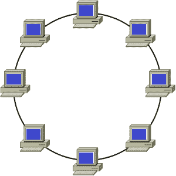
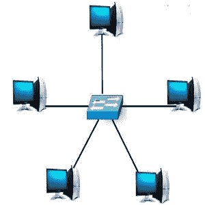
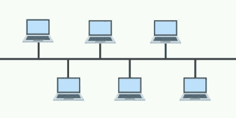
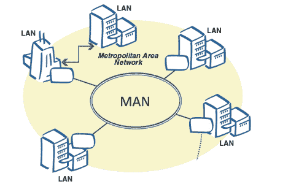
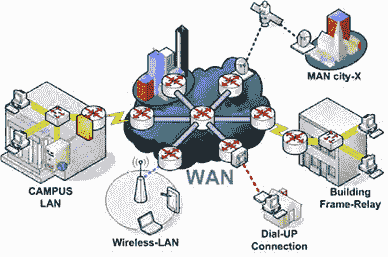

# 计算机网络

> 原文：<https://www.javatpoint.com/computer-network>

通过通信通道连接两台或多台计算机和其他支持硬件设备而建立的网络称为计算机网络。它使计算机能够相互通信并共享命令、数据等。，包括硬件和软件资源。

## 计算机网络的用途:

*   它允许您共享资源，如打印机、扫描仪等。
*   您可以在网络用户之间共享昂贵的软件和数据库。
*   它便于从一台计算机到另一台计算机的通信。
*   它允许用户通过网络交换数据和信息。

## 流行的计算机网络:

*   局域网
*   城域网
*   广域网

## 局域网:

顾名思义，局域网是一种在小区域内运行的计算机网络，即它连接小地理区域内的计算机，如办公室、公司、学校或任何其他组织。因此，它存在于特定的区域内，例如家庭网络、办公网络、学校网络等。

局域网可以是有线或无线网络或两者的组合。局域网中的设备通常使用以太网电缆连接，以太网电缆提供了连接路由器、交换机和计算机等多个设备的接口。例如，使用一台路由器、几根以太网电缆和计算机，您可以在家中、办公室等创建一个局域网。在这个网络中，一台计算机可以充当服务器，作为网络一部分的其他计算机可以充当客户端。

### 局域网的拓扑结构:

拓扑:指计算机网络中计算机(节点)的排列。局域网的主要拓扑如下:

环形拓扑:

顾名思义，在环形拓扑中，计算机以环形和闭环的方式连接。该拓扑中的消息仅在环的一个方向上从一个节点移动到另一个节点，并由每个节点检查匹配的目的地址。因此，数据会一直移动，直到到达目的地。所有节点都是相等的；它们之间不存在客户机-服务器关系。由于节点是环形的，如果一个节点无法传输数据，通信流就会被切断。

### 星型拓扑:

在这种拓扑中，所有计算机都分别连接到一个中心节点或连接点，该节点可以是服务器、集线器、路由器或交换机。这种拓扑结构的优点是，如果一根电缆不工作，只有相应的节点会受到影响，其余节点将顺利工作。一个节点发送给另一个节点的所有数据或消息都要经过中心集线器。

这种拓扑易于设计和实现，也易于向中心节点添加额外的节点。这种拓扑的主要缺点是容易在中心连接点出现瓶颈或故障，即中心节点的故障会影响整个通信。

### 总线拓扑:

在这种布置中，节点(计算机)通过接口连接器连接到一条通信线路(中央电缆)，该线路在两个方向上传送信息。所有节点连接的中心电缆是网络的主干。它被称为公共汽车。这种安排中的信号在两个方向上传播到所有机器，直到它找到接收机器。它比其他拓扑更容易设置，因为它只使用一根中央电缆来建立网络。

### 局域网的优势:

*   它提供了比广域网和城域网更高的运行速度。
*   它不太贵，而且易于安装和维护。
*   它完美地满足了特定组织的要求，如办公室、学校等。
*   它可以是有线或无线的，也可以是两者的组合。
*   它比其他网络更安全，因为它是一个很小的设置，可以很容易地处理。

### 局域网的主要功能:

*   **文件共享:**它允许您在局域网内将文件从一台计算机共享或传输到另一台计算机。例如，在银行中，它可以用来从服务器向客户端发送包含客户交易详细信息的文件。
*   **共享打印机:**它还允许共享访问打印机、文件服务器等。例如，通过局域网连接的十台计算机可以使用一台打印机、文件服务器、传真机等。
*   **计算能力共享:**它允许客户端访问服务器的计算能力，例如应用服务器，因为在局域网中的客户端上运行的一些应用可能需要更高的计算能力。
*   **邮件和消息相关服务:**允许局域网内计算机之间收发邮件。您需要有一个邮件服务器。
*   **数据库服务:**它还允许在数据库服务器的帮助下存储和检索数据。

## 城域网:

城域网是一种高速网络，遍布大的地理区域，如大城市或城镇。它是通过使用路由器和本地电话交换线路连接局域网而建立的。它可以由私人公司运营，也可以是由本地电话公司等公司提供的服务。

城域网是希望共享数据或信息的相对较大区域的人们的理想选择。它通过高速载体或传输介质(如铜、光纤和微波)提供快速通信。城域网常用的协议有 X.25、帧中继、异步传输模式(ATM)、xDSL(数字用户线路)、ISDN(综合业务数字网)、ADSL(非对称数字用户线路)等。

城域网覆盖的面积比局域网大，但比广域网小。它的网络从 5 公里到 50 公里不等。此外，它还提供连接局域网到广域网和互联网的上行链路。一个组织可以使用城域网连接位于全市不同办公室的所有局域网。

### 城域网的例子:

*   有线电视网络
*   提供高速 DSL 线路的电话服务
*   IEEE 802.16 或 WiMAX
*   城市中相连的消防站
*   城市中学校的相连分支

### 城域网的优势:

*   **更便宜:**建立城域网并将其连接到广域网的成本更低。
*   **高速:**数据传输速度超过 WAN。
*   **本地邮件:**可以快速发送本地邮件。
*   **接入互联网:**它可以让你共享你的互联网连接，从而多个用户可以接入高速互联网。
*   **易于设置:**可以通过连接多个局域网轻松设置一个 MAN。
*   **高安全性:**比 WAN 更安全。

## 广域网:

广域网延伸到很大的地理区域。它不局限于办公室、学校、城市或城镇，主要通过电话线、光纤或卫星链路建立。它主要被银行和跨国公司等大型组织用来与他们在世界各地的分支机构和客户沟通。虽然它在结构上与城域网相似，但在覆盖范围上与城域网不同，例如城域网覆盖范围高达 50 公里，而 WAM 覆盖的距离大于 50 公里，例如 1000 公里或更远。

广域网通过使用 TCP/IP 协议与网络设备(如交换机、路由器、防火墙和调制解调器)相结合来工作。它不连接单个计算机；相反，它们被设计用来连接像局域网和城域网这样的小型网络，以创建一个大型网络。互联网被认为是世界上最大的广域网，因为它通过互联网服务提供商连接各种局域网和城域网。

计算机通过公共网络连接到广域网，如电话系统、租用线路或卫星。广域网的用户不拥有网络，因为它是连接远程计算机系统的大型设施。然而，他们需要订购电信提供商提供的服务才能使用该网络。

### 广域网的优势:

*   **大网络范围:**跨越 2000 公里以上的大地理区域，例如从一个国家到另一个国家。
*   **集中数据:**允许你的不同办公分支机构使用你的总公司服务器进行数据的检索和共享。因此，你不？不需要购买电子邮件服务器、文件服务器和备份服务器等。
*   **获取更新的文件和数据:**它为需要实时服务器的公司提供了一个理想的平台，让员工在几秒钟内交换更新的文件。
*   **高带宽:**它提供比普通宽带连接更高的带宽。因此，它可以通过提供不间断的数据传输和通信来提高您公司的生产率。
*   **工作负载分配:**有助于将您的工作负载分配到其他位置。你可以在不同的国家雇佣员工，并让他们在你的办公室工作。

### 广域网的例子:

互联网
美国国防部
证券交易所网络
铁路预约系统
大银行‘自动取款机’网络
卫星系统

访问:[计算机网络教程](computer-network-tutorial)

* * *