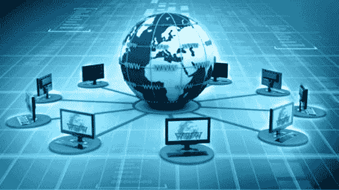
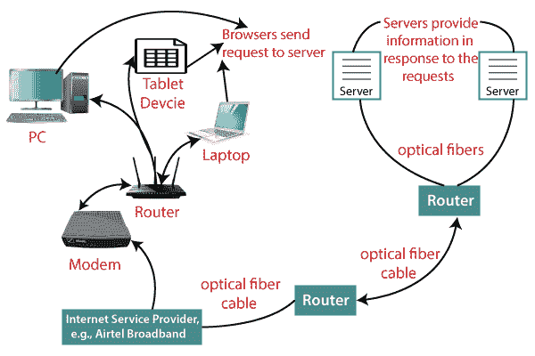

# 互联网

> 原文：<https://www.javatpoint.com/internet>

互联网是一个全球网络，它将世界上数十亿台计算机相互连接并连接到万维网。它使用标准互联网协议套件(TCP/IP)连接全球数十亿计算机用户。它是通过使用光纤等电缆和其他无线和网络技术建立的。目前，互联网是世界各地计算机之间发送或交换信息和数据的最快方式。

据信，互联网是由美国“国防高级计划局”(DARPA)部门开发的。它于 1969 年首次连接。

## 为什么互联网被称为网络？

互联网被称为网络，因为它通过使用路由器、交换机和电话线以及其他通信设备和通道连接世界各地的计算机和服务器来创建网络。因此，它可以被认为是一个物理电缆的全球网络，如铜质电话线、光纤电缆、电视电缆等。此外，即使像 3G、4G 或无线网络这样的无线连接也利用这些电缆来访问互联网。

互联网不同于[万维网](https://www.javatpoint.com/what-is-world-wide-web)，因为万维网是由计算机和服务器通过互联网连接而成的网络。因此，互联网是网络的支柱，因为它提供了建立[万维网](https://www.javatpoint.com/www-full-form)的技术基础设施，并充当了将信息从一台计算机传输到另一台计算机的媒介。它使用网络浏览器在客户端显示信息，并从网络服务器获取信息。

互联网不是完全由一个人或组织拥有的。它是一个基于物理基础设施的概念，将网络与其他网络连接起来，创建一个由数十亿台计算机组成的全球网络。截至 2016 年 8 月 12 日，全世界有 30 多亿互联网用户。

## 互联网是如何工作的？

**在了解这之前，让我们先了解一些与互联网相关的基础知识:**

互联网在客户端和服务器的帮助下工作。连接到互联网的设备，如笔记本电脑，被称为客户端，而不是服务器，因为它没有直接连接到互联网。但是，它通过互联网服务提供商(ISP)间接连接到互联网，并由一个 IP 地址标识，该地址是一串数字。就像你有一个唯一标识你家的地址一样，一个 IP 地址也是你设备的送货地址。IP 地址由你的 ISP 提供，你可以看到你的 ISP 给了你的系统什么 [IP](https://www.javatpoint.com/ip-full-form) 地址。

服务器是存储网站的大型计算机。它还有一个 IP 地址。存储大量服务器的地方称为数据中心。服务器接受客户端通过浏览器通过网络(互联网)发送的请求，并做出相应的响应。

要访问互联网，我们需要一个域名，它代表一个 IP 地址号码，即每个 IP 地址都被分配了一个域名。例如，youtube.com、facebook.com、paypal.com 被用来表示 IP 地址。域名的产生是因为一个人很难记住一长串数字。但是互联网不理解域名，它理解的是 IP 地址，所以当你在浏览器搜索栏输入域名时，互联网必须从一个巨大的电话簿中获取这个域名的 IP 地址，这个电话簿被称为 [DNS](https://www.javatpoint.com/dns-full-form) (域名服务器)。

例如，如果你有一个人的名字，你可以通过搜索他的名字在电话簿中找到他的电话号码。互联网以同样的方式使用域名系统服务器来查找域名的 IP 地址。DNS 服务器由 ISP 或类似组织管理。

**现在在了解了基础知识之后，让我们看看互联网是如何工作的？**

当您打开电脑并在浏览器搜索栏中键入域名时，您的浏览器会向 DNS 服务器发送请求以获取相应的 IP 地址。获取 IP 地址后，浏览器将请求转发到相应的服务器。

一旦服务器收到提供特定网站信息的请求，数据就开始流动。数据通过光缆以数字格式或光脉冲的形式传输。由于服务器放置在很远的地方，数据可能需要通过光缆传输数千英里才能到达您的计算机。

光纤连接到路由器，路由器将光信号转换成电信号。这些电信号通过以太网电缆传输到您的笔记本电脑。因此，您通过互联网接收所需的信息，互联网实际上是连接您和服务器的电缆。

此外，如果您正在使用 wifi 或移动数据的无线互联网，来自光缆的信号首先被发送到手机发射塔，并从那里以电磁波的形式到达您的手机。

互联网由位于美国的互联网名称与号码分配机构管理。它管理 IP 地址分配、[域名](https://www.javatpoint.com/what-is-domain)注册等。

互联网上的数据传输非常快。当你按下回车键时，你会从离你几千英里远的服务器上获得信息。这种速度的原因是数据以二进制形式(0，1)发送，这些 0 和 1 被分成称为数据包的小片段，可以高速发送。

## 互联网的优势:

*   **即时通讯:**你可以使用互联网向任何人发送消息或交流，如电子邮件、语音聊天、视频会议等。
*   **获取方向:**利用 GPS 技术，可以获取一个城市、国家等几乎每个地方的方向。你可以在附近找到餐馆、购物中心或任何其他服务机构。
*   **网购:**它允许你在网上购物，比如你可以是衣服、鞋子、预定电影票、火车票、飞机票等等。
*   **支付账单:**可以在线支付账单，比如电费、煤气费、大学费用等。
*   **网上银行:**可以使用网上银行，在网上银行可以查看余额、收款或转账、获取对账单、申请支票簿等。
*   **在线销售:**你可以在线销售你的产品或服务。它帮助你接触更多的客户，从而增加你的销售和利润。
*   **在家办公:**如果需要在家办公，可以使用可以上网的系统。如今，许多公司允许员工在家工作。
*   **娱乐:**可以听网络音乐，看视频或电影，玩网络游戏。
*   **云计算:**它可以让你将电脑和支持互联网的设备连接到云存储、云计算等云服务。
*   **职业建设:**你可以在不同的求职门户网站上在线搜索职位，如果需要还可以通过电子邮件给你发送简历。

* * *