# 计算机端口

> 原文：<https://www.javatpoint.com/computer-ports>

端口是计算机上提供的连接或插孔，用于将外部或外围设备连接到计算机，例如，您需要设备上的端口来连接键盘、鼠标、笔驱动器等。因此，它充当了[计算机](https://www.javatpoint.com/computer-fundamentals-tutorial)和外部设备之间的接口或连接点。它也被称为通信端口，因为它是您插入外围设备的点，以允许设备和计算机之间的数据传输或通信。一般来说，它们的数量是 4 到 6 个，并且出现在计算机的背面或侧面。

根据用于通信的协议类型，计算机端口可以有两种类型:串行端口和并行端口。

## 串行端口:

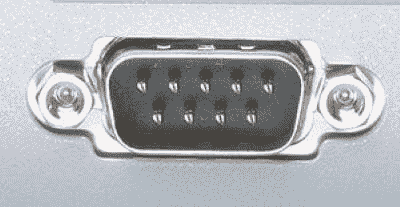

这种类型的端口提供了使用串行协议连接到外围设备的接口。在这个端口中，通过一条通信线路传输数据的速率是一次一位。例如，D-超小型或 D-子连接器是一种常用的串行端口，它承载 RS-232 信号。

## 并行端口:

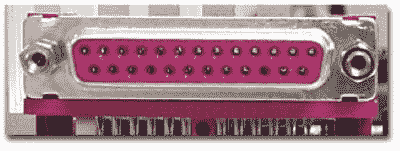

顾名思义，并行端口是一种接口，它允许计算机和设备之间通过多条通信线路以并行方式进行通信或数据传输。例如，打印机端口是并行端口。

## 计算机端口示例:

### 1) PS/2:

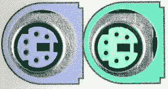

顾名思义，它是由 IBM 的个人系统/2 系列计算机引入的。这些连接器是彩色编码的，例如，绿色代表鼠标，紫色代表键盘。除此之外，它是一个六针的 DIN 连接器。目前被 USB 口取代。

### 2) VGA 端口:

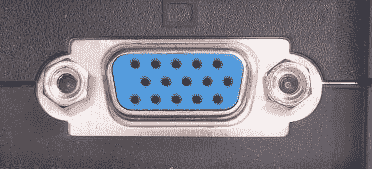

该端口常见于计算机、投影仪和高清电视中。它是一个 D-sub 连接器，称为 DR-15，因为它有 15 个引脚，排列成 3 行，每行 5 个引脚。它最常用于连接[中央处理器](https://www.javatpoint.com/cpu-full-form)和阴极射线管监视器。不过，大多数[液晶](https://www.javatpoint.com/lcd-full-form)和[发光二极管](https://www.javatpoint.com/led-full-form)显示器都带有 [VGA](https://www.javatpoint.com/vga-full-form) 端口。然而，这些端口不能保证高图像质量，因为 VGA 只能传输分辨率高达 648X480 的模拟视频信号。

随着对视频质量的需求和重视程度不断提高，VGA 端口逐渐被更先进的端口所取代，这些端口可以保证高视频质量，如 [HDMI](https://www.javatpoint.com/hdmi-full-form) 和显示端口。

### 3)数字视频接口:

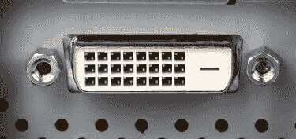

这是[中央处理器](https://www.javatpoint.com/central-processing-unit)和显示器之间的另一个接口。它是为传输无损数字视频信号和通过 VGA 技术取代模拟数字视频信号传输而开发的高速接口。

根据传输的信号，DVI 接口可以有三种类型:DVI-I、DVI-D 和 DVI-A。DVI-I 支持数字和模拟信号的组合，而 DVI-A 仅支持模拟信号，DVI-D 仅支持数字信号。

**Mini-DVI:** 顾名思义，它比一个常用的 DVI 端口还要小。它是苹果开发的 32 针端口，作为 Mini-VGA 端口的替代品。它可以使用各自的适配器传输各种类型的信号，如 S-Video、VGA 和复合信号。

### 4)显示端口:

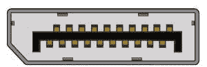

该接口允许将视频和音频从设备传输到显示屏。它是一种先进的显示技术，是作为 DVI 和 VGA 等旧接口的替代品开发的。显示端口可以在笔记本电脑、台式电脑、平板电脑、显示器等上看到。它有一个 20 针连接器，并提供比 DVI 端口更好的分辨率。

### 5) RCA 连接器:

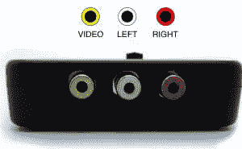

它被设计为接受由三根电缆(称为 RCA 电缆)传输的复合视频和立体声信号。RAC 电缆有三个彩色编码插头，它们连接到 RCA 连接器的三个相应的彩色插孔。每个彩色插孔都用金属圈起来。红色插孔支持右立体声通道，白色插孔支持左立体声通道，黄色插孔用于合成视频。

### 6)分量视频:

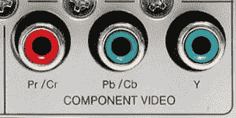

该接口允许将视频信号分成三个通道。分量视频通常有三个彩色编码的槽；红色、蓝色和绿色。每个时隙接收然后发送视频信号的特定分量。它提供比复合视频更高质量的视频，并且可以传送模拟和数字视频信号。

### 7) HDMI 端口:

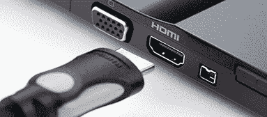

HDMI(高清晰度媒体接口)是一种数字接口，用于连接数码相机、游戏机等高清设备。，连接到带有 HDMI 端口的电脑和电视。除此之外，它还可以传输未压缩的视频和未压缩或压缩的音频信号。HDMI 的高级版本，如 2.0，可以传输分辨率高达 4096x2160 的视频信号。

### 8) USB:

[USB](https://www.javatpoint.com/usb-full-form) (通用串行总线)端口用途非常广泛；它可以用于各种目的，例如传输数据、连接外围设备，甚至作为智能手机、数码相机等充电设备的接口。如今，它已经取代了 PS/2 连接器、游戏端口、串行和并行端口等。

### USB 端口的类型:

**USB A 型:**

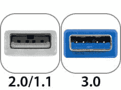

它是一个四针连接器，有许多版本，包括 USB 1.1、USB 2.0 和 USB 3.0 以及 USB 3.1。3.0 版是一个通用标准，支持高达 400 [MBps](https://www.javatpoint.com/mbps-full-form) 的数据传输速率。版本 3.1 允许高达 10 Gbps 的数据速率。

**USB 型 C:**

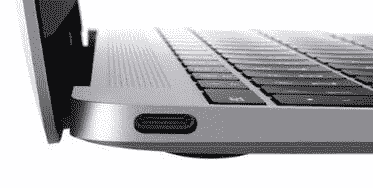

它是 USB 的最新设计，带有 24 个引脚，可以处理 3A 的电流。由于它可以处理大电流，因此也用于快速充电设备。这个端口是由通用串行总线实现者论坛开发的。这个端口的一个显著特点是它没有上下方向，这意味着你不需要翻转插头就可以将其插入 USB 端口。例如，一个 USB-C 插头是对称的，因此它可以以任何方式插入或插入。

### 9) RJ-45:

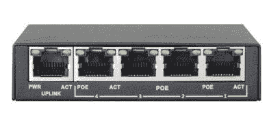

它是一个以太网风格的网络端口，可以在计算机和其他设备(如路由器、交换机等)上找到。此端口允许您的计算机与需要以太网网络的其他计算机和网络设备进行交互或通信。

它的完整形式是注册杰克 45。它也被称为以太网端口、网络插孔或 RJ45 插孔。它有八个引脚；因此，RJ45 电缆包括八根不同颜色的独立电线。除此之外，它看起来像一个电话插孔；然而，它比那个稍宽。

### 10) RJ11:

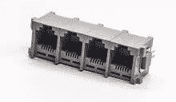

它也是一个注册的插孔，通常用作调制解调器、ADSL 和电话的接口，以及电话线的终端。虽然它看起来像 RJ45，但它不同于那个，因为它更小，只有六个引脚；它是一个 6P4C 连接器，显示它有六个引脚和四个触点。该端口主要用于连接拨号调制解调器，也称为电话连接器、调制解调器端口、电话插孔等。

### 11) 3.5 毫米音频插孔:

它是一个小的圆形连接器、端口或音频插孔，常见于笔记本电脑、电脑、电话等。它旨在连接有线耳机和扬声器。换句话说，它接受来自耳机、听筒等的针形插头。测量值“3.5 毫米”表示连接器的直径。

然而，在旧设备中，有两个音频插孔，一个用于麦克风，另一个用于耳机。除此之外，他们还有一个 2.5 毫米的电话耳机插孔或端口。

* * *