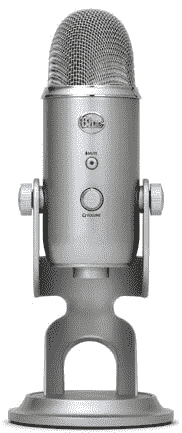
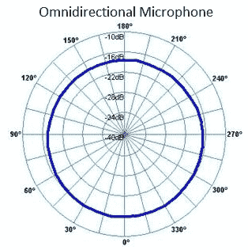
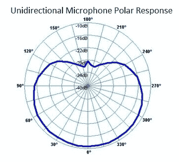
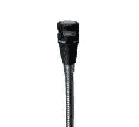
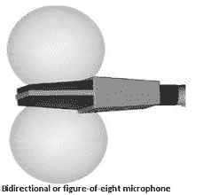

# 什么是麦克风？

> 原文：<https://www.javatpoint.com/microphone>

麦克风是爱米尔·贝利纳在 1877 年开发的输入设备。用于 ***将声波转换成电波*** 或 ***将音频输入电脑*** 。它通过将声波转换成电信号来捕获音频，该电信号可以是数字或模拟信号。这个过程可以通过计算机或其他数字音频设备来实现。第一个电子麦克风是基于液体机制，它使用一个隔膜，连接到一个电流充电针在稀硫酸溶液。它无法再现可理解的讲话。

通常，除了设备类型之外，麦克风的设计还基于方向性。如，**全向**麦克风能够拾取一个区域内的所有声音，但无法聚焦有背景噪声的特定主体。**双向**、定向和**霰弹枪麦克风**对面试有益。然而，**两个单向**设备可以提供相同的效果，就像心形麦克风一样。

### 麦克风在电脑上有什么用？

*   它用于录音。
*   它为用户提供了语音识别选项。
*   它允许用户记录乐器的声音。
*   它使用户能够在线聊天。
*   它允许我们使用网络电话。
*   它也用于电脑游戏。
*   此外，它还可以录制唱歌、播客和听写的声音。

### 麦克风的历史

如今，麦克风主要与音乐和娱乐领域有关，但在 17 世纪，科学家们开始研究如何放大声音。

**1665 年:**直到 19 世纪，麦克风这个词才被使用。英国物理学家和罗伯特·胡克被认为是远距离传播声音领域的先驱，因为他们开发了声学杯和弦式电话。

**1827 年:**查尔斯·惠斯通是第一个在麦克风发展过程中发挥重要作用的人。惠斯通是受欢迎的英国物理学家和创造者，他是电报的最佳发明者。基本上，他对各个领域都有兴趣，并在 19 世纪 20 年代花了一些时间研究声学。惠斯通是最早认识到声音可以借助介质通过波传播的科学家之一。这一发现让他很好奇，想找出远距离从一个地方向另一个地方传递声音的不同方式。他致力于开发一种可以放大低音的设备，并将这种设备命名为麦克风。

**1876 年:**爱米尔·贝利纳可能被认为是第一个现代麦克风的发明者。他最出名的是发明了留声机及其唱片。当贝林纳在美国百年纪念演讲中看到贝尔公司的演示时，他受到了启发，开始探索如何增强最近发明的电话的功能。贝尔公司的管理层对他推出的带有电话语音发射器的设备印象深刻，亚历山大·格雷厄姆·贝尔发明了**液体麦克风**。

**1878 年:**在柏林和爱迪生发明了麦克风之后，英美音乐教授大卫·爱德华·休斯介绍了第一个碳麦克风。它被用作许多仍在使用的碳麦克风的原型。

**1915:** 真空管放大器？er 的开发是为了提高许多设备的音量，包括麦克风。

**1916 年:** E.C .文特在贝尔实验室发明了电容式麦克风，也就是大家熟知的电容或静电麦克风。虽然他的任务是改善电话的音质，但他的创新也影响了麦克风。

**20 世纪 20 年代:**当收音机成为全世界新闻娱乐领域的第一来源时，对最优质麦克风的需求也随之增长。随后，RCA 公司推出了第一款用于无线电的带状麦克风 PB-31/PB-17。

**1928 年:**格奥尔格·诺依曼公司在德国成立，瞬间以麦克风闻名。第一个商用电容式麦克风是由格奥尔格·诺依曼开发的。由于它的形状，它也被称为“瓶子”。

**1931 年:**这一年，西电将其？rst 动态麦克风，618 电动。

**1957:** 雷蒙德·A·利特克是圣何塞州立学院和教育媒体资源学院的电气工程师。他发明了第一个无线麦克风，它是为多媒体应用以及广播、电视和高等教育而设计的。他也在今年申请了这款麦克风的专利。

**1959 年:**第一个单向装置 Unidyne III 麦克风被发明用来拾取麦克风顶部的声音，而不是侧面。此外，这一新的改进指明了未来麦克风的现代设计。

**1964 年**:詹姆斯·韦斯特和格哈德·塞斯勒获得了**驻极体麦克风**的专利号 3，118，022，该麦克风以较低的价格和较小的尺寸提供了更好的可靠性和更高的精度。它改变了麦克风领域，每年生产约 10 亿台。

**20 世纪 70 年代:**在这十年中，无论是动态话筒还是电容话筒都有了更多的提升。他们提供了更清晰的录音和更低的声级灵敏度。此外，20 世纪 70 年代还引入了大量中等收入国家。

**1983 年:**这一年，森海塞尔推出了第一款夹式麦克风，是为录音室设计的(MKE 2)，是一款指向性麦克风(MK# 40)。这些类型的设备仍在使用中。

**20 世纪 90 年代:**诺依曼发布了一款专为现场演出设计的冷凝器型号 KMS 105，为更好的品质提供了新的标准。

**2000 年代:**在这十年中，MEMS(微机电系统)麦克风越来越受便携式设备以及耳机、笔记本电脑和手机的欢迎。此外，随着汽车技术、可穿戴设备、智能家居等应用的发展，小尺寸麦克风的趋势也在增长。

**2010** :本征麦克风于 2010 年推出，由各种类型的高品质麦克风组成。这些麦克风被设计成排列在一个坚固的球体表面，使其能够从不同的方向拾取声音。

**现在:**麦克风技术不断发展。

**目前可用的用户友好型麦克风如下:**

*   带状麦克风
*   带有大小振膜的电容式麦克风
*   动态麦克风

### 麦克风是如何工作的？

*   每当一个人说话，声波就进入麦克风；它产生能量。
*   位于麦克风内部的振膜，通常由非常薄的塑料制成。当声波撞击振膜时，它会来回移动。
*   线圈连接到前后移动的隔膜上。
*   永久磁铁产生的磁场。线圈切断磁场，当线圈通过磁场前后移动时，电流流过它。
*   电流通过麦克风流向录音设备。该电流用于驱动录音设备，使您可以永久存储声音。此外，您可以放大电流并将其保存到扬声器中，扬声器将电流转换成更大的声音。

### 麦克风的类型

以下是麦克风的类型:

**1。全向麦克风:**它是一种能够从麦克风的各个侧面拾取声音的麦克风，因为它包含一个圆形极坐标图。例如，如果一个人从左、右、前、后对着麦克风说话，它将从四面平等地记录信号。这些麦克风主要用于录音室录制多人语音或乐器。它与单向麦克风相反，单向麦克风接收特定方向的声音。

**2。单向麦克风:**是一种只能拾取一个方向声音的麦克风。因此，当你以正确的方向说话时，它可以记录声音。当用户想要在播客或画外音期间录制他们的声音时，这种类型的麦克风是有益的。它的极坐标图显示，当用户在它面前说话时，它会接收到最大的声音。如下图所示:

**3。近距离麦克风:**这是另一种类型的麦克风，在这种麦克风中，您必须将嘴靠近麦克风，而不会发出任何噪音或声音，这种情况通常会在其他麦克风中发生。这些麦克风与手机、耳机以及语音识别软件一起使用。它为固定电台应用提供了出色的语音质量。此外，它还包括一个特色的消声线圈，以减少不必要的声音，提高语音通信的质量。

**4。双向麦克风:**也称为八位数麦克风，旨在以高灵敏度拾取麦克风正面和背面的声音。这在面试一个人时很有用，因为你希望从面试官和被面试者那里得到同样的声音。

下图显示了双向麦克风声音拾取模式，显示它拾取了正面和背面的部分声音。

**5。夹式话筒:**又称领夹式、翻领式、体式、颈式、领式或个人式话筒。这是一款小型免提无线麦克风，用于剧院、电视和公共演讲等免提操作。这些主要用于系领带、衣领、衬衫或其他服装。

### 麦克风如何向计算机输入数据？

麦克风是一种输入设备；它向计算机发送信息。例如，当它被用于记录音乐或声音时，信息(唱片)被存储在计算机上以响应将来的播放。此外，麦克风对于语音识别技术很重要，它将您的声音作为输入，并指定计算机要执行什么操作。

### 麦克风的不同部分

您可以独立购买以下给定的麦克风组件；因此，如果您的麦克风出现任何问题，本指南将帮助您确定应该更换哪个部件，从而解决问题，而不是购买新的麦克风。

麦克风包含几个部分，可以高效工作；这些措施如下:

*   **风屏:**是用户说话的麦克风部分。麦克风包括一个圆形屏障，由硬金属制成。挡风玻璃位于这个屏障下面。虽然大多数麦克风都有内置挡风玻璃，但这可能是在录音室或户外演出中使用挡风玻璃的问题；因此，他们可以使用额外的 pop 过滤器来消除问题。挡风玻璃是一层薄薄的泡沫，有助于提供最佳质量的声音，因为它可以阻止风进入振膜并在信号中产生不必要的噪音。
*   **横膈膜:**最类似于像人的耳鼓。当用户说话时，声波进入麦克风，它们撞击振膜并使其振动。在麦克风的帮助下，这种振动被转换成电信号。此外，提供最佳音质是整个麦克风最重要的因素。
*   **磁芯:**它是动态麦克风独有的，它还为线圈产生磁场。因此，振动可以转换成电信号。
*   **Coil:** 它也是动态麦克风独有的。它与振膜相连，当振膜开始振动时，线圈也开始振动。然后，线圈在磁铁之间来回移动；通过这种运动，线圈被充电，磁铁在信号中产生电能。
*   **胶囊:**胶囊是声音在任何麦克风中从振动转化为电信号的地方。有些麦克风需要太空舱来完成工作，有些则不需要太空舱。麦克风能够在一种叫做“幻像电源”的设置的帮助下从混音器中获取能量。您需要检查您的麦克风是否需要幻像电源。
*   **Body:** 麦克风的 Body 描述声音的质量，并指定麦克风将持续多长时间。它的车身看起来像汽车的底盘。最好的麦克风有一个坚固的机身，机身内有智能放置的电子设备；因此，它们可以保护麦克风免受跌落、撞击和其他东西的影响。
*   **输出:**它是任何麦克风中的一个地方，电缆将插入麦克风。XLR 是麦克风的默认电缆类型。这种三叉电缆的工作是发送立体声信号，可以根据需要购买任意长度。一些麦克风包括 1/4 英寸电缆的输出，一些价格较低的麦克风附带默认电缆。

### 如何检查电脑有没有麦克风？

电脑麦克风一般有两种类型:**内部**和**外部**。

**内置麦克风:**虽然在电脑中看到内置麦克风有些困难，因为它可以是电脑显示器边框下的小孔形式，也可以是笔记本电脑机身上的任何地方。另一方面，它们通常有“麦克风”一词或麦克风的小图片来指示麦克风在计算机或笔记本电脑上的位置。

**外接麦克风:**这些麦克风可以单独购买，插在电脑上。如果您没有连接麦克风的 USB 端口或声卡，则不能使用外部麦克风。声卡是您连接外部扬声器的地方，它位于计算机的背面。

* * *