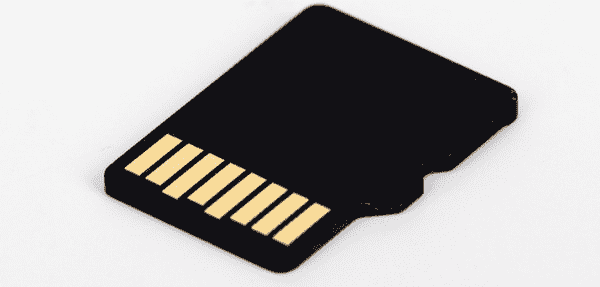
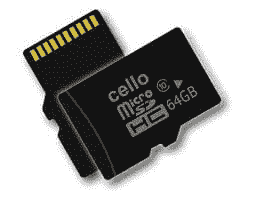
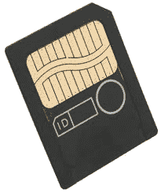
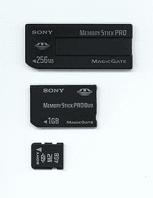
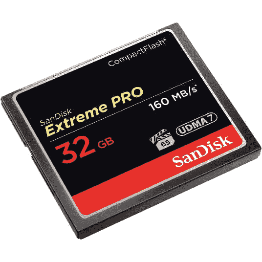
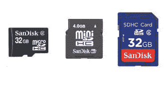
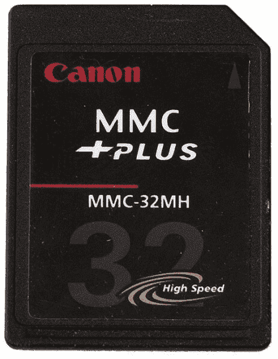

# 什么是存储卡？

> 原文：<https://www.javatpoint.com/memory-card>

存储卡是一种用于存储视频、照片或其他数据文件的存储设备。它提供了一个易失性和非易失性介质来存储来自插入设备的数据。它也被称为**闪存**。通常，它用于手机、数码相机、笔记本电脑、数码摄像机、游戏机、MP3 播放器、打印机等设备。

### 存储卡的历史

闪存是存储卡技术的基础，存储卡技术是由桀冈富士雄于 1980 年在 T2 东芝公司发明的。后来在 **1987** 被东芝商业化。

当数码相机和手机技术开始发展并变得更加复杂时，大约在 1990 年，存储卡被发布。如今，最常见的是手机包含 500 万像素的摄像头，这使得用户能够以高分辨率拍摄图片。由于手机的内部存储容量很低，大约有 10MB。因此，为了存储诸如音频、视频、照片等数据，需要存储卡来提供额外的存储。

第一个商用存储卡格式，个人电脑卡，通常用于连接输入/输出设备，如调制解调器，并用于工业应用。自 1994 年以来，推出了许多比个人计算机卡更小的存储卡格式。紧凑型闪存是第一张卡，然后是智能媒体和微型卡。

首先推出了**SD 卡**，然后按照 sd 卡格式开发了 MiniSD、MicroSD、MS Micro2 和 Micro SDHC。SanDisk 是最早加入内存需求潮流的制造商之一。存储卡不仅用于摄录机、手机和相机，还用于视频游戏控制器，如 Xbox、GameCube 和 Play station。

在 **1995** 年，东芝推出了一款智能媒体卡作为电脑软盘的继承者，这是一款基于 NAND 的闪存卡标准。智能媒体存储卡的存储容量从 **2 MB 到 128 MB** 不等，不足以存储今天的照片。智能媒体卡是早期存储卡中最小最薄的一种，由嵌入薄塑料卡中的单个“与非”芯片组成；弯曲它容易损坏，因为它是最小最薄的存储卡。特别是，这些存储卡在数码相机中很受欢迎，并且通常用于便携式设备。

**2001 年**CF 开始专业数码相机市场，仅 SM 一家就占据了几乎一半的数码相机市场。随着相机分辨率的提高，格式开始出现问题。存储卡的大小不能超过 128 兆字节，智能媒体卡也非常大，不适合使用。最终，在 1999 年，东芝转而使用更小、更大容量的 SD 卡(安全数字卡)。

在 **1997** 年，SanDisk 和 Siemens AG 推出了存储容量高达 512 GB 的**多媒体卡** (MMC)。它被用于消费电子产品。自从 SD 卡发布以来，多媒体卡在 1999 年就失去了人气。但就可在 [Windows](https://www.javatpoint.com/windows) 手机或[安卓](https://www.javatpoint.com/android-tutorial)中使用的内部存储而言，嵌入式 MMC 仍广泛应用于便携式设备中。

1998 年末，索尼推出了记忆棒，这是一种可移动的闪存卡格式。最初，它的存储容量很低，从 4 MB 到 128 MB。后来，它以更小的尺寸、最大的存储容量和更快的传输速度上市。在 2000 年代，记忆棒专门用于索尼产品，如 WEGA、数码相机、PlayStation 便携式手持游戏控制台和 VAIO 电脑。索尼从 2010 年开始支持 SD 卡格式，随着 Sd 卡格式的日益普及。如今，索尼数码相机使用 SD 和 SDHC 存储卡。

SD 卡协会开发了一种用于便携式设备的安全数字卡，这是一种存储卡格式。1999 年，松下的 SanDisk(松下电器)和东芝联合推出了 SD 卡，作为对多媒体卡(MMC)的改进。从那以后，它成为了行业的标准。

2000 年， [IBM](https://www.javatpoint.com/ibm-full-form) 和 Trek 科技发布并在商业市场销售 [USB](https://www.javatpoint.com/usb-full-form) (通用串行总线)。它包括带有集成 USB 接口的闪存，因为它是一个即插即用的数据存储设备。u 盘有许多不同的尺寸，用于数据备份、存储和文件传输。

2003 年，SD 卡的较小版本 miniSD 卡形式发布。特别是，新卡是为手机设计的；它们提供了与标准 SD 存储卡插槽的兼容性，因为它们与 miniSD 适配器一起封装。

微型 SD 卡于 2005 年发行，容量为 32、64、128 兆字节。2006 年，推出了尺寸从 64 MB 到 16 GB 的微型 M2 卡和尺寸从 2 GB 到 32 GB 的微型 SDHC 卡。

2010 年，SDXC 内存卡推出，代表**安全数字扩展容量**。SDXC 存储卡的初始存储容量为 64 GB，最多可扩展到 2 TB。此外，这些卡包括防水和防尘的特点；因此，它们能够承受高达 16 公斤的压力，同时速度超快。此外，该卡能够通过使用微软的 exFAT 处理大量数据和文件。

2016 年，三星面向手机、数码相机和消费电子设备的**通用闪存**发布。UFS 的目的是提高闪存存储的可靠性，并提供更高的数据传输速度。eMMCs 和 SD 卡一次只能执行一个操作，但 UFS 技术能够同时向存储设备读写数据。

与上一版本相比，SDUC 没有将最大存储容量从 2 TB 再次提高到 128 TB，并将速度提高 1.58 倍，而是在 2018 年 6 月宣布推出 SDHC 和 SDXC 卡，紧随原始 SD 的脚步。但是这些卡何时上市还没有确切的日期。

### 存储卡的类型

市场上有几种类型的存储卡，最常用的存储卡类型如下:

*   sd 卡
*   MicroSD(微额供资)
*   智能媒体卡
*   索尼记忆棒
*   CF (CompactFlash)
*   xD-图片卡
*   SDHC 卡
*   多媒体控制器

**SD 卡:**它是最常见的存储卡类型之一，代表**安全数字卡**，旨在提供小尺寸的大容量内存。主要用于手持电脑、数码摄像机、数码相机、手机等众多小型便携设备。大约有 8000 多种不同型号和 400 多个品牌的电子设备使用 SD 技术。它的尺寸为 32 x 24 x 2.1 毫米，重量约为 2 克，由于广泛使用，被认为是行业标准。

**MicroSD:** 它是一种可移动闪存卡，也称为 T-Flash 或 TransFlash，用于存储信息。SanDisk 开发了第一张 microSD 卡，并于 2005 年 7 月 13 日被批准为标准。它通常用于手机和其他尺寸从 128 MB 到 4 GB 的移动设备。

有些笔记本电脑具有 MicroSD 插槽功能，用户可以插入 MicroSD 来下载笔记本电脑上的数据或文件。如果您有一台台式计算机或您的笔记本电脑没有 MicroSD 插槽，您可以使用媒体读卡器，该读卡器还允许您查看 MicroSD 卡上的数据，并将数据传输到计算机。

**智能媒体卡:**这是一种由存储数据的闪存芯片组成的存储器。东芝开发了第一张智能媒体卡，存储容量从 2 MB 减小到 128 MB。它有一个嵌入在薄塑料卡中的 NAND 闪存芯片。它是最小的存储卡，只有 0.76 毫米厚，容易维护，成本比其他卡优惠。

**索尼记忆棒:**是索尼在 1998 年 10 月推出的一款闪存。它与索尼的数码相机和其他类型的电子设备一起用于存储数据。索尼几乎所有使用闪存介质的产品都使用记忆棒，因为它是索尼的专有产品。索尼发布了不同种类的记忆棒以及记忆棒微，记忆棒专业版，记忆棒双雄，记忆棒专业版双雄，记忆棒专业版 HG。记忆棒的存储容量从 4 MB 到 256 GB 不等，最大容量为 2 TB。

此外，记忆棒卡与索尼开发的产品兼容。自 2010 年以来，没有推出新的存储卡。如今，索尼数码相机使用 SD 和 SDHC 存储卡来存储数据。

**CompactFlash:** 它是一种非常小的可移动大容量存储设备，常见于 PDAs、数码相机和其他便携式设备中。SanDisk 公司在 1994 年发明了 CompactFlash 存储卡。它是一款 50 针连接存储设备，支持 3.3V 和 5V 工作，依靠闪存技术。它不需要电池来无限期地保存数据。CF 卡的存储容量很大，从 2 MB 到 128 GB。

紧凑型闪存卡有两种类型，以适应不同的容量:第一类卡和第二类卡。一类卡的尺寸为 3.3 毫米厚，二类卡为 5.5 毫米厚。该卡可以插入带有适配器的 PCMCIA 插槽，因为它是基于 PCMCIA 个人计算机卡标准设计的。

**xD-Picture Card:** 这是一款设计用于多种型号数码相机的闪存卡。2002 年由奥林巴斯和富士胶片开发。xD (Extreme Digital)图片卡的尺寸为 20 毫米 x25 毫米 x 1.7mm 毫米，其原始版本的容量高达 512 兆字节，H 型和 M/M+版本的容量高达 2 GB。

**SDHC 卡:**代表**安全数字大容量**，基于 SDA 2.00 规范。它是标准 SD 卡的扩展版本，存储容量高达 32 GB。与标准 SD 卡相比，SDHC 的工作方式有所不同，因为它使用了新技术。此外，它通过使用低于三速的分级系统为消费者提供不同的数据传输速度:

*   2 级-2MB/秒的最小持续 DTS
*   4 级-最小持续数据传输速率为 4MB/秒
*   6 级-最小持续数据传输速率为 6MB/秒

**MMC (MultiMediaCard):** 是一种作为闪存的微型存储卡，由 SanDisk 和西门子公司/英飞凌科技公司共同开发。它用于使存储在多种设备中便携，例如汽车收音机、手机、数码相机、汽车导航系统、掌上电脑、打印机、音乐播放器、手机、视频摄像机和个人电脑。它非常类似于 SD 卡，与旧的存储卡格式(如紧凑型闪存和智能媒体卡)相比更小。直到 2002 年 10 月，主媒体中心提供了高达 128 兆字节的存储容量。

此外，与传统存储介质相比，它更强大，如 CF 卡和 SD 卡。它具有像 SD 卡一样的加密功能，用于保护数据，以确定版权内容的安全交付，如电子书、数字音乐和视频。

### 存储卡的优点

今天，每个人都有一部手机是非常普遍的。虽然手机包含内存存储，但由于内存空间不足或任何其他原因，一些用户打算在智能手机中使用 SD 卡。因此，了解存储卡的优缺点非常重要。以下是在手机中使用 SD 卡的优点列表。

1.  **增加储物**
    最重要的一个优点就是可以轻松增加储物空间。由于一些智能手机的存储容量有限，因此您可以轻松使用 SD 卡来相应地扩展额外的存储空间。
2.  **性价比高**
    如果购买内存条高的手机，相比内存小的手机会更贵。可以购买存储容量大的 SD 卡；这将比购买高存储手机便宜得多。
3.  **降低手机内存消耗**
    将 SD 卡插入手机后，可以将电影、视频、音乐等大型文件存储在 SD 卡中。，而不是存储到手机内存中。此外，许多手机允许我们在 SD 卡上安装应用程序。因此，您可以节省手机内存或减少手机内存消耗。
4.  **可拆卸&便携**T2】sd 卡是便携的，可拆卸的，因为它的体积很小。与硬盘不同，如果你从智能手机中弹出 SD 卡，你可以很容易地把它带到任何地方，因为 SD 卡比硬盘小得多。
5.  **非易失性存储器**
    SD 卡使用非易失性存储器作为存储卡的一种，将数据永久存储在卡上。例如，如果您在电脑上工作，并且您的数据保存在 SD 卡中，它不会通过中间关闭电脑来擦除。
6.  **在电脑上轻松访问**
    将 SD 卡连接到电脑上非常容易。为此，您需要一个读卡器，然后将 SD 卡插入读卡器，并将读卡器插入电脑上可用的 USB 端口。一旦你把 SD 卡插在电脑上，你就可以从电脑上下载 SD 卡上的文件。

### 存储卡的缺点

1.  **易断**
    内存卡最大的缺点之一就是像其他存储介质一样容易断。它包括一个非常敏感的金属部件。因此，它很容易损坏。一旦卡损坏，其数据也将丢失。因此，如果卡中包含重要数据，对任何人来说都可能是一个大问题。
2.  **低级卡会降低手机性能**
    市面上有几款 SD 卡。如果你购买了一个低级别的存储卡用于智能手机，可能会导致手机性能下降。例如，安装在手机上的应用程序可能运行非常缓慢。
3.  **比主内存慢**
    手机内存指的是主内存。尽管 SD 卡在存储空间方面略有增加，但就速度而言，它与主内存仍不在同一水平上。
4.  **移除后应用消失**
    一些智能手机允许用户在存储卡上安装应用。如果您在 SD 卡上安装了应用程序，并从手机上移除了一张卡，那么所有应用程序也将消失。下一次，当你将 SD 卡重新插入手机时，找回所有消失的应用程序的机会很小。

### 存储卡提供多少存储空间？

基于存储卡的类型，存储卡在存储空间方面可能有所不同。然而，如今，大多数存储卡的大小从 4 GB 到 128 GB 不等。虽然旧的内存卡可能比 4 GB 小，但你可以买更大的内存卡，大于 128 GB，但这些卡可能很贵。

### 存储卡存储容量可以增加吗？

不，存储卡容量不能增加，因为它的大小是固定的。但是有一些方法可以增加存储卡的存储空间，比如可以删除存储卡上存储的一些文件，将文件移动到另一个存储设备，或者可以购买一个新的大容量存储卡。

* * *