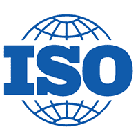

# 什么是 ISO？

> 原文：<https://www.javatpoint.com/iso>

国际标准化组织是一个独立的非政府成员组织，代表国际标准化组织。它与世界各地的研究所和公司合作，帮助制定产品和技术标准。ISO 源自希腊语“isos”，意为平等，ISO 的成员代表来自 162 个国家的国家标准组织。

[ISO](https://www.javatpoint.com/iso-full-form) 的主要目标是促进贸易，但其重点是各个领域的安全、工艺改进和质量。它有助于标准化，并提供在全球范围内工作的方法，确保产品对消费者来说是兼容和安全的。有 163 个标准机构是国际标准化组织的成员，每个国家都有一名国际标准化组织代表。意思是你的公司不能是个人会员，但是国家会员有能力影响 ISO 方向。

第一个标准，ISO 9660，是针对光盘媒体的。国际标准化组织没有执行法律或法规的权力，也不是一个管理机构。但它的指导方针被世界各地的企业所遵循，以提供高效、简化和安全的流程。国际标准化组织的指导方针大多带有数字，如 **ISO 9001、ISO 27000、ISO 31000** 等。这些是认证:一家公司可以通过 ISO 9001 认证，这意味着它遵循指南中概述的结构和步骤。

在产品和服务的创造中，使用确保产品和服务可靠、安全和最佳质量的标准。该标准有助于提高企业和公司的生产率，同时减少浪费和错误。这些标准有助于在公平的基础上发展全球贸易，并通过允许直接比较来自不同市场的产品来促进进入新市场。该标准还致力于保护产品和服务的消费者。英语(牛津拼写)、法语和俄语是国际标准化组织的三种官方语言。

## 国际标准化组织的历史

在 **1947** 年，一个 ISO 成立，几乎涵盖了围绕商业和技术的所有方面。来自约 140 个国家的国际标准化组织是国家标准机构的全球联盟。这些国际标准在国际贸易中发挥着重要的促进作用，并为系统、服务和产品提供通用的、世界一流的规范，以确保效率、安全和质量。在 **1951** 中，发布了第一个标准；工业长度测量的标准参考温度。后来在 **1952** 年，第一个 ISO 期刊出版。自《国际标准化组织期刊》创刊以来，国际标准化组织每月出版一份包含其技术委员会信息的标准。

在 1987 年，随着 ISO 9000 家族，国际标准化组织发布了第一个质量管理标准。通常，制造商使用这些质量管理标准来让消费者放心，他们创造了高质量的产品。ISO 9000 家族的标准已经成为流行和畅销的标准。1995 年，国际标准化组织第一个网站在 T2“T3”实现了数字化。

在 **1996** 年，ISO 推出了标准 ISO 14001，这是一个环境管理体系标准。该标准在组织和公司中发挥着关键作用，因为它提供了控制和识别其环境影响的工具。保护我们的环境是全世界的一个紧迫问题；因此，它已成为最广泛认可的标准。国际标准化组织每天都在不断发展，并为他们的图书馆增加有价值的标准，他们激动地拥有 160 多名成员，已经走过了 70 年。自成立以来，截至 **2018 年，**已发布近 22，000 项国际标准。

## 结构

国际标准化组织成员承认标准权威，因为它是一个自愿组织。他们每年举行一次会议，在大会上讨论国际标准化组织的战略目标。在日内瓦，中央秘书处协调这个组织。其指导和治理，包括确定中央秘书处的年度预算，由一个由 20 个成员机构轮流组成的理事会提供。此外，250 多个成员制定了国际标准化组织标准，技术管理委员会对这些成员负责。

## 国际标准化组织标准开发过程

为了创建新的标准，当消费者团体或行业协会提出要求时，标准化的过程就开始了。然后，国际标准化组织收购行业利益相关者和建立技术委员会的主题专家。通过两轮标准草案的制定，委员会通过并对 FDIS(最终国际标准草案)进行正式投票。此外，如果 FDIS 获得批准，国际标准化组织将其作为官方国际标准发布。

## 流行标准

信息技术有各种流行的国际标准化组织标准，其中一些标准如下:

*   **开放系统互连(OSI):** 在 **1983** 中，这种通用参考模型是由计算机制造商和电信提供商为通信协议开发的。后来被 ISO 采纳为标准。
*   **ISO 27001:** 为了制定和实施信息安全政策和流程，本 ISO 标准提供了六个步骤的流程。
*   **ISO 17799:** 这是一个安全管理标准，为业务资产、访问控制、连续性等指定了 100 多个最佳程序。
*   **ISO 20000:** 对于 IT(信息技术)，这个 ISO 标准创建了一个技术规范并编纂了最佳实践。
*   **ISO 31000:** 这一风险管理框架为任何个人、企业或机构提供了指导方针，并对风险和相关术语的定义进行了标准化。
*   **ISO 12207:** 它能够为所有软件创建一致的生命周期管理流程。

## 国际标准化组织也可以指以下任何一项:

1.  就 ***相机*** 而言，ISO 是一个调整光线对相机敏感度的设置。ISO 会影响图片的颗粒感或噪点，并改变图片的亮度。ISO 设置包括从 ISO 50 到 ISO 25600 的范围。光线对相机很敏感，这取决于 ISO 值。如果 ISO 值较低，光线对相机的敏感度也会较低。
2.  一个国际标准化组织也被称为 ***国际标准化组织形象*** 。

### 什么是 ISO 图像？

ISO 图像或。国际标准化组织文件是一个计算机文件，作为一个存档文件，这是一个现有文件系统的精确副本。ISO 映像是一种包含 [CD](https://www.javatpoint.com/cd-full-form) 、 [DVD](https://www.javatpoint.com/dvd-full-form) 或其他光盘或磁盘的完整内容的光盘映像。通常通过软件应用程序创建的国际标准化组织文件，用于创建、打开和提取[光盘](https://www.javatpoint.com/cd)或 DVD 图像文件。然后，将提取的图像转换为 ISO 文件。它使用户能够将原始文件的精确副本刻录到 CD 或 DVD 上。那个。iso 是 ISO 文件的文件扩展名。此外，国际标准化组织的图像也可能有 UDF(通用磁盘格式)文件系统，这是用在蓝光光盘和数字视盘。

在二进制格式中，一个国际标准化组织图像有一个光学媒体文件系统的副本和数据。ISO 映像包含的数据是根据光盘上使用的文件系统排序的。ISO 图像变得比光学介质上的原始数据小，因为它只存储数据，而不考虑控制头和校正数据。

虽然文件扩展名。iso 是常用的，一些 ISO 图像文件也包含。img 文件扩展名。另外，有时候。udf 扩展名也用于表示文件系统不是 ISO 9660，而是 UDF(通用磁盘格式)。由于没有单一的标准格式，术语“ISO 图像”被广泛用于指代光盘的任何盘图像文件。

临时存储器是国际标准化组织图像的常见用途；在写入空白 CD-R 或 DVD-R 之前，它会创建一个与原始光盘完全相同的副本。ISO 映像文件的内容可能会被复制到本地文件夹，因为这些文件可能会被打开。它们也可以作为光盘驱动器虚拟访问和安装。

* * *