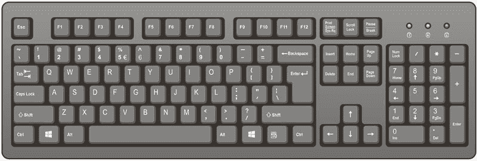
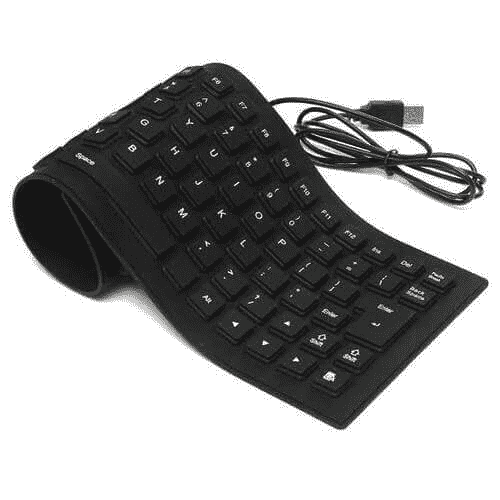
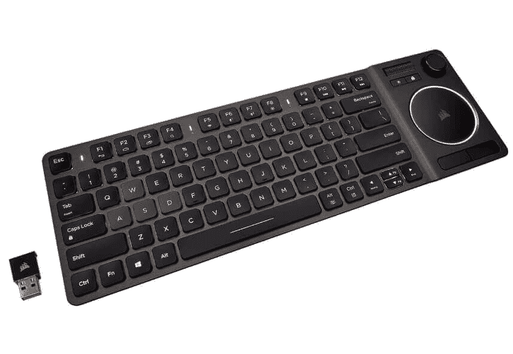
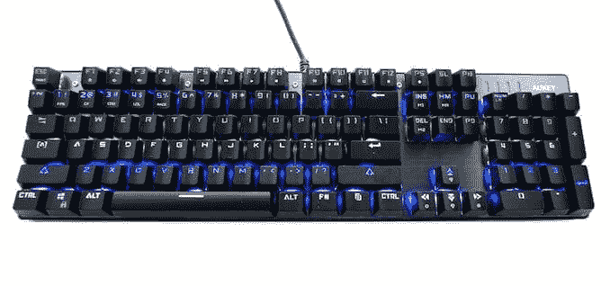
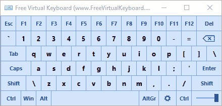
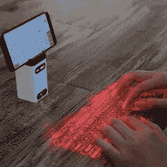
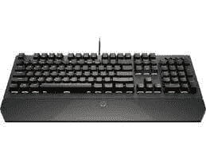
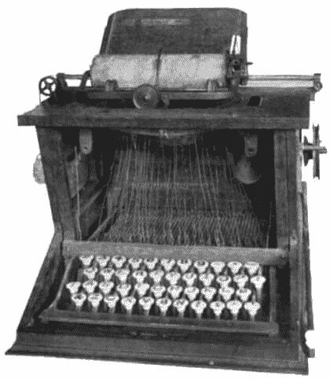
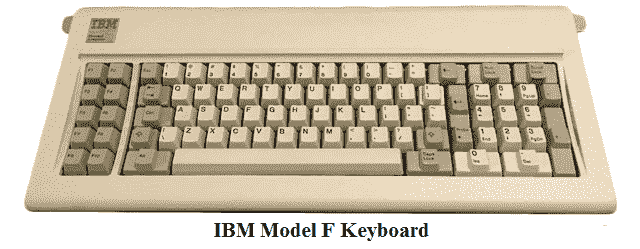

# 什么是键盘？

> 原文：<https://www.javatpoint.com/keyboard>

键盘是允许用户向计算机或任何其他电子机器输入文本的主要输入设备之一。它是一种外围设备，是用户与计算机通信的最基本方式。它由创建数字、符号和字母的多个按钮以及像窗口和 Alt 键这样的特殊键组成，包括执行其他功能。键盘的设计来源于打字机键盘，数字和字母以那种方式排列在键盘上，有助于快速打字。

上面的键盘设计被称为 QWERTY 设计，因为它的前六个字母位于键盘的左上角。虽然键盘设计源于打字机，但如今，它还包括许多其他键，以及 Alt/Option、Control 和 Windows 键，可用作快捷键，通过与其他键组合来执行特定操作。例如，在[微软 Word](https://www.javatpoint.com/ms-word-tutorial) 中处理文档时按下 Control + S，会保存正在处理的文档。此外，大多数键盘在键盘顶部有功能键(F1 至 F12 或 F16)，在底部有箭头键，用于执行许多功能。

### 键盘类型

大多数计算机用户使用连接到计算机的标准键盘。虽然计算机键盘有很多种类型，如下所示:

**1。软键盘:**是一种由软硅胶制成的键盘，具有很高的便携性。它防水防尘，不需要经常清洗。它的作用与标准键盘相同，并通过[通用串行总线](https://www.javatpoint.com/usb-full-form)连接串行端口连接到计算机。与传统键盘相比，这些类型的键盘在某些方面也更耐用。

这款柔性键盘由柔软的硅胶制成，避免了许多不同的物质。例如，如果你在靠近液体空间的地方使用键盘，硅胶皮肤可以提供极好的防溅保护。此外，它在使用时不会发出声音；这就是为什么它也被称为静音键盘的原因。这些键盘对旅行时间很有用，因为它们可以卷成一个包，在户外环境下很灵活。

**2。人体工程学键盘:**这种键盘对你的身体姿势很有好处。它不是调整自己来适应键盘，而是设计来轻松适应您，易于使用，并减少压力。它是这样设计的；它可以让用户伸直双手，而不是弯曲双手。一般来说，与普通键盘相比，空格键更大，可以快速打字。

**3。无线键盘:**它是一种不用任何电缆就能连接电脑、笔记本电脑或平板电脑的电脑键盘。它使用射频、红外或[蓝牙](https://www.javatpoint.com/android-bluetooth-tutorial)技术与设备连接。用户可以移动无线键盘，而不必把它放在桌子上，因为它为用户提供了便携性和灵活性。采用不锈钢材料设计，长时间延长使用寿命。通过将 USB 接收器插入计算机，可以非常容易地进行设置。

它基于红外技术，利用光波向其他支持红外的设备传输信号。一些无线键盘使用射频技术，通过 27 兆赫至 2.4 千兆赫范围内的信号进行通信。

**4。机械键盘:**采用家庭和办公室常用的优质材料制作而成。它设计用于长寿命，具有高耐用性和高响应性。它提供清脆的咔哒声、中等的阻力以及更好的游戏性能和终极打字反馈。与传统的橡胶圆顶键盘相比，它提供框架、开关、打印方法、功能、印刷电路板、按键结构、[发光二极管](https://www.javatpoint.com/led-full-form)照明或更多其他更好的功能。

**5。虚拟键盘:**它是一种基于软件的键盘，用户无需物理按键就可以打字。它是物理键盘或 QWERTY 键盘的数字表示的替代方案。这些类型的键盘通常有多页字符，包括数字、字母、标点符号和符号。一些虚拟的

键盘还包括根据设备的操作系统插入表情符号、贴纸或动画 [GIF](https://www.javatpoint.com/gif-full-form) s 的选项。包含虚拟键盘的设备是平板电脑、智能手机和其他便携式设备，因为这些设备不需要经常使用物理键盘。

**虚拟键盘示例**

*   **Gboard:** 谷歌为安卓和 iOS 创建了一个虚拟键盘，包括 gif、可定制主题和翻译功能等功能。
*   **OSK:** 代表屏幕键盘。常见于微软 Windows。

**6。投影键盘:**它是一种计算机输入设备，可以通过蓝牙连接到迷你电脑、平板电脑，甚至智能手机。在投影键盘中，虚拟键盘的图像被投影到一个表面上。当用户触摸表面上显示的键盘上的任何键时，该设备记录相应的击键。部分设备通过蓝牙设备连接，如平板电脑、智能手机、搭载[安卓](https://www.javatpoint.com/android-tutorial)、 [Windows 操作系统](https://www.javatpoint.com/windows)或 iOS 等的迷你 PC。

**7。游戏键盘:**包含一些供游戏玩家使用的特定按键的键盘被称为游戏键盘。W、S、D、A 和箭头键广泛用于标准 QWERTY 键盘上的游戏。游戏键盘(主要是机械键盘)，按键开关无需按压，为游戏提供更快的动作。

### 第一个键盘的发明？

有不同类型的发明，还有打字机、击键器和电传打字机，这些都有助于计算机键盘的发展。17 世纪，第一批书写工具被设计出来，亨利·米尔斯于 1714 年在英国伦敦申请了专利。

### 打字机的发明

不同的打字和书写设备是在 17 世纪末和 19 世纪初在世界各地发明的。尽管在 1868 年，克里斯托弗·肖尔斯开发了第一台实用打字机和被认为是第一台打字机的“打字机”一词，并获得了专利。

此外，QWERTY 键盘设计是由打字机推出的，至今仍在使用

目前主要用于美国键盘。塞缪尔·索勒、克里斯托弗·肖尔斯和卡洛斯·格里登创造了一个打字机，如下图所示:

1878 年，第一个带有 Shift 键的键盘被发明出来，它在键盘的左侧有一个 Shift 键。安德伍德打字机被认为是第一台成功的现代打字机，直到 1939 年，其 500 万台打字机被售出。第一台安德伍德打字机是由弗朗茨·夏弗·瓦格纳发明的，1893 年 4 月 27 日，他申请了打字机的美国专利 523，698。安德伍德打字机最大的改进是，它能够看到打字时的字迹。1895 年晚些时候，弗朗茨·西弗·瓦格纳在约翰·安德伍德的帮助下创建了安德伍德公司，并于 1896 年推出了第一台打字机。

在 1961 年 7 月 27 日 IBM 推出 [IBM](https://www.javatpoint.com/ibm-full-form) Selectric 打字机之前，所有制造商的打字机都开始变得更加相似。与其他打字机不同的是， [IBM](https://www.javatpoint.com/ibm-interview-questions) 选择型打字机使用了一个打字球，其中包含的字符会敲击色带。此外，这台打字机直到 1986 年才售出 1300 多万台。

**按键、电报和电传打字机的发明**

约瑟夫·玛丽·贾卡在 17 世纪晚期开发了提花织机，在 19 世纪晚期和 19 世纪初期，赫尔曼·何乐礼用他的关键穿孔发明扩展了该织机。

在 1832 年，帕维尔·席林发明了第一台电报机，并通过线路发送莫尔斯电码信息，允许使用一把钥匙。后来在 **1846** 年，一种印刷电报获得了皇家伯爵府的专利，它使用了 28 个钢琴式的键。按键通过代表字母表中的每个字母，使得发送信息变得容易。1874 年，波德密码由埃米尔·波德发明；后来，唐纳德·默里(电子打字机的发明者)对其进行了扩展。查尔斯·克鲁姆帮助发明了电传打字机，他继续研究从 1902 年到 1918 年开发的弗兰克·皮尔恩。在 1907 年 8 月**，他申请了美国专利 862，402。此外，他于 1908 年 5 月提交了专利 888，335，并于 1910 年 5 月提交了专利 1，286，351。**

 **### 早期带键盘的电脑

时隔多年，在 **1964** 年，Multics 和视频显示终端(VDTs)的推出，让用户可以在屏幕上看到自己正在输入的内容。

数据点 3300 于 1969 年由计算机终端公司开始发货。这是第一台用来取代电传打字机的计算机终端。除了惠普 2600A、DEC 和 VT06 之外，还推出了该终端的其他一些版本。数据点 3300 是一个能够使用箭头键移动光标的终端，它使用屏幕显示来显示键入的文本。此外，它能够清除屏幕上的所有文本。

20 世纪 70 年代初，键盘开始使用我们今天使用的东西。这些键盘是重型机械打字机或由 IBM 等公司改造的电动打字机。苹果、无线电小屋和康茂德在 20 世纪 70 年代末推出了包括键盘在内的电脑。后来，IBM PC 和 1981 年 8 月 IBM 推出的 Model F 键盘。

M 型键盘是由 IBM 在 1986 年推出的，它包含像今天的键盘一样横跨键盘顶部的功能键。M 型仍然被认为是一个高键盘，因为它有一个标准的 101 键美国布局，这是用于今天的全尺寸键盘。它也是为带有 104 键菜单键和窗口键的窗口键盘设计的。

自从 IBM 推出 Model M 键盘以来，如今使用的键盘发生了许多变化。薄膜有助于容易地制造计算机键盘并降低制造成本。此外，与最初的机械键盘相比，薄膜键盘使键盘更轻、更薄、更安静。

* * ***