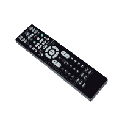

# 什么是远程？

> 原文：<https://www.javatpoint.com/remote>

遥控器是一种电子设备，通常是手持硬件设备，允许用户控制其他设备或对象，如收音机、电视、 [DVD](https://www.javatpoint.com/dvd-full-form) 播放器、立体声系统或音频/视频录制设备。例如，交流遥控器可以用来执行交流的许多功能，如打开和关闭，改变交流的冷却温度，等等。

电视遥控器也用于更改频道、音量、颜色以及打开/关闭电视。1956 年，天顶的罗伯特·阿德勒博士发明了第一台无线电视遥控器。在引入无绳遥控器之前，电视遥控器有电线从电视连接到遥控器。遥控器通常使用红外信号来执行任务，有时也使用射频信号。

大多数遥控器都是通过使用红外二极管的红外信号来实现的，红外二极管产生(一个 940 纳米波长的发光二极管)一束不可见的光。为了调制载波信号和解调接收信号，多通道遥控器采用了复杂的技术。此外，它通过使用各种频率滤波器来分离信号，以执行不同的远程控制功能。然而，为了操作该设备，这些红外信号需要在一条直线上。

一些遥控器不需要被控制设备的视线，因为它们是由射频信号完成的。这些类型的遥控器可以集中在一个方向或多方向。在一些应用中，射频遥控被广泛使用，例如防盗报警器、车库门开启器、无线家庭报警系统和自动栅栏控制。

### 不同类型的遥控器

通常，有三种类型的遥控器，如下所示:

*   红外遥控
*   口声控制
*   无线电遥控

**红外遥控:**需要视线，利用光线操作目的设备。例如，电视遥控器是一种红外遥控器。要操作它，你需要把它带到接收器的方向。此外，多功能遥控器易于编码，成本较低。

**声控:**也叫超声波遥控器，是楼梯走廊沿线的路灯开关。这是一个非常简单的遥控器，因为它可以从用户的声音中获得输入。甚至有时候不需要专门的遥控器，只要求你大声说话。

**无线电遥控:**用于操作或控制远处物体。它在各种无线电信号的帮助下控制设备，这些信号由遥控设备传输。它与车库门开启器、汽车报警器、自动护栏系统、无线电控制玩具和工业自动化系统一起使用。此外，这项技术还出现在许多其他应用中。这些类型的遥控器具有最好的性能，因为它们具有复杂的电路。这种遥控器的成本非常高，并且能够控制最远距离的设备。

### 遥控的历史

众所周知，遥控器让我们的生活变得非常轻松。因为无需离开座位，您就可以更改频道、音量、颜色以及打开或关闭电视。此外，只要按下一个按钮，你就可以打开车门。

**第一个遥控器**

19 世纪，遥控器第一次被制造出来。1898 年，第一台无线遥控器由塞尔维亚裔美国发明家尼古拉·特斯拉发明。他用它通过无线电波控制微型船，并给它命名为远程自动机。

**无线机器人**

莱昂纳多·托雷斯在 1903 年发明了一个名为 Telekino 的机器人，它有自己的遥控器。当托雷斯使用电磁波技术来控制机器人时，它成为了遥控器领域的先驱。后来，他无线引导一艘船，并演示了 Telekino 技术。此外，他计划借助遥控装置控制鱼雷。

**遥控器的军事用途**

第一架遥控飞机是在 1930 年左右飞行的。在第二次世界大战期间，军方使用遥控技术，他们广泛工作。无线电制造商也在使用遥控器，1939 年，菲尔科神秘控制成为第一个消费电子设备。它使用低频无线电发射器，因为它是一个无线遥控器。

**电视遥控器的发展**

第一台电视遥控器是由 Zenith Radio Corporation 在 1950 年发明的。要使用这个遥控器，你需要在光电传感器处准确地使用电视遥控器，有时它无法正常工作。因此，它的使用很困难。电视的每个角落都有四个传感器，这些传感器对太阳、灯和天花板上的灯有反应，并且对光敏感。这些功能通常是由意外通道的变化引起的。但这比靠近电视改变频道、通过电视上的按钮调节音量更有益。

天顶公司的罗伯特·阿德勒在 1956 年发明了太空指挥控制系统。太空司令部使用高频超声波使遥控器工作，而不是依靠光。这些遥控器包括四个按钮，如开、关、频道向上和频道向下。它们没有音量控制按钮。

1970 年，RCA 发明的全电子遥控器，使用数字信号和代表金属氧化物半导体场效应晶体管的记忆场效应晶体管。它取代了电机驱动的调谐控制，被彩色电视广泛采用。

在遥控器使用红外光信号之前，超声波一直是电视遥控器的标准，直到 1980 年。然后红外光信号开始在遥控器上使用，很快遥控器随处可见。2000 年初，普通美国家庭有四个遥控器，这为通用遥控器的发展和完善提供了途径。

**将您的移动设备用作遥控器**

如今，智能手机也可以用作通用遥控器，让你可以控制电视和家里的其他设备。随着智能手机的普及程度与日俱增，人们用它来做任何事情，还有遥控器。毫无疑问，有了遥控系统，我们的生活变得非常轻松。

* * *