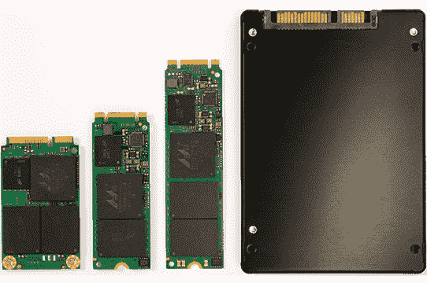

# 什么是 M.2 SSD？

> 原文：<https://www.javatpoint.com/m2-ssd>

我们通常称之为固态硬盘的 M.2 固态硬盘，用作计算机中的存储，加快操作系统速度。此外，它的外形非常小，很容易放入轻薄笔记本电脑中。M.2 固态硬盘比普通硬盘快 25 倍甚至更快。它帮助我们非常快地将安装的软件加载到我们的计算机上。

固态硬盘是一种存储介质格式，用于存储永久固态闪存数据。一个[固态硬盘](https://www.javatpoint.com/ssd)没有可拆分或上下转动的运动部件，而不是硬盘驱动器。m2 固态硬盘设计被简单地称为下一代功能集，但是术语“下一代”已经被更新以代替 m2 写的 M-dot-2。

## m2 固态硬盘外形

M.2 固态硬盘为矩形。它可以是 22 毫米宽，60 毫米或更长。卡片的容量也可以变化。它可以在更小的外形中包含更多的 NAND 芯片，从而为计算机提供更多的数据。m2 固态硬盘可以有两种不同的形式。一种可以是卡的形式，另一种是普通硬盘，我们可以很容易地把它放在没有 M.2 插槽的旧笔记本电脑或电脑中。

注意 22 毫米的宽度；这是 [windows](https://www.javatpoint.com/windows) 电脑的常态。一个 80 毫米或 110 毫米长的卡可以容纳 8 个具有 2 TB 存储的 NAND 芯片。

## m2 固态硬盘的优缺点

m2 固态硬盘外形中最显著的两个优势是尺寸和容量。例如，它在普通笔记本电脑内部使用的空间非常小，使笔记本电脑非常紧凑，易于携带。与简单的 [SATA](https://www.javatpoint.com/sata-full-form) 或 [SAS](https://www.javatpoint.com/sas-full-form) 接口相比，M.2 固态硬盘的功耗要高得多，因为它没有活动部件。他们还在手机中使用芯片，手机有能力存储大量数据。

M.2 接口是配置 PCIe、SATA、 [USB](https://www.javatpoint.com/usb-full-form) 3.0、蓝牙、 [Wi-Fi](https://www.javatpoint.com/wifi-full-form) 的多功能平台。如果你有一台由 M.2 接口组成的笔记本电脑，那么它将提供许多输入/输出设备配置选项。

m2 固态硬盘容量的主要缺点是价格和缺乏不那么常见。2.5 英寸 SATA 固态硬盘的价格也呈指数级下降，因为它们的制造数量越来越多。

1 TB SATA 固态硬盘近年来一直在 99 美元左右或更低；相对于 SATA 驱动器的价格，同等大小的 M.2 SSD 大约高出两倍半。受限存储是 m2 固态硬盘的另一个缺点。虽然 1 到 2 TB 可能适合大多数移动应用程序，但 m2 需要更高的容量才能进入更多的企业存储系统。

## M.2 供应商

一般来说，2 TB M.2 固态硬盘的成本从 230 美元到 400 美元不等；存储成本低一点。三星提供各种存储变体的各种 M.2 固态硬盘。英特尔是 m2 无线适配器的最大提供商。

## M.2 固态硬盘与毫安达

M.2 经常被认为是 mSATA 的替代品，但 mSATA 固态硬盘仍然存在，并且可能会在支持该功能集的笔记本电脑平台上持续一段时间。由于 M.2 和 mSATA 卡是不同的设计因素，有不同的连接器，所以不能连接到同一台机器上；它们都有各自的使用目的。

* * *