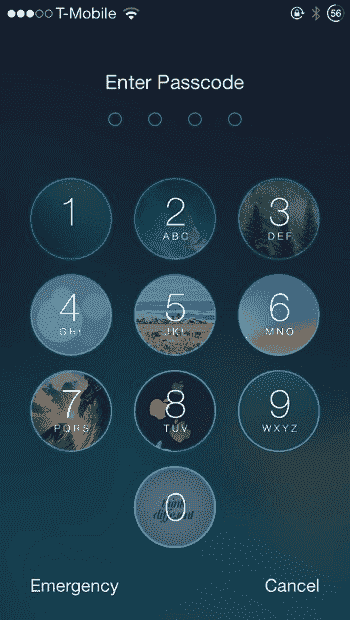
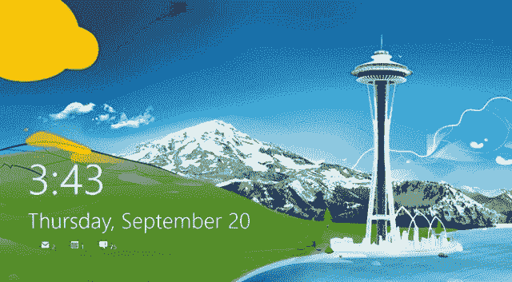

# 什么是锁屏？

> 原文：<https://www.javatpoint.com/what-is-lock-screen>

锁屏是计算机、智能手机或平板电脑的一项安全功能，有助于防止未经授权访问设备。这是一个在启动时查看的界面。当设备被锁定时，设备的应用程序被限制访问。锁定的设备有助于从不需要的用户那里保存设备数据。如果有人试图使用锁屏功能来保护设备，则需要特定的操作或操作序列才能正确执行。当设备被锁定并输入密码以解锁设备时，只有使用正确的密码或生物识别技术才能解锁。桌面、主屏幕或应用图标显示在屏幕上；如果设备解锁，则设备可以自由使用。

要解锁锁定的设备，需要输入密码或密码短语，访问生物识别阅读器，或者在屏幕上执行特定的动作或手势，检查用户的指纹，扫描用户的眼睛或执行类似的分析来识别用户。

大多数锁屏功能包括可定制的壁纸，与桌面或主屏幕的图像相比，壁纸可以是不同的图片。智能手机上的锁屏功能还可以显示当前日期和时间，包括未接来电、短信或其他通知。一旦设备解锁，还可以选择通知来打开特定的应用程序。大多数移动设备锁定屏幕，使用户能够在设备锁定时拨打紧急电话并启动摄像头。

借助 [Windows](https://www.javatpoint.com/windows) ，微软下一代 Windows 8 操作系统引入了锁屏功能，同时也在 Windows 8.1 和 [Windows 10](https://www.javatpoint.com/what-is-windows) 中提供。与 Windows Vista、Windows XP 和 Windows 7 不同，Windows 8 中需要锁屏功能，因为它可以在触摸屏环境中使用。锁屏功能包括令人兴奋的功能之一；它显示关于特定任务的通知。它有两个组成部分:

*   具有动态电池状态、消息图标、网络图标的锁定屏幕背景图像，以及输入解锁设备密码的登录屏幕。
*   锁屏功能对个人电脑和平板电脑用户都很方便。

即使您的计算机被锁定，它也会显示时间和日期、图像，并可以显示您的邮件、日历、消息等首选应用程序。有快捷键 **Windows 键+L** 锁定电脑并显示锁屏。下图是 Windows 8 锁屏的一个例子。

### 如何调整 Windows 10 锁定屏幕

以下是调整 10 号窗口锁定屏幕的步骤:

*   首先，您需要按下*窗口键*，在搜索栏上输入*锁屏设置*，然后按下回车键。
*   接下来，可以在锁屏设置中显示当前设置，现在相应调整锁屏；你可以调整你想在锁屏上显示的应用，也可以调整它的超时。

### 如何调整 Windows 8 锁屏

要调整窗口 10 锁定屏幕，请遵循以下步骤:

*   首先，您需要借助将鼠标移动到屏幕右侧来打开 Charms，或者简单地使用键盘上的快捷键 Windows 键+C 键。
*   接下来，点击打开的魅力设置。
*   现在，点击电脑设置菜单底部*更多电脑设置*上的选项。
*   然后，在“个性化”中，选择您想要在“锁定屏幕”窗口下的锁定屏幕上设置的图片。

### 走出锁定屏幕

有很多方法可以打开锁屏。您可以将手指放在鼠标触摸屏上并向顶部翻转，或者只需按键盘上的回车键或空格键。

### 按平台锁定屏幕

### 移动操作系统

通常，智能手机和平板电脑使用基于手势的锁屏。由 Neonode 制造的手机，包括通过在手机触摸屏上向右滑动来解锁的功能。在 iOS 10 之前，iPhone 和 iPad 系列都使用苹果的 iOS，而类似的机制是，屏幕上的滑块向右滑动解锁手机。在 iOS 5 早期，如果用户向另一个方向滑动，它会直接启动相机应用程序。作为对 iOS 进行更大规模改造的一部分，滑动部件在 iOS 7 上被移除，现在用户可以向屏幕的任何方向滑动。

锁定屏幕通常显示通知、时钟并提供音频回放控制。iOS 10 用按下 Home 键取代了滑动手势，对锁屏进行了重大改动。要访问手机中的摄像头，滑动仍在使用中的，包括左侧带有小部件的另一个页面。在 iPhone X 和 iPad Pro 中，用户需要从屏幕底部滑动上侧，因为它们没有物理主页按钮。

最初，安卓用户被要求按下手机的菜单按钮，因为[安卓](https://www.javatpoint.com/android-tutorial)没有使用基于手势的锁定屏幕。**安卓 2.0** 上引入了一个新的基于手势的锁屏，包括两个图标:设置音量模式和解锁手机。在**安卓 2.1** 上，旋转表盘被屏幕两端的两个标签代替。**安卓 3.0** 推出了一种新的设计，一个带有挂锁图标的球被拖到了圆形区域的外面。

**安卓 4.0** 提供了直接解锁摄像头的选项，而 4.1 通过向上拖动解锁到谷歌搜索屏幕。**安卓 4.2** 允许用户通过屏幕左边缘的滑动来添加小部件以访问锁定屏幕上的页面。此外，安卓还包括一项功能，可以通过使用密码、密码、9 个圆圈网格上的图案、面部识别或指纹传感来锁定设备。通常，安卓发行版使用其他制造商的不同锁屏设计，这些设计是安卓使用的。某些版本的 HTC 的 Sense 使用金属环解锁手机；这个铃声不得不从屏幕底部拖动来解锁手机，也允许用户通过拖动各自的快捷图标直接访问应用程序。

解锁三星设备，如三星 Galaxy S III 和 S4，锁屏可以向任何方向拖动。同样，HTC 的锁屏，应用程序也可以通过从屏幕底部向上拖动直接启动。一些应用程序可能会劫持默认锁定屏幕，因为它们可能包含广告软件。此外，2017 年 11 月，谷歌 Play 商店正式禁止非锁屏应用程序将锁屏货币化。

### 个人电脑操作系统

Windows NT 提供了通过显示登录窗口锁定计算机的功能，需要输入正确的密码才能解锁系统。从 Windows XP 开始，也可以使用键盘快捷键**窗口键+ L、**锁定设备。锁屏是在 Windows 8 上重新设计的，对于移动操作系统来说非常封闭。它允许用户在锁定屏幕上选择不同的图片进行设置，同时显示日历、时钟和其他通知。

要解锁电脑，请按键盘上的空格键或回车键，或者用鼠标或触摸屏向上拖动屏幕。Windows 10 通过支持幻灯片放映和增加使用锁屏中的 Cortana 语音助手来保持这种锁屏设计。它还提供了可选的与壁纸相关的促销建议，以及像视窗聚光灯这样的服务来检索日常壁纸。屏保系统(类似 Unix 的操作系统，如 gnome-screensaver 和 XScreenSaver)也包含锁屏功能。

* * *