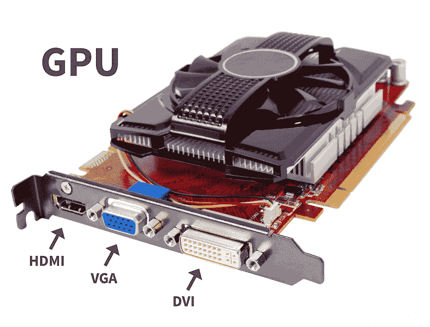

# 视频随机存储器

> 原文：<https://www.javatpoint.com/vram>

视频 RAM 就像普通的 RAM 一样，但是视频 RAM 的工作是处理图片，这样显示器就可以给你看图片了。所有类型的虚拟内存都是动态内存的特殊安排。视频内存是计算机和显示器之间的缓冲区。它也被称为帧缓冲区。当系统将图像发送到屏幕上显示时，处理器将图像读取到专用视频[内存](https://www.javatpoint.com/ram-full-form)或集成视频内存中。然后视频被处理到内存中并出现在监视器上。

以前的高性能视频内存类型是双端口的，这意味着当[中央处理器](https://www.javatpoint.com/cpu-full-form)正在为虚拟内存制作新图片时，屏幕会从虚拟内存中读取以修改其当前显示数据。双端口设计是上世纪八九十年代电脑[内存](https://www.javatpoint.com/ram)和视频内存的主要区别。

**多库动态 RAM** 是 MoSys 打造的高性能 RAM，将内存分割成多个 32 千字节的段或库，可以独立访问。传统的虚拟内存是单片的，可以一次访问整个帧缓冲区。拥有连续的内存库可以同时执行访问，从而提升整体性能。多存储动态随机存取存储器也更便宜，因为对于给定的分辨率带宽，卡只能以正确的空间量生产，而不是多兆字节，不像许多其他类型的视频随机存取存储器。

**同步图形 RAM** 是一款成本相对较低、时钟同步的 DRAM 视频内存。SGRAM 是单端口内存，但是它可以像双端口内存一样通过同时构建新的内存页面来运行，而不仅仅是一个。

Windows RAM 与微软 Windows 没有关联。这是一款高性能双端口虚拟内存，容量比虚拟内存高 25%左右，但成本更低。它具有更有效地读取数据以用于块填充和文本绘图的特性。使用正确的颜色，WRAM 可以用于非常高的分辨率。

### 真正的用途

现代显卡使用一种称为 GDDR5 的 SGRAM 变体。正如标题所示，GDDR5 是 RAM 双倍数据速率。DDR4 在今天的电子产品中被用作机器内存。

VRAM 和设备 RAM 之间唯一的关键区别是速度和模仿双端口功能的潜力。VRAM 非常适合查看图像复杂纹理或基于多边形渲染三维结构的应用程序。视频游戏或 3D 图形设计软件是这些应用程序中最受欢迎的例子。

对于运行复杂数据处理功能的服务来说，系统显卡上的虚拟内存数量并不重要。

### 视频内存对游戏的重要性

VRAM 在游戏效率方面发挥着重要作用，例如加载时间和图像质量。以各种分辨率运行游戏需要某些 VRAM 级别。以 1920*1080 分辨率渲染大型 AAA 游戏不同于以 4K UHD 质量渲染游戏，后者需要额外的图形内存(如 6GB、8GB、12GB)。需要额外的视频内存来正确渲染高质量的图像，否则，用户试图渲染的纹理和图像会淹没视频内存，并导致图形处理器将数据溢出到内存中。这可能会导致性能问题。

* * *