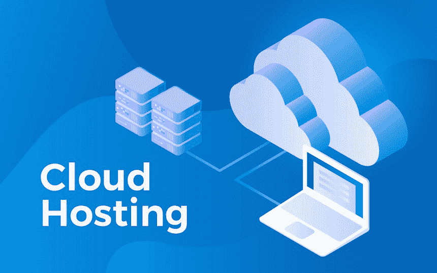

# 云托管

> 原文：<https://www.javatpoint.com/cloud-hosting>

将企业的处理和存储能力外包给以实用模式提供网络服务的服务提供商的方法是云托管。

云供应商监督设置、云存储、保护和管理，而客户将配置硬件和应用程序并在线扩展服务器。计算和存储服务根据负载平衡输入/输出需求，通过数百台虚拟机分散在云计算配置中。

传统的专用服务器模式允许企业开发和维护自己的数据中心，与之相比，云存储模式是一种更便宜的替代方案。在整个传统模式中，具有专用[硬件](https://www.javatpoint.com/hardware)和虚拟基础架构的服务器都存在于内部，这对组织来说可能是一笔昂贵的运营成本。

### 云托管优势

云基础架构为公司提供了可观的财务和运营收益，因此他们不必在与数据中心购置和维护相关的实际直接资本成本上投入大量资金。信息技术也有潜力更快地扩展，只使用他们需要的服务并为其付费。此外，长期数据存储成为一个更加简化的过程，避免了昂贵的磁盘和磁带存储系统。

通过利用云托管服务，可以获得快速性能和灾难恢复等数据安全优势。许多公司使用混合模式，将现场处理和存储功能与云服务框架中的计算和存储相结合。

在开发应用程序、网站和其他资源时，灵活且更具成本效益的可扩展性是使用云计算服务的关键优势之一。由于消费者能够根据需要进行扩展，因此他们只为他们使用的设施付费，而不为任何未使用的设施付费。这个支付系统使得云托管成为一个相对便宜的存储过程。

虽然有很多优点，但也有一些局限性。随着云采用速度的加快，云保护挑战吸引了更多的兴趣。随着数据逃离业务数据中心，公司面临着欺诈和知识产权退化、违反执法、对流氓员工的活动缺乏控制以及违反保密规定的风险。

高供应、恢复点目标和恢复时间目标是需要考虑的额外因素。

### 顶级供应商/提供商

作为一种技术模式，云计算系统推动了基础设施的发展，在这种基础设施下，通常采用按使用量付费系统的第三方供应商为客户提供硬件、应用程序、服务器、存储和网络设施。

[亚马逊网络服务](https://www.javatpoint.com/aws-tutorial)、谷歌云门户、 [IBM](https://www.javatpoint.com/ibm-full-form) 云和[微软 Azure](https://www.javatpoint.com/microsoft-azure) 是提供云托管的常见提供商。AWS 提供了比大多数云供应商更全面的存储设施和更多的区域和分区，是市场上的主要竞争对手。近年来，Azure 和谷歌的势头越来越大。

AWS 与亚马逊轻松存储解决方案和亚马逊服务器冰川一起，提供弹性计算云来处理计算资源。对于企业来说，谷歌拥有谷歌计算引擎和谷歌云存储。 [Azure 虚拟机](https://www.javatpoint.com/azure-virtual-machines)和 [Azure 虚拟机扩展集](https://www.javatpoint.com/azure-virtual-machine-scale-set-and-auto-scaling)受微软 Azure 支持，其数据中包含 blob、日志和队列数据。常见的云服务是微软 Office 365。

* * *