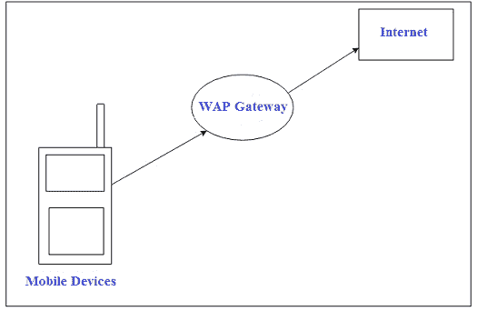
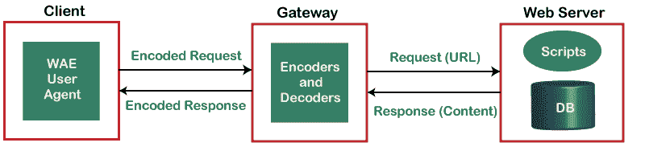
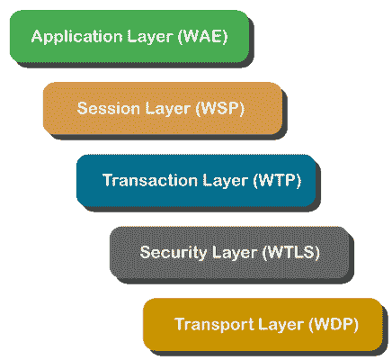

# 什么是 WAP？

> 原文：<https://www.javatpoint.com/wap>

WAP 是 1999 年推出的协议，代表无线应用协议。它通过移动电话等无线设备提供互联网通信。在 2000 年代早期，它获得了一定的普及，到了 2010 年代，它主要被更新的标准所取代。此外，它提供了一种为移动设备创建网络应用程序的方法，并且是为微浏览器设计的。

大部分无线网络由 [WAP](https://www.javatpoint.com/wireless-application-protocol-in-mobile-computing) 支持，还有 TDMA、 [CDMA](https://www.javatpoint.com/cdma-full-form) 、 [GSM](https://www.javatpoint.com/gsm-full-form) 。此外，所有操作系统都可以支持无线应用协议。它支持在移动设备上访问互联网，并使用标记语言，如 WML，代表无线标记语言，称为 [XML](https://www.javatpoint.com/xml-tutorial) 1.0 应用程序。WAP 提供了将交互式无线设备(如移动电话)连接到互联网的功能，并增强了无线规范的互操作性。

WAP 可以在任何类型的操作系统上创建，并在开放的应用环境中运行。它对移动用户更有利，因为它能够高效地传递电子信息。1998 年，诺基亚、摩托罗拉、埃里克森和 Unwired Planet 创建了 WAP 论坛，其目标是借助协议将几种无线技术标准化。

WAP [CSS(层叠样式表)](https://www.javatpoint.com/css-tutorial)使开发人员能够格式化屏幕大小，以适应移动设备。当使用 WAP CSS 内容时，则不需要重新格式化。它控制页面布局与不同移动设备显示屏的兼容性。

传输层处理物理网络问题，通过它，全球无线运营可以轻松访问无线网关。WAP 网关是一个服务器，提供接入无线网络的设施。WAP 论坛提供规范开发、WAP 工具测试，还为所有移动服务提供支持。现在，WAP 论坛被称为开放移动联盟。

### WAP 模式

在移动设备中，用户打开网络浏览器并访问网站并相应地访问网页。移动设备使用 WAP 协议通过网络将[网址](https://www.javatpoint.com/url-full-form)请求转发到 WAP 网关。然后，WAP 网关将该请求翻译成常规的 [HTTP](https://www.javatpoint.com/http) 网址请求后，通过互联网引用该请求。指定的网络服务器接受请求并处理该请求。然后，它通过 WAP 网关将 WML 文件中的响应返回给移动设备，该响应将显示在设备的网络浏览器中。

### 无线应用协议堆栈

**1。[应用层](https://www.javatpoint.com/computer-network-application-layer) (WAE)**

无线应用环境包含内容开发编程语言，如 WML 和移动设备规范。它的功能很像一个 JavaScript ，并且拥有无线互联网内容开发者使用的工具。它包括与 WML 结合使用的脚本语言，如 WML 和 WMLScript。

**2。[会话层](https://www.javatpoint.com/iot-session-layer-protocols) (WSP)**

它确定设备和网络之间的会话是面向连接的还是无连接的，并提供重新连接和快速连接暂停。在面向连接的会话中，数据在网络和设备之间双向传递。然后，WSP 将数据包转发到下一层 WTP(无线事务协议)。当信息从网络传输或广播到设备时，通常使用无连接会话。然后，WSP 将数据包转发到无线数据报协议层。

**3。交易层(WTP)**

无线交易协议提供交易支持。它是 [TCP/IP](https://www.javatpoint.com/computer-network-tcp-ip-model) 的一部分，运行在代表用户数据报协议的 UDP 之上。

**4。安全层(WTLS)**

无线传输层安全性在数据完整性、隐私和身份验证方面提供安全性，有助于保存您的数据。它还能够像传输层安全性一样工作。此外，它还包含具有传输层安全性的安全功能。

**5。[传输层](https://www.javatpoint.com/computer-network-transport-layer) (WDP)**

通过网络载体层，无线数据报协议协同工作，并向 WAP 协议栈的更高层呈现恒定的数据格式。

### WAP 的组件

WAP 有三个主要组件，如下所示:

**1。协议支持**

*   **IP 网络:**支持的协议包含 HTTP(称为 WP-HTTP)、TLS 和无线“概要”版本的 TCP(称为 WP-TCP)。
*   **非 IP 网络:**包括四层:无线传输层安全、无线数据报协议、无线会话协议、无线事务协议。

**2。应用环境**

*   **WML 规范:** WML 代表无线标记语言，基于 XML 和 XHTML。
*   **WMLScript 规范:**一种用于在客户端上运行代码的脚本语言。
*   **WAP 微浏览器:**特别是设计用来控制 WAP 设备的。在 WAP 微浏览器的帮助下，WAP 设备能够在有限的资源环境中运行。

**3。服务和能力**

*   **用户配置文件的定制:**在客户端设备能力和用户偏好的基础上，WAP 使服务器能够定制交付给用户的内容。
*   **电话支持:**无线应用协议允许在数据环境中操作电话服务。因此，WAP 手机可以充当网络设备和集成语音。

### WAP 的优势

使用 WAP 有各种优势；这些措施如下:

**便携性**

WAP 的主要用途是使用专有协议编写应用程序。当您将应用程序移植到不同类型的网络时，将需要大量的代码重写。例如，不同类型的网络，如 GSM 和 CDMA，以及承载协议，如 CSD(电路交换数据)或[短信](https://www.javatpoint.com/sms-full-form)(短消息服务)。

**用户体验**

*   处理能力有限、屏幕小、内存和电池有限的设备。
*   提供窄带宽连接。

**降低成本和应用开发时间**

WAP 有助于以更低的成本和更快的速度添加新服务。这可以通过 WAP 工具和平台来完成，如 WAP 设备、WAP 网关和 WAP 软件开发工具包。

WAP 的其他一些优势包括:

*   没有硬件过时
*   实时发送/接收数据
*   大多数现代移动电话设备都支持 WAP
*   接近互联网模式的实现
*   节省时间
*   设备、基础设施和网关制造商的销售额增加。
*   个性化的

### WAP 的缺点

*   用户不太熟悉
*   包括第三方
*   商业模式是昂贵的
*   速度低、安全性高、用户界面非常小
*   小型显示屏
*   限定的频带宽度
*   访问速度和有限的可用性

### WAP 的应用

**企业应用程序:**WAP 已经使用了公司应用程序，销售人员希望使用他们的 WAP 直接访问最新的定价，手机可以随时获得即时的竞争信息，最新的新闻。

**手机银行:**用于银行部门，用途不同，如提供用户账户余额、最近四笔交易、透支额度等明细。WAP、私人信息服务、安全和各种不同的其他元素都包含在其中。此外，它还有许多方法来提供用户的信息。另一方面，用户可以通过消息发送请求来获取信息，或者服务可以是基于推送的，这意味着它可以根据事件或设置的间隔自动生成。

所有移动电话都能够运行移动银行服务，或者可以为符合协议的电话或特定品牌的电话(例如，WAP)定制服务。此外，WAP 不仅有利于信息的提供，还可以保障电子商务和移动交易的安全。

**游戏:**游戏是一项庞大的服务，就移动设备中的应用或软件而言，它是人们使用最广泛的服务。同样，随着电子音乐发行的增加，游戏也将增加。你可以从网站下载游戏或视频，而不是去音像店租游戏或视频。

**移动商务:**移动商务应用需要使用手机进行交易。通常，这意味着以电子方式转移资金或支付货款。电子商务应用程序提供账户间转账和支付购物金额的服务。

**铃声:**下载铃声是另一种新兴的服务。当有人打电话时，它会播放音乐。手机用户可以改变他们的手机铃声，使其不同于其他人。通常，手机的内存中会有不同的内置铃声，用户可以从中选择来设置手机铃声。然而，在现代，从互联网网站下载铃声到手机上更常见。此外，还有许多铃声作曲家可以帮助用户根据自己的需求创作自己独特的铃声。

**统一消息:**它是一种新兴的增值网络服务，将通信提升到通信技术之上。人们会收到各种难以管理的信息。为了访问不同类型的消息，统一消息为用户提供了单一界面。通常，它有助于在人们收到新消息时通知他们，并通过统一消息框提醒他们。短消息通常包括指定新消息的指示。此外，通过 WAP，用户可以相应地访问和管理他们的统一消息箱。

**定位:**定位在移动上下文中的含义可以包括几个东西:电话或车辆或人的位置。[全球定位系统](https://www.javatpoint.com/global-positioning-systems)是一个由 24 颗卫星组成的全球网络。带有全球定位系统的接收器可以获得他们的卫星位置并找到位置。短信是发送[全球定位系统](https://www.javatpoint.com/gps-full-form)信息的标准，如纬度、经度、方位和纬度。GPS 信息的长度一般在 60 个字符左右，可以为其他车辆特定信息留出空间。

**定性信息:**

不同种类的内容可以传递给手机用户，例如股价、航班信息、彩票结果、体育比分、天气、笑话、新闻标题等等。这些信息可以是任何形式的视觉信息、图表或地图。

### WAP 的历史

1988 年，诺基亚、爱立信、Unwired Planet 和摩托罗拉创立了 WAP 论坛。开发 WAP(无线应用协议)的主要目的是将几种无线技术收集在一个标准化的协议中。

**欧洲**

当 WAP 推出时，它被营销人员大肆宣传。英国电信公司 BT Cellnet 开展了一项广告活动，在信息空间等神经漫游者的帮助下，浏览了一个卡通 WAP 用户。

2003 年到 2004 年之间，当时的无线服务，比如 T-Mobile T-Zones，沃达丰直播！和其他容易获得的服务，使 WAP 有了更强的复兴。通过 UMTS 和 GPRS 的转移，运营商产生了收入，这与传统的互联网服务提供商和网站使用的商业模式不同。

直到 2013 年，WAP 的使用基本上消失了。WAP 的使用已经被大多数主要网站和公司所淘汰，多年来，它并不是手机上网络的常规技术。现在最新的手机互联网浏览器都是这样设计的；它们能够支持 [HTML](https://www.javatpoint.com/html-tutorial) 、 [CSS](https://www.javatpoint.com/css-tutorial) 和 JavaScript。此外，为了网页兼容性，现代手机避免使用任何类型的 WAP 标记。支持超文本标记语言的手机非常普遍，例如所有版本的苹果手机、安卓手机、所有的视窗手机、许多诺基亚手机和所有的黑莓设备。

亚洲

在日本，WAP 取得了重大成功；即使是最大的运营商 NTT DoCoMo 也没有使用它，它是由软银移动和竞争对手 KDDI (au)成功部署的。尤其是基于 WAP 的服务有 [Java](https://www.javatpoint.com/java-tutorial) (JSCL)，J-Phone 的 Sha-Mail 图片邮件服务，以及(au)的 chakumovie。2010 年，随着支持超文本标记语言的智能手机在日本流行，WAP 和 i-mode 的使用量像欧洲一样下降。

**美国**

在美国，WAP 的采用受到了影响，因为许多手机需要额外的数据支持和单独激活费用。在美国采用 WAP 也是有原因的；电信公司要求将数据访问限制在只有经过批准的数据提供商。2007 年 7 月 31 日，联邦通信委员会发布了一项命令。第三方应用程序开发人员、设备制造商和其他人可以在该特定许可网络频段上运行时使用任何应用程序或设备。

### 什么是 WAP 2.0？

WAP forum 2.0 版本于 2002 年推出，有助于提升无线用户体验，采用了带有端到端 HTTP 的 [XHTML](https://www.javatpoint.com/xhtml-tutorial) 的精简版，以一套规范将无线世界带向更接近互联网的方向。它支持 HTTP、 [TCP](https://www.javatpoint.com/tcp) 和 [IP](https://www.javatpoint.com/ip) 等协议，这些协议提供了一个环境，允许无线设备使用现有的互联网技术。此外，它由运营商配置，可以包括计费信息、电话号码、位置和其他手机信息。它包括各种特征；这些措施如下:

*   它增强了 WAP 推送功能。
*   为了描述设备功能，它提供了一个用户代理配置文件。
*   此外，它还提供了一个外部功能接口来支持外部插件，例如微浏览器中的功能。

### 什么是 WAP 网关

无线应用协议(WAP)网关是一个软件系统，对智能手机微浏览器和互联网之间的请求和响应进行解码和编码。访问网站的请求通过 WAP 网关发送，因为它提供了安全性。它帮助支持 WAP 的无线设备与应用程序和互联网网站进行通信。如果您想从支持 WAP 的无线设备访问互联网资源，您需要 WAP 网关服务。WML(无线标记语言)有助于以特殊格式交付网页，这些格式通过 WAP 网关进行编译和转发。

WAP 网关通常是在访问请求中充当中介的服务器。HTTP 向服务器请求一个网站，服务器从请求的网站获取数据。然后，将其转换为显示在客户端浏览器上的加密形式。

### WAP 浏览器

WAP 浏览器使移动设备能够访问兼容的网页。迷你浏览器可以使用大量互联网协议将网页转换为纯文本。通常，就 WAP 浏览器的有效性而言，网络开发人员为移动设备创建单独的 WAP 网页。如果没有 WAP 优化，网页内容通常需要更长的加载时间，并且可能无法正确地将内容翻译到移动设备。

现在的 WAP 浏览器也支持高级互联网语言，如可扩展超文本标记语言(XHTML)和紧凑超文本标记语言(CHTML)。它使得更新的移动设备可以通过 WAP 浏览器支持高级互联网语言，以翻译流行的 XHTML 媒体元素。包含小显示屏的老式移动设备仍然使用 WAP 浏览器来翻译网页。随着功能越来越强大，即使是现代移动设备也可以处理显示整个网页。

### 什么是 WML？

无线标记语言是一种基于超文本标记语言和 HDML 的标记语言。超文本标记语言为桌面浏览器翻译内容，而无线媒体语言为没有处理能力的无线设备翻译内容。对于手机，用于开发网站，指定为 XML 文档类型。在使用无线标记语言设计网站时，必须考虑无线设备的限制，例如有限的内存、小显示屏、小资源和低传输带宽。用 WAP 设计的网站不同于普通的 HTML 网站，因为它们是单色的(只有黑白)，显示屏的空间非常小。

### WML 的特点

*   **用户交互:**它提供了与用户交流的简单方式，因为用户可以自由选择按键或语音等输入；因为它能够支持多种类型的输入，如文本输入控件、密码输入和选项选择器。
*   **文本和图像:** WML 描述了一种向用户呈现图像和文本的方式。图像将是单色的，需要在 WBMP 格式。
*   **导航:** WML 提供浏览历史和超链接导航。
*   **上下文管理:**这个状态可以在不同的甲板之间保存。与 HTML 相比，它包括一些关键特性，如下所示:
*   变量不能存储在 HTML 中，但是变量可以在保存字符串格式数据的 WML 中定义。
*   HTML 是桌面的标记语言，而 WML 是小型无线计算设备的标记语言。
*   WML 支持的图像格式是 WBMP，HTML 支持，GIF 和 JPEG，BMP。
*   HTML 不区分大小写，WML 遵循 XHTML 规范；因此，它区分大小写。

* * *