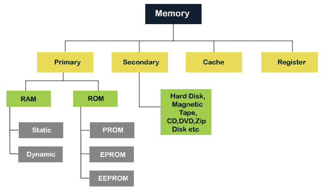
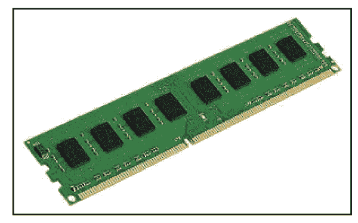
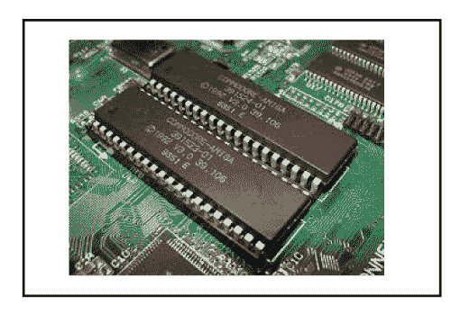
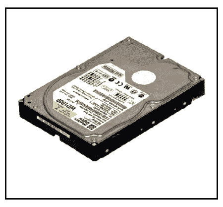
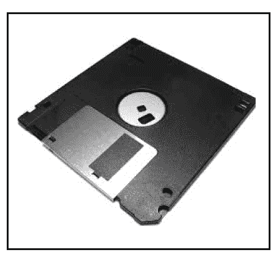
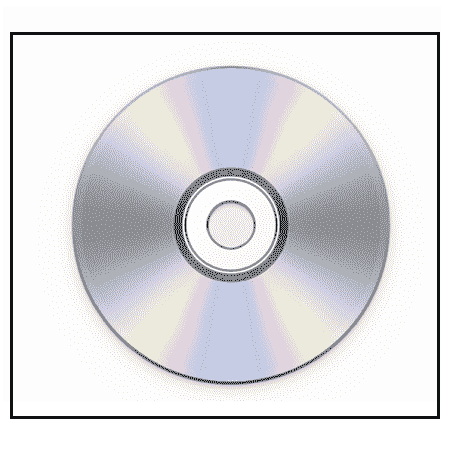
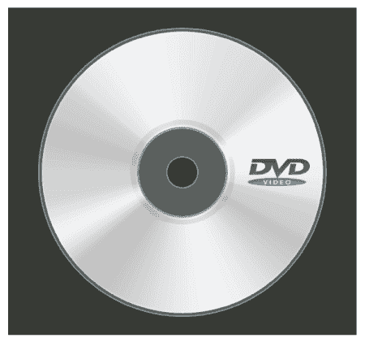
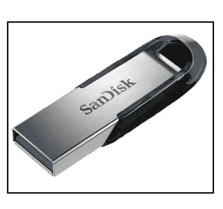
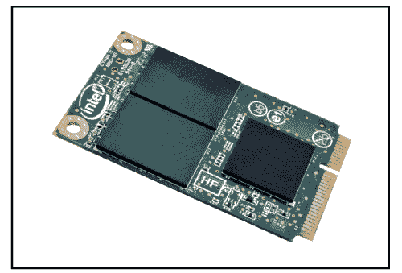

# 记忆的分类

> 原文：<https://www.javatpoint.com/classification-of-memory>

在计算机中，**内存**是任何系统正常运行最基本的组成部分。计算机系统根据不同的目的和用途对内存进行分类。在这一节中，我们已经详细讨论了记忆的**分类**。此外，我们还将讨论**内存的类型、内存、随机存取存储器、只读存储器、静态随机存取存储器、动态随机存取存储器的特点及其优缺点。**

## 什么是计算机内存？

[计算机内存](https://www.javatpoint.com/computer-memory)是任何物理设备，用于临时或永久存储数据、信息或指令。它是以位的形式存储二进制信息的存储单元的集合。内存块被分成少量的组件，称为单元。每个单元都有一个唯一的地址来存储内存中的数据，范围从零到内存大小减一。例如，如果计算机内存的大小为 64k 字，则内存单元有 64 * 1024 = 65536 个位置或单元。内存单元的地址从 0 到 65535 不等。

## 为什么我们需要电脑内存？

在计算机系统中，我们需要计算机内存来存储各种类型的数据，如文本、图像、视频、音频、文档等。当需要数据时，我们可以检索它。例如，当我们编写和执行任何计算机程序时，它最初存储在主存储器中。如果处理器在较长时间内不需要特定项目，程序或数据会自动保存到永久或辅助存储器中。然后将数据从辅助存储器调用到主存储器，并执行代码。

## 记忆的特征

以下是内存系统的不同功能，包括:

1.  **位置:**代表计算机内存的内部或外部位置。内存内置于计算机内存中。它也被称为主存储器。主存储器例子是寄存器、高速缓存和主存储器。而外部存储器是与计算机分开的存储设备，如磁盘、磁带、u 盘。
2.  **容量:**是电脑内存最重要的特性。外部和内部存储器的存储容量可能不同。外部设备的存储容量是用字节来衡量的，而内部存储器是用字节或字来衡量的。存储字长度可以以位为单位变化，例如 8、16 或 32 位。
3.  **访问方式:**内存可以通过四种内存模式进行访问。
    *   **DMA:** 顾名思义，直接内存地址(DMA)是一种允许输入/输出(I/O)设备直接或从主内存访问或检索数据的方法。
    *   **顺序存取法:**在数据存储设备中使用顺序存取法，从计算机存储器中顺序读取存储的数据。然而，从随机存取存储器接收的数据可以是任何顺序的。
    *   **随机存取法:**是一种从内存中随机存取数据的方法。这种方法与 SAM 相反。比如在随机访问中从 A 到 Z，我们可以直接跳转到任意指定的位置。在顺序方法中，我们必须遵循从 A 到 Z 的所有干预来到达特定的存储位置。
    *   **关联访问方法:**它是一种特殊类型的内存，通过定义的数据直接访问基于内存地址存储的信息，从而优化搜索性能。
4.  **传输单位:**顾名思义，传输单位衡量的是可以读写存储设备的位的传输速率。外部和内部存储器中的数据传输速率可能不同。
    *   **内存:**位的传输速率大多等于字长。
    *   **外存:**位或单位的传输速率不等于字长。它总是大于一个字或者可以被称为**区块**。
5.  **性能:**内存的性能主要分为三个部分。
    *   **存取时间:**在随机存取存储器中，它表示存储器设备执行一个地址被发送到存储器的读或写操作所花费的总时间。
    *   **内存周期时间:**访问内存块所需的总时间以及开始第二次访问之前所需的额外时间。
    *   **传输速率:**描述用于将内存传输到外部或内部存储设备或从外部或内部存储设备传输内存的数据传输速率。对于不同的外部和内部设备，位传输可能不同。
6.  **物理类型:**它定义了计算机中使用的存储器的物理类型，如磁性、半导体、磁光和光学。
7.  **组织:**定义内存中使用的位的物理结构。
8.  **物理特性:**它规定了易失性、非易失性或不可擦除存储器等存储器的物理行为。易失性存储器被称为随机存取存储器，它需要电源来保存存储的信息，如果发生任何断电，存储的数据将会丢失。非易失性存储器是永久存储存储器，用于获取任何存储的信息，即使在断电时也是如此。不可擦除存储器是一种在制造类似只读存储器之后不能被擦除的存储器，因为在制造只读存储器时是被编程的。

## 记忆的分类

下图显示了内存的分类:

### 主存储器还是主存储器

主存储器也称为计算机系统的主存储器，直接在[中央处理器](https://www.javatpoint.com/cpu-full-form)内通信，辅助存储器和高速缓冲存储器。当处理器工作时，主存储器用来保存程序或数据。当程序或数据被激活执行时，处理器首先将指令或程序从辅助存储器加载到主存储器中，然后处理器开始执行。从主存储器访问或执行数据更快，因为它有一个提供更快响应的高速缓存或寄存器存储器，并且它位于更靠近[中央处理器](https://www.javatpoint.com/central-processing-unit)的位置。主存储器是易失性的，这意味着当发生电源故障时，如果不保存，存储器中的数据可能会丢失。它比辅助存储器贵，并且与辅助存储器相比，主存储器容量有限。

主存储器进一步分为两部分:

1.  随机存取存储器
2.  只读存储器

### 随机存取存储器

[随机存取存储器(RAM)](https://www.javatpoint.com/ram) 是 CPU 直接访问的速度较快的主存类型之一。它是计算机设备中临时存储数据、程序或程序结果的硬件。它用于在机器工作之前在内存中读取/写入数据。它是易失性的，这意味着如果发生电源故障或计算机关闭，存储在[内存](https://www.javatpoint.com/ram-full-form)中的信息将丢失。存储在计算机内存中的所有数据都可以随时随机读取或访问。

内存有两种类型:

*   静态随机存取储存器
*   动态随机存取存储器

**动态随机存取存储器:**动态随机存取存储器**(动态随机存取存储器)**是一种用于在随机存取存储器中动态存储数据的随机存取存储器。在动态随机存取存储器中，每个单元携带一位信息。电池由两部分组成:一个**电容器**和一个**晶体管**。电容器和晶体管的尺寸非常小，需要将数百万个电容器和晶体管存储在单个芯片上。因此，一个动态随机存取存储器芯片可以比同样大小的静态随机存取存储器芯片保存更多的数据。然而，由于动态随机存取存储器是易失性的，电容器需要不断刷新以保留信息。如果电源关闭，存储在内存中的数据将丢失。

**DRAM 的特性**

1.  它需要不断刷新以保留数据。
2.  它比静态随机存取存储器慢
3.  它保存着大量的数据
4.  它是电容器和晶体管的组合
5.  与静态随机存取存储器相比，它更便宜
6.  功耗更低

**静态随机存取存储器:** SRMA **(静态随机存取存储器)**是一种用于在存储器中存储静态数据的随机存取存储器。这意味着只要计算机系统有电源，在静态随机存取存储器中存储数据就保持活动状态。但是，当发生电源故障时，静态随机存取存储器中的数据会丢失。

**静压头的特性**

1.  它不需要刷新。
2.  它比动态随机存取存储器快
3.  它很贵。
4.  高功耗
5.  寿命更长
6.  大号
7.  用作高速缓存

### 静态随机存取存储器与动态随机存取存储器

| 静态随机存取储存器 | 动态随机存取存储器 |
| 这是一个静态随机存取存储器。 | 这是一个动态随机存取存储器。 |
| SRAM 的存取时间慢。 | 动态随机存取存储器的存取时间高。 |
| 它使用触发器来存储每一位信息。 | 它使用一个电容器来存储每一位信息。 |
| 它不需要定期刷新来保存信息。 | 它需要定期刷新以保存信息。 |
| 它在高速缓冲存储器中使用。 | 它被用在主存储器中。 |
| 静态随机存取存储器的成本很高。 | DRAM 的成本更低。 |
| 它的结构很复杂。 | 其结构简单。 |
| 它需要低功耗。 | 它需要更多的功耗。 |

**RAM 的优势**

*   它是计算机中速度较快的内存类型。
*   它需要更少的电力来运行。
*   程序加载要快得多
*   更多的内存提高了系统的性能，可以进行多任务处理。
*   执行读写操作。
*   处理器读取信息的速度比硬盘、软盘、USB 等都要快。

**RAM 的缺点**

*   内存减少会降低计算机的速度和性能。
*   由于不稳定，它需要电力来保存数据。
*   它比只读存储器贵
*   与只读存储器相比，它是不可靠的
*   内存的大小是有限的。

### 只读存储器

[只读存储器](https://www.javatpoint.com/rom)是一种存储设备或存储介质，用于在芯片内永久地**存储信息。它是只读存储器，只能读取存储的信息、数据或程序，但我们不能写或修改任何东西。只读存储器包含启动或引导计算机所需的一些重要指令或程序数据。它是一个**非易失性**存储器；这意味着即使在电源关闭或系统关闭时，存储的信息也不会丢失。**

**

**只读存储器的类型**

只读存储器有五种类型:

1.  **MROM(屏蔽只读存储器):**
    MROM 是最古老的只读存储器类型，其程序或数据在制造时由集成电路制造商预先配置。因此，用户不能改变存储在 MROM 芯片中的程序或指令。
2.  **PROM(可编程只读存储器):**
    它是一种数字只读存储器，用户可以在其中只写一次任何类型的信息或程序。它意味着它是空的可编程只读存储器芯片，用户可以使用专用的可编程只读存储器编程器或可编程只读存储器刻录机设备只写一次所需的内容或程序；此后，数据或指令不能被改变或擦除。
3.  **EPROM(可擦除可编程只读存储器):**
    这是一种只读存储器，其中存储的数据只能在 EPROM 存储器中擦除和重新编程一次。它是一种非易失性存储芯片，在没有电源时可以保存数据，也可以存储数据至少 10 到 20 年。在 EPROM 中，如果我们想擦除任何存储的数据并对其重新编程，首先，我们需要通过 40 分钟的紫外光来擦除数据；之后，数据在 EPROM 中重新创建。
4.  **EEPROM(电可擦除可编程只读存储器):**
    EEROM 是一种电可擦除可编程只读存储器，用于使用高压电荷擦除存储的数据并对其重新编程。它也是非易失性存储器，其数据不能被擦除或丢失；连电源都关了。在 EEPROM 中，存储的数据可以被擦除和重新编程多达 1 万次，数据一次擦除一个字节。
5.  **闪存 ROM:**
    闪存是一种非易失性存储存储器芯片，可以以称为块或扇区的小单元进行写入或编程。闪存是计算机内存的 EEPROM 形式，当电源关闭时，内容或数据不会丢失。它也用于在计算机和数字设备之间传输数据。

**ROM 的优势**

1.  它是非易失性存储器，即使关闭电源，存储的信息也会丢失。
2.  它是静态的，所以不需要每次都刷新内容。
3.  数据可以永久存储。
4.  与内存相比，测试和存储大数据很容易。
5.  这些不能被意外改变
6.  它比内存便宜。
7.  与内存相比，它简单可靠。
8.  它有助于启动计算机和加载操作系统。

**ROM 的缺点**

1.  除非读取现有数据，否则无法更新或修改存储数据。
2.  访问存储数据的速度比内存慢。
3.  利用紫外线的高电荷破坏现有数据大约需要 40 分钟。

### 内存与只读存储器

| 随机存取存储 | 只读存储器 |
| 这是一个随机存取存储器。 | 这是一个只读存储器。 |
| 可以执行读写操作。 | 只能执行读取操作。 |
| 当电源关闭时，易失性存储器中的数据可能会丢失。 | 当电源关闭时，数据不会在非易失性存储器中丢失。 |
| 这是一个更快和昂贵的内存。 | 这是一种速度更慢、成本更低的内存。 |
| 存储数据需要在内存中刷新。 | 存储数据不需要在只读存储器中刷新。 |
| 芯片的尺寸比存储数据的只读存储器芯片大。 | 芯片的尺寸小于存储相同数据量的随机存取存储器芯片。 |
| 随机存取存储器的类型:动态随机存取存储器和静态随机存取存储器 | 只读存储器的类型:MROM，可编程只读存储器，可编程只读存储器，可编程只读存储器 |

## 辅助存贮器

[二级内存](https://www.javatpoint.com/secondary-memory)是一个**永久存储**空间，用来保存大量数据。辅助存储器也称为外部存储器，代表各种存储介质(硬盘、USB、光盘、闪存和 DVD)，计算机数据和程序可以长期保存在这些存储介质上。然而，它比主存更便宜，速度更慢。与主内存不同，辅助内存不能由中央处理器直接访问。取而代之的是，辅助存储器数据首先被加载到随机存取存储器中，然后被发送到处理器以读取和更新数据。辅助存储设备还包括磁盘，如硬盘和软盘，光盘，如光盘和光盘，以及磁带。

### 二级存储器的特点

*   它的速度比主/主存慢。
*   由于非易失性，存储数据不会丢失。
*   它可以存储大量不同类型的集合，如音频、视频、图片、文本、软件等。
*   辅助存储器中存储的所有数据都不会丢失，因为它是一个永久存储区；连电源都关了。
*   它有各种光和磁存储器来存储数据。

### 辅助存储器的类型

以下是辅助存储设备的类型:

**硬盘**

硬盘是计算机的永久存储设备。它是非易失性磁盘，可永久存储数据、程序和文件，并且在计算机电源关闭时不会丢失存储的数据。通常，它位于计算机主板内部，使用一个或多个密封外壳内的刚性快速旋转磁盘盘来存储和检索数据。它是一种大型存储设备，可以在每台计算机或笔记本电脑上找到，用于永久存储已安装的软件、音乐、文本文档、视频、操作系统和数据，直到用户没有删除。

**软盘**

软盘是一种二级存储系统，由薄而柔韧的磁性涂层盘组成，用于保存电子数据，如计算机文件。它也被称为软盘，有三种尺寸，如 8 英寸、5.5 英寸和 3.5 英寸。软盘上存储的数据可以通过软盘驱动器访问。此外，这是通过安装在计算机上的新程序或备份信息的唯一方法。然而，它是最古老的便携式存储设备，可以存储高达 1.44 兆字节的数据。因为大多数程序都比较大，所以需要多张软盘来存储大量数据。因此，由于内存存储非常低，所以没有使用它。

**光盘(光盘)**

一张[光盘](https://www.javatpoint.com/cd)是光盘存储设备，代表光盘。它是一种存储设备，用于存储各种数据类型，如音频、视频、文件、操作系统、备份文件以及对计算机有用的任何其他信息。光盘的宽度为 1.2 毫米，高度为 12 厘米，可以存储大约 783 兆字节的数据。它使用激光从光盘上读写数据。

**光盘类型**

1.  **光驱(光盘只读存储器):**制造时主要用于音频光盘、软件、电脑游戏等批量大小的海量。用户只能从光盘上读取数据、文本、音乐、视频，但不能修改或刻录。
2.  **CD-R(可刻录光盘):**用户用来写一次的光盘类型；在那之后，它不能被修改或删除。
3.  **CD-RW(可重写光盘):**是一种可重写光盘，常用于写入或删除存储的数据。

**DVD 驱动器/光盘**

DVD 是光盘存储设备，代表**数字视频显示器或数字多功能光盘**。它的大小与光盘相同，但可以比光盘存储更多的数据。它是由索尼、松下、东芝和飞利浦四家电子公司于 1995 年在**开发的。DVD 驱动器分为三种类型，如 DVD ROM(只读存储器)、 **DVD R** (可记录)和 **DVD RW** (可重写或可擦除)。它可以存储音频、视频、图像、软件、操作系统等多种数据格式。DVD 中数据的存储容量为 4.7 GB 到 17 GB。**

**蓝光光盘(BD)**

蓝光是一种光盘存储设备，用于存储大量数据或高清视频录制和播放其他媒体文件。它使用激光技术读取蓝光光盘中存储的数据。与光盘相比，它可以以更高的密度存储更多的数据。例如，光盘允许我们存储 700 MB 的数据，而在 DVD 中，它提供了高达 8 GB 的存储容量，而蓝光光盘提供了 28 GB 的空间来存储数据。

**笔驱动**

笔式驱动器是一种用于永久存储数据的便携式设备，也称为 u 盘。它通常用于存储和传输使用 USB 端口连接到计算机的数据。它没有任何可移动部件来存储数据；它使用集成电路芯片来存储数据。它允许用户存储和传输数据，如音频、视频、图像等。从一台电脑到任何 USB 笔驱动器。笔式驱动器的存储容量从 64 MB 到 128 GB 或更多。

**缓存**

它是一种小型的基于芯片的计算机内存，位于中央处理器和主内存之间。它是一个更快，高性能和临时内存，以提高中央处理器的性能。它存储了计算机 CPU 经常使用的所有数据和指令。它还减少了从主存储器访问数据的时间。它比主存快，有时候，它也叫 CPU 内存，因为它离 CPU 芯片很近。以下是缓存的级别。

1.  **一级缓存:**L1 缓存也称为板载、内部或主缓存。它是在中央处理器的帮助下建造的。它的速度非常快，L1 缓存的大小从 8 KB 到 128 KB 不等。
2.  **L2 缓存:**又称外部或二级缓存，需要快速访问时间来存储临时数据。它内置在主板的独立芯片中，而不是像 L1 级那样内置在中央处理器中。L2 缓存的大小可以是 128 KB 到 1 MB。
3.  **L3 缓存:** L3 缓存级别一般与计算机的高性能和高容量一起使用。它内置于主板中。它的速度非常慢，而且最大大小可达 8 MB。

**缓存的优势**

1.  与主内存相比，高速缓存是速度更快的内存。
2.  它存储中央处理器为提高计算机性能而重复使用的所有数据和指令。
3.  数据的存取时间比主存少。

**缓存的缺点**

1.  与主内存和辅助内存相比，它的成本非常高。
2.  它的存储容量有限。

**寄存器存储器**

寄存器存储器是一个临时存储区，用于存储数据和指令并将其传输到计算机。它是计算机中最小也是最快的内存。它是计算机内存的一部分，以寄存器的形式位于中央处理器中。寄存器存储器的大小为 16、32 和 64 位。它临时存储数据指令和内存的地址，这些地址被重复使用，以向中央处理器提供更快的响应。

### 主内存与辅助内存

| 主存储器 | 辅助存贮器 |
| 它也被称为临时记忆。 | 它也被称为永久记忆。 |
| 处理器或中央处理器可以直接访问数据。 | 输入/输出处理器或中央处理器不能直接访问数据。 |
| 存储的数据可以是易失性或非易失性存储器。 | 二级存储器的本质总是非易失的。 |
| 它比二级内存更昂贵。 | 它比主内存便宜。 |
| 这是一个更快的记忆。 | 这是一个较慢的记忆。 |
| 它的存储容量有限。 | 它有很大的存储容量。 |
| 它需要将数据保留在主内存中的能力。 | 将数据保留在辅助存储器中不需要电源。 |
| 主存储器的例子有随机存取存储器、只读存储器、寄存器、可编程只读存储器、可编程只读存储器和高速缓冲存储器。 | 辅助存储器的例子有光盘、DVD、HDD、磁带、闪存盘、笔式驱动器等。 |

* * ***