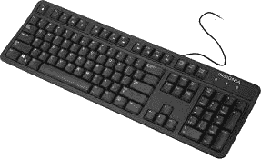

# 硬件和软件有什么区别？

> 原文：<https://www.javatpoint.com/hardware-vs-software>

### 计算机硬件

[硬件](https://www.javatpoint.com/hardware)是指我们可以看到和触摸到的计算机或机器的物理部件。它包含电路板、集成电路或计算机系统中的其他电子器件。它是一个物理组件，以不同的方式用于构建计算机或任何其他机器。存储设备、处理器、[中央处理器](https://www.javatpoint.com/central-processing-unit)、[鼠标](https://www.javatpoint.com/mouse)和[键盘](https://www.javatpoint.com/keyboard)都是计算机系统中硬件的例子。另一方面，无论您是在平板电脑、显示器还是智能手机上查看此页面，您查看此页面的屏幕都是硬件的最佳示例。没有任何硬件，计算机系统就不会存在，也不能运行任何软件。图中显示了一个外部硬件外设(键盘)的示例。它允许用户向计算机输入信息。

## 计算机软件

[软件](https://www.javatpoint.com/software)是程序、指令、文档的集合，这些程序、指令、文档确切地告诉计算机要做什么或者允许用户与计算机交互。有时缩写为 S/W 和 SW，这对计算机或其他类似设备来说是最重要的。没有软件，大多数计算机可能都没用。比如你的电脑里没有安装软件程序 [MS-Word](https://www.javatpoint.com/ms-word-tutorial) ，你就无法制作任何可以通过 MS-Word 完成的文档。此外，如果您的系统没有互联网浏览器软件，您将无法浏览[互联网](https://www.javatpoint.com/internet)或访问任何网站。此外，[浏览器](https://www.javatpoint.com/browsers)在没有操作系统的情况下无法在计算机上运行。[谷歌 Chrome](https://www.javatpoint.com/google-chrome) 、Photoshop、MS Word、 [Excel](https://www.javatpoint.com/excel-tutorial) 、 [MySQL](https://www.javatpoint.com/mysql-tutorial) 等都是软件的例子。下图所示，是一个软件的例子，这是一个互联网软件程序谷歌 Chrome 的图片。

软件是运行在计算机上的指令的集合，而硬件是与计算机一起使用或在计算机上使用的物理设备。另一方面，软件不能触摸和拿在手中，而硬件可以触摸和拿在手中。下面给出了一个表格，其中包含了硬件和软件之间的差异。

| 五金器具 | 软件 |
| 硬件是执行指令的计算机的物理组件。 | 软件是一种程序，它使用户能够与计算机及其硬件进行交互。 |
| 它是在工厂里制造的。 | 它是由软件程序员或软件开发公司开发的。 |
| 存储设备、输入设备、输出设备和内部组件是硬件的主要类别。 | 操作系统、应用软件和编程软件是软件的主要类别。 |
| 硬件是一种物理的电子设备，可以看到和触摸。 | 软件是虚拟的，不是物理的，所以可以看到但不能触摸。 |
| 计算机病毒不会影响硬件。 | 计算机病毒会影响软件。 |
| 如果硬件损坏，可以更换新的。 | 如果软件损坏，将重新安装。 |
| 通过网络，硬件不能电气传输。只是，它可以物理转移。 | 这个软件很容易转让。 |
| 硬件的例子有内存、只读存储器、打印机、显示器、鼠标、硬盘等等。 | 软件的例子有谷歌 Chrome、MySQL、MS Word、Excel、PowerPoint、记事本、Photoshop 等等。 |

## 更多信息和示例

对于操作软件，至少需要一个硬件设备。例如，微软单词是软件；它利用计算机处理器、[内存(随机存取存储器)](https://www.javatpoint.com/ram)、[硬盘](https://www.javatpoint.com/hdd)来处理文档。此外，视频游戏是另一种利用计算机硬盘、处理器、内存和显卡运行的软件。

硬件是使计算机能够工作的东西。一个[中央处理器](https://www.javatpoint.com/cpu-full-form)处理可以存储在硬盘或随机存取存储器中的数据或信息。图像由视频卡提供，声卡向扬声器提供声音。这些都被认为是硬件组件的例子。

## 电脑没有硬件能运行吗？

大多数电脑正常运行至少需要一个键盘、显卡、显示器、处理器、硬盘、[主板](https://www.javatpoint.com/motherboard)、内存和电源。没有硬盘、显示器或键盘，像瘦客户机和服务器这样的计算机系统可以被设置为运行。

当这些设备中的任何一个丢失或出现故障时，计算机无法打开或遇到错误。不需要包括硬件，如声卡、鼠标、打印机、网卡或扬声器。但是它们使计算机更有能力。

## 没有软件电脑能运行吗？

是的，在大多数情况下，计算机无需安装软件就可以运行。但是，如果找不到操作系统或解释器，计算机不会提供任何信息输出或显示错误。计算机系统需要操作系统来使用户和软件能够与计算机硬件通信。除了操作系统之外，在计算机上安装软件使计算机能够执行附加功能。例如，MS-Excel 不是运行计算机所需的程序，但它允许用户处理电子表格。

* * *