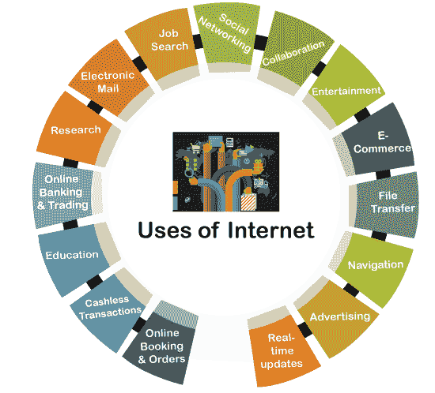

# 互联网的用途

> 原文：<https://www.javatpoint.com/uses-of-internet>

互联网是一个全球性的网络系统，现在可以在大多数设备上使用，已经成为我们生活中必不可少的一部分。在当今的技术时代，大多数公司都是通过互联网完成业务的。互联网有各种各样的用途，公司和个人通过互联网使他们的日常工作更加高效和舒适。

在这里，我们讨论了在日常生活中起着重要作用的互联网的主要用途:

### 在线预订和订单

[互联网](https://www.javatpoint.com/internet)让人们从任何地方直接使用设备预订公共汽车、火车、航班(国内和国际)的机票变得容易多了。人们也可以通过选择他们当前的位置来预订出租车，他们将在指定的位置被接走或放下。现在没有人需要在售票柜台排队等候订票了。

此外，人们可以在家里使用互联网和设备订购各种各样的产品。它的范围从食品杂货到即食食品、时装到药品。大多数物品可以在家订购，直接在门口领取。

### 无现金交易

大多数国家都在推广无现金交易和数字支付。这有助于人们不携带太多现金。人们可以使用 POS 设备通过借记卡或信用卡支付账单。这些设备连接到互联网上的支付网关。除此之外，人们还可以使用智能手机和互联网在 [UPI(统一支付接口)](https://www.javatpoint.com/upi-full-form)上进行交易处理。它甚至不要求他们携带卡片。合众国际社的支付方式正在不断发展，预计在不久的将来将涵盖大多数交易。

### 教育

现在大多数设备都是通过互联网连接的。互联网上有各种不同类型的广泛教育内容。人们只需在网上花几分钟就可以研究相关的话题。互联网搜索引擎帮助人们快速找到多种格式的相关学习资料(如图像、视频、文档等)。).这有助于消除去图书馆读几本书来寻找所需信息的需要。

此外，互联网还使学生能够通过视频会议参与课堂，在视频会议中，学生可以与世界任何地方的老师或专业人员联系。

### 网上银行和交易

互联网引入后，银行的经营方式发生了变化。互联网使银行业务在线化，人们可以坐在家里或出国旅行时管理自己的银行账户。如今，银行的大部分功能都掌握在人们手中。在网上银行的帮助下，人们可以安全地将钱从一个账户转移到另一个账户，更改他们的[自动取款机](https://www.javatpoint.com/atm-full-form)密码，申请实体或虚拟信用卡，更新信用卡限额，启用或禁用国际交易，跟踪他们的交易，等等。此外，他们甚至可以在线投诉或联系银行的支持人员。

除此之外，互联网让人们在股票市场交易变得更加容易。人们可以很容易地在网上买卖或管理股票。

### 研究

互联网在研究领域发挥着重要作用。在使用互联网之前，很难找到任何东西的信息。人们不得不翻遍数百本参考书籍来寻找想要的信息。然而，互联网让它变得容易多了，任何人只需点击几下就能找到所需的信息。在研究中，人们可以研究成功和失败的研究，并为改进进一步努力。互联网在研究中的应用对研究人员非常有益。

### 电子邮件

电子邮件是互联网最初的重要用途之一。电子邮件使得人们在互联网上更快地交流。使用电子邮件，人们可以快速共享信息、数据文件，如图像、音频、视频和其他类型的文件。电子邮件的使用大大减少了纸张的使用，而纸张在过去是主要的交流来源。任何人都可以有一个免费的电子邮件地址，可以很容易地与他人交流。这也减少了物理邮件系统的负载，尽管它仍在使用中。

### 求职

找工作比以前容易多了。任何人都可以使用互联网查看相关的工作信息。早些时候，人们必须逐个检查每家公司，才能知道一个职位是否空缺。然而，互联网使人们能够在家找到适合自己兴趣的工作。许多网站提供关于工作可用性的详细信息。一旦人们提交简历，这些网站就会不断通过电子邮件通知空缺职位。此外，每个知名公司都有自己的网站，公司在那里发布空缺职位的信息。所以，只要坐在家里，人们就可以搜索、申请工作，甚至进行面试，看到或知道他们的结果。

### 网络社交

社交网站已经把世界各地的人们联系在一起。社交网络是互联网的重要组成部分。在互联网的帮助下，人们有能力组建社会团体，在那里他们可以分享关于任何事情的信息、想法和想法。社交网络平台是最大的内容来源，涵盖从信息内容到娱乐的一切。最好的是，人们不用支付任何费用就能使用这些服务。这有助于企业发展他们的社区和推广他们的产品。

### 合作

由于互联网，交流变得越来越容易，越来越好。你可以在网上轻松地与任何人联系，无论是发短信、打电话还是视频通话。为人民创造了新的合作机会。有几个在线聊天软件和网站可以帮助人们创建小组讨论或会议。它有助于企业进行轻松的讨论。因此，人们并不总是需要长途跋涉去参加会议。这有助于人们避免不必要的旅行，节省时间用于生产。

此外，还有许多基于云的软件和网站，可以让人们同时从事同一项目。来自不同地方的人可以使用互联网轻松连接和支持他们的专业。

### 娱乐

互联网是最有效的娱乐方式。网上有各种选项，人们可以尝试，比如看电影、玩网络游戏、听歌等。互联网也让人们很容易将娱乐项目下载到他们的本地存储中。使用互联网，人们也可以在线与他人分享他们的视频、歌曲、图片。另外，现在人们可以在网上看电视直播或体育比赛。

### 电子商务

互联网不仅仅局限于点餐；它也可以用来销售产品。许多电子商务网站允许企业和个人销售他们的产品。产品由这些电商公司购买，储存在他们的仓库里，包装在他们的品牌包装里，自己配送。电子商务公司向顾客分发商品收取一定的佣金。此外，他们为顾客提供很大的折扣和优惠。最好的是顾客不用去实体店。

此外，卖家还可以创建他们的网站，并在那里列出他们的产品。他们可以查阅关于产品的所有信息，回答客户的问题，并向客户提供在线支付选项。所有这些在互联网上都是可能的。

### 文件传输

互联网使系统或设备之间的文件传输变得更加容易。借助 [FTP(文件传输协议)](https://www.javatpoint.com/ftp-full-form)，可以通过互联网安全地交换数据。 [FTP](https://www.javatpoint.com/computer-network-ftp) 主要在需要传输大文件时有好处，因为电子邮件允许共享有限大小的文件。FTP 是两个利益相关者之间交换信息的最佳方式。这种方法仍然很流行，并在使用中。

### 航行

导航机制是互联网最有益的用途之一。一旦用户将该位置放入在线地图(如谷歌地图)，它就会提供该位置的所有细节。用户甚至可以找到访问该特定位置的最佳路线。地图还提供了位置之间的距离。关于导航最好的事情是它将提供尽可能短的路线和更少的流量。人们还可以搜索任何特定的地方，如最近的酒店、餐馆、银行、自动取款机等。除此之外，一个人可以使用互联网和导航技术与其他人共享一个现场位置。

### 广告

因为大多数人都使用互联网，所以它是推广某物或广告的最佳手段。有付费促销和免费促销两种选择。互联网上有许多广告平台，帮助在线推广产品或业务。这些平台使用横幅、视频、电子邮件等在其他相关网站上宣传产品。他们根据距离、关键词和受众等对这些广告收费。然而，人们也可以利用社交媒体平台创建在线团体或社区，并免费做广告。

### 实时更新

互联网正在帮助人们跟上世界各地发生的事情。许多新闻和信息网站提供各种类别的实时更新，如政治、历史、新闻、地质、休闲、体育、技术、营销等。您可以轻松选择感兴趣的类别，并与更新保持联系。电子报纸和杂志的出现更新了人们的生活，有助于减少纸张的使用。

* * *