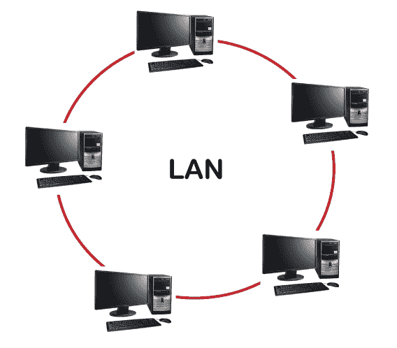
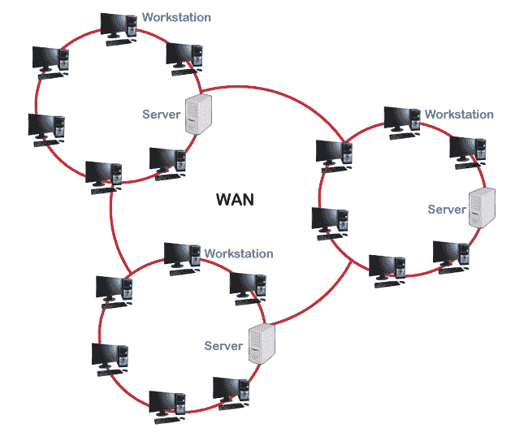

# 局域网和广域网的区别

> 原文：<https://www.javatpoint.com/lan-vs-wan>

在这个技术时代，计算机网络无疑是大多数组织的支柱。局域网和广域网是两种最流行的计算机网络。然而，有一些不同之处。在本文中，我们将讨论局域网和广域网之间的主要区别。让我们首先理解这两个定义:

## 局域网

一个[局域网](https://www.javatpoint.com/wireless-lan-introduction)是一组连接在一个有限区域内的计算机和其他网络设备，如一所房子、一栋建筑、一间办公室、整个校园等。它是一个广泛使用的设备网络，可以在有限的地理区域内建立，而无需像其他网络那样投入巨大的成本。在大多数情况下，局域网是用来形成一个网络，共享资源，如打印机，扫描仪，或文件，如音频，视频，电影，软件，游戏等。最简单的局域网例子是在一个房子里的计算机和打印机之间形成的连接。通常，它是一种介质，有助于在有限的范围内跨设备传输数据。

**优势:**

下面列出了使用局域网的几个优点:

*   数据可以毫无问题地从一台设备传输到另一台联网设备。
*   数据可以集中存储在服务器计算机的单个存储磁盘中。保护单个磁盘中的数据比保护所有单独的磁盘要容易得多。这也有助于数据管理。
*   局域网允许管理员在所有其他连接的设备之间共享一个互联网连接。
*   不同系统的用户可以通过网络从服务器的主计算机上使用相同的软件，而不是为每个系统购买任何付费软件。

像硬盘、光盘驱动器和打印机这样的计算机外围设备可以共享局域网，这将降低硬件购买的总成本。使用局域网，多台计算机可以使用同一台打印机或其他连接的设备。

## 广域网

广域网是一个重要的计算机网络，它覆盖了一个很大的地理区域。它可以覆盖国家之间的距离。广域网比局域网或城域网大得多，相对来说也更贵。由于其成本和复杂的设置，广域网通常不归一个组织所有。广域网是使用几个通过电话线或无线电波连接的局域网建立的。典型地，这些类型的网络使用高端电信电路来组织。互联网，一种公共网络，是最大的广域网的一个例子。

**优势:**

下面列出了使用广域网的几个优点:

*   广域网使用户能够在很大的地理区域内建立连接。这对于在很远的地方有办公室的组织很有帮助。他们可以很容易地与其他办公室沟通。
*   数据以集中的方式组织。它帮助用户轻松访问或管理数据。这在使用电子邮件、文件或备份服务器时很有帮助。用户不必为每个办公室或分支机构单独支付这些资源。
*   广域网允许用户通过即时消息系统进行通信。像 Whatsapp、Telegram 和 Skype 这样的应用程序让人们更容易与朋友或家人联系。
*   使用广域网，公司可以在实时服务器上工作。因此，开发人员和程序员可以在几秒钟内即时访问更新的文件。这有助于提高生产率。
*   由于有了公共网络，人们可以通过互联网在全球范围内组织他们的业务。

## 局域网和广域网的主要区别

下面列出了局域网和广域网之间的几个主要区别:

*   局域网是建立在小地理区域内的计算机网络，例如房子、办公室或建筑物。另一方面，广域网是一个覆盖广泛地理区域的计算机网络。
*   局域网允许用户更快地传输数据，而广域网的数据传输速率相对较慢。
*   局域网速度较高，而广域网速度较慢。
*   局域网的设计、设置和维护相对容易，而广域网的设计、设置和维护则比较困难。
*   局域网的容错率很高，而广域网的容错率较低。

## 局域网和广域网的主要区别

局域网和广域网之间的其他主要区别可以用表格形式解释，如下所示:

| 属性 | 局域网 | 广域网 |
| 完整表格 | 局域网的完整形式是“**局域网**”。 | 广域网的完整形式是“**广域网**”。 |
| 定义 | 局域网是一组连接在小地理区域的设备，如房屋、办公室或建筑物。 | 广域网是通过覆盖广阔区域的网络连接几个设备的一种安排。广域网的一个例子是，一个网络的通信链路跨越了地区、大都市或国家的边界。 |
| 地理区域 | 局域网占地面积小，不需要租用任何电信线路。 | 广域网覆盖的地理区域距离很远，通常跨越地区或大都市的边界，需要租用电信线路。 |
| 速度 | 局域网提供了相对较高的速度。 | 与局域网相比，广域网的速度较慢。 |
| 数据传输速率 | 局域网提供了比广域网更高的数据传输速率。最高可达 1000 Mbps。 | 广域网提供相对较慢的数据传输速率。最高可达 150mbps。 |
| 传播延迟 | 在局域网中，传播延迟很短。 | 在广域网中，传播延迟相对较长。 |
| 所有权 | 局域网由个人或组织拥有、管理和使用。因此，它是一个专用网络。 | 广域网可以是私有的，也可以是公共的。互联网是公共广域网的最好例子。 |
| 拥挤 | 局域网的拥塞率低于广域网。 | 与局域网相比，广域网的拥塞相对较高。 |
| 容错 | 局域网具有较高的容错性。 | 与局域网相比，广域网的容错能力较低。 |
| 技术 | 局域网倾向于使用一些特定的连接技术，主要是以太网和令牌环网。 | 广域网倾向于使用帧中继、多协议标签交换和自动柜员机以及 X.25 进行远距离连接。 |
| 关系 | 局域网可以通过电话线和无线电波连接到任何距离。通常，同轴电缆或 UTP 电缆用作传输介质。 | 在广域网中，设备通过公共网络连接，如电话系统。它们也可以通过租用线路或卫星连接。 |
| 成分 | 局域网的主要组件包括第 1 层设备(如集线器、中继器)和第 2 层设备(如交换机、网桥)。 | 广域网的主要组件包括第 3 层设备(如路由器、多层交换机)和特定技术设备(如调幅、帧中继交换机)。 |
| 带宽 | 局域网为传输提供了高带宽。 | 广域网为传输提供低带宽。 |
| 保持 | 局域网的设计和维护很容易。 | 广域网的设计和维护是复杂的。 |
| 核心原则 | 它以广播为原则。 | 它以点对点的原则运作。 |
| 费用 | 因为局域网占地面积小，所以安装起来非常便宜。 | 广域网的设置很高，因为它的地理区域更广。 |
| 可量测性 | 如果需要在一个局域网中连接更多的设备，这是很容易做到的。不会花很多钱。 | 说到广域网，额外设备的设置成本很高，因为必须连接偏远地区的网络。此外，使用公共网络的广域网容易建立并且不贵。 |

* * *