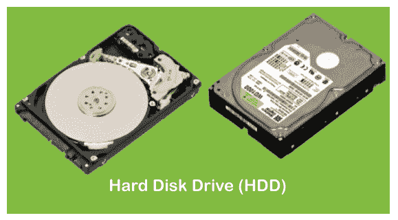
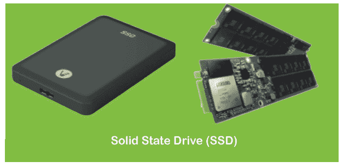

# 固态硬盘和硬盘的区别

> 原文：<https://www.javatpoint.com/ssd-vs-hdd>

固态硬盘和硬盘的物理结构和规格相似；然而，它们遵循不同的机制来存储数据。这两种驱动器各有优缺点，选择合适的驱动器取决于用户的要求和预算。

我们在本文中讨论了固态硬盘和硬盘之间的显著差异，这有助于决定在这个现代时代使用哪一种更好。让我们首先理解这两个定义:

## 硬盘驱动器

一[硬盘](https://www.javatpoint.com/hdd)是非易失性数据存储设备。术语非易失性是指即使在电源断开或关闭时也能存储数据的存储器。硬盘包含机械盘片和移动磁头，用于读写数据。头部通常连接有一个小马达，帮助旋转盘片和移动头部的手臂。

每个盘子被组织成几个同心圆，称为轨道。这些磁道进一步分成多个逻辑单元，称为扇区。每个磁道和扇区号都有一个唯一的地址，有助于定位和访问数据。数据存储在最近的可用空间中。在大多数硬盘中，盘片以 5400 转/分的速度旋转。转速越高，硬盘访问数据的速度就越快。

## 固态硬盘

[固态硬盘](https://www.javatpoint.com/ssd-full-form)或[固态硬盘](https://www.javatpoint.com/ssd)是一种更新、更快的非易失性存储设备。与硬盘不同，固态硬盘不包括移动部件，如盘片、磁头或臂。它使用集成电路来即时存储和检索数据。这些集成电路耦合在一个互连的闪存芯片(通常称为“与非”)上，以实现卓越的性能和耐用性。没有移动组件，固态硬盘运行更冷，能耗更低。这有助于延长笔记本电脑和其他基于固态硬盘的设备的电池寿命。

固态硬盘中使用的机制类似于大型 [USB](https://www.javatpoint.com/usb-full-form) 驱动器；然而，USB 驱动器使用不同种类的闪存芯片。这就是固态硬盘比[u 盘](https://www.javatpoint.com/usb-flash-drive)贵的原因。这些存储设备中使用的技术是与非门，一种闪存。它们包括浮栅晶体管，记录电荷以最低水平存储数据。这些大门保持网格风格，进一步变成了一个街区。帮助将栅极组织成网格图案的每一行称为一页。数据存储在这些有组织的块中。

## 固态硬盘和硬盘的主要区别

固态硬盘和硬盘之间的几个主要区别如下:

*   固态硬盘和硬盘的主要区别在于固态硬盘的读写速度要快得多。即使是最便宜的固态硬盘也能比传统硬盘实现更高的速度。
*   另一个很大的区别是尺寸。固态硬盘可以和硬盘一样大，但也有类似于随机存取存储器的紧凑尺寸。现代固态硬盘直接组装在电路板上。
*   固态硬盘和硬盘最大的区别之一是成本。固态硬盘比硬盘贵得多。然而，由于其令人难以置信的性能和紧凑的尺寸，为固态硬盘支付如此高的价格仍然是值得的。

## 固态硬盘和硬盘的主要区别

固态硬盘和硬盘驱动器之间的其他显著差异可以用表格形式解释，如下所示:

| 属性 | （同 solid-statedisk）固态（磁）盘 | 硬盘驱动器 |
| 完整的意义 | 固态硬盘是固态硬盘的缩写。 | 硬盘是硬盘驱动器的缩写。 |
| 机械零件 | 固态硬盘不包括任何机械零件。它只包含电子设计的组件，如集成电路。 | 硬盘是由机械零件组成的。它包括大盘子、移动头和手臂。 |
| 物理尺度 | 固态硬盘有不同的尺寸。它可以和硬盘一样大，也可以和内存一样小。 | 硬盘相对较大。它们有两种尺寸:3.5 英寸(适用于台式机系统)和 2.5 英寸(适用于笔记本电脑和笔记本电脑)。 |
| 重量 | 由于其紧凑的尺寸和没有机械零件，固态硬盘比硬盘重量轻。 | 硬盘比 SDD 重一点。 |
| 装卸时间 | 固态硬盘的读写总次数更短。 | 硬盘的读写总次数更高。 |
| 每秒操作数 | 固态硬盘可以在一秒钟内处理更多的输入/输出操作。 | 硬盘支持每秒更少的输入/输出操作。 |
| 潜伏 | 固态硬盘包含更高的延迟。 | 硬盘由较低的延迟组成。 |
| 碎片问题 | 固态硬盘不会面临碎片问题。 | 硬盘存在碎片问题。作为维护的一部分，需要不时对其进行碎片整理。 |
| 数据传送 | 数据传输基于随机访问。 | 数据传输是顺序的。 |
| 费用 | 固态硬盘比硬盘贵得多。 | 硬盘相对便宜。 |
| 放时间 | 固态硬盘是一种较新的存储解决方案，可以被称为未来的设备。 | 硬盘是一种更古老的存储选择，被称为传统存储。 |
| 噪音 | 固态硬盘没有噪音问题。 | 硬盘在旋转或通过其他机械运动时会产生噪音。 |
| 可靠性 | 固态硬盘要可靠得多。 | 硬盘包含机械零件，因此这些零件的功能有可能出现故障，使其不如固态硬盘可靠。 |
| 功率消耗 | 由于固态硬盘的非机械特性，其功耗更低。这有助于获得更长的电池寿命。 | 硬盘驱动器消耗相对较高的功率来使其盘片旋转，并使用电机带动其他部件一起移动。 |

## 我们应该选择哪一个？

如上所述，选择合适的存储是基于用户的需求和预算。固态硬盘最适合那些无法在性能上妥协的人，无论他们付出多少代价。此外，硬盘驱动器是那些有基本任务处理要求并希望以尽可能少的预算准备好系统的人的选择。

然而，在预算内实现平衡性能的最佳方法是同时使用固态硬盘和硬盘。当今技术时代的计算机系统可以同时使用两种存储器。因此，安装了操作系统的低容量固态硬盘将比传统硬盘工作得更好。固态硬盘只能用于软件，而用户的数据(如图像、音频、视频、文档等)。)可以存储在 HDD 中。这将有助于系统软件和活动运行得更快，并提供最佳性能。

* * *