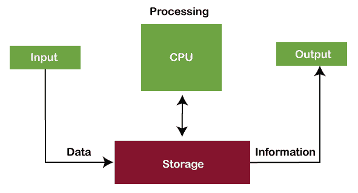
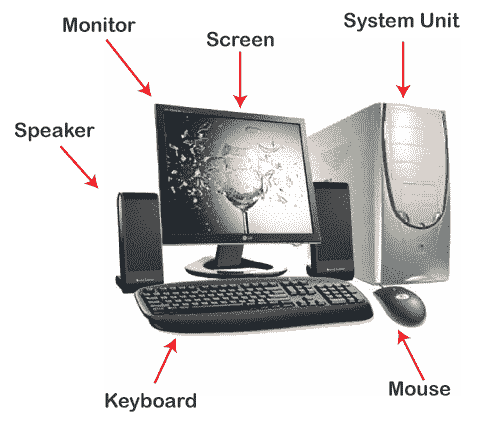
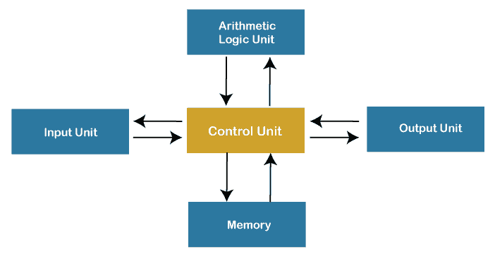

# 计算机导论

> 原文：<https://www.javatpoint.com/computer>

在现代，计算机是我们日常生活中必不可少的一部分。这意味着计算机几乎存在于每个领域，使我们的日常任务变得更容易和更快。如今，电脑可以在银行、商店、学校、医院、铁路和更多的地方看到，包括我们的家。因为它们是我们生活中如此重要的一部分，我们必须了解基本的计算机入门知识。让我们首先定义计算机:

## 什么是计算机？

计算机的直接含义是可以计算的机器。然而，现代计算机不再仅仅是一个计算设备。他们可以执行各种任务。简单来说，计算机是一种用于存储、检索和处理数据的可编程电子机器。

根据定义，“**计算机是一种可编程的电子设备，它获取数据，执行指令的算术和逻辑运算，并给出输出。**”

作为输入给计算机的东西叫做“数据”，而经过处理后得到的输出叫做“信息”。

## 计算机简史

“计算机”一词最早出现于 1640 年，被称为“计算者”。它源自拉丁语“computare”，意思是“计算”。1897 年，它被称为“计算机器”。后来在 1945 年，术语“计算机”被引入作为“可编程数字电子计算机”，现在被称为“计算机”。

当计算机被引进时，它们很大，可以填满整个房间。有些电脑是用大尺寸真空管操作的。1833 年，**查尔斯·巴贝奇**(被称为计算机之父)发明了一种早期的计算器，被命名为“**差分引擎**”。后来在 1837 年，他引进了第一台机械通用计算机“**分析引擎”**。随着时间的推移，计算机的性能变得强大，体积变小。

## 几代计算机

计算机有五代，可分为以下几类:

**第一代(1946 - 1959)** :第一代的时候，电脑是基于电子管(真空管)的。一些流行的第一代计算机是 ENIAC、EDVAC、UNIVAC 等。

**第二代(1959 - 1965)** :第二代的时候，电脑是基于晶体管的。一些流行的第二代计算机有 IBM 1400、IBM 1620、IBM 7000 系列等。

**第三代(1965 - 1971)** :第三代的时候，电脑是基于**集成电路**的。一些流行的第三代电脑有 IBM 360、IBM 370、PDP 等。

**第四代(1971 - 1980)** :第四代期间，计算机基于**超大规模集成电路**电路。一些流行的第四代电脑有 STAR 1000、CRAY-1、CRAY-X-MP、DEC 10 等。

**第五代(1980 年至今)**:第五代还在进行中。这些计算机基于多种技术，如**超大规模集成(ULSI)、人工智能(AI)** ，以及并行处理硬件。第五代电脑包括台式机、笔记本电脑、笔记本电脑等。

## 计算机软件和硬件

### 软件

[计算机软件](https://www.javatpoint.com/software)是指示计算机系统相应工作的一组指令或程序。主要有两种类型的软件:

**系统软件:**系统软件帮助建立硬件组件之间的通信，以便用户可以与计算机进行交互。这些类型的软件是计算机正确运行所必需的。它们提供了运行其他第三方程序或实用工具的界面。操作系统、驱动程序、实用软件和固件是系统软件的典型示例。

**应用软件**:应用软件旨在帮助用户执行特定的任务，如网上冲浪、设置闹钟、听音乐、播放视频、照片设计、编辑等。这种类型的软件大多在前端运行，允许最终用户使用。网络浏览器、Photoshop 软件、多媒体软件和文字处理器就是应用软件的例子。

### 五金器具

附在计算机上构成一台完整计算机的物理部件称为[硬件](https://www.javatpoint.com/hardware)或硬件组件。根据结构的不同，可以有不同类型的硬件。一些最常见的硬件有[鼠标](https://www.javatpoint.com/mouse)、[键盘](https://www.javatpoint.com/keyboard)、[显示器](https://www.javatpoint.com/monitor)、[打印机](https://www.javatpoint.com/printers)等。这些是人类可以看到和触摸到的部分。

## 计算机的基本部件

计算机的基本组件可以定义如下:

**输入单元**:输入单元或设备用于将数据或指令输入计算机。一些最常见的输入设备是鼠标和关键字。

**输出单元**:输出单元或设备用于以所需的格式向用户提供输出。输出设备最常见的例子是显示器和打印机。

**控制单元**:如其名称所述，该单元主要用于控制计算机的所有功能和功能。连接到计算机的所有组件或设备都通过控制单元相互作用。简而言之，控制单元被称为“ **CU** ”。

**算术逻辑单元**:算术逻辑单元帮助执行计算机系统的所有算术和逻辑运算。简而言之，算术逻辑单元被称为“**算术逻辑单元**”。

**内存**:内存用于存储所有的输入数据、指令和输出数据。记忆通常有两种类型:**主记忆**和**次记忆**。在[中央处理器](https://www.javatpoint.com/central-processing-unit)中找到的内存称为主内存，而不是[中央处理器](https://www.javatpoint.com/cpu-full-form)组成部分的内存称为辅助内存。

#### 注:控制单元、算术逻辑单元和存储器同时构成中央处理器(简称 CPU)。

## 计算机的功能

计算机有四个核心功能，如下所述:

**输入**:给电脑的东西都叫输入。使用输入设备将输入数据提供给计算机。计算机只接受二进制形式(原始格式)的数据。输入设备有助于将输入的二进制数据转换为计算机可以理解的形式。数据可以以各种形式输入，如字母、数字、图像等。

**处理**:处理是电脑的首要功能。中央处理器根据输入计算机系统的指令帮助处理数据。数据的处理是计算机系统的内部过程，数据在队列中执行。处理完成后，数据作为输出被进一步传输。处理器(CPU)是计算机的大脑，它是一个微芯片。处理器的速度在不同的计算机中有所不同，因为它取决于几个因素，如中央处理器、内存和主板的类型。

通常，在处理过程中会对数据执行以下操作:

*   算术运算，如加法、减法、乘法、微分、平方根等。
*   逻辑运算，如等于、不等于、大于、小于、相反等。

**输出**:从电脑出来的任何东西都叫输出。它是人类可读的数据，显示在计算机屏幕(监视器)上。如果需要，输出可以存储在存储设备中。输出设备帮助将中央处理器处理过的数据转换成人类可以理解的形式。

**存储**:用于存储计算机系统数据的设备称为存储器。存储设备有助于存储数字数据。它们可以在计算机运行时和处理后存储数据。有易失性和非易失性存储选项。只要电源连接，易失性存储器就可以存储数据，而非易失性存储器即使在电源断开后也可以永久存储数据。

## 计算机的特点

计算机的本质特征使它成为人类生活中如此重要的一部分。让我们了解计算机的基本特征:

**速度**:电脑是高速的电子机器。它们每秒可以传送大约 300-400 万条指令。即使是先进的计算机每秒也能处理数万亿条指令，从而缩短了执行任何数字任务的时间。

**准确度**:电脑也以性能精准著称。他们几乎可以 100%准确地完成给定的工作。虽然计算机中可能会出现错误，但它们通常是由不正确的输入、不正确的指令或芯片中的错误引起的。所有这些都是人为的错误。

**存储容量**:电脑可以轻松存储海量数据。与旧时代相比，现代计算机内置了高存储功能。附加数据可以存储在辅助设备上，如外部硬盘或闪存等。由于令人难以置信的速度，数据可以很快从存储中检索出来。

**可靠性**:电脑可靠一致；他们可以多次处理相同的任务，而不会抛出任何错误。计算机不会像人类一样感到疲劳，因此它们在执行基于规则的重复任务方面更胜一筹。

**通用性**:一台电脑可以完成的任务种类几乎是无限的。这意味着计算机可以连续执行不同的任务而不会出错；它们不再仅仅是一台计算机。一会儿，计算机可以用来执行数据输入任务或订票，下一会儿，它可以用来进行复杂的数学计算或连续的天文观测等。

## 计算机的分类

根据物理尺寸，计算机分为以下类型:

**超级计算机**:超级计算机是最快、最贵的一类计算机。它们很大，需要更多的安装空间。这些类型的计算机主要用于执行基于大量数据的复杂任务。超级计算机有足够的能力同时处理数万亿条指令。

**大型计算机**:与超级计算机相比，大型计算机的体积相对较小。然而，它们并不小。这些类型的计算机被设计成同时执行数百或数千个任务。这些计算机可以处理繁重的任务，包括复杂的计算，并可以存储大量数据。它们最适合大型组织，如银行、电信和教育部门。

**微电脑**:微电脑价格便宜，支持多用户平台。这些是通用计算机，旨在处理个人需求的所有必要任务。因为它们比大型计算机相对慢，因此适合小型组织。它们最适合网吧、学校、大学、办公室等。在日常生活中，微型计算机也被称为“个人计算机”。笔记本电脑和台式机是微型计算机的例子。

**小型机**:小型机也被称为 Miniframe 计算机。这些是为便于携带而专门设计的中型多处理计算机。这些类型的计算机重量轻，可以放在很小的空间里。它们适用于计费、会计、教育和商业目的。由于这些小型计算机易于携带，因此对于那些在旅行时需要计算机的人来说，它们是最好的选择。平板电脑、笔记本电脑和手机都是小型机的例子。

**工作站**:工作站是一台功能强大的单用户电脑。工作站是一种个人计算机，具有更快的微处理器、大量内存、更高质量的显示器、高图形内存等。这最适合专业地执行任何特定类型的任务。根据任务的类型，工作站可以被称为音乐工作站、图形工作站或工程设计工作站。大多数企业和专业人员使用工作站执行任务，如动画、音乐创作、视频编辑、海报设计、数据分析等。

## 使用计算机的优势

以下是使用计算机的主要优点:

*   计算机可以以惊人的速度执行给定的任务。
*   计算机可以以相同的精度多次执行相同的任务。
*   计算机允许同时完成几项任务，因为它们最适合多任务处理。
*   计算机保护存储数据的安全，防止未经授权的用户访问。
*   计算机可以自动化地自动执行日常任务，使人类可以执行更智能的任务。

## 使用计算机的缺点

以下是使用计算机的主要缺点:

*   计算机不能自己工作。它们需要人类的指令来完成任务。此外，计算机盲目地遵循给定的指令，而不考虑结果。
*   电脑需要电源才能工作。没有电源，它们就没用了。
*   长时间持续在电脑上工作会导致一些健康问题。
*   电脑及其零件的浪费会对环境造成负面影响。
*   计算机正在许多领域取代人类的工作。它们正在取代人类的工作，从而增加了失业率。

* * *