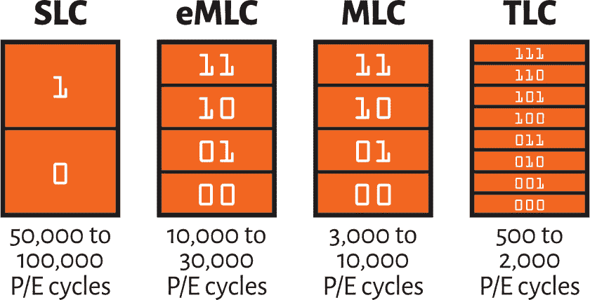

# MLC 对比 TLC 对比 SLC NAND 闪存

> 原文：<https://www.javatpoint.com/mlc-vs-tlc-vs-slc-nand-flash>

固态硬盘的底层 NAND 架构将因型号而异，这些变化将在本文中讨论。有多种 NAND 闪存类型-SLC、MLC、eMLC 和 TLC，每种都有独特的特性，对我们的业务存储产生了最佳影响。

闪存彻底改变了企业数据挖掘。[固态硬盘](https://www.javatpoint.com/ssd-full-form)封装允许存储子系统和阵列相对于硬盘提供广泛的设备效率。它还使我们能够快速处理业务分析和其他工作负载。闪存可以在电脑和移动设备上快速启动、快速启动程序和传输数据。

固态硬盘甚至不容易受到突然运动和物理冲击的干扰，因为闪存中没有移动部件。它们的油耗也比[硬盘](https://www.javatpoint.com/hdd)少，这是另一个优势。

### 不同类型的与非闪存

[NAND 闪存](https://www.javatpoint.com/nand-flash-memory)是一种非易失性存储架构，用于固态硬盘和存储卡。它的名字来自决定数字数据如何存储在闪存计算机芯片中的逻辑门(非与)。

### 企业多级单元(EMLC)

企业多级单元是 MLC NAND 闪存的一种更复杂的变体，它填补了 SLC 和 MLC 在效率和耐用性方面的差异。EMLC 驱动器的价格高于 MLC 驱动器，但它们的同类产品的价格远低于 SLC。尽管每个单元只能容纳两位，但 eMLC 驱动器的控制器可以执行数据定位、损耗均衡和其他存储操作，从而延长 eMLC 固态硬盘的使用寿命。

### 单层细胞(SLC)

单级单元固态硬盘存储一位。这种设计提高了耐用性、准确性和效率。SLC 是关键商业软件和计算设备的首选闪存技术。一般来说，它持有最大的价格标签。

### 三级细胞

三级单元 NAND 闪存每个单元存储三位，成本最低，通常用于消费级电子产品中相对较低的效率和耐用性要求。[基于 TLC](https://www.javatpoint.com/tlc-full-form) 的存储模块很少在业务环境中使用，最适合读取量大的应用。即使是最近闪存架构的增强，也让该平台在读取密集型企业存储应用中发挥了作用，包括 3D NAND 和增强耐用性的数据定位和纠错技术。

### 多级单元

尽管闪存具有买方级别的味道，但[多级单元](https://www.javatpoint.com/multi-level-cell)结构可以容纳每个单元 2 位。虽然合理使用空间可能会在一个存储单元中封装多个位，但这是以降低使用寿命和效率为代价的。MLC 固态硬盘使向电脑和笔记本电脑添加闪存存储在经济上变得容易。

### 与非门与 3D 与非门

3D NAND 或垂直 NAND 是进入闪存存储行业的主要技术之一。顾名思义，它利用堆叠架构将存储单元排列在[固态驱动器(SSD)](https://www.javatpoint.com/ssd) 内，而不是以前实现的平面或扁平结构。实际上，相对于 2D NAND，这种架构有助于供应商以更低的成本将更多容量打包到更少的物理空间中。它还能产生更高的速度、更好的耐用性和更低的燃油规格。如今，大多数大型固态硬盘供应商都在销售 3D NAND 固态硬盘。

例如，三星利用这一技术在其最新的 NVMe NF1 固态硬盘中加载了 8 TB 的闪存。下一代小尺寸组件仅 11 厘米乘 3.5 厘米，如果资金不是问题，足以填满 2U 服务器上 576 TB 的全闪存存储容量。

### 如何在三级电池、多级电池和单级电池固态硬盘之间进行选择

寻找最佳质量固态硬盘的信息技术买家应该会期望为 SLC 支付比 eMLC、MLC 和 TLC 更多的费用。

在尝试让存储物超所值时，有许多因素需要考虑。SLC 固态硬盘非常适合要求快速可靠性能的关键应用程序工作负载和全天候数据库。当然，不是所有的工作负载都需要快速度，价格或性能也必须考虑。

* * *