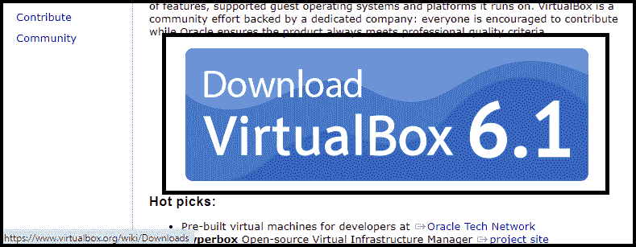
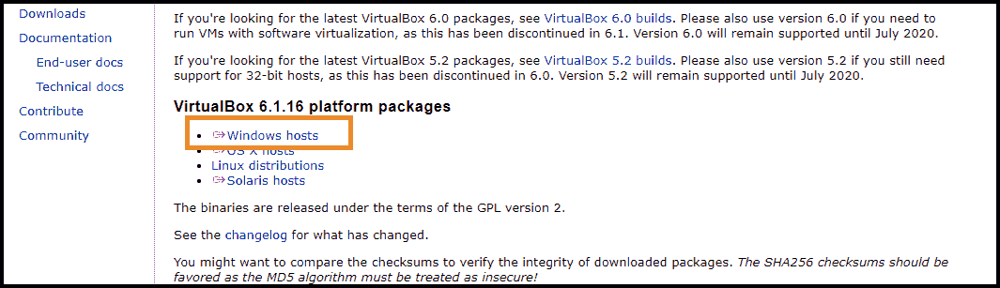
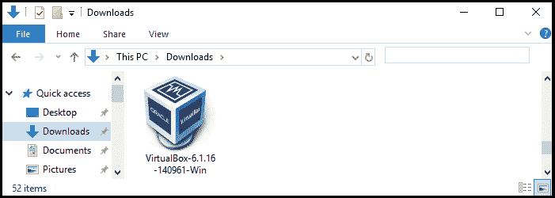
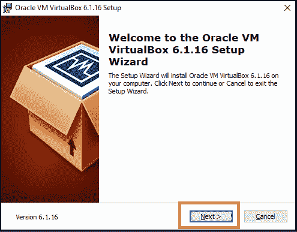
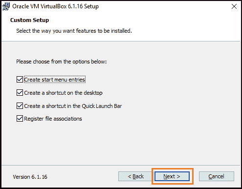
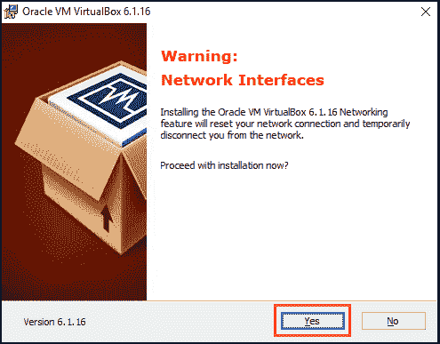
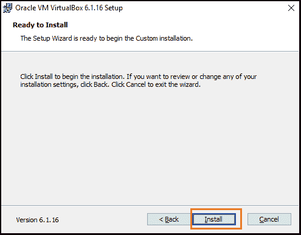
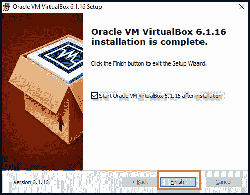

# VirtualBox 安装

> 原文：<https://www.javatpoint.com/virtualbox-installation>

在本文中，我们将讨论如何安装 VirtualBox。但是首先，我们必须了解 VirtualBox。

## 什么是 VirtualBox？

VirtualBox 是一个免费的开源软件程序，用于虚拟化 **x86** 计算架构。甲骨文公司开发的。它作为虚拟机管理程序工作，并开发一个虚拟机，用户可以在其中运行另一个操作系统。**“主机”**操作系统是 VirtualBox 运行的操作系统。**“来宾”**操作系统是运行在虚拟机上的操作系统。作为主机操作系统，VirtualBox 支持 [Windows](https://www.javatpoint.com/windows) 、 [Linux](https://www.javatpoint.com/linux-tutorial) 、Solaris、Open Solaris 和 MacOS。

在设置虚拟机时，用户可以确定有多少处理器内核以及多少[内存](https://www.javatpoint.com/ram-full-form)和磁盘空间将用于虚拟机。虚拟机运行时，可能是**【暂停】**。

## VirtualBox 的历史

**Innotek GmbH** 最初是它开发的。VirtualBox 作为开源软件包于 2007 年 1 月 17 日在**发布。太阳微系统公司**后来收购了该公司。**甲骨文公司**于**2010 年 1 月 27 日**收购孙，接管 VirtualBox 生产。

## VirtualBox 的特性

VirtualBox 有各种各样的特性。一些基本特征如下:

### 轻便

VirtualBox 是一种类型 2 虚拟机管理程序跨平台操作系统，这意味着构建在单个主机上的虚拟机将在其他主机上运行。可以使用开放虚拟化格式(OVF)根据需要导入和导出来宾虚拟机。

### 客人添加

这些是安装在来宾操作系统上的工具集合，用于优化其性能并提供额外的主机系统集成和通信。

### 虚拟机组

VirtualBox 提供群组功能。该功能允许用户单独和集体地组织虚拟机。通常，可以对虚拟机类(如单个虚拟机)应用启动、暂停、关闭、重置、关闭、保存状态、断电等操作。

### 硬件支持

VirtualBox 支持 Guest SMP、多屏幕分辨率、内置 iSCSI 支持、 [USB](https://www.javatpoint.com/usb-full-form) 设备、全 ACPI 支持以及 PXE 网络引导。

### 快照

VirtualBox 通过保存快照功能为来宾提供虚拟机状态详细信息。到时候，我们可以回去把虚拟机找回来。

## 虚拟盒子是如何工作的？

[Oracle](https://www.javatpoint.com/oracle-tutorial) VirtualBox 具有可伸缩性和灵活性。理论上，软件程序虚拟化并不太复杂。我们可以在 VirtualBox 上运行许多操作系统。每个操作系统都可以独立启动、暂停和停止。

虚拟机管理程序作为环形零内核服务应用。内核包括一个名为 vboxsrv 的设备驱动程序工具。该设备驱动程序管理任务或活动，包括为功能加载虚拟机管理程序模块，为数字访问者机器分配物理内存，以及保存和恢复访问者技术的上下文。每当发生任何中断时，我们都可以使用另一个操作系统来启动执行和识别，同时希望处理 VT-x 或 AMD-V 活动。

用户自己在整个执行过程中管理其操作系统调度。用户在主机系统上作为单个进程运行，并通过主机进行调度。除此之外，当用户允许操作系统访问磁盘、社区控制器和不同设备等资源时，还有额外的设备驱动程序。除了内核模块，其他进程也在主机上运行，帮助运行的客户。当从 VirtualBox 图形用户界面启动来宾虚拟机时，VBoxSVC 过程会在后台自动开始。

## 在 Windows 中安装 VirtualBox

如果我们想在 windows 中安装 VirtualBox，我们可以使用以下步骤:

**第一步:**首先，我们需要通过系统互联网浏览器中的[https://www.virtualbox.org/](https://www.virtualbox.org/)进入 **VirtualBox 网站**。这是我们将下载 VirtualBox 安装文件的链接。

**第二步:**点击**下载虚拟盒子**按钮，该按钮出现在页面的蓝色按钮上。

**第三步:**现在，点击**视窗主机**链接。我们将在**“VirtualBox 6 . 1 . 16 平台包”**选项下看到它。

**第四步:**现在，打开系统中我们下载该文件的 **VirtualBox EXE** 文件。之后，VirtualBox 安装窗口将会打开。

**第五步:**点击欢迎窗口中的**下一步**按钮。

**第 6 步:**选择**安装文件夹**，点击**下一步**按钮。

**第七步:**现在，我们将选择我们想要安装的功能，然后点击**下一步**按钮。

**第 8 步:**点击**是**按钮安装甲骨文虚拟盒子界面。

**步骤 9:** 出现提示时，点击**安装**按钮。之后，它将开始在我们的系统中安装 VirtualBox。

**步骤 10:** 完成所有这些过程后，点击**完成**按钮。当我们这样做时，安装选项卡将被关闭，VirtualBox 将被打开。现在，我们可以创建一个虚拟机来运行系统上的任何操作系统。

* * *