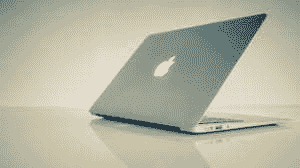

# 什么是 MAC？

> 原文：<https://www.javatpoint.com/mac>

媒体访问控制一词可以定义为以下任何一种:

1.MAC 代表媒体访问控制，即一个地址，称为硬件地址和物理地址。这是一种地址类型，它是单独提供给所有计算机或网络设备的，并且以十六进制格式专门排列。它与苹果麦金塔电脑无关，被制造成每一张网卡，比如无线网卡或以太网卡。通常由硬件制造商指定。媒体访问控制地址在大多数网络类型中实现，但不能更改。

有成千上万的可联网设备可用，所有设备都需要唯一的媒体访问控制地址和各种可能的地址。因此，这六个两位十六进制数用于组成媒体访问控制地址，并用冒号分隔。给定的地址是媒体访问控制地址的一个例子:

E4-CE-D9-5D-46-11A

另外，以太网卡可能有 00:0d:83:b1:c0:8e MAC 地址。

2.“苹果电脑”一词也被用来描述麦金塔电脑，这是苹果电脑的电脑操作系统。Mac OS X 是一个桌面界面，这是其最新版本的一个流行功能。它运行旧的苹果应用程序和 UNIX 应用程序。当微软操作系统成为行业标准时，苹果操作系统被引入并被认为是基于图形用户界面的操作系统的先驱。它还能够提供类似于 Linux 操作系统或 Windows 的服务和功能。Mac OS 具有 Lisa OS 的一些特性和代码库。默认情况下，Mac OS 不支持 x86 架构，设计用于在苹果制造的电脑上运行。到 2012 年已经发布了各种版本，如 Mac OS X、Macintosh 128k、Mac OS X、Mac 山狮等。

## 苹果电脑是电脑吗？

在计算机领域，个人电脑一词有两种含义。但是当它们相关时，它们有唯一的定义。

最初，术语 [PC](https://www.javatpoint.com/pc) 代表个人电脑。这意味着当一个人亲自使用电脑时，它可以被认为是一台电脑或个人电脑。家庭或办公室使用的计算机被认为是个人计算机。由于 Mac 是为个人使用而设计的；因此，根据这个定义，苹果电脑被认为是个人电脑。

然而，当 IBM 于 1981 年 8 月推出第一台型号为 5150 的计算机时，个人电脑这个术语变得更加具体。从那时起，个人电脑取代了兼容 IBM 的电脑。在现代，如果有人用计算机来谈论个人电脑，通常指的是与 IBM 兼容的计算机。所以，一台苹果电脑不兼容 IBM 因此，它不被认为是个人电脑。

虽然在大多数情况下，术语“个人电脑”指的是与 IBM 兼容的电脑，但它仍然是个人电脑的简称。苹果电脑不运行微软视窗系统。因此，在特定意义上，它不是个人电脑。

## Mac 和 PC 有什么区别？

当“苹果电脑”和“个人电脑”这个词出现在电脑上时，苹果电脑和个人电脑之间的区别就成了最有争议的话题之一。IT 始于 IBM 不是苹果或微软电脑之王的时候。国际商用机器公司的个人电脑鼓励了国际商用机器公司的个人电脑，从阿尔泰 8800 开始，苹果和康茂德公司被领导。

大多数情况下，康茂德成为一个两个公司的比赛，因为它退出了个人电脑市场。在众多与 IBM 兼容的计算机和苹果的麦金塔系列计算机之间，这成为了一场通常被称为个人电脑的竞赛。正如苹果框定的那样，你可以买一台苹果电脑和一台个人电脑。

## 苹果电脑和个人电脑有什么相似之处

请记住，当一台苹果电脑刚刚安装了苹果操作系统时，它被认为是一台电脑。它从来没有像苹果这样相似，苹果试图将苹果电脑视为与个人电脑不同的东西。Mac OS 和 [Windows](https://www.javatpoint.com/windows) 都可以安装在 iMac 或者 MacBook 上；您也可以在它们之间切换，或者在 Fusion 或 Parallels 等软件的帮助下在 Mac OS 上运行 Windows(或者可以并行运行)。Mac 和 PC 有各种相似之处；这些措施如下:

*   就使用基本硬件组件而言，两者是相似的。
*   它们都能够支持第三方键盘和鼠标，以及无线鼠标和键盘。
*   它们都包括一个类似的用户界面，在桌面上有应用程序图标，或者使用户能够在您的桌面上存储应用程序，轻松运行已安装的应用程序，以及许多其他功能。
*   Mac 和 PC 都允许用户使用谷歌驱动、Dropbox、Box.net 等云服务。
*   他们都由一个虚拟助理组成；基于 Windows 的电脑有 Cortana，Mac 有 Siri。
*   网络浏览器，如谷歌浏览器、火狐和 Safari，既适用于苹果电脑，也适用于个人电脑，这是少数几个只适用于像 Edge 浏览器这样的窗口的流行浏览器之一。

## 苹果电脑和个人电脑有什么不同

苹果操作系统能够支持鼠标的左右点击，也允许用户将鼠标连接到苹果电脑，他们在视窗电脑上使用苹果电脑，而苹果的魔术鼠标看起来像一个按钮；当从右侧单击它时，它会生成右键单击。

对于从 Windows 界面切换到 Mac 的人来说，键盘快捷键是许多困难的步骤。如果您正在使用 Mac 剪贴板，并且使用快捷键 Control+C 来复制某些内容，您会看到 Control+C 无法将任何内容复制到剪贴板。Command+C 用于复制 Mac 上的任何内容。虽然看起来很简单，但不太容易像以前那样自然。关于 Mac 和 PC 的区别有多个术语，描述如下:

### 安全

**Mac:** 传统上，Mac 被认为更安全，因为它的安全漏洞更少。与运行视窗系统的电脑相比，苹果电脑感染的病毒更少。根据市场价格，这个数字可能会有所不同，因为苹果电脑的市场份额不到 10%。结果，它向个人电脑表明，他们有更多的漏洞，但个人电脑是最好的目标，如果有人试图未经授权或非法访问大多数计算机。

**PC:** 运行微软 Windows 某些版本的计算机正成为攻击者的主要目标，因为它们被当今大多数人使用。据说，与苹果电脑相比，视窗电脑在过去有更多的安全漏洞。

**底线:**在这个类别中，Mac 获胜。然而，在较新版本的 Windows 中，安全性有了实质性的提高。但是由于大多数恶意软件是为个人电脑创建的，所以苹果电脑的安全问题较少。

### 软件

对于苹果电脑来说，不同的软件标题在过去几年里有所增加。然而，一提到游戏，Windows 就被电脑软件市场征服了。由于用户基数更大，开发人员更有动力为个人电脑开发软件。

**底线:**由于软件和自由程序的整体可用性，PC 在这一类别中胜出。

### 价格

**Mac:** 很多人认为，对于一台 Mac 电脑来说，“物有所值”，与 PC 相比，Mac 电脑自带外设。但从一美元到性能的角度来看，这是非常昂贵的。

**PC:** 与 Mac 相比，很多 PC 都要便宜很多，包括它们的外设。与其他产品相比，它们特别便宜。

**底线:**对比所有电脑和硬件时，PC 胜出这一类。在某些情况下，如果你只比较高端硬件，一台电脑可能会很贵。

### 操作系统

说到比较[操作系统](https://www.javatpoint.com/operating-system)，就好比比较苹果和橘子。macOS 和 Windows 10 这两种操作系统都是功能强大、快速、干净、简单的操作系统。归结起来就是用户的具体要求和个人喜好。

### 生态系统

**Mac:** 苹果用自己的产品打造了一个强大的生态系统，比如苹果电视、iPhone 和 iPad。如果你购买了一台苹果电脑，它可以帮助你在苹果操作系统的帮助下与其他苹果产品进行交流。

**PC:** 有了 Xbox 和微软 Office，微软有了强大的生态系统。但是，微软必须依赖安卓设备，没有移动产品。此外，像苹果的产品生态系统一样，其他制造商的产品生态系统也没有那么紧密。

**底线:**在这个类别中，Mac 赢了，但是是情景化的。

### 启动时间

**底线:**与 PC 相比，MAC 的开机速度更快。操作系统 Windows 10 在某些情况下比 macOS 执行得更快。计算机使用的硬盘类型是有助于减少启动时间的最大组件。虽然个人电脑和苹果电脑都有固态硬盘，但它们有更快的选项来构建个人电脑。

### 司机

**Mac:** 由于苹果是大多数硬件和这些电脑的唯一制造商，这为 Mac 提供了优势。因此，苹果有能力维护和控制他们的大部分驱动程序。

**PC:**PC 需要大量的驱动程序，因为它们是由各种不同的制造商用可互换的组件构建的。尽管即插即用的优势在于它使硬件安装变得容易，但所有制造商都需要维护驱动程序，所有硬件仍然需要驱动程序。

### 赌博

这些年来，电脑游戏公司对苹果电脑的兴趣越来越大。虽然开发者更有动力为 Windows 开发游戏软件，而且它也拥有 90%的市场份额。

**底线:**由于开发者对 Windows 操作系统游戏软件的广泛开发，PC 赢得了这一类别。

### 修理费用

**Mac:** 苹果总是试图让产品尽可能紧凑，线条尽可能圆滑。为此，他们不断地集成他们的组件。因此，这些计算机在需要维修时需要更多的成本。此外，苹果产品在任何地方都不容易或不常见，就像其他产品一样，这使得您的计算机更难修复。对于像微软产品这样的其他公司产品，你可以很容易地在任何地方找到任何陈列室或商店来修理这些产品。

**PC:** 任何一家本地电脑维修店都可以非常轻松的维修台式 PC。然而，有些型号的个人电脑和笔记本电脑可能会像苹果笔记本电脑一样困难和昂贵。

**底线:**因为修复 PC 比修复 Mac 更容易；因此，PC 赢得了这一类别。

### 支持

**Mac:** 苹果可以在你的 Mac 需要技术帮助或支持时提供很多帮助，而这在 PC 上是没有的。因为当用户对他们的苹果产品有任何问题时，他们只需要与苹果打交道，因为苹果的产品只由苹果设计和制造。此外，对于苹果产品，苹果在世界各地有许多商店提供面对面的帮助和支持。

**电脑:**对于电脑，支持可能会因原始设备制造商和您购买原始设备制造商电脑(如戴尔或惠普)时遇到的问题而受到影响或错过。虽然有很多修理电脑问题的商店，但它们不提供培训，可能不适合为某个品牌的电脑修理。最后，如果你自己制造电脑，你会和很多不同的制造商打交道，寻求支持。

### 触摸能力

Mac 在台式机和笔记本电脑上不提供触摸屏功能。它在一些 MacBooks 上提供触摸条，而个人电脑带有触摸功能。因此，个人电脑赢得了这一类别。

**附加免责声明**

**所有 PC 不一样**

所有的电脑都不一样；有多种型号的电脑和不同的 PC 制造商，这意味着每台 PC 都没有所有的东西或不适用于每台 PC，这是上面提到的。因此，所有的电脑都不一样。

**我的苹果可以运行 Windows**

上述所有内容可能不适用于您的苹果电脑，因为微软视窗系统能够在苹果电脑上运行，并得到引导营的帮助。此外，通过使用新兵训练营，在苹果电脑上，你可能能够运行最新的游戏。然而，Boot Camp 并不完美，在 PC 游戏没有开发出与苹果硬件兼容之前，并不能完全在电脑上运行每一款游戏。因此，很可能会出现性能问题和遇到问题。

**Windows XP、Windows 7、Windows 8 或 Windows 10**

Windows XP 在市场上已经走过了 18 年。所以，如果你拿一台 Windows XP 电脑和一台新款 iMac 和 macOS 做对比，就好比拿一辆老款车和最新款车做对比，比如 Maruti 800 和法拉利或者另一款新车做对比。如果你正在比较任何一台计算机，这是比较具有相似硬件组件的新型号计算机的正确方法。

**有些人不喜欢 Windows 或者 macOS**

有些人不喜欢任何类型的操作系统，苹果 macOS 或者微软 Windows。它完全取决于用户想要使用哪一个操作系统；如果他们不喜欢使用微软 Windows，那就买一台 Mac，如果他们不喜欢使用 macOS，那就相应地买一台 PC。

### MAC 与 PC 的一些主要关键点如下:

*   个人电脑是访问未经授权或非法功能的最佳目标。然而，大多数病毒和恶意软件都是专门为 Mac 编写的。
*   基于 Windows 的个人电脑比 Macs 便宜，因为它们是由许多不同的制造商设计和制造的，如戴尔、惠普、宏碁、索尼、联想等。
*   与个人电脑相比，苹果电脑的成本要高得多，因为它们只由苹果设计和制造。但是它们提供了更好的稳定性，因为对硬件的更严格控制导致了更少的问题。
*   对于游戏，微软视窗提供了更好的支持。它还包括对 Oculus Rift 或 HTC Vive 和其他虚拟现实硬件的支持。
*   虽然对于基于 Windows 的 Pc 来说，一部分一部分地升级要容易得多，但大多数人发现购买一台新的 PC 而不是升级它是一个合适的解决方案。但是通过升级游戏使用的图形，技术人员可以提高他们的计算机的寿命，音乐、电影和其他媒体使用的存储容量，以及应用程序使用的内存。

* * *