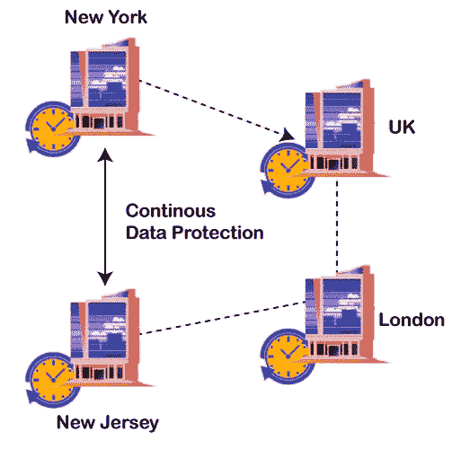

# 连续数据保护

> 原文：<https://www.javatpoint.com/continuous-data-protection>

连续数据保护是一种检索机制，在这种机制中，如果进行了任何修改，组织的所有数据都会得到备份，通常称为连续备份。实际上，它会生成一份电子日志，其中包含完整的信息快照，每发生一次数据更改，就有一个存储快照。

事实上，它维护任何业务活动的数据库是 CDP 的一个重要优势。此外，如果系统感染了病毒或特洛伊木马，或者文件被破坏或损坏，总是可以恢复受影响文件的最新干净副本。

与磁带备份或归档相比，CDP 光盘记录系统在几秒钟内恢复数据的时间甚至更少。CDP 硬件和编程实现简单快捷，不会将当前数据置于风险之中。

### 连续数据备份的优势

用于数据安全的连续软件促进了分层存储，分层存储管理的增加有助于最大限度地减少存储的手动分层阶段。如今，设备自动化会在各种存储设备、驱动器类型或 RAID 类别之间实时自动传输数据，而这些对客户来说基本上是不可见的。短期层保存最新的数据，通常驻留在高性能存储阵列上，该阵列的磁盘可以共同拥有足够的 IOPS 容量来高效地保存和恢复数据。随着恢复点的老化，连续数据管理程序会将它们从短期存储层转移到长期存储层。这一层可以使用商用光盘，但使用磁带或云存储更受欢迎。

### CDP 是如何工作的

通过将修改后的数据从源设备复制到目标设备，连续数据保护可以发挥作用。还会有一个与源位置相同的光盘，这是一种快速恢复数据的方法。

然而，异地复制是可行的，这为灾难恢复提供了更好的安全性和未来的供应。对于某些 CDP 产品，您可以复制到两个站点，一个是现场快速恢复站点，另一个是更远的灾难恢复站点。

在物理系统出现故障的情况下，连续数据保护系统会在故障前一直保留所有修改，直到最后一次写入。你会恢复到那个点，或者在任何腐败发生之前的最后一点。

当他们报告任何更新时，真正的 CDP 系统可以同样容易地复制文件或程序。

### CDP 能否替代传统备份？

连续数据保护提供了几乎即时的磁盘恢复，并且至少提供了与真正的 CDP 一样最新的 RPO。此外，由于 CDP 在白天进行备份，因此可以跳过可怕的备份窗口。这意味着 CDP 提供了一夜之间摆脱单一单一备份操作的能力。

但是传统备份会被取代吗？嗯，很多事情取决于任何备份计划的未来有效性。其中，备份副本和主站点之间的距离是秘密。使用 CDP 复制任何单个更新。您可以有一个接近零的恢复点目标和一个快速的磁盘恢复期，因此您可以很好地应对重大灾难之外的情况。

但是，如果这些备份与主记录在同一个站点上，那么在发生火灾或其他灾难时，您根本就不安全。

### 磁盘镜像与 CDP

像任何形式的完整备份一样，镜像备份会占用大量存储空间。磁盘镜像，也称为 RAID 1，将数据完全复制到两个或三个驱动器，这样，如果一个驱动器崩溃，公司就可以访问镜像副本。在引入云计算之前，只运行一台服务器和几台笔记本电脑的中小型企业由于费用和困难不太可能实施 CDP。

### 近连续备份与 CDP

CDP 和近 CDP 支持即时恢复，使应用程序能够在主映像被销毁时自动安装恢复映像。两者之间的区别是它们提供的恢复点的目标。

* * *