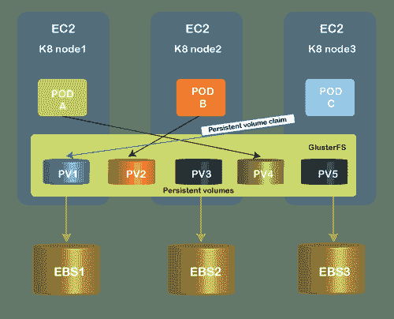

# 持久存储

> 原文：<https://www.javatpoint.com/persistent-storage>

持久存储是在关闭数据存储设备的电源后保存数据的任何设备。通常，它也被称为非挥发性材料。与不同的光学媒体格式(如 DVD)一样，磁性媒体(如硬盘驱动器和磁带)是典型的永久存储类型。持久存储结构可以是文件、块或对象的存储形式。在很大程度上，任何存储系统最简单的先决条件是存储寿命是一种保证，无论它适用于单个光盘、共享网络存储系统还是云存储设施。不同寻常的是，它甚至被列在存储设备和系统的技术要求中，所以人们相信持久性。

### 持久固态存储

永久存储的例子还有固态硬盘。但是，它们与其他类型的永久介质不同，因为它们不包含移动组件，无论是内部组件还是访问介质所需的驱动器组件。

很少有固态存储设备，尤其是用于随机存取存储器和高速缓存设备的芯片，通常是非持久存储设备，这意味着当连续电源停止流经计算机时，它们承载的信息会被删除。但是，一些类型，如非易失性内存和基于闪存的内存，是持久的；当一次能源被切断时，他们通常依靠电池供电。使用保存电荷的超级电容器而不是电池缓冲器也可以获得一定程度的持久性。内存保留活动的工作，这些工作可能尚未保存到磁盘驱动器或固态驱动器中，以防崩溃或重建。内存持久性可以避免数据丢失。

易失性或非持久性存储资源的一个缺点是，当电源关闭时，它们会销毁所有数据。相对于持久存储设备，它们通常提供较少的安全风险。

### 持久存储和集装箱化

然而，有一个例外与虚拟化计算的最新发展有关，它有助于增加存储持久性这一问题。近年来，容器化已经成为将软件及其操作系统打包成隔离的、可传输的模块的常见方式，这些模块被尽可能多地生成和销毁。但是容器最初不允许永久存储，这意味着容器化应用程序生成的数据将消失，直到应用程序完成其功能，并且容器被破坏。

然而，一些软件和存储供应商最近开发了一些方法来保留容器应用程序生成的数据，并将它们保存在熟悉的存储卷中。存储卷通常与最先进的应用程序(如数据库)相关联，即使应用程序被关闭或处理，这些应用程序仍可访问。存储容器的这些进步解决了保留更短暂的存储卷的问题，这些存储卷随着从容器运行的无状态应用程序而生存和死亡。

### 持久存储的类型

*   **Kubernetes:** OpenShift 是基于 Docker 容器打包设计的平台即框架服务，使用 Kubernetes 围绕一个集群编排容器化的软件集群。在程序使用它们之前，必须预先配置存储卷，并将其手动注册为持久卷对象。存储类对象允许资源调配器接口为按需应用程序生成存储卷。
*   **Containers:**OpenStack swift 是一款全分布式存储解决方案，可用于存储任何形式的静态数据或二进制对象，如媒体文件、海量数据集和磁盘映像。通过使用箱，解决方案组织这些对象。虽然实例只能访问卷的内容，但是容器中的对象可以通过对象存储的 REST API 来访问。因此，公共云或私有云中的几乎任何服务都将对象存储用作存储库。

### 持久存储用例

某些功能产生必须保存的信息。例如，销售税计算功能产生需要在应用程序中存储和交换的信息。在下面的方法中，必须保留的基本数据可以被处理。

**将传统应用程序迁移到云中:**通过在云中切换到透明且更具可扩展性的基础架构，“提升和转移”方法为 IT 现代化开辟了道路。出于健全的市场目的，企业采用提升和变革，包括降低成本、提高效率和弹性。

**持续集成和持续交付:**持续集成和持续分发是两种软件开发技术，旨在提高编程一致性，加速代码交付和实现。为了确保新产品功能和更新的快速实施，它们通常一起实施。

**数据基础架构管理:**随着 IT 环境的快速增长和发展，数据基础架构的自动化需要敏捷性来跟上步伐。通过多云和虚拟化环境，可以实现这种多功能性。

### 持久性存储如何与容器一起工作？

1.  **持久卷:**PV 是集群服务，其生命周期独立于使用 PV 的任何特定 pod。在主机上，这是保存永久数据的“物理”卷。持久卷具有集群存储服务，即使存储资源被使用它们的存储单元循环使用，也允许存储资源存活。持久卷可以静态或动态调配，通过指定诸如效率、规模和访问模式等属性，可以对其进行使用配置。
2.  **Trident:** Trident 与 Kubernetes 持久卷平台接口，并为 NetApp ONTAP 和 SolidFire 横向扩展存储网络提供单一存储资源调配接口。它被部署为 Kubernetes 的高可用性“部署”，并以持久卷声明的形式与 API 服务器交互，以处理 pod 存储请求。
3.  **持久卷声明:**PVC 是充当资源声明测试的资源请求。聚氯乙烯是一个为网络建立一个持久卷的请求，并通过聚氯乙烯将聚氯乙烯连接到吊舱。

* * *