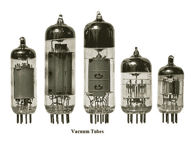
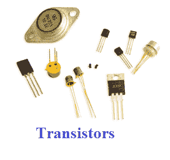
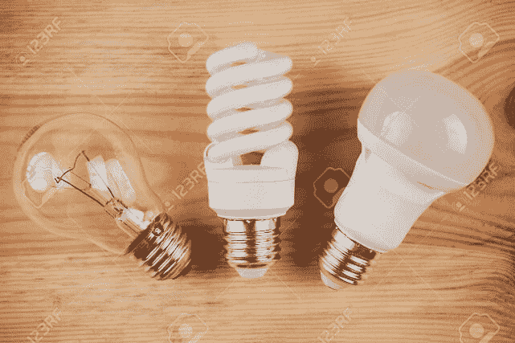

# 电脑有几代了？

> 原文：<https://www.javatpoint.com/how-many-generations-of-the-computer>

计算机是操作信息的电子机器；它接受原始数据作为输入，并在处理后提供有意义的结果。它可用于编辑或创建电子表格、演示文稿、键入文档、浏览网页、玩游戏、发送电子邮件等。

计算机的产生是基于计算机内部发生重大技术变革的时候，比如微处理器、真空管和晶体管的使用。这个复杂系统的第一代大约始于 1940 年，到 2020 年为止，计算机已经有五代了。

## 第一代(1940 - 1956)

第一台电子计算机使用真空管作为一项重要的技术，这就是 ENIAC，代表电子数字集成和计算器，由毛奇和埃克特发明。从 1940 年到 1956 年，真空管被广泛应用于计算机。第一代计算机体积非常大，占据了房间的很大空间，因为真空管是计算机中使用的较大部件。甚至一些第一代计算机的尺寸也如此之大；他们占据了整个房间。它重达 30 多吨，包括 70，000 个电阻器、10，000 个电容器，此外还有大约 20，000 个真空管。下图是真空管。下面给出了第一代计算机的一些示例:

*   UNIVAC 公司
*   IBM-701
*   electronicnumericalintegratorandcomputer 电子数字积分计算机
*   EDVAC 公司
*   IBM-650

### 第一代计算机的优点

1.  就计算而言，这些计算机用不了多久。它们可能以毫秒计算。
2.  真空管是当时可用的电子元件，被这些计算机使用。

### 第一代计算机的缺点

1.  这些电脑的重量约为 30 吨，体积很大，占用了大量空间。
2.  这些计算机非常昂贵，而且是基于真空管的。
3.  由于磁鼓的存在，它们只能存储少量信息。
4.  由于第一代计算机使用的是真空管，这需要一个大的冷却系统。
5.  它们消耗大量能量，工作效率较低。
6.  他们需要打卡来输入，并且编程能力有限。

## 第二代(1956 - 1963)

第二代计算机用晶体管代替了真空管。从 1956 年到 1963 年，晶体管在第二代计算机中被广泛使用。与第一代计算机相比，这些计算机体积较小，因为它们在这几代计算机中使用了比真空管更小的晶体管。此外，在速度方面，第二代计算机更快。而且它们的制造成本更低。1956 年，计算机 TX-0 被引入，这是使用晶体管的主要计算机。第二代计算机的一些示例如下:

*   疾控中心 3600
*   霍尼韦尔 400
*   UNIVAC 1108 号
*   IBM 7094
*   疾控中心 1604，还有更多

### 第二代计算机的优势

1.  由于晶体管而不是真空管的存在，电子元件的尺寸减小了。因此，与上一代计算机相比，这些计算机的规模较小。
2.  由于第一代计算机，这些计算机消耗的能量更少，也没有产生最大的热量。
3.  在这些计算机中，穿孔卡片和汇编语言被用来提供输入。
4.  与第一代相比，它具有更好的便携性和更低的成本。
5.  此外，这些计算机速度更快，可以在微秒内计算数据。

### 第二代计算机的缺点

1.  它需要冷却系统和持续的维护。
2.  此外，这些计算机仅用于特定目的。

## 第三代(1964 - 1971)

第三代计算机由集成电路支持。1958-1959 年，杰克·基尔比和罗伯特·诺伊斯发明了集成电路，这是一种可以有许多晶体管的信号元件。与第二代计算机相比，集成电路在计算机中的应用使它们更快，并有助于缩小计算机的规模。

20 世纪 60 年代中后期，几乎所有的计算机都使用了集成电路。虽然很多人认为第三代计算机的时间周期是从 1964 年到 1971 年。今天的计算机仍在使用集成电路。下面，给出了第三代计算机的一些例子:

*   IBM 370
*   PDP-8
*   ICL 2900
*   IBM 360
*   PDP-11，以及更多

### 第三代计算机的优势

1.  与第二代计算机相比，这些计算机在成本上更便宜。
2.  这一代的计算机使用集成电路，这使得它们体积小。此外，他们是可靠的，速度更快。
3.  集成电路的使用不仅有利于减小计算机的体积；与第二代计算机相比，它还提高了计算机的性能。
4.  第三代计算机引入了大存储容量。
5.  在这些计算机中，键盘和鼠标被用来输入而不是打卡。
6.  这一代计算机在计算方面要快得多；它们将计算时间从微秒减少到纳秒。
7.  此外，为了获得更好的性能，这些计算机使用了操作系统，并使用了多重编程和分时概念。

### 第三代计算机的缺点

1.  这些电脑需要空调。
2.  集成电路芯片的制造需要高度复杂的技术；此外，集成电路芯片不容易维护。

## 第四代(1972 - 2010)

微处理器，通常被称为中央处理器，被第四代计算机使用。微处理器被用在电脑上，这使得电脑功能更强大，体积更小，也更容易放在桌子上。此外，微处理器和集成电路也帮助引入了笔记本电脑。为了给用户提供更多的舒适性，开发了图形用户界面技术。IBM 5100、Altair 8800、Micral 和其他一些是使用微处理器的老式计算机。虽然第四代被认为已经在 2010 年结束，但在现代，微处理器仍然在计算机中使用。下面是微处理器。第四代计算机的一些例子如下:

*   STAR 1000
*   PUP 11
*   IBM 4341
*   十二月十日

### 第四代计算机的优势

1.  与上一代计算机相比，这一代计算机的第一个优点是体积减小，计算速度最快。
2.  它产生的热量可以忽略不计，并且需要较少的维护。
3.  在这些类型的计算机中，可以使用各种高级语言。

### 第四代计算机的缺点

1.  微处理器的制造和设计并不简单。
2.  在许多情况下，由于集成电路的出现，需要空调。
3.  制造集成电路需要先进的技术。

## 第五代(2010 年至今)

第五代计算机是基于人工智能的。人工智能是一项先进的技术，包含了世界各地各种可能的应用。这一代计算机的主要目的是使设备更有能力自组织和学习，包括能够响应自然语言输入。由于这一代是基于超大规模集成电路(ULSI)，一千万个电子元件由微处理器的生产组成。尽管人工智能使计算机变得更加强大，但计算机仍然需要一些改进。

IBM 的沃森是计算机使用人工智能的一个常见例子，它是电视节目《危险》中的一名参赛者。微软在 Windows 8 和 Windows 10 计算机上的 Cortana 和。苹果在 iPhone 上的 Siri 是其他一些使用 AI 的电脑的例子。此外，人工智能还被用于像谷歌这样的搜索引擎来处理用户搜索。更多的例子有:

*   超极本
*   铬书
*   桌面
*   笔记本电脑
*   笔记本

### 第五代计算机的优势

1.  它有独特的功能，有几种尺寸可供选择。
2.  它更可靠，并且能够更快地工作。
3.  它为计算机提供了更友好的用户界面，包括多媒体功能。

### 第五代计算机的缺点

1.  在这些计算机中，需要非常低级的语言。
2.  就使人类的大脑变得注定和迟钝而言，它们可能是有害的。

## 怎么能定义为代这个名词呢？

“一代”一词意味着新的组件和计算机是用最新的技术发布的。例如，两代不同的计算机处理器是英特尔奔腾和英特尔奔腾二，都是 IBM 兼容的处理器。Apple II 和 ENIAC 是几代计算机的另一个例子。更新的一代可能包括最新的特性和功能，使设备与前几代相比更加合适，或者使前几代不兼容或过时。

* * *