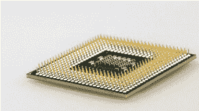
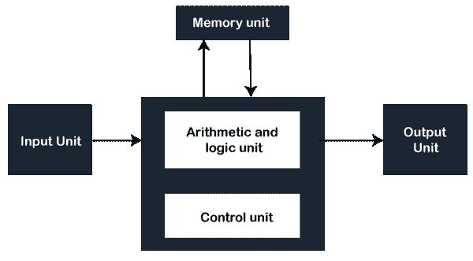

# 第四代计算机

> 原文：<https://www.javatpoint.com/fourth-generation-of-computer>

第四代制造的计算机是以微处理器为基础的，微处理器是第三代计算机的扩展版本。这些计算机使用了超大规模集成电路，这一代的时间是 1971 年到 1980 年。在单个芯片上，微处理器包含了超大规模集成电路和大规模集成电路技术，可以封装数百万个晶体管。超大规模集成电路是超大规模集成的简称，大规模集成电路代表大规模集成。在现代，计算机的速度和内存大幅提高，而成本和体积却大幅下降。

第四代计算机的特点是，由于这些计算机使用超大规模集成电路技术，借助于将许多晶体管结合到单个芯片中来创建集成电路的过程。例如，由于用于构建第四代计算机的技术，它们具有多种功能，例如更通用、大的主存储容量、出色的速度和可靠性、便携式、非常紧凑和小巧等。

在这一代，电脑变得更受欢迎，因为它们以最低的价格出售。此外，[个人电脑(PC)](https://www.javatpoint.com/pc) 革命也是因为第四代电脑的特性而发展起来的。下图是微处理器的一个实例。

第一个处理器是英特尔 4004，它建立在单个硅芯片上，建于 1971 年，包括 2300 个晶体管。它带来了新一代计算机，这一代计算机的血统将延续到现在。1981 年，IBM 选择英特尔公司作为 IBM 新机 IBM-PC 的微处理器(英特尔 8086)的制造商。新的 IBM 机器，IBM-PC，每秒可以执行大约 240，000 次添加。然而，就速度而言，与 IBM 360 系列的计算机相比，这台计算机要慢得多。但它成为了个人电脑市场增长的原因，以今天的美元计算，它的成本只有 4000 美元。

后来在 1996 年，个人电脑方面，英特尔公司的奔腾 Pro 速度非常快；它具有每秒执行 400，000，000 次加法的能力，与第二次世界大战的主力发动机 ENIAC 相比，这大约快了 210，000 倍。这台机器的价格只有 4400 美元。

在现代，所有的计算机都依赖于微处理器技术。芯片的制造并不昂贵。内存芯片和处理器芯片都不一样；内存芯片用于动态 [RAM](https://www.javatpoint.com/ram-full-form) (随机存取存储器)，处理器芯片作为中央处理器。这两种芯片(存储器和处理器芯片)都使用了数百万个晶体管。这些芯片将来可以通过将存储器和处理器芯片结合在单个硅芯片上来实现。

由于许多晶体管可以集中在一个非常小的地方，超标量、缓存和流水线微处理器变得流行起来，这使得科学家能够在指令流水线和设计的帮助下利用指令级并行性，这使得它能够一次执行多个指令(称为超标量)。此外，科学家们有能力设计这些带有板载存储器的单芯片处理器，这就是所谓的高速缓存。英特尔奔腾专业电脑以流水线、高速缓存、超标量微处理器而闻名。

此外，在此期间，并行处理器的使用有所增加。为了并行处理结果，这些机器以不同的方式集成了多个处理器。现在，它们被用于文件服务器和数据库；然而，它们也被用于科学计算。它们仍然可能无法为自己提供并行解决方案的各种问题，并且很难编程，因为它们不像单处理器那样通用。

有人说，如果航空业有像计算机业一样的进步，人们可以花 50 美分在 5 秒钟内从纽约到旧金山。在 20 世纪 90 年代末，微处理器的性能以每年 55%的速度提高。如果这种改进没有停止并且继续下去，那么在 21 世纪初，在硅谷，所有计算机的所有计算能力都可以在单个微处理器的帮助下拥有，这是正确的。第四代计算机的其他一些例子包括:IBM 4341、DEC 10、STAR 1000 和 PUP 11。

## 第四代计算机的体系结构

第四代制造的计算机包括五个独立的单元输入、算术和逻辑、存储器、输出和控制单元。下图表示计算机功能单元在计算机中的物理位置。该装置在鼠标、键盘、麦克风等输入设备的帮助下接受用户的输入(数字信息)。根据指令的种类处理或保持输入。

## 第四代计算机的特点

第四代制造的计算机有许多特点，如下所示:

*   这些计算机使用集成了数百万个晶体管的超大规模集成电路。
*   与前三代电脑相比，第四代电脑价格更便宜。
*   他们出现了单板计算机和单芯片处理器。
*   这一代计算机在速度、准确性和可靠性方面都有所提高。
*   由于组件密度高，与上一代计算机相比，它们的尺寸很小。
*   在第四代中，开发了多种高级语言，如 BASIC、PASCAL、COBOL、FORTRAN 和 C 语言。
*   此外，由于第四代计算机的特点，个人计算机革命也在发展。
*   因为有了这些计算机，数据通信的使用变得很普遍。
*   系统间联网的发展始于第四代计算机。

## 第四代计算机的优缺点

起初，集成电路技术只包含大约十到二十个组件，这就是所谓的小规模集成。后来，随着集成电路领域先进技术的发展，将数百个组件结合在一个芯片上成为可能，这被称为中等规模集成(MSI)。随着时间的推移，将 30，000 多个组件集成到一个芯片上成为可能。这项工作仍在继续，以获得更先进的技术，并有望开发出将数百万个组件集成在单个芯片上的技术，这种技术被称为超大规模集成电路(VLSI)。

第四代计算机包含大规模集成电路芯片技术作为他们的大脑。这项技术的帮助使得制造功能极其强大的计算机和非常小的尺寸成为可能。这导致了计算机领域的一场社会革命。有了邮票那么大，在一艘船上，整个计算机电路很快就可以使用了。后来，随着制造电脑的成本变得便宜，为每个人制造一台电脑成为可能。

| 优势 | 不足之处 |
| 

*   The volume of the fourth-generation computer is reduced because of the high density of components.
*   These computers are developed for general purpose.
*   They are more reliable, and the heat of these computers is negligible.
*   Computers made in the fourth generation do not need air conditioning in many cases.
*   These computers need minimal maintenance.
*   Compared with the previous version, the fourth generation computer is cheap and easy to carry.
*   In terms of speed, the fourth-generation computers are much faster than other generations.
*   During this period, personal computers became more and more popular and affordable.
*   The development goal of these computers is for commercial production.
*   In this generation of computers, various high-level languages can be used.

 | 

*   The manufacturing of VLSI chips requires very advanced technology.
*   One of the other limitations of these computers; They are very sophisticated.
*   They need a fan to cool the system.
*   In addition, the manufacture of microprocessor requires high-tech knowledge.
*   The manufacture of integrated circuits can be accomplished by high-quality and reliable systems or technologies.

 |

* * *