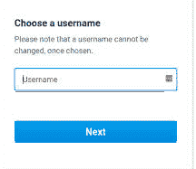

# 什么是用户名？

> 原文：<https://www.javatpoint.com/what-is-a-username>

用户名是在计算机或计算机网络上给予用户的名称。它可以是短语、单词、多个字符的组合，也称为登录标识、帐户名、用户名、用户标识。它唯一地识别并获得对计算系统、软件、需要用户认证的网站的访问。例如，一个计算机系统可能有许多帐户；每个帐户都有不同的用户名。

用户名通常由用户的全名和别名组合而成。通常，它意味着用户名是用户全名和姓氏的缩写。例如，用户名的名称是约翰·史密斯；他可能拥有用户名站点，该站点可以由别名或姓氏的前四个字母与名字的第一个字母组合而成。为了自定义设置或设置在线帐户，许多网站允许用户选择用户名。例如，银行可能会提供用户名来访问您的银行信息。

此外，在网络上，就发送给特定留言板的消息而言，您可能需要选择用户名。此外，为了使用该服务，像 Hotmail 这样的电子邮件服务需要用户选择用户名或登录标识。用户名在使用在线服务和同一台计算机的个人文件和设置中起着重要的作用。例如，用户名允许用户在使用任何网站时保持他们的个人身份。

几乎一个用户名总有一个密码，这是用户登录网站或其他相关服务经常需要的。用户名/密码的组合称为登录。如果您需要输入正确的用户名和密码来访问您的电子邮件帐户，以便您可以访问您的邮件。

一旦您登录了您的电子邮件帐户，您可能会在显示屏上看到您的用户名；但是，您的密码将是保密的。对于多个网站，用户可以在保持密码私密的帮助下创建安全帐户。大多数用户名不允许有空格，只能有字母和数字。当您创建一个电子邮件帐户时，它需要一个用户名和密码，其中您的用户名将是“@”之前的部分。

用户名通常用于具有多用户访问机制的信息技术和支持信息技术的系统，这就是为什么它被广泛采用的身份验证和授权技术以及更好的安全功能来保护您的信息安全。用户名用作身份验证，因为它标识用户和密码。在大多数情况下，用户创建用户名并相应地设置密码，用户名的长度在 6 到 14 个字符之间。

此外，授权完全取决于用户名和密码的正确输入；因此，如果用户名被黑客发现，它不能单独构成严重威胁，且可能被黑客或有恶意的人用于未经授权的目的。

## 我的用户名是什么？

对于大多数服务，您主要创建一个用户名，或者它被分配给您。如果您已经创建了您的用户名，但忘记了您选择的名称，您可以尝试使用您的电子邮件地址而不是用户名来访问您的帐户。如果您试图使用电子邮件地址登录服务，您可以尝试创建帐户时输入的号码。

如果上述建议不起作用，大多数服务都有一个忘记密码的功能和一个可以通过电子邮件发送用户名的用户名。大多数情况下，用户名和密码字段的周围或下方会有一个忘记用户名或密码的链接。它需要记住，当您创建用户名时，输入时可能区分大小写。因此，您可以在关闭大写锁定键(如果已启用)后尝试输入您的用户名。

## 用户名和电子邮件地址一样吗？

用户名是在网站或服务器上标识您的名称；一般来说，它是给计算机网络或管理安全用户帐户的计算机系统上的用户的。但是，这是您的帐户所在系统的限制，这取决于您的判断力。最重要的是了解什么是实际的用户名以及它们是如何存储的，这可能更有利于了解为什么保持高安全的用户名更重要。通常，用户会考虑保留高安全性的密码，但选择更好的用户名也很重要。

### 用户名和电子邮件地址

用户名只是一个短语、单词、数字组合或字符，网络服务器使用它们来识别用户在服务器或网络上的帐户。一般来说，用户名包括代表符号、标点、罗马字母、数字的 ASCII 码；在某些情况下，它还表示空格字符，可能是空白或制表符。但是，用户名的工作过程取决于服务器上使用的应用程序类型。在这种情况下，虽然电子邮件地址不是用来充当用户名的，但它可以充当用户名。

### 用户名存储

当服务器启用用户帐户时，通常它们存储在服务器的数据库中。在数据库中，用户名将与您创建的密码一起存储，该密码具有安全性，因为没有正确的密码，任何人都无法访问该帐户。例如，数据库可能在服务器中有一个包含用户名和密码的表。当您尝试使用您的电子邮件地址作为用户名登录时，服务器会在数据库中找到您的电子邮件地址和相应的密码。然后，你输入密码；服务器将匹配您输入的密码，如果密码匹配，则允许访问。否则，将无法访问该帐户。

### 安全用户名实践

虽然您不会像设置用户名一样设置密码，但可以。在某些服务中，例如您的电子邮件，您的电子邮件地址更有可能成为您的用户名。但是，将您的电子邮件地址用作所有帐户的用户名并不被认为是最佳做法。如果黑客或未经授权的人侵入您的一个帐户并识别您的密码，他可以访问您将电子邮件地址设置为用户名的所有帐户，这在安全性方面可能更有害。您可以通过在不同的服务中使用不同的用户名来避免这个问题；此外，您应该使用可以加密或散列密码信息服务。

## 我们可以使用什么用户名、用户名或用户名？

当提到真实姓名或全名时，可以使用“用户名”。如果您指的是与密码一起使用的身份，则不应使用用户名和名称之间的空格，而应使用“用户名”就“用户名”而言，它很少被使用。

## 为什么“一切”不能使用一个用户名？

有些在线服务和网站使用您的电子邮件地址作为您的用户名；有些服务不是这样的。这种方法要么有效，但有各种服务不使用电子邮件地址作为用户名，需要用户创建一个由字母和数字组合而成的新用户名。下一个文本将是您的用户名，当您使用该服务时，将使用该用户名登录该服务。有时，服务可能会对最少字符数施加条件，有时会限制用户名的字符数。有些服务不允许您使用您的电子邮件作为用户名，而有些服务允许您使用您的电子邮件地址和密码登录。为什么会这样？原因在下面讨论？

一个原因是，一些服务使用现有的号码或成员标识在网络上识别您。信用卡号、学生证、社会保险号、汽车俱乐部会员、银行账号和医疗保健会员身份等身份或号码已经被用来识别某人的账户信息。因此，在线服务有时可能会要求您使用该身份证或号码作为您的用户名。虽然大多数情况下，服务需要您创建一个由字符或数字组合而成的新用户名，这与您的学生证、社会保险号、汽车俱乐部会员资格、银行账号不同，因为他们想让您的用户名更安全。

* * *