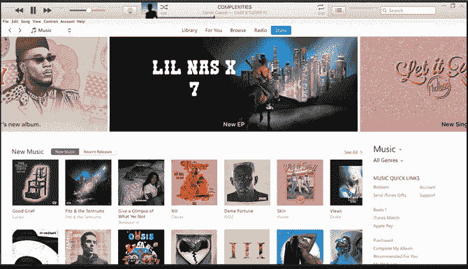
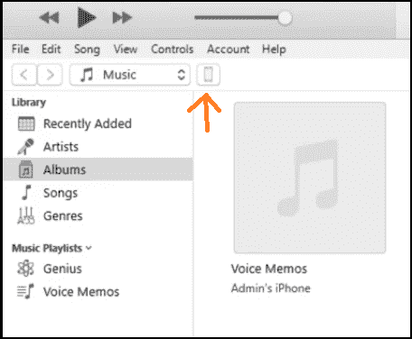
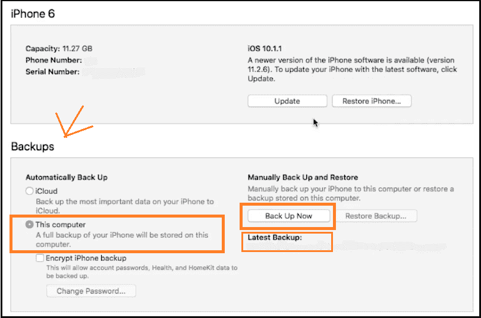
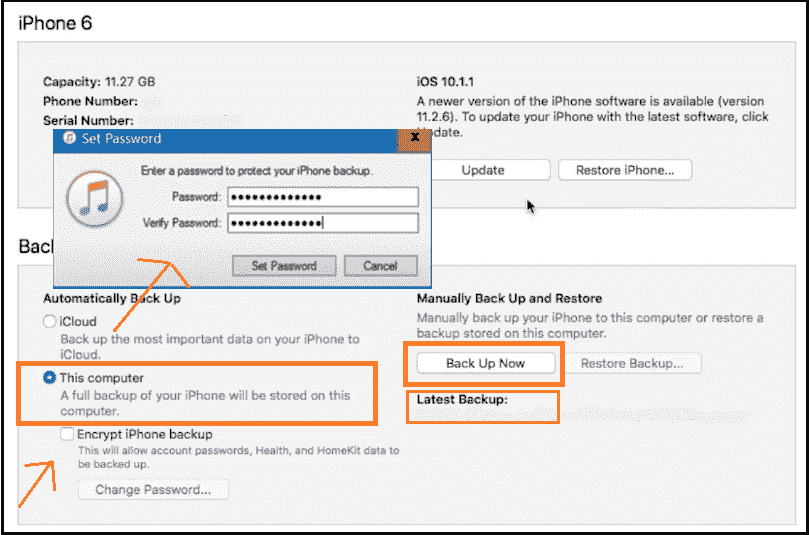
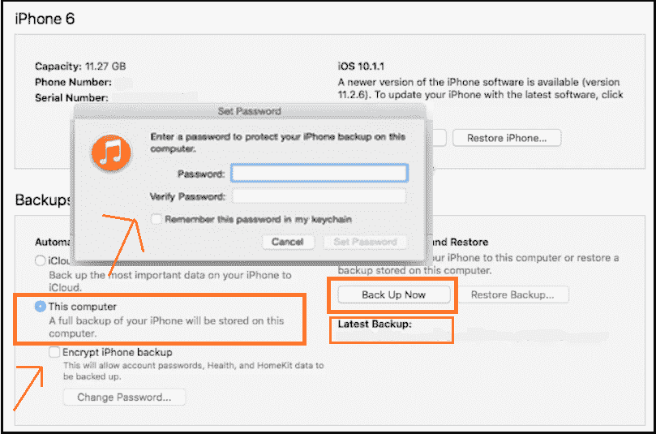

# 如何将 iPhone 备份到电脑

> 原文：<https://www.javatpoint.com/how-to-backup-iphone-to-computer>

备份是指在另一台设备上保留数据副本，以避免在设备崩溃、重置或故障时数据丢失。这是一种备份电脑或手机数据的聪明方法。这类似于我们最终决定为实现目标而冒险时制定的备份计划。此外，如果您想将您的 iPhone 更改或切换到新版本或型号，如果您有数据备份，您可以将数据传输到新手机。

我们可以通过以下几个步骤在电脑上备份 iPhone。事情是在“用户想拿回哪个[操作系统](https://www.javatpoint.com/operating-system)上？”。

在这里，我们将讨论在 [Windows 操作系统](https://www.javatpoint.com/windows)以及 Mac 操作系统上备份 iPhone 的步骤。

让我们开始逐一讨论 Windows 操作系统和 macOS 上的 iPhones 备份。

## 将 iPhone 备份到 Windows 操作系统。

用户可以通过以下步骤在 Windows 系统上备份其 iPhone 数据:

**第一步:**在你的系统上从苹果网站下载并安装**【iTunes】**应用程序。iTunes 应用程序会保留设置、保存的图像/相机胶卷，以及其他基本数据。它用于在 Windows 上备份数据。

**步骤 2:** 通过 [USB](https://www.javatpoint.com/usb-full-form) 电缆(有线连接)或设置无线连接的无线同步，在您的 iPhone 和系统之间建立连接。但是如果您是第一次设置无线同步，则需要使用一次 USB 电缆在 iTunes 应用程序中进行设置，以便为您的 iPhone 启用无线同步。只做一次，然后享受无线连接。

**步骤 3:** 连接后，打开系统上的 iTunes 应用，在 iTunes 窗口左上角附近，会出现一个“**iPhone”**图标或按钮。点击它，如下图所示:

**第 4 步:**之后点击“总结”。然后，单击“备份”下的“这台计算机”，并单击“立即备份”选项，如代码片段所示:

检查“最新备份”并确认您的备份。一般来说，当连接到系统时，iTunes 应用程序会自动备份您的 iPhone 数据。但是，它是在需要时备份数据的手动选项。

**第五步:**如果你的 iOS 版本高于 3.0，你会得到一个选项‘加密本地备份’。这将有助于保护您的备份数据。点击它，它会要求提供密码保护。提供密码并点击设置密码，如下所示:

你的数据将会被备份到你的系统中。

## 将 iPhone 备份到 Mac OS。

要将您的 iPhone 备份到 Mac 操作系统，您需要遵循以下步骤:

**步骤 1:** 通过 USB 电缆(有线连接)或设置 [Wi-Fi](https://www.javatpoint.com/wifi-full-form) 同步进行无线连接，在您的 iPhone 和系统之间建立连接。但是如果您是第一次设置无线同步，则需要使用一次 USB 电缆在 iTunes 应用程序中进行设置，以便为您的 iPhone 启用无线同步。只做一次，然后享受无线连接。

**第二步:**如果你的 macOS 版本比较旧，你需要使用‘iTunes’来备份数据。对于新版本的 macOS，请使用“macOS Catalina”。在这里，我们使用了 iTunes 进行备份。

**第三步:**连接手机后，左上角或右上角会出现一个‘iPhone’设备图标(具体取决于 iTunes 版本)。点击它，如下所示:

**第四步:**点击“总结”。在“备份”下，单击“这台计算机”，最后单击“立即备份”。下面显示了一个片段:

您可以检查“最新备份”并确认您的备份。

**第 5 步:**如果您想要通过加密保护存储的备份数据的选项。选择“加密 iPhone 备份”并用密码保护。

它将保护您的数据免受恶意软件的侵害。

根据您拥有的操作系统阅读并按照步骤操作，只需几个步骤即可备份您的 iPhone 数据。

* * *