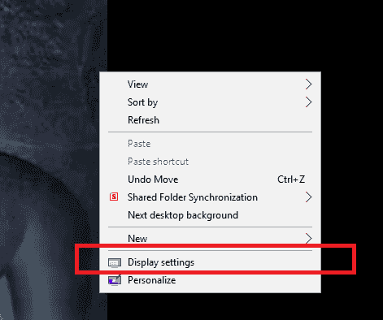
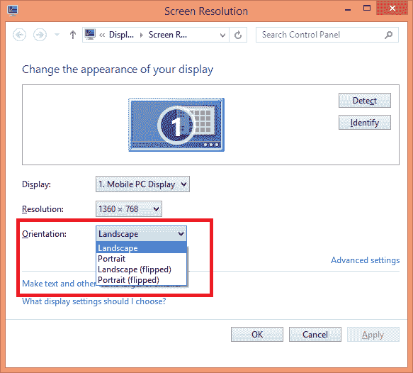
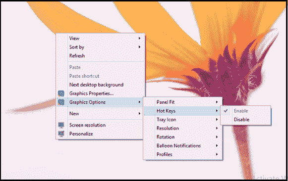
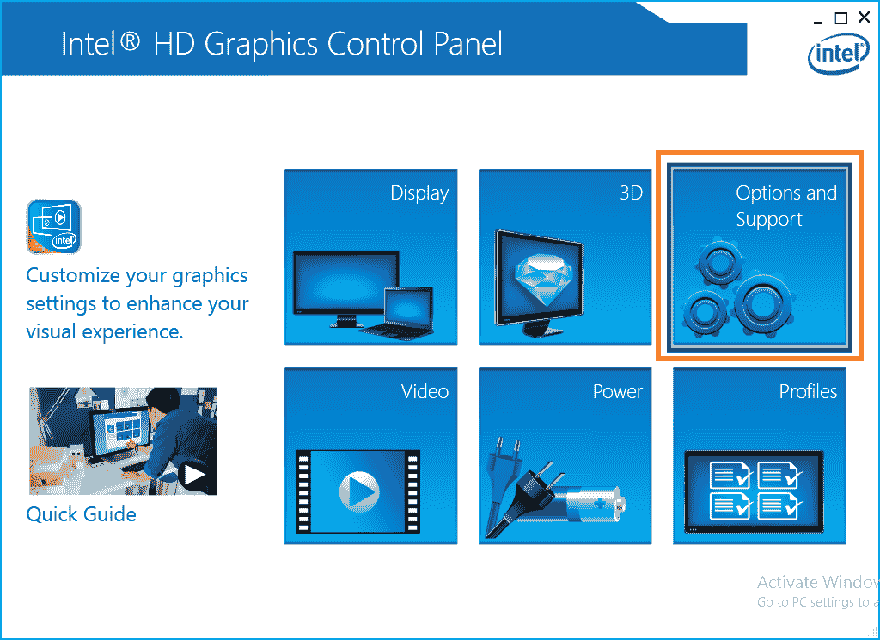
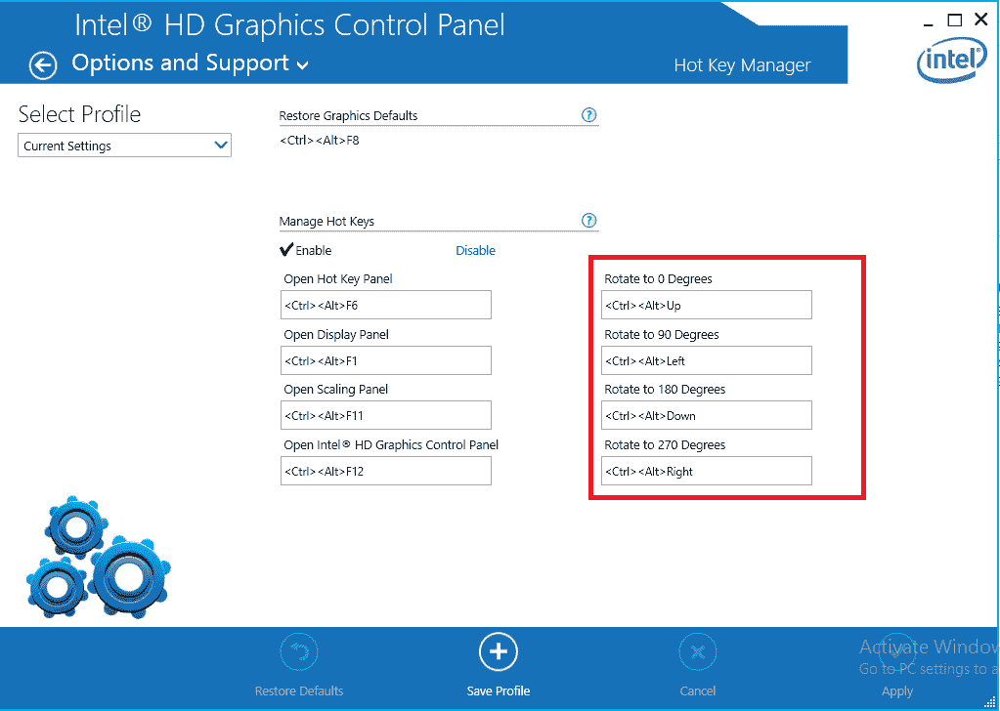
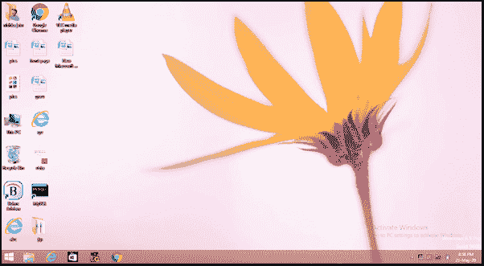
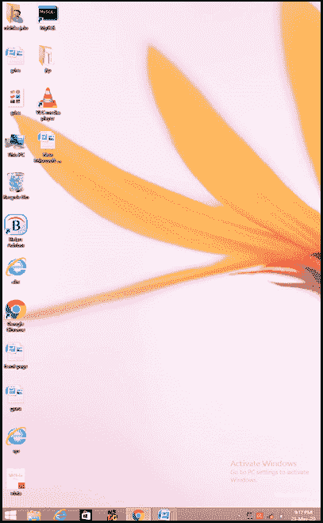
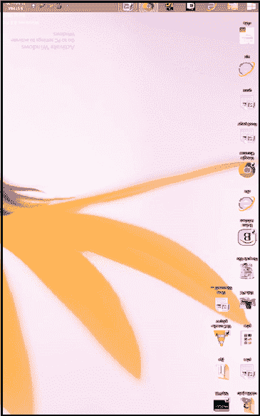

# 如何翻转电脑屏幕

> 原文：<https://www.javatpoint.com/how-to-flip-computer-screen>

翻转计算机屏幕意味着以不同的方向旋转计算机屏幕。通常，我们可以看到水平方向的电脑屏幕。关于它，我们也可以在其他模式下旋转电脑的显示屏。对于总是尝试和学习探索新事物的探险家来说，这是令人兴奋的特征之一。

我们可以通过两种方式翻转或旋转电脑屏幕:

1.  通过显示设置/屏幕分辨率
2.  通过键盘快捷键

在这里，我们将讨论和学习旋转电脑屏幕的两种方法。此外，我们将展示有助于更好地理解的实际实现。

但是在开始之前，让我们讨论一下计算机上可用的方向类型。

## 显示方向的类型

在窗口中，可能有四种不同类型的显示方向:

1.  **横向:**是横向模式下旋转屏幕的方向。这是 Windows 系统的默认定向模式。
2.  **人像:**是在人像模式下旋转屏幕的方向。它将使屏幕旋转 270 度，因此您的屏幕将垂直定向。
3.  **横向(翻转):**方向旋转横向模式对面的屏幕。它将使屏幕旋转 180 度，水平和颠倒，因此您的屏幕将处于水平(横向)方向的翻转模式。
4.  **纵向(翻转):**方向旋转纵向模式对面的屏幕。它会使屏幕旋转 90 度，垂直和颠倒；因此，您的屏幕将处于垂直(纵向)方向的翻转模式。

## 在显示设置中翻转计算机屏幕

要更改或设置系统的方向，请执行以下步骤:

**步骤 1:** 打开系统上的显示设置。为此，您可以直接在[窗口](https://www.javatpoint.com/windows)搜索栏中搜索“更改显示设置”，或者在桌面上的空白处单击鼠标右键。将会打开一个快捷菜单。单击显示设置/屏幕分辨率。在下面的快照中，我们通过快捷菜单选择了显示设置:

**第二步:**显示设置窗口将打开，有各种选项可以在系统显示中进行不同类型的更改。其中一个选择是“定位”。在方向下拉框下，所有四个选项都将对您可见。下面显示了实际实施的快照:

#### 注意:如果您在系统上设置了多个显示器，请确保在“显示”菜单顶部显示正确的显示器。

**第三步:**如果不想保留更改，按 **Esc** 键(左上角键盘第一行第一个键)。屏幕将被设置为默认方向。另一种方法是再次打开显示设置并将更改设置回原位。

通过键盘快捷键翻转计算机屏幕

旋转电脑屏幕的另一种方法是使用键盘快捷键。这是一种直接而快捷的方法。只需键盘上的三个键，即 Ctrl、Alt 和左/右/上/下箭头键，即可快速翻转屏幕。

**第一步:**一起按组合键，你的电脑屏幕会相应地翻转。根据您的需要，执行以下步骤翻转屏幕:

1.  **Ctrl+Alt+Up(↑):** 同时按住 Ctrl+Alt+Up 箭头键。它会将您的屏幕翻转到水平模式，即横向(默认模式)。
2.  **Ctrl+Alt+Down (↓):** 同时按住 Ctrl+Alt+Down 箭头键，会将您的屏幕翻转到默认模式的对面，即作为横向(翻转)方向。
3.  **Ctrl+Alt+Left(←):** 同时按住 Ctrl+Alt+Left 箭头键，会将您的屏幕翻转到垂直模式，即纵向方向。
4.  **Ctrl+Alt+Right(→):** 同时按住 Ctrl+Alt+Right 箭头键，会将您的屏幕翻转到垂直模式的对面，即作为纵向(翻转)方向。

**步骤 2:** 但是，如果[键盘快捷键](https://www.javatpoint.com/computer-shortcut-keys)在您的系统上不起作用，请在桌面上右键单击打开英特尔图形设置。从快捷菜单中点击**图形选项>热键**。快照如下所示:

让我们看看下面截图中每种定向类型的实际实现:

**步骤 3:****英特尔高清图形控制面板**将打开。点击“**选项和支持”**图标，如下图所示:

**第 4 步:**将打开一个**热键管理器**窗口。因此，如果屏幕旋转键盘快捷键是可见的，这意味着它们是存在的。否则，快捷方式功能在您的 Windows 系统上不可用。如下图所示，键盘快捷键功能是可用的，因此，不同方向的所有快捷键都是可见的:

### 方向快照的类型

*   **在横向模式下设置方向。**

*   **在纵向模式下设置方向。**

*   **在横向(翻转)模式下设置方向。**

*   **在纵向(翻转)模式下设置方向。**

这是一项令人兴奋的活动，您可以通过仔细遵循上述步骤轻松进行。

* * *