# 如何加速计算机

> 原文：<https://www.javatpoint.com/how-to-speed-up-computer>

想象一下，新年只剩下十秒钟了，你们都准备好“新年愿望”帖子了。倒计时开始了，哎呀！发生了什么事？。你的系统突然掉出速度，你的帖子错过了倒计时。新年伊始是如此令人沮丧的时刻。这样的慢速系统深深地挫败了大脑，并激怒了它。但是，我们可以采取一些预防措施来保护我们的系统免受此类易受攻击的事件的影响。

在这里，我们将讨论你可以加速你的慢性能系统或防止你的系统速度和性能不佳的要点和方法。

## 提高计算机速度的方法

我们可以按照以下步骤来提高系统的速度和性能:

**1。重启你的系统:**当你发现你的系统运行缓慢时，这是你能采取的最重要的步骤。重启电脑有助于提高速度。电源选项中的重启选项与其他选项一起提供。此外，您可以使用 Alt+F4 键从下拉列表中直接选择重启选项，然后单击确定。下面，代码片段显示了重启 Windows 10 系统的示例:

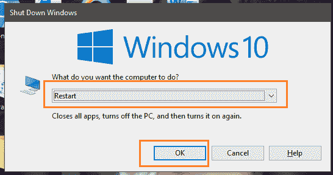

**2。重置或恢复系统:**重置或恢复是将事物设置回其原始外观的过程。重置计算机系统意味着消除导致系统缓慢和不良的问题。虽然重置方法会抹掉我们到目前为止对系统所做的所有更改，但它会升级系统及其性能。

**如何复位:**

要重置系统，在 Windows 10 中打开**窗口设置>更新&安全>恢复**，如下图:

当我们重置系统时，我们得到两个选项，即恢复并保存所有文件或文件夹，或者恢复而不保存文件和文件夹。选择适当的选项并继续系统还原。

**3。将窗口和驱动程序更新到最新版本:**始终将窗口更新到其最新版本，因为它会带来性能更好的系统。检查 Windows 更新，系统将自动找到最新的驱动程序。,

**如何检查更新**

*   **窗口 10**

在[窗口](https://www.javatpoint.com/windows) 10 中，自动更新完成。您可以通过**开始>设置>更新&安全>窗口更新>检查更新来检查更新。**

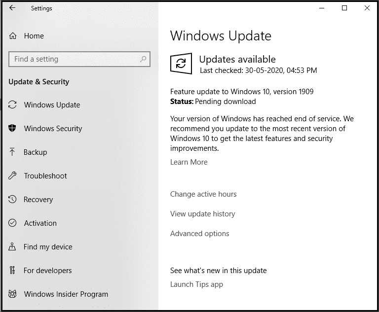

检查可用的更新(如果有)，并安装它们。重新启动计算机以获得更好的性能

*   **其他 Windows 版本**

转到系统的控制面板。单击系统和安全选项，然后单击窗口更新选项。系统将显示所需的更新(如果有)并安装它们。

**4。只打开需要的程序或应用**因为如果系统上打开了这么多应用或程序，会降低系统的速度。打开的程序数量越多，意味着更多的[内存](https://www.javatpoint.com/ram-full-form)将被占用。因此，关闭那些不需要的程序或应用程序将有助于提高系统速度。

**5。从系统中删除临时文件:**这些文件是不需要的，所以从系统中删除它们，因为它们不必要地占用了硬盘空间。

**如何删除:**

要从系统中删除临时文件，有以下几种方法:

*   使用窗口**磁盘清理**从系统中删除临时文件和其他不需要的文件。选择要清洗的驱动器，点击【确定】，如下图:

    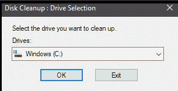
*   在搜索栏(接近开始菜单)或在**运行字段**中键入 **%temp%** (通过同时按下窗口按钮+R)。按确定。

    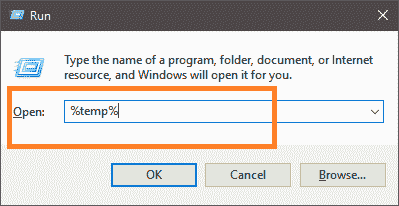
    一个 temp 文件夹会打开，删除所有文件如下所示:

    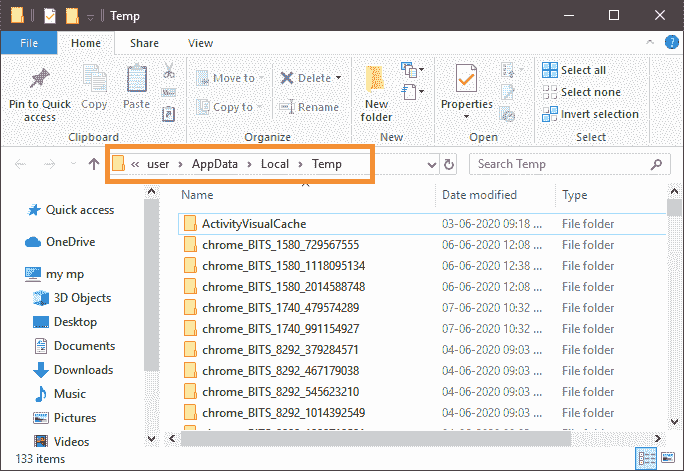
    如果有任何文件正在使用，跳过此类文件。 *%temp%* 命令删除*本地临时文件。*
*   在搜索栏或运行字段中输入**温度**。将打开一个临时文件夹，如下所示:

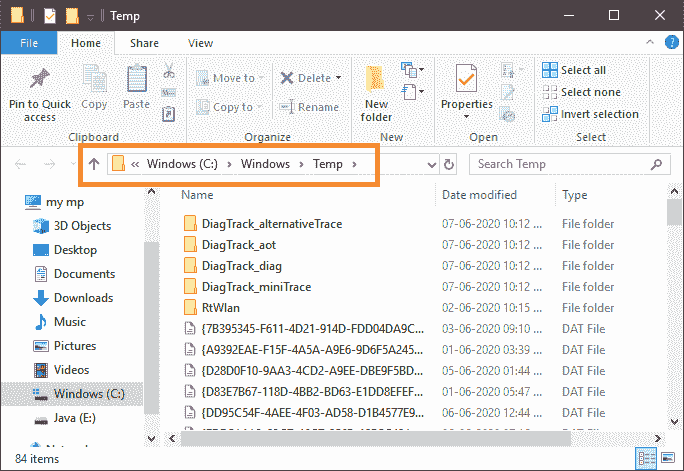

选择所有文件并删除它们。如果某些文件正在使用，请跳过这些文件。 *TEMP* 命令删除*窗口临时文件*。

从系统中删除临时文件可以节省大量硬盘内存，并提高系统的速度和性能。

**6。禁用不需要的启动程序:**每当我们启动计算机系统时，启动程序都会在后台自动启动。我们需要禁用此类程序。然而，我们从不确定某些程序在后台执行是不必要的。我们需要找出这些程序，如果不需要，就禁用它们。

**如何查找和禁用:**

我们可以使用下面描述的任何方法来查找整个正在运行的启动程序，并禁用不需要的启动程序:

*   **Windows 10:** 点击**启动按钮>设置>应用程序>启动**。右键单击应用程序的相应状态，选择不需要的程序并设置为禁用，如下所示:

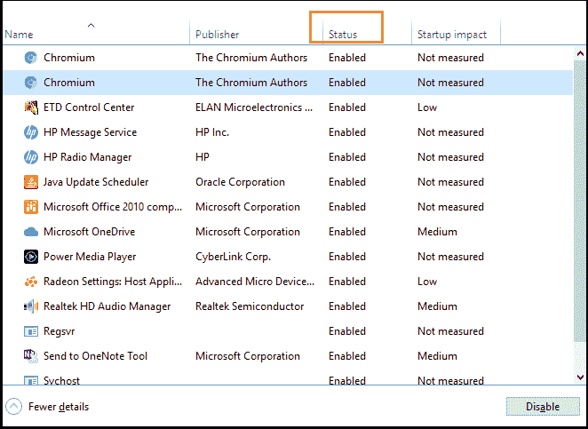

*   对于其他版本的 Windows，包括 Windows 10，禁用启动程序的最好方法是使用**任务管理器**。一起使用**Ctrl+Alt+删除**键打开任务管理器。选择启动，选择要禁用的程序并设置为禁用。

**7。硬盘碎片整理:**碎片整理是将数据的无组织位排列成硬盘上顺序的、可访问的块，以优化它们的过程。这样做可以过滤掉硬盘中未使用的可用空间，加快系统速度。硬盘碎片的主要原因是大文件，如视频、重型软件或游戏。因此，碎片整理有助于提升计算机系统的性能。在 Windows 10、8 或 7 中，碎片整理选项是自动计划的，即每周一次。但是，也有手动碎片整理选项可用。

**如何整理碎片:**

要对文件进行碎片整理，请在搜索栏上键入“碎片整理”，下面显示的窗口将会打开:

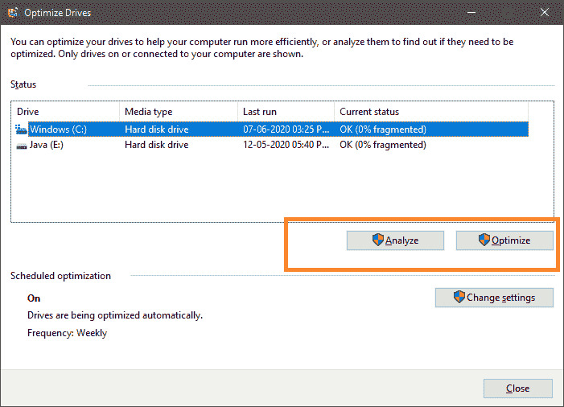

通过分割驱动器来优化驱动器。

**8。扫描病毒和恶意软件:**病毒和恶意软件是从内部吞噬计算机并使其中空的恶意程序。您应该始终努力防止您的系统遭受此类灾难。每月对系统进行一次检查，并扫描此类恶意程序。您可以使用反恶意软件或防病毒软件作为预防措施。这些防病毒和反病毒软件用于预防和扫描病毒(如果有)。每个视窗版本都包含视窗安全，被称为**视窗卫士安全中心。**可用于病毒或恶意软件扫描。

打开 **Windows Defender 安全中心>病毒&威胁**，如下图:

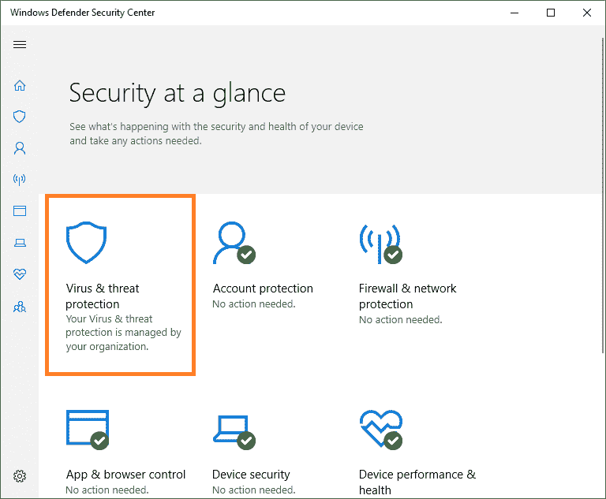

检查并扫描威胁。

**9。停止或暂停 OneDrive 同步:** OneDrive 允许存储文件和文件夹，以远离攻击或系统故障。为了存储文件，您需要在系统和 OneDrive 之间同步文件，同步会降低速度。因此，我们需要暂停或停止 OneDrive 的同步，以提高速度和性能。

**如何停止或暂停一个驱动器同步:**

要停止同步，需要遵循以下步骤:

**步骤 1:** 打开系统上的 OneDrive。

**步骤 2:** 选择更多>暂停同步。

**步骤 3:** 选择想要暂停同步的时间。

**第四步:**最后，重启系统，感受系统速度和性能的提升，如下图所示，我们已经从“显示隐藏图标”直接打开了 OneDrive:

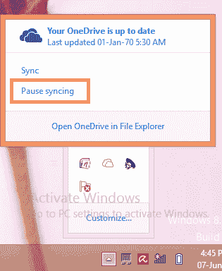

如果感觉不到速度和性能的任何变化或改善，再次打开 **OneDrive > More >恢复同步，恢复同步。**

**10。禁用网页浏览器扩展:**在一些系统中，可以看到当它没有连接到互联网时，它可以流畅高效地工作。但是，当它连接到互联网时，速度会变慢，性能也会下降。背后的原因是插件、附加组件、通知或扩展。如果不需要，禁用此类插件。

**11 时。管理动画和视觉效果:**动画和其他视觉效果也会影响速度，如果系统内存太有限，管理就变得至关重要。调整性能和视觉效果以获得最佳性能选项。

**如何调整:**

*   要调整图形和动画，打开**控制面板>系统>高级系统设置**，然后在**性能**部分，点击**设置**，如下图:

    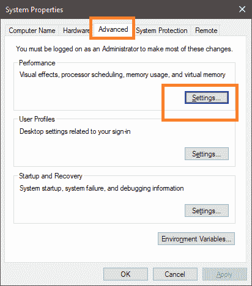
*   将打开一个**性能选项**窗口，如下图:

    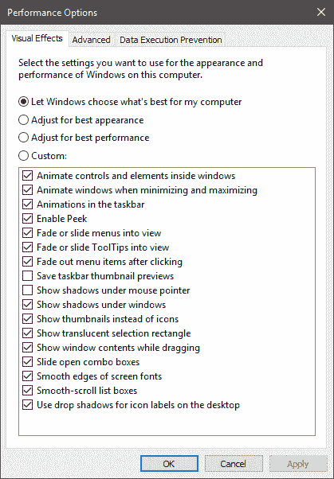

进行适当的设置，然后点击**确定**。

**12 时。清理硬盘:**当硬盘内存满时，由于内存不足，它开始缓慢工作。要执行一个程序，操作系统需要足够的空间。确保每个驱动器中至少有 **500MB** 的可用空间。

**如何检查:**

要检查可用的内存空间，请打开文件资源管理器，然后单击窗口左侧的这台电脑(或我的电脑)。包括本地驱动器(即 c 盘)在内的所有驱动器都会出现，在每个驱动器名称下方，您可以看到驱动器中的可用空间，如下所示:

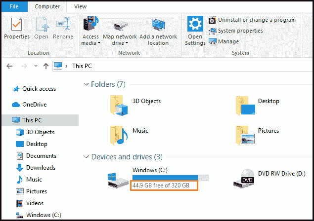

尝试在每个驱动器中保持足够的空间，以获得良好的性能和快速的系统。

**13。清理浏览器 cookie 和缓存:**每天搜索东西和访问众多网站会将 cookie 存储到系统中，浏览器也会使用缓存内存来加快浏览速度。但是，cookie 和缓存都利用内存空间，因此，在一两个月内清除缓存和 cookie。这将有助于提高系统的性能。

**14。重装 Windows:** 当以上所有选项都无法达到加速系统的目的时，是一个选项。Windows 的重新安装意味着将所有驱动程序和设置重置为新版本。重新安装不会存储和保护您的文件，因此在重新安装之前，请通过互联网备份您的重要文件。

**15。硬件相关问题:**执行上述方法后，您仍然发现系统中存在速度问题，正在检查硬件问题(如果有)。任何硬件组件都有可能出现故障，例如硬盘故障、[中央处理器](https://www.javatpoint.com/cpu-full-form)、[主板](https://www.javatpoint.com/motherboard)、[不间断电源](https://www.javatpoint.com/ups-full-form)或任何其他故障。最好去商店诊断和解决这样的硬件问题。

**16。太旧的电脑:**如果用同一台电脑工作多年时间太长。很明显，它需要退役，因为它的硬件部分可能已经严重削弱，花钱只是浪费金钱和时间。一个运行良好的计算机系统的能力大约是五年。后来，某些问题开始出现。

* * *