# 如何找到电脑的 IP 地址

> 原文：<https://www.javatpoint.com/how-to-find-computer-ip-address>

## 什么是知识产权地址

IP 地址代表**互联网协议**，是**传输控制协议(TCP)** 的一部分。IP 地址是连接到计算机系统的设备的网络地址。是一个从 **0 到 255** 的 **32 位**号。一个 [IP](https://www.javatpoint.com/ip) 地址有两个版本，分别是 [**IPv4(互联网协议版本 4)** 和 **IPv6(互联网协议版本 6)**](https://www.javatpoint.com/ipv4-vs-ipv6) 。IPv4 使用 32 位的 IP 地址，而 IPv6 使用 128 位的 IP 地址。目前，IPv6 已经成为标准化的 IP 版本。 [IP](https://www.javatpoint.com/ip-full-form) 地址的主要工作是识别主机或网络接口，并提供主机在网络中的位置。计算机 IP 地址是系统的本地 IP 地址，很容易找到。

在这里，我们将学习使用 Windows 命令提示符而不使用命令提示符来查找系统的 IP 地址。

## 使用窗口命令提示符查找计算机的 IP 地址

要知道系统的 IP 地址，需要遵循以下步骤:

**步骤 1:** 用互联网连接连接您的系统。因为我们需要搜索系统的互联网协议地址，它需要一个互联网连接。

**第二步:**一起按**窗口+R** ，在“运行”文本框中输入“cmd”命令，点击确定，如下图:

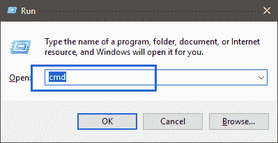

您也可以在搜索栏选项卡上搜索“cmd”或“命令提示符”，如下所示:

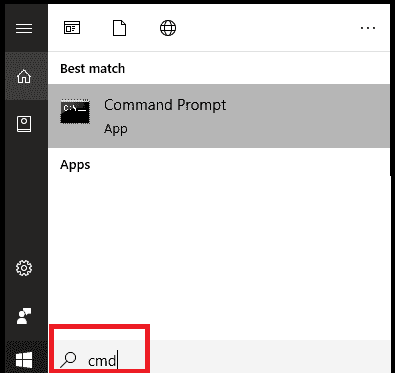

**第三步:**命令提示符打开，如下图:

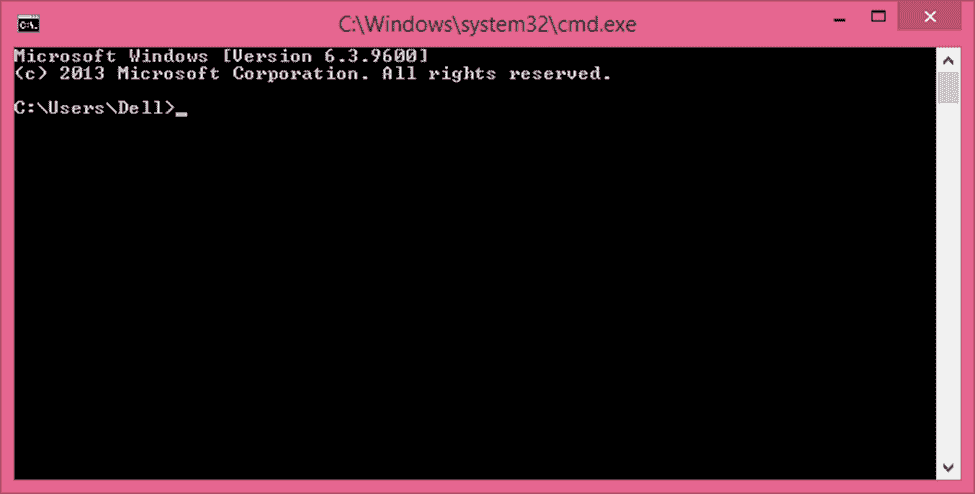

**步骤 4:** 在计算机网络中，命令“ipconfig”用于获取计算机系统上配置的所有网络接口详细信息。在[窗口](https://www.javatpoint.com/windows)命令提示符下键入命令，然后按回车键，如下图所示:

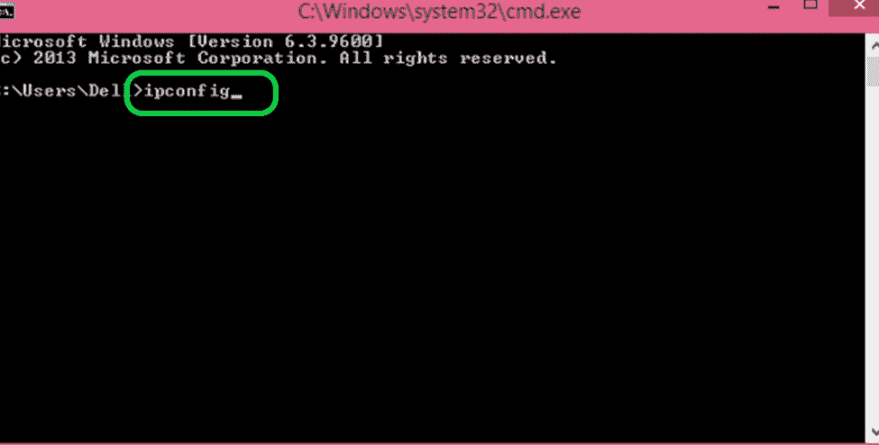

**步骤 5:** 您将能够看到连接到系统的网络接口或适配器的所有信息。下面的快照显示了系统的 IP 地址，并告诉我们 IPv4 和 IPv6 的版本地址:

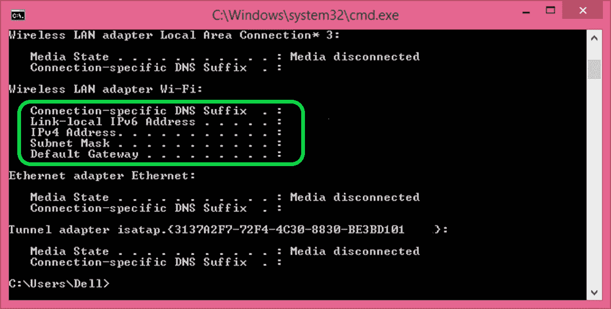

**第六步:**如果想获取更多网络接口的详细信息，在命令提示符下使用‘ipconfig/all’命令，按 enter 键，如下图快照所示:

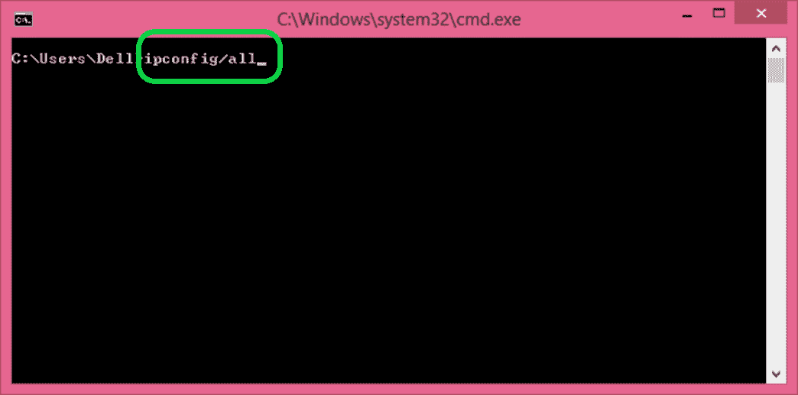

**第 7 步:**该命令将获取 Windows IP 配置的所有详细信息。快照如下所示:

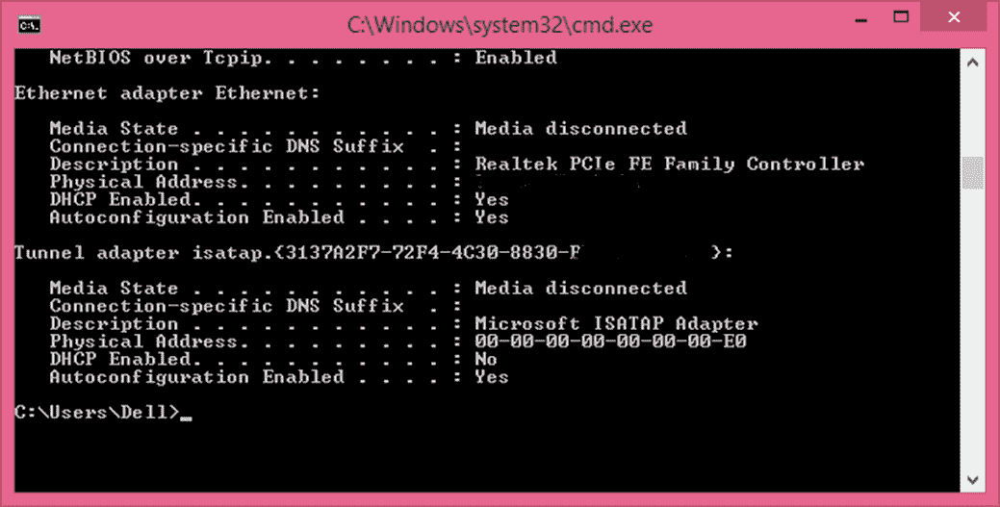

该 IP 地址将显示其版本号。

#### 注意:无论是 Windows XP、Windows 7、Windows 8、8.1 还是 Windows 10，使用 Windows 命令提示符查找计算机系统 IP 地址的方法在每个版本的 Windows 操作系统中都是相似的。

## 不使用窗口命令提示符查找 IP 地址

在不使用[窗口](https://www.javatpoint.com/what-is-windows)命令提示符的情况下查找系统的 IP 地址的步骤很简单，但不同的窗口版本会有所不同。让我们看看找到 IP 地址的步骤:

### Windows 10

**第 1 步:**通过互联网连接或以太网连接连接您的系统。

**第二步:**在搜索栏中输入“设置”或点击开始>设置，打开系统上的“设置”。快照如下所示:

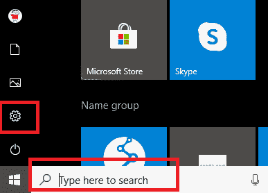

**第二步:**设置窗口将打开。点击“网络&互联网”选项，如下图所示:

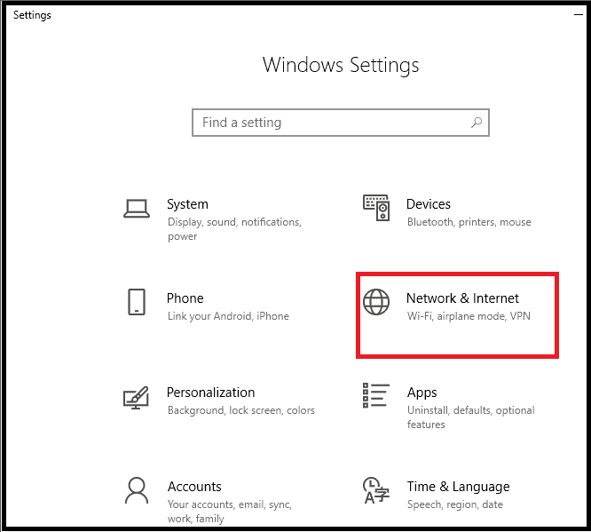

**步骤 4:** 如果您的系统通过无线连接(Wi-Fi)或以太网(有线连接)连接，请从左侧菜单窗格中选择它。这里，系统连接了 [Wi-Fi](https://www.javatpoint.com/wifi-full-form) ，从左侧菜单窗格选择 Wi-Fi，如下图:

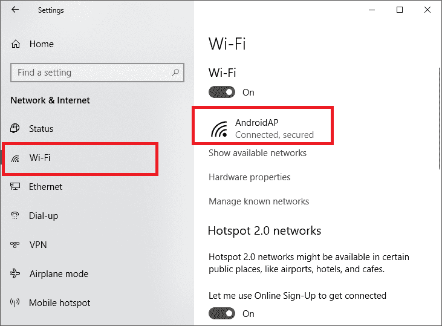

连接的网络设备将如上面的截图所示，它是 AndroidAP。这意味着计算机连接到一个名为“安卓”的设备。单击设备名称。

**步骤 5:** 单击设备名称后，将打开一个窗口页面，显示网络详细信息，包括网络配置文件、计量连接以及包含 IP 地址的已连接设备的属性。您需要向下滚动，IP 地址将显示如下图所示:

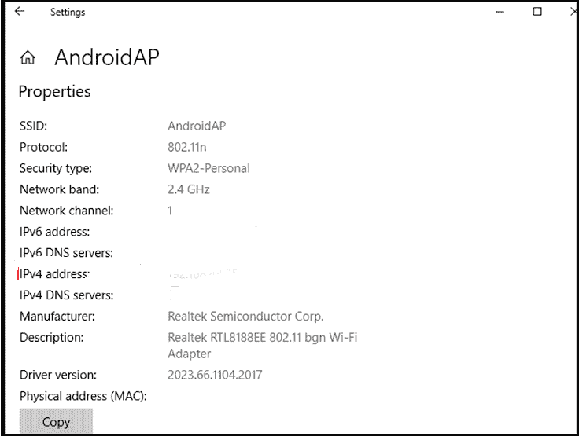

可以看到 IPv4 地址和 IPv6 地址。

### Windows8/8.1 专业版

**步骤 1:** 通过有线或无线连接连接您的系统。

**第二步:**在搜索栏上搜索点击“网络连接”，或者点击右下角的“互联网接入”图标直接打开。

**第三步:**点击后，右侧会打开一个网络面板，如下图:

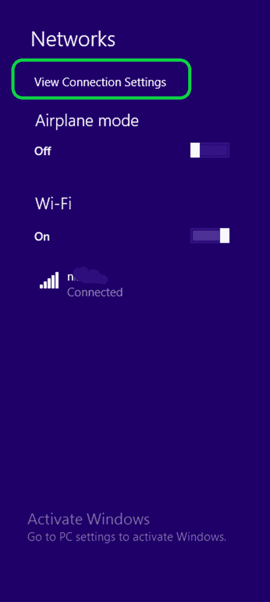

**第 4 步:**点击面板下的“查看连接设置”，这样会打开一个网络窗口，如下图所示:

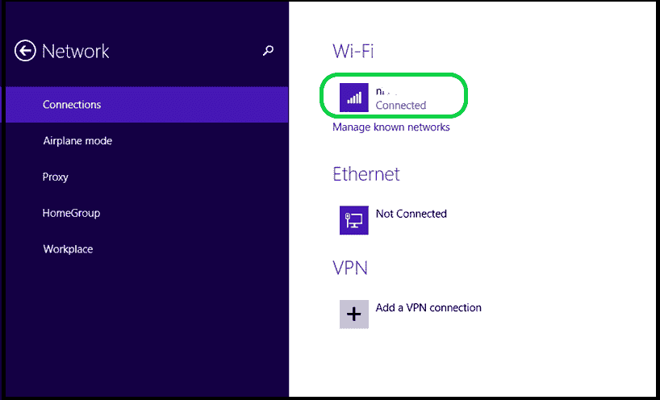

**第五步:**点击连接的设备名称，设备详细信息将打开，如下图所示:

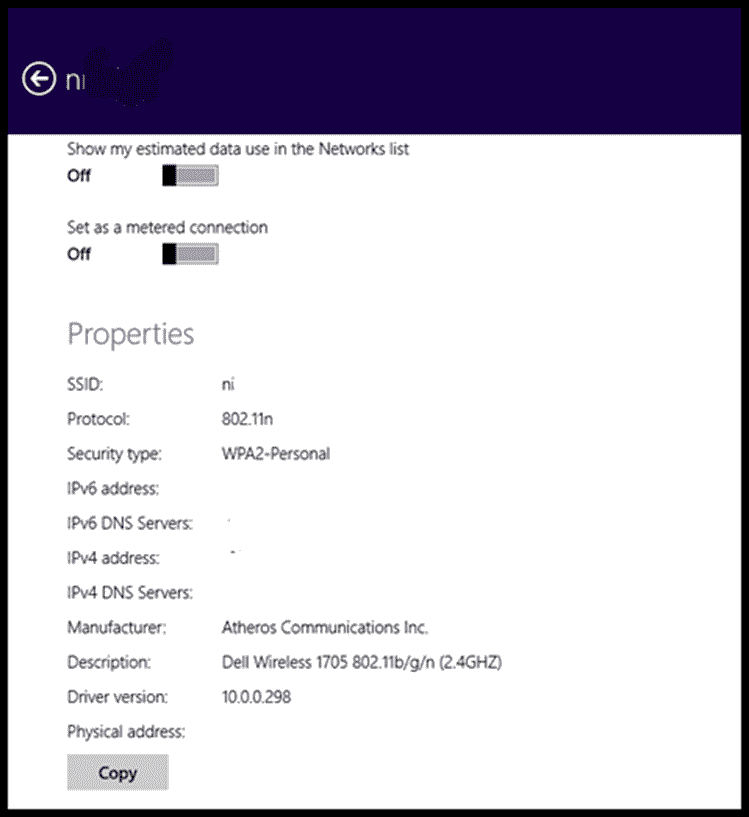

因此，您可以从那里检查并找到连接设备的 IP 地址。

### Windows 7

**步骤 1:** 用无线网络或以太网连接您的系统。

**第二步:**点击任务栏上出现的“网络连接”。它将显示可供连接的网络。

**步骤 3:** 双击以太网的“局域网连接”或无线网络连接的“无线网络连接”。

**第四步:**点击“详细信息”，包括设备 IP 地址在内的所有详细信息都会显示在屏幕上。

因此，这些是用户可以轻松搜索计算机系统的 IP 地址的步骤或几次点击。

* * *