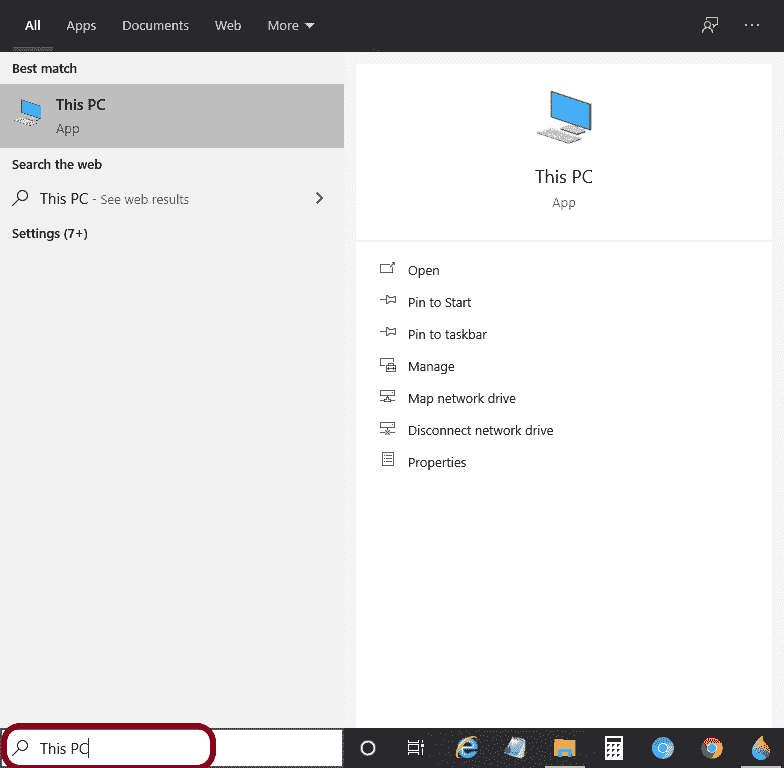
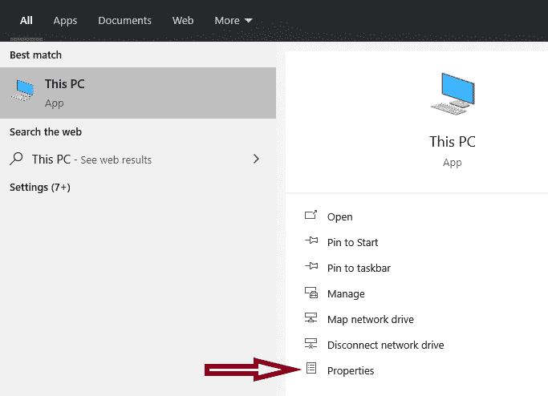
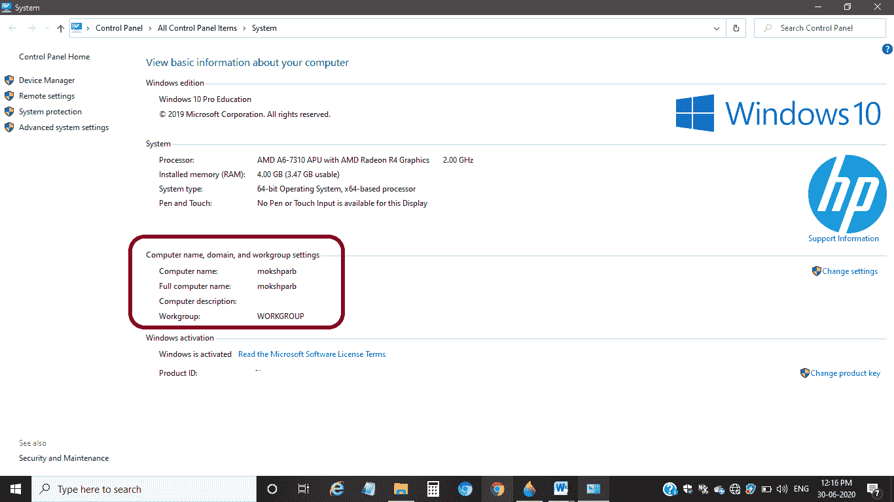
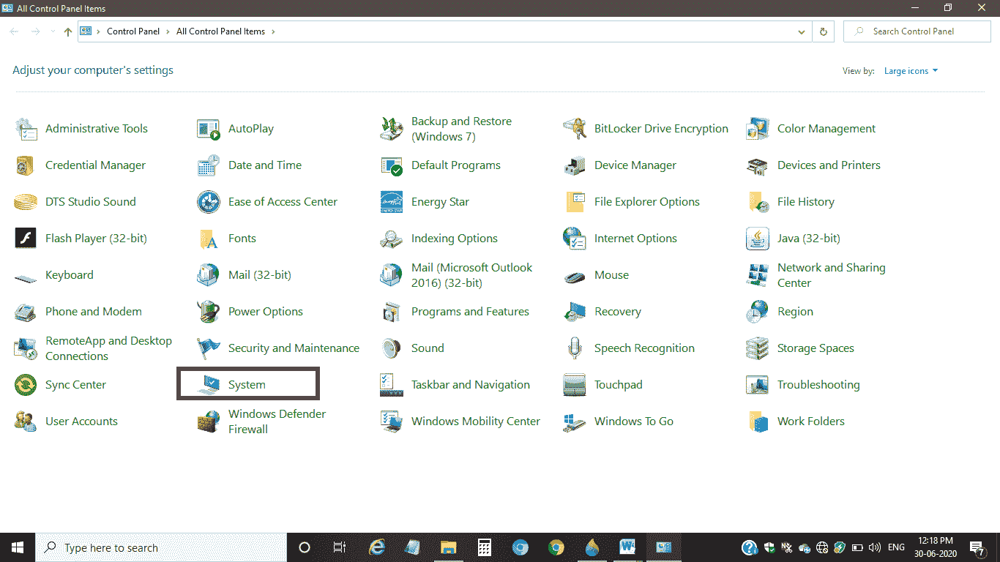
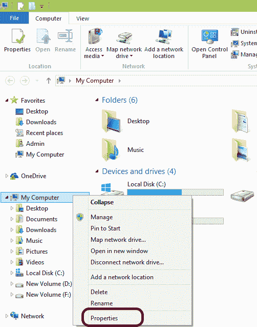
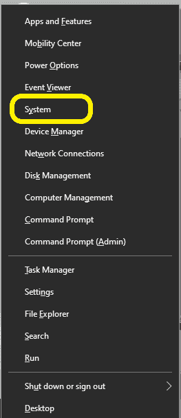
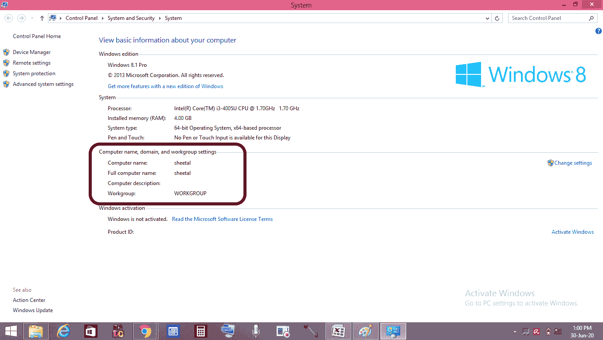

# 如何查找计算机名

> 原文：<https://www.javatpoint.com/how-to-find-computer-name>

有时，当需要解决任何技术问题或将任何软件下载到计算机时，我们需要提供我们的系统名称和其他详细信息。如果一个人懂电脑，就不会有问题。但是，如果某人对计算机不熟悉，并且计算机上出现了一些问题，则很难检测到计算机的名称。同样，对于这样一个微小的任务，这个人可能需要别人的帮助。

在这里，我们将学习在 [Windows OS](https://www.javatpoint.com/windows) 上查找电脑名称的步骤。我们将看快速和详细的步骤，通过这些步骤，人们可以很容易地找到计算机的名称。

## 查找 Windows 10 计算机名

我们可以通过以下步骤找到该名称:

**第一步:**右键点击系统的“这台电脑”。如果您在系统上找不到“这台电脑”，请在搜索栏中进行搜索，如下图所示:

**第二步:**点击“属性”，如下图:

**第三步:**关于你电脑的基本信息会打开，你可以看到‘电脑名称’等关于你系统的信息。快照如下所示:

这是找到计算机系统名称的快速过程。

### 替代方法

这是找出计算机系统名称的另一种方法。这些步骤如下:

**步骤 1:** 在搜索栏上搜索，打开系统上的“控制面板”，然后按“回车”。

**步骤 2:** 从控制面板中选择并点击“系统”，如下图所示:

**第三步:**将打开基本信息页面，如下图快照所示:

你也可以看到电脑名称和其他细节。

## Windows 8/8.1 专业版计算机名

查找系统名称有以下步骤:

**步骤 1:** 右键单击系统上的“我的电脑”。如果没有找到，可以在搜索栏中搜索。在某些系统中，它可能是“这台电脑”。

**步骤 2:** 右键点击后，选择并点击“属性”，如下图所示:

**第三步:**这样做的时候，电脑的基本信息就会打开。快照如下所示:

可以看到“电脑名称”以及其他相关信息，如 [Windows](https://www.javatpoint.com/what-is-windows) 版本、系统信息等。

### 替代方法

找出计算机系统的名称是另一个过程。这些步骤如下:

**第一步:**在键盘上同时按下 **Windows + X** 键。

**第二步:**在按下 Windows + X 键后出现的列表下点击“系统”，如下图快照所示:

**第三步:**系统会打开显示电脑的所有基本细节，包括名称等信息。快照如下所示:

## Windows 7 计算机名

查找计算机名有以下步骤:

**第一步:**点击“开始”按钮。

**步骤 2:** 右键单击“计算机”，然后单击“属性”。

**第三步:**将打开一个窗口，显示计算机系统的基本细节。

* * *