# 如何擦拭电脑

> 原文：<https://www.javatpoint.com/how-to-wipe-a-computer>

擦除系统意味着擦除所做的系统设置并将其重置为默认设置。简而言之，擦拭计算机意味着重置计算机系统。当我们重置系统时，它会删除系统中包含的所有文件和应用程序，并保留系统附带的所有应用程序和文件。这意味着重置选项会将系统移回其新阶段。一年擦一次系统总是好的。或者，擦拭计算机意味着清洁计算机的灰尘。对于它，使用柔软的干布清洁屏幕、[键盘](https://www.javatpoint.com/computer-shortcut-keys)和其他设备上的污垢。

### 需要擦拭计算机系统

擦拭电脑背后有以下原因:

*   它从系统中删除所有不必要和不需要的文件。
*   它释放了内存空间，提高了系统速度，使系统能够平稳快速地工作。
*   它会清除系统中的所有恶意程序或软件。
*   它解决了我们在系统中安装更新时遇到的问题。
*   当我们考虑用新设备更换系统并希望出售时，擦拭也很重要。这是因为，一旦重置，将从系统中删除所有敏感和个人信息。

#### 注意:如果您没有遇到任何问题，请每年至少擦拭一次电脑。它将防止您的系统受到任何伤害或恶意攻击。

## 擦拭 Windows 10 计算机系统

[Windows](https://www.javatpoint.com/windows) 10 是微软提供的 Windows 的当前版本，在全球范围内也广泛使用。擦拭过程只需在系统上点击几下鼠标，如下所述:

#### 注意:建议您将想要保留的文件和文件夹备份到系统中。你可以备份到你的驱动器或收存箱。

**第一步:**通过直接在搜索栏上导航打开系统上的“设置”或者转到开始>设置。

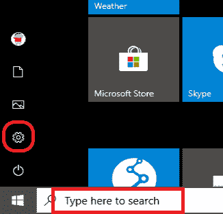

**第二步:**将打开“设置”窗口窗格，各种图标将可见，如下图快照所示:

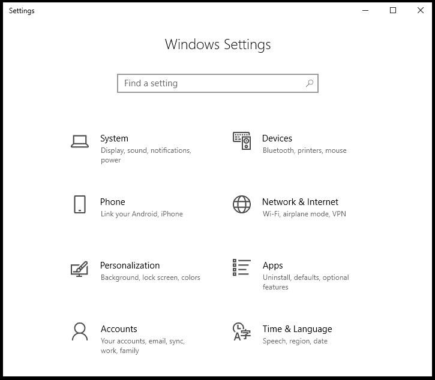

**步骤 3:** 选择并通过向下滚动点击“更新&安全”图标。快照如下所示:

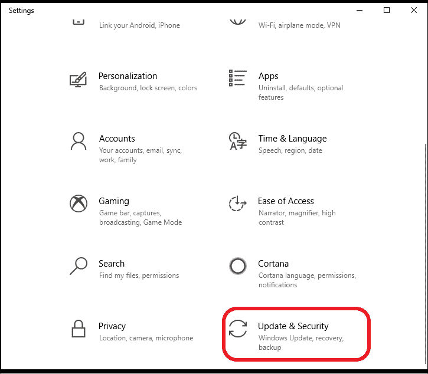

**步骤 4:** 将打开“更新&安全”窗口。点击菜单窗格左侧的“恢复”，如下图所示:

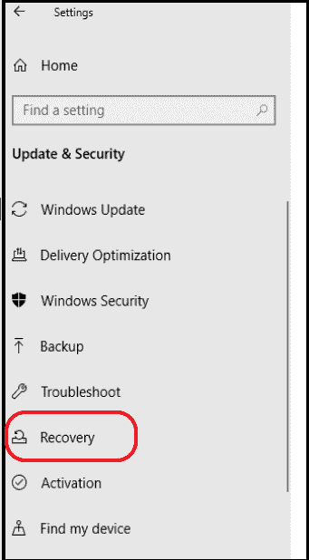

**步骤 5:** 将打开“恢复”窗口。在它下面，[视窗](https://www.javatpoint.com/what-is-windows) 10 提供了四个选项:

1.  **重置这台电脑:**最好的方法是从一个全新的系统开始。它会将您的系统清除到默认设置。
2.  **回到之前的 Windows 10 版本:**它会将当前版本的 Windows 移动到之前的版本。然而，甚至不能保证事情会对你有利。所以，这也是一种选择。
3.  **高级启动:**是指将你的系统与 USB 或光盘等外部设备连接，更改启动设置，将系统恢复到以前的版本。

下面显示了快照，其中这三个选项可见:

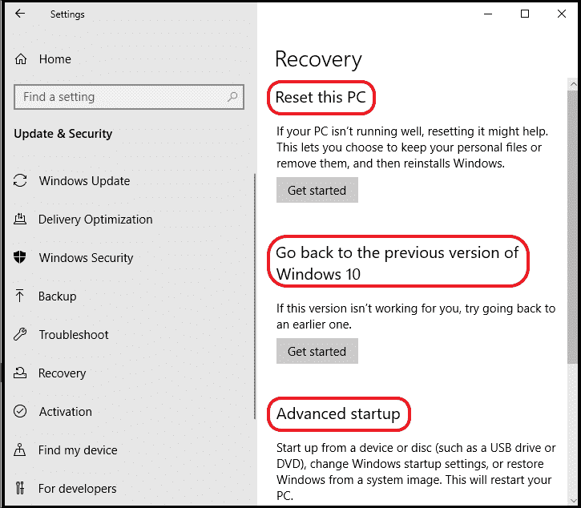

**第六步:**点击“重置这台电脑”选项下的“开始”，如下图:

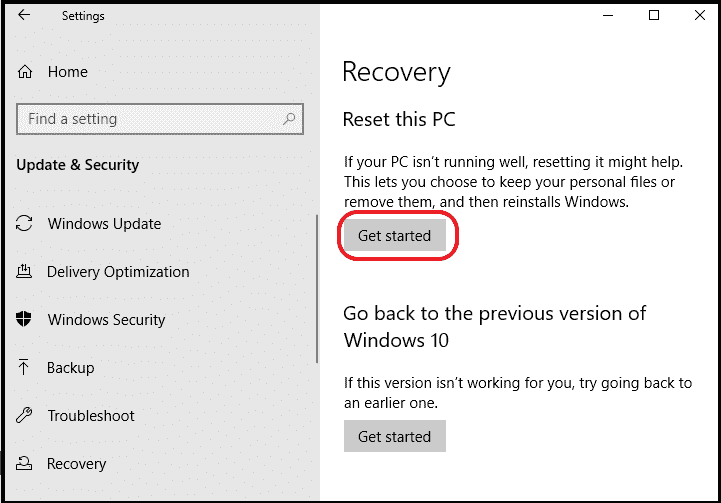

**第 7 步:**将打开一个蓝色的“重置这台电脑”窗口，有两个选项。要么**保留我的文件**(它将仅恢复您的个人文件)，要么**删除所有内容**(它将删除您的个人文件以及您所做的应用程序和设置)。快照如下所示:

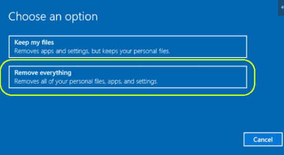

**第 8 步:**选择“移除所有内容”，之后，新窗口将再次打开。它会通过两个选项询问“您是否也要清洗驱动器”。要么是“只删除我的文件”(它将删除所有文件和设置，但不会删除窗口)，要么是“删除文件并清理驱动器”(它安全、耗时，并将删除操作系统，即窗口)。选择“仅删除我的文件”选项。否则，选择替代选项会将 Windows 从计算机中删除，您再次需要将其重新安装到系统中。

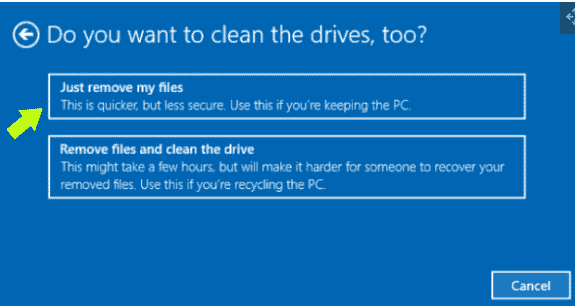

**第九步:**最后，“准备复位”窗口打开。最后，点击出现在屏幕右下角的**重置**按钮，如下图所示:

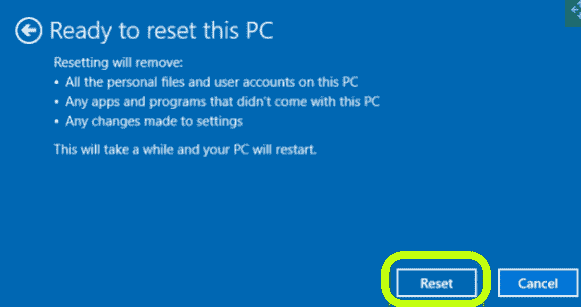

**第十步:**需要一段时间，最后你的系统会被重置。之后，所有的数据和个人文件都将从系统中清除。它会看起来像你新买的那个。

#### 注意:一旦系统复位，恢复数据就比较困难。

## 擦拭 Windows 8/8.1 计算机系统

**步骤 1:** 备份不想删除的文件和文件夹。将文件备份到驱动器或收存箱中。这是因为重置选项将清除您对计算机所做的所有文件和设置。如果不想备份，请忽略该步骤。

**第二步:**在搜索栏中导航打开“设置”，如下图:

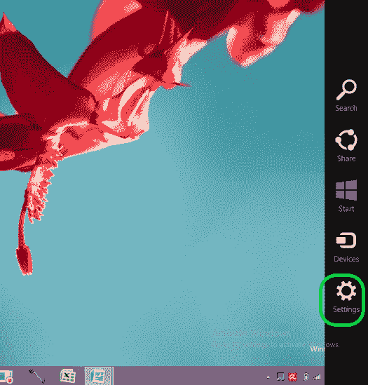

从中选择“更改电脑设置”。快照如下所示:

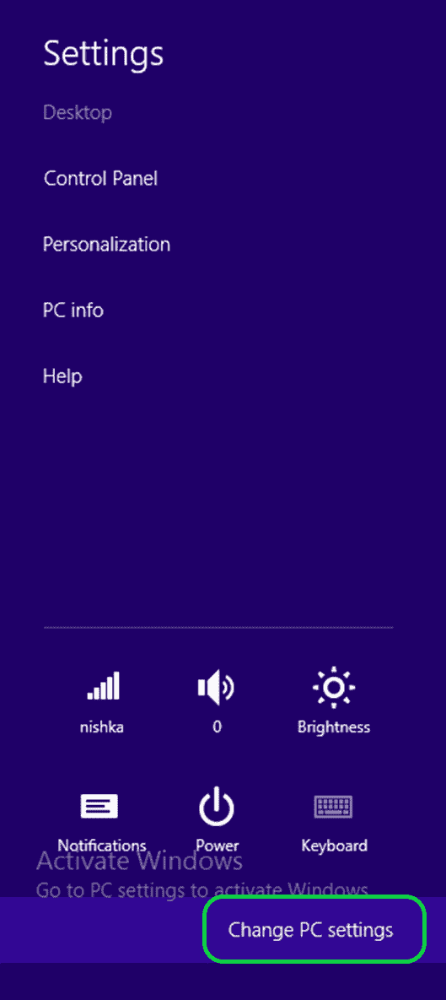

**第三步:**将打开一个窗口。点击“更新&恢复”选项。选择下面的“恢复”选项，如下图所示:

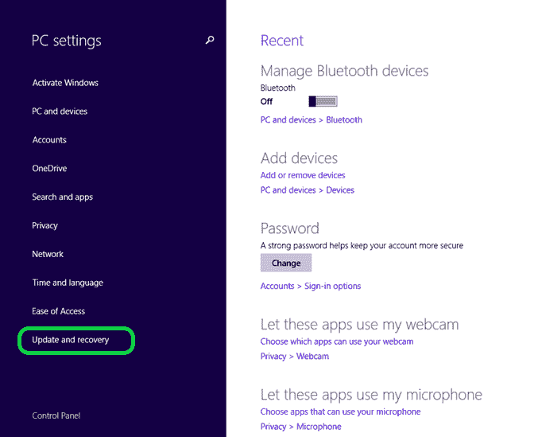

**步骤 4:** 将打开“恢复”窗口，有三个选项可供选择:

1.  **刷新 PC 不影响文件:**不丢失，只会刷新系统一次。
2.  **删除所有内容，重新安装 Windows:** 清除所有数据和设置，重置电脑。
3.  **高级启动:**将计算机与外部设备连接，将系统恢复到以前的版本。

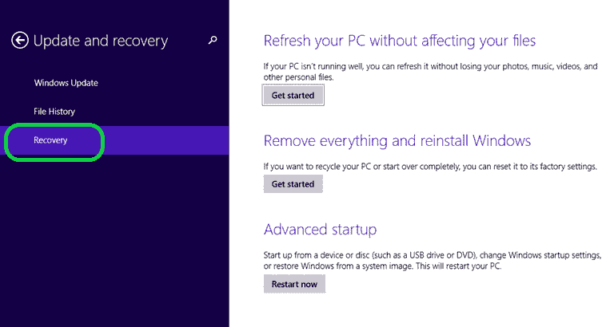

**第五步:**在“删除所有内容并重新安装 Windows”下，点击“开始”，如下图所示:

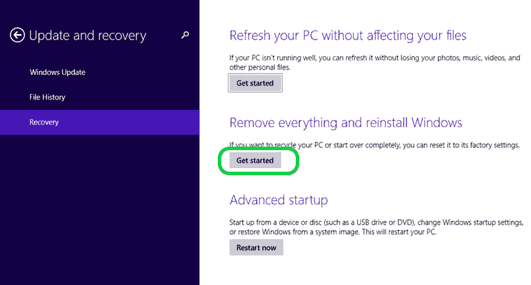

**第六步:**一个“重置电脑”的蓝屏会打开，告诉你重置电脑会发生什么。点击**【下一步】**。

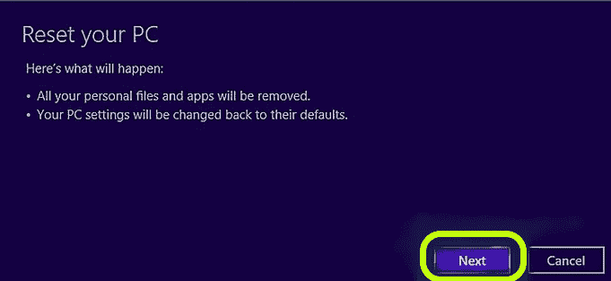

**第 7 步:**现在，从两个选项中点击“删除我的文件”。这是因为如果您选择“完全清理驱动器”选项，它将清除所有文件，并从计算机上重新安装窗口。如果您也想重新安装 Windows，可以继续使用此选项。

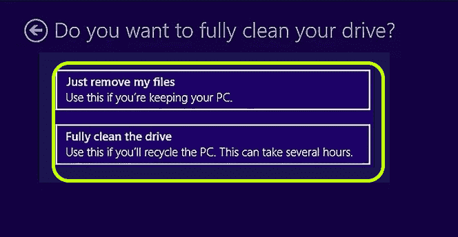

**第 8 步:**最后，将出现“准备重置电脑”选项。点击“重置”按钮。您的系统将重新启动并开始重置。

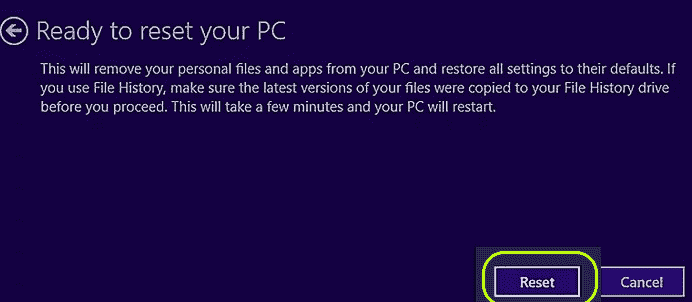

### 擦拭 Windows 7 计算机系统

**第一步:**备份重要文件和文件夹。

**第二步:**重启系统，多次按 F11 打开**的【高级启动选项】**菜单，也叫恢复菜单。

**步骤 3:** 选择“复位”选项。它可能因型号而异。通常是“恢复出厂设置”。

**步骤 4:** 按照步骤操作，小心重置系统。

#### 注意:重置 Windows XP 或 Vista 的步骤与擦除 Windows 7 的步骤相同。

* * *