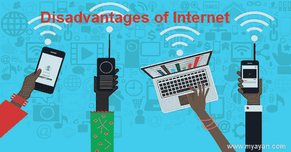

# 互联网有哪些弊端？

> 原文：<https://www.javatpoint.com/what-are-the-disadvantages-of-the-internet>

虽然互联网有各种各样的好处，是最强大的创造之一，但它也包含许多缺点。下面列出了互联网的全部缺点。

### 1.上瘾，浪费时间，导致分心

如果一个人花很多时间在联网设备上，他可能会沉迷于[互联网](https://www.javatpoint.com/internet)。一个网络成瘾的人会导致他把宝贵的时间花在网络上，而不是做一些有成效的事情。因此，任何沉迷于网上冲浪的人也会影响工作效率。

### 2.欺凌、巨魔、跟踪者和犯罪

一个经常使用互联网的人可能会面对辱骂或流氓的人。网络欺凌的另一个问题近年来也在迅速增加。有时，你会在网上被黑客或未经授权的人跟踪；他们可能通过窃取你的个人信息对你有害。

如果你花更多的时间在互联网上，那么黑客会更容易通过各种方式找到你的个人信息。为了经营企业而不用担心被抓住，网络很深，互联网上隐藏的地方也可能是犯罪分子的地方。此外，还有一些人为罪犯提供了更多的方法来招揽他们的货物。

### 3.垃圾邮件和广告

与传统的广告方式(例如，电视、报纸和广播)相比，互联网是为任何服务或产品做广告的最佳场所。但是在现实生活中，你可能会在收件箱里看到比垃圾邮件更多的垃圾邮件，因为数字广告可以大规模发送。

### 4.色情暴力图片

在现代，互联网上有大量的内容。此外，还有各种包含大量数据的资源，如[维基百科](https://www.wikipedia.org/)，也有一些网站的内容不太理想。因此，用户可以在使用网站时看到他们可能不想看到的色情或暴力图像。

### 5.永远无法脱离工作

互联网是提供连接并使人们能够在任何地方工作的最佳创造。因此，任何人都可以期望你在任何时候都有空去工作，即使你没有空在那里工作。例如，当你在家的时候，你收到了一封重要的与工作相关的电子邮件，但是却没有得到报酬，最终你不得不处理邮件的内容。

### 6.身份盗窃、黑客攻击、病毒和欺骗

有各种各样的恶意用户和计算机黑客可以窃取你的个人信息和黑客账户，这些可以用于身份盗窃，并可能对你个人有害。由于互联网将所有计算机相互连接，因此黑客可以通过扫描数百万台计算机来快速识别哪些计算机容易受到攻击。此外，互联网还能让学生找到其他人做作业，并提供作弊的方法。

### 7.影响注意力和耐心

这些网站有一种即时满足的效果，我们每天都在互联网上使用。根据需要，他们还提供大量的菜单，让您随时体验和思考。以这种方式获取信息会影响你的互动，让你更不耐烦，更不专注于你的活动。要解决这个问题，试着专注于更有成效的现实生活活动，如锻炼或清洁，并在远离社交媒体的时间内平衡这种自然效果。

### 8.健康问题和肥胖

如果你经常上网，玩游戏，花太多时间在电脑上，也会导致肥胖和不健康的生活方式。此外，一个花太多时间在电脑上的人可能会面临像腕管综合征这样的问题，因为电脑需要大量重复的运动。

你需要移动你的身体部位来操作电脑，例如，打字和将手移动到鼠标是会造成伤害的重复动作。了解电脑人体工程学，保持正确的姿势，休息一下都有助于延缓或预防这些伤害。

### 9.抑郁、孤独和社会孤立

互联网也成为导致抑郁症的一个原因，因为许多人倾向于在社交网站上与他人比较他们的生活。社交网站为用户提供了结交成千上万朋友并相互交流的选择。还有一些在线游戏允许玩家与他人交流。虽然社交网站可以让你在世界各地找到新的联系，但你可能会发现自己与现实生活中的朋友脱节了。

### 10.买你不需要的东西

互联网为消费者进行购买提供了优势，因此用户可以频繁购买产品，而无需过多考虑是否应该购买。此外，有些人会沉迷于在网上购买会导致严重债务的物品。

### 11.对孩子们来说不是一个安全的地方

互联网对孩子们来说可能没有更多的用处，因为他们花了很多时间在互联网上。此外，互联网上有许多不道德和色情的社区，会分散他们的注意力。因此，互联网对儿童没有好处，因为他们可以借助互联网上可用的不同工具绕过父母的保护。再者，如果允许孩子使用互联网，他们可能会沉迷其中，这也是非常危险的。

### 12.病毒/恶意软件

频繁使用互联网可能会使病毒感染您的系统，从而损坏您的宝贵数据，而这些数据很难恢复。这些病毒通过美国银行、加拿大国际开发署和互联网进入系统。此外，由于病毒，您的系统可能变得毫无价值。

* * *