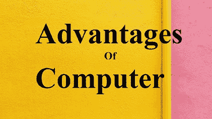

# 电脑有什么优点？

> 原文：<https://www.javatpoint.com/what-are-the-advantages-of-computer>

使用电脑有很多好处。下面列出了计算机的主要优点。

### 提高您的生产力

计算机有助于提高用户的工作效率，用户在很好地理解了你在计算机上运行的软件上所做的一切后，会变得更有效率。例如，当你对 [Excel](https://www.javatpoint.com/excel-tutorial) 工作表有了基本的了解后，你可以创建、编辑、删除、存储、计算和打印文档和信件。在所有现有技术的情况下，所有这些事情要么是不可能的，要么要慢得多。

### 可以存储大量信息并减少浪费

计算机最有用的优点之一是能够存储和访问大量的数据，这些数据可以在将来检索。例如，像电子书阅读器这样的计算机系统和设备有足够的存储容量，因为它们可以存储数百或数千本书。此外，您可以在计算机上以数字方式存储电影、图片、歌曲和文档，并可以相应地快速查找数据和在设备之间共享信息。它减少了用于制作非数字版本媒体的塑料和纸张需求。

### 将您连接到互联网

电脑有能力将你连接到网络或[互联网](https://www.javatpoint.com/internet-explorer)。连接后，您可以搜索任何类型的信息，并可以下载音频、视频、电影、文档等。

### 帮助分类、组织和搜索信息

与另一台设备相比，一台[计算机](https://www.javatpoint.com/full-form-of-computer)系统可以更恰当地使用其存储的信息。如前所述，一台计算机可以存储成千上万本书。存储在计算机上的书籍可以按字母顺序分类，这有助于用户在不到一分钟的时间内正确找到信息。如果人类试图从数百或数千本书中手动找到某些信息，将需要很长时间或数月。

### 保持联系

电脑帮助你通过电子邮件和社交网络与你的朋友、家人或其他远方亲戚联系。此外，您可以通过网络电话和聊天服务等在线媒体与成千上万的人联系。你和世界各地的人之间的联系也是通过网络与异地人见面的更好方式。虽然你不能通过[互联网](https://www.javatpoint.com/internet)与人进行身体接触，但你仍然可以与他们分享你的想法、感受和联系。

与其他交流方式相比，在互联网上交流速度更快。例如，邮政邮件可能需要很多时间或几天才能到达，在互联网上，你可以向任何人发送电子邮件，这些邮件在几分钟内就能到达。

### 更好地理解数据

计算机还帮助用户更好地理解数据。例如，企业中可能有一个销售商品的数据库。一个商人可以借助计算机上存储的数据来识别一年中什么产品卖得最好，什么商品卖得不好。获得这种类型的业务信息可以更好地了解他们的客户，并可以通过消除生产中的问题来促进业务增长。

### 可以帮助你学习并让你了解情况

当你在电脑上连接到[互联网](https://www.javatpoint.com/internet-full-form)时，它帮助你提供几乎所有问题的答案，并教你任何你感兴趣的东西。您还可以随时了解世界各地的最新新闻、天气和故事。此外，通过看视频和阅读网站，你可以学习一个新的职业。您可以通过注册所需的在线课程在线学习任何科目。

### 你可以挣钱

当电脑连接到互联网时，你可以通过许多不同的方式赚钱。例如，你可以创建和运营一个在线商店，因为它比实体店便宜得多。此外，当你创建一个曾经的在线商店时，你可以向世界上任何人销售你的产品，就像你的产品在互联网上有一个庞大的受众网络一样。此外，你还可以用电子表格在电脑上赚钱，这是一个分解你的支出和记录你的财务状况的完美工具。

### 提高你的能力

如果你的语法、数学很差，你不是最好的拼写者，没有很好的记忆力，或者需要一些其他的帮助，y56 你可以在电脑的帮助下提高你的能力。此外，如果你是一个努力学习的人，你可以依靠电脑作为助手。

### 改善你的就业选择

如果你有一台电脑，并且知道如何使用电脑，你可以改善你的就业选择，并且可以在家工作。例如，有时这可能是任何组织允许员工在家工作的一个条件。就像，在 2020 年新冠肺炎爆发疫情时，许多办公室需要员工在家办公。即使在危机期间，家里有一台电脑，并且知道如何操作电脑，许多办公室允许员工在家继续工作。

### 可以帮助自动化和监控

计算机被编程来执行动作或完成任务。一旦一台计算机被编程完成一项任务，它就可以根据需要重复该任务多次。例如，计算机已经被编程为通过打印机打印文档；然后，你可以根据自己的要求多次重复这个任务。

计算机也可以被编程来等待某事的发生，并且可以自动完成大多数可以想象的任务。例如，一个摄像头连接到电脑上，可以让你观察动作，当检测到动作时，发出警报并开始记录。

### 节省时间

今天，有许多服务，计算机可以用很少的时间完成，可以节省你的时间。下面给出了几个例子:

*   您可以查看您的银行余额，而无需亲自前往分支机构；你可以在任何地方的任何网上银行网站上查看余额。还有，你可以在线支付电费、钢瓶费等。
*   你可以使用像亚马逊这样的购物网站购买许多产品，而不必离开你的家。用这种方式购买产品，你可以节省很多时间。此外，你可以在不同的网站上找到许多相同的产品，价格相同或更便宜。
*   如果你想在你最喜欢的餐馆点些东西吃，而你的餐馆有一个网站，你可以相应地点任何食物，而不必排队。
*   要找到最快的路线，您可以查看在线地图和带有交通信息的交通摄像头。

### 让你开心

电脑还可以保持娱乐，因为连接到互联网后，您可以收听数百万首歌曲，观看视频或电影。此外，您可以将离线歌曲、视频或电影存储在计算机上，无需互联网连接即可随时播放。还有一些受欢迎的网站，如亚马逊、网飞和 YouTube，它们提供无限量的流媒体和在线视频。

### 在生活中寻找爱

电脑和互联网使得与世界各地的人联系变得非常容易。通过它，你可以在网上的网上约会网站上找到你对生活的热爱。

* * *