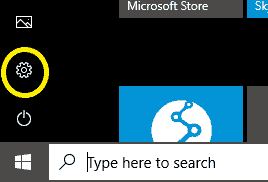
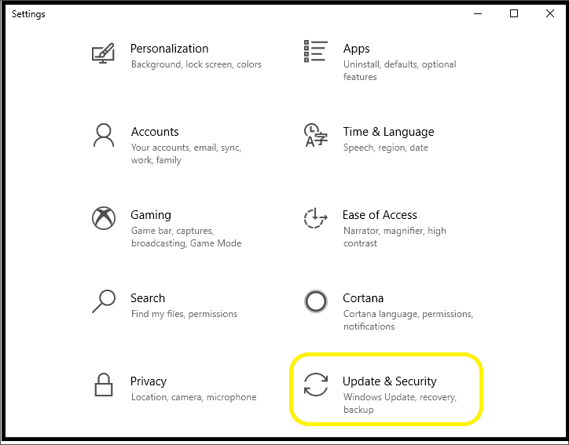
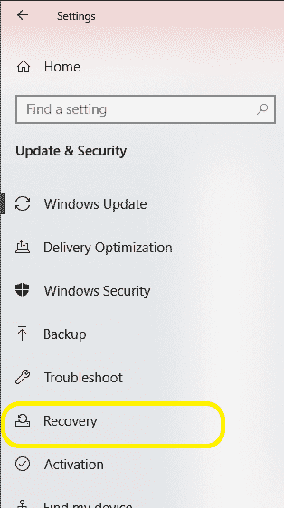
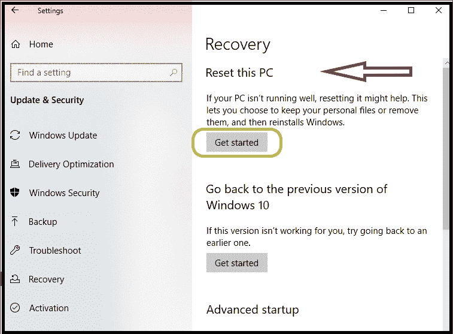
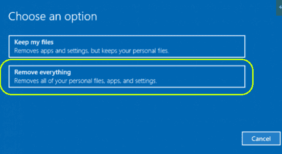

# 如何在工厂重置计算机

> 原文：<https://www.javatpoint.com/how-to-factory-reset-a-computer>

通常，当系统变得太旧或内存不足时，我们需要重置系统。我们需要删除数据，并从计算机中删除此类问题。重置系统是处理如此缓慢和无响应的系统的最佳方式。工厂重置不是扔掉这样的系统或在它上面花费金钱，而是克服这个问题的最好的技巧和方法。还建议我们每年对计算机系统进行一次工厂重置，因为这将节省并防止我们的系统出现速度问题或任何其他有问题的因素。

在这里，我们将学习工厂重置计算机的方法。

### 什么是工厂重置

工厂重置是指将计算机软件恢复到其原始状态。[工厂复位](https://www.javatpoint.com/how-to-factory-reset-windows-7)也称为**主复位**。它会删除所有数据和更改，并将系统恢复到以前的状态。只有预装在计算机中的软件和程序不受出厂重置的影响。因此，如果我们需要保留数据并且不想丢失数据，备份是一种选择。备份所有不想保存在计算机上的重要文件和数据。

### 工厂重置的要求

为了将我们的系统恢复到出厂设置，计算机中应该有以下任何适用的东西:

1.  我们需要一个原始的 Windows 安装盘。这样的光盘有视窗系统，如视窗操作系统，7，8，8.1 专业版或视窗 10。
2.  我们的电脑系统应该安装有恢复分区，一般是惠普、联想、戴尔等电脑厂商安装的。
3.  当我们从卖家那里购买计算机时，计算机附带的任何恢复盘也是适用的。这些光盘用于工厂恢复。

任何这些要求，当满足时，我们可以很容易地进行工厂重置。

除了这些，如果我们不能满足这些讨论的要求，我们也有一些其他的选择。它们是:

1.  我们可以使用“系统还原”选项，该选项在每个 Windows 版本中都提供。此外，默认情况下，此功能在 Windows 中是启用的。该功能能够将计算机恢复到出厂设置。但是，请注意系统中是否启用了系统还原。
2.  我们可以使用 Windows 操作系统中提供的恢复要素。但是我们只能对合适的错误使用这个选项。这样的恢复要素并不适用于每一种错误。恢复要素被称为“自动修复”功能，它可以帮助自动处理和修复引导错误，加上其系统恢复选项，可以快速恢复我们的系统。它还允许访问和备份文件、反病毒软件、基本文件、防病毒软件和其他数据。

但是，这些选项应该应用于紧急需要工厂重置的情况。这些是从战术问题中拯救我们的数据和计算机的紧急点。否则，只需执行上述要求。

## 计算机出厂复位步骤

在这里，我们将讨论在工厂重置具有 [Windows 10 操作系统](https://www.javatpoint.com/what-is-windows)的计算机系统的步骤:

第一步:备份所有重要文件和其他数据。

步骤 2:搜索磁盘并将磁盘(如上所述)与计算机连接，这样可能有助于将计算机恢复到出厂设置。

第三步:在电脑上打开设置，或者在搜索栏上搜索，或者同时按下 Windows + A 键，右上角会打开一个面板。点击“设置”选项。

第四步:将打开【设置】[窗口](https://www.javatpoint.com/windows)。点击其中的“更新&安全”图标。快照如下所示:

步骤 5:在“更新和安全”窗口中，选择并单击出现在左上角面板中的“恢复”选项。如下图所示:快照:

步骤 6:我们可以在“恢复”页面下看到三个选项。由于我们必须在工厂重置系统，所以我们需要选择第一个选项，即重置这台电脑。点击该选项下的“开始”。我们也可以选择高级启动选项，但它会对系统进行深度修改。所以最好选择第一种。快照如下所示:

第七步:重置过程将开始。最初，它会要求选择“保留我的文件”或“删除所有内容”。选择一个选项，然后进入“下一步”，如下所示:

在这里，我们选择了“删除所有内容”选项。

第八步:根据你选择的选项按照说明操作，最后，重置窗口会打开。再次思考，点击重置按钮重置系统。如果您想取消，请单击“取消”按钮。

### 工厂复位和硬复位的区别

下表描述了这两个术语之间的区别:

| 工厂重置 | 硬重置 |
| 重置选项重置整个计算机系统，即它擦除电子设备(如计算机、笔记本电脑、手机等)的 A 到 Z 信息。 | 这是工厂重置的子部分，用于重置硬件设备。它只重启电子系统的硬件。 |
| 当我们应用工厂重置时，整个系统被格式化。 | 当我们应用硬复位时，只有特定的硬件被格式化。例如，如果我们想重置一个 PenDrive，我们可以将它连接到计算机并轻松格式化它。它会将设备恢复到原始状态。 |
| 工厂重置是一个耗时的过程，因为 t 从系统中检索所有的数据，然后一个接一个地删除它。 | 这是一个非常快速的过程，因为我们只重置特别受影响的硬件设备，而不是硬重置整个系统。 |
| 效率更高，每年至少要做一次。 | 这是有效的，可以在必要时或出现任何问题时进行。 |

* * *