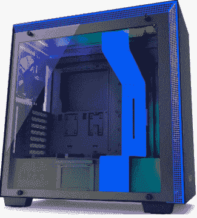
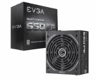
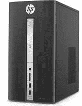
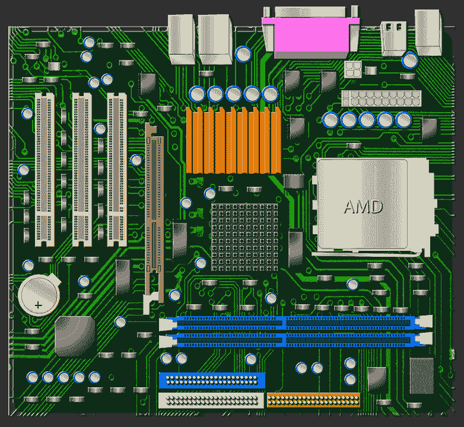
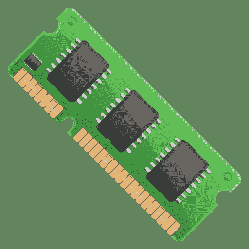
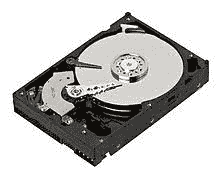
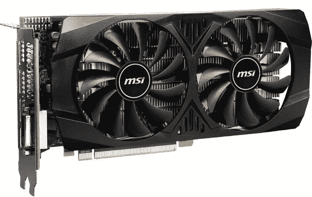
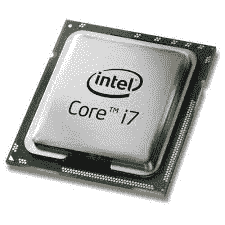
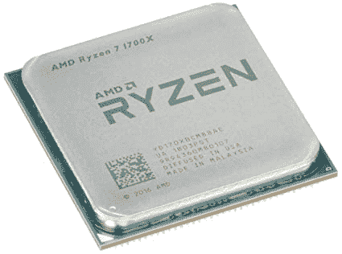

# 如何建造一台计算机

> 原文：<https://www.javatpoint.com/how-to-build-a-computer>

**类似问题:**

*   如何建造一台个人电脑
*   2020 年如何打造自己的 PC
*   我能自己造电脑吗
*   如何建造一台台式电脑
*   如何逐步构建一台电脑

虽然在考虑建造一台计算机时似乎很困难，但这是一项有趣的任务。如果你是一个初学者，可能需要一点时间来理解每一步，并实际执行它。计算机是一种电子设备，所以通过将计算机的各个部分连接在正确的位置，肯定会建造出一台好的、完美的计算机。作为一个初学者，你刚刚从商店买了一台电脑，但也有可能自己造一台电脑。这并不是一项不可能的任务，只是需要挑选出正确的组件，并在正确的插槽和连接器中小心地进行连接。

在本教程中，我们将一步一步地深入了解每一步，这样我们可能会发现构建起来很容易。没必要担心，因为我们会让你知道从哪里开始。此外，我们将看到最适合构建计算机的组件。

## 选择正确的组件

选择和挑选计算机系统中正确和良好的部分是非常必要的。组件的正确选择将导致计算机的兼容和高效构建。然而，如果我们选择不兼容的计算机部件，就会产生某些问题，金钱浪费，对其他产品的损坏，以及与店主就退回这种反应迟钝和质量差的部件进行争论。因此，在处理计算机最关键的部分时，应该足够小心。如果选择正确，以下组件将导致成功构建计算机，其工作方式与我们从商店购买的计算机相似。

我们需要以下组件来构建计算机:

*   **案例:**它是计算机建筑的第一个必不可少的部分。根据我们制造的计算机的大小，这些机箱以不同的形式出现。根据需要选择合适的案例。电脑机箱看起来像:
    
*   **PSU:** *供电单元*或 PSU 用于向计算机的各个部分提供所需的电力。PSU 的最佳选择应该从 **500 瓦**开始。选择模块化、可靠、品牌化和高效的 PSU 来构建计算机。这将是一笔昂贵的交易，但它是一个重要的组成部分，因此应该选择最好的。推荐选择 **EVGA 超新星 A750 GA PSU** ，这是目前为止最好的 PSU。然而，也有其他选择。PSU 电脑看起来像:
    
*   **CPU:** 是计算机系统的*中央处理器*。因此，它被称为计算机系统的大脑。它是计算机必不可少的一部分，因为计算机的整个处理依赖于一个中央处理器。我们可以使用 **AMD** 和**英特尔**来构建桌面处理器。最好的 CPU 无疑足够贵，应该与主板兼容。这是因为它的插座直接插入主板。它应该有最好的冷却器，以防止过热和处理器响应缓慢。CPU 最好的选择是**英特尔酷睿 i7** 或者 **AMD 锐龙 3** ，目前为止都是最好的。一个 CPU 看起来像:
    
*   [**主板:**](https://www.javatpoint.com/motherboard) 它是一个重要的电路板元件，其他元件都插在上面。它是计算机的心脏，是计算机的生命线。它是其他组件用来相互协作和通信的桥梁。主板应该与中央处理器的相同插座类型相匹配。此外，与计算机的所有其他组件相比，它也是最便宜的。市场上有各种尺寸和配置可供选择。他们的工作相似，但看起来不一样。推荐的主板有**华硕 ROG Strix B450-F** 和 **MSI MPG Z490** ，目前最好。电脑主板看起来像:
    
*   [**RAM:**](https://www.javatpoint.com/ram) *随机存取存储器*或者 RAM 就是电脑的内存。它有不同的字节，所以我们可以根据需要选择内存。我们的电脑可以选择 **32GB** 或 **64GB** 内存。此外，它应该满足并支持相同的时钟速度。台式电脑使用名为 **DDR4 RAM** 的 RAM，可以为 CPU 存储游戏数据和程序，其他组件在需要时可以方便快捷地访问所需数据。这是目前速度最快的内存。几乎所有类型的主板都支持 DDR4 RAM。一些 DDR4 内存是**G . Skill Ripjaws V series 32 GB 288 针内存**和**海盗船复仇 LPX** ，这是迄今为止最好的内存。计算机内存看起来像:
    
*   **存储:**它是计算机的储藏室，我们在这里存储所有文件和其他数据，如电影、游戏或照片。如果将来需要，我们还可以添加更多存储。存储负责在计算机上安装操作系统。建议使用**固态硬盘**将操作系统安装到我们的电脑上。不同固态硬盘的价格和性能各不相同。建议的固态硬盘是 **WD Blue 1TB 内嵌式固态硬盘**，目前为止是最好的。其中一个存储如下所示:
    
*   **GPU:** *图形处理单元*或者说 GPU 并不是构建电脑不可或缺的一部分，因为当我们是一个游戏玩家并且喜欢在电脑上玩游戏的时候，它是需要的。也被称为**显卡**。我们需要一个显卡来编辑视频或照片，以及处理主要的视觉数据。推荐的显卡有 **MSI 镭龙 RX 570、MSI GeForce GTX 1660、**和 **MSI GeForce RTX 2060** 。一个 GPU 看起来像:
    

所以，我们需要收集所有这些硬件部件来建造一台计算机。我们可以很容易地从电子商店买到这些零件。收集完所有这些基本组件后，请确保它们是否正常工作，以便以后不会出现冲突。

除了这些必不可少的工具之外，还要准备一个工具包，里面有螺丝刀、螺丝、 [LED](https://www.javatpoint.com/windows) 等常用工具。

### 安全措施

在开始我们的主要工作，即制造计算机之前，有必要保持安全措施。这些安全措施如下:

*   寻找一个干净的工作空间，我们将在那里保存所有组件和其他必要的工具。一个干净的空间是必不可少的，因为一根细小的头发会在构建计算机时产生冲突。
*   干净的工作空间应该足够大，这样我们就可以将箱子和其他部件保持一定的距离。
*   避免穿羊毛袜或任何其他导热性能好的袜子。要求我们自己采取预防措施也是因为我们使用了对我们有害的静电。我们可以使用防静电腕带作为预防措施。腕带看起来像:

一端缠绕在我们手上的腕带上，另一端夹在电脑上。

*   从地板上取下地毯或任何类似物品。地板应该是空的，因为地毯会产生高静电，连接电脑部件时要穿鞋或凉鞋。
*   不要从我们不工作的袋子中打开这些部件。这是因为这些部件大部分都包在防静电包里，不用的话不要碰。
*   使用每台计算机组件附带的指南，并按照指南中的注意事项进行操作。

## 构建计算机的步骤

让我们通过在正确的地方连接这些组件来开始制造计算机，并制造一台可行的电子机器。开始构建计算机时，我们需要遵循以下步骤:

**第一步:打开箱子**

最重要的一步是打开箱子，放在地板上。打开和准备案例是最容易完成的步骤。拆下机箱的侧板，也拆下机箱内产生噪音或悬挂的任何东西。这是因为它可能会在之后制造一个问题。如果它连接得太紧，请推动它并将其拆下。这样做之后，将案例搁置一段时间。

**第二步:一切都需要电源才能开始。**

[PSU](https://www.javatpoint.com/psu-full-form) 是电脑机箱的第一个部件，位于机箱的顶角或底角。在这种情况下，存在 PSU 的变体，即标准 PSU 和模块化 PSU，它们是主要的电源，此外，还存在混合半模块化 PSU。模块化电源单元携带从主单元分离的电缆，以避免混乱，它非常适合较小的情况。请查看我们案例中的 PSU 型号，如果是模块化的，请暂时不要使用电缆，在安装附加组件时运行电缆。但是，电缆不会完全分离、捆绑和捆扎，它们会悬挂在机箱的开放侧板上。将电缆捆绑在一起可以将它们放在一边，直到我们安装计算机的其他组件。

**第三步:安装 CPU**

是时候取出主板，通过安装或连接[中央处理器](https://www.javatpoint.com/central-processing-unit)、其冷却器和随机存取存储器进行准备，然后再装在外壳中。我们也可以在将这些组件安装到机箱中后进行连接，但是将它们连接到计算机上会变得相当困难。因此，只在这一步安装[中央处理器](https://www.javatpoint.com/cpu-full-form)、[内存](https://www.javatpoint.com/ram-full-form)和冷却器更好也更容易，即在将主板安装到机箱之前。从防静电袋中取出主板，将其放在平坦的非金属表面上，例如桌面上。请小心连接并在主板上安装中央处理器，因为主板上的针脚太多，所以请确保中央处理器正确安装在主板上。处理器的安装过程因购买的处理器类型而异。让我们讨论一下。

**安装英特尔处理器的过程**

在英特尔处理器中，引脚位于主板上的现代英特尔插座中，使中央处理器的安装变得容易。插座的这一部分被称为**触点阵列**。

#### 注意:不要试图弯曲或触摸这些引脚。

负载板负责将中央处理器固定在其正确的位置。使用负载杆升高和降低负载板。当它被夹住时，它的末端藏在一个钩子下，以保持一切都在正确的位置。通过向下推动装载臂打开装载板，并将其从吊钩下移出。之后，一路抬高。装载板将通过挂钩杆的作用打开，挂钩杆可以很容易地向上翻转。在新的主板上，可能会覆盖一层泡沫过滤器，轻轻取下即可。将 CPU 放入插座中，使外缘与插座本体齐平，不需要施加任何压力，因为我们可以很容易地做到。利用负载臂降低芯片上的板，推动它，并再次通过施加一些压力将臂夹在钩子下。此外，确保处理器中的凹槽(以半圆形状出现在芯片的每一侧)应与插座中的凹槽对齐。

**安装 AMD 处理器的过程**

AMD 处理器的安装过程与英特尔处理器不同。AMD 处理器的设计也不同于英特尔处理器。在 AMD 处理器中，引脚从处理器中伸出。

AMDs 处理器的针脚插入主板中央处理器插槽的孔中。负载臂轻微移动孔，当我们按下它时，针脚会被处理器抓住。不知何故，如果不是这样，抬起手臂，让它伸直，然后让它休息。这样做将确保孔对销敞开。避免使用槽口，并在中央处理器角上使用镌刻金的三角形，以便在插槽中正确排列处理器。一旦我们成功地将处理器放入插槽中，通过向下施加一些压力来按压臂，直到它卡在正确的位置并锁定。

**步骤 4:安装内存**

与前面讨论的步骤不同，安装内存并不是什么大事。我们只需要记住两点，即我们已经选择了兼容的内存以及安装内存的方向和插槽选择。方向太容易选择了。所有记忆棒底部边缘的触点上都有凹槽，与主板上的一块内存插槽对齐。握住插槽上方的线和面向右侧的向上方向的两条线。如果做不到，将其旋转 180 度。放置内存的插槽选择取决于我们购买内存的方式等因素，因为如果是单条，我们需要将其安装在 A1 插槽中。将木棒安装在它们各自的插槽中，插槽的颜色匹配，标记为 A1 和 B1 或 A2 和 B2。对于其他类型，我们可以阅读主板手册中给出的说明。知道内存的正确插槽和方向后，现在向下并向外推动插槽一端的塑料护翼(可能是主板有两个)。此后，将拉杆垂直向上放在卡槽处，并向下推，直到内存插入卡槽。最后，塑料袋放回原处，夹住棍子的末端。

**第五步:安装主板**

现代机箱由不可拆卸的垫片组成，这些垫片内置在后壁和主板之间。我们称之为**对峙**。这些支架就像主板的地板，有助于防止背面的连接出现任何短路。有些情况下需要手动安装可拆卸支架。这些螺钉是铜色或金色的，顶部有另一个螺钉孔。主板的方向根据我们的情况而有所不同。主板输入/输出面板的背面或顶部将有一个矩形切口。主板也附带了一个输入输出屏蔽，安装好之后，我们对准输入输出面板，然后我们可以看到主板的螺丝孔对准了机箱中的支架。但是，如果不是这样，只需晃动主板，使其卡入护罩，支座正确对齐。在机箱中成功连接主板后，仍需要两个连接:

**Conn 1:** 主板的电源连接是一根两排电缆，足够宽，可以插入主板上看起来相似的位置。电缆大约有 28 针连接器，为主板和中央处理器供电。如果顶角侧有第二个 4 针或 8 针处理器连接器，也可以插入。

**Conn 2:** 现在，我们需要将机箱插头和按钮连接到主板上。一排双宽引脚用于运行 USB 端口、复位和电源按钮以及电源和存储活动指示灯。这些小电缆从放置在外壳中的端口成束延伸。

最后 [USB](https://www.javatpoint.com/usb-full-form) 头会连接到主板本身的前置端口。

**步骤 6:安装中央处理器冷却器**

现在，我们需要使用导热膏安装中央处理器冷却器，导热膏是一种良好的导热材料，可以将热量从芯片传递到冷却器。我们只需要粘贴得到治愈，然后安装就结束了。但是要给风扇系统完全供电，请将风扇的电线插入主板上的 4 针连接。这些 4 针连接器离处理器很近，我们可以通过它贴上标签的名字“CPU_FAN”很容易找到。

**第七步:安装显卡**

如前所述，每个系统都不需要安装显卡。如果我们不是游戏玩家，跳过这一步。在现代显卡中，有一个 PCI-Express 插槽，它是主板上的一个又长又薄的连接器。卸下矩形背板，将卡放入插槽。插槽是一个薄的金属支架，它排列在箱子的后面，以保持密封。使用主板手册并搜索 PCI 插槽，这是一个带有塑料闩锁的水平插槽。PCI 插槽是图形处理器的插槽。用我们的机箱背面推动 GPU 背面(背面有 HDMI 和显示端口)，将 GPU 放入并固定在插槽中。如果成功插入，图形处理器将被锁定在插槽中。将电源引出的电缆连接到图形处理器矩形或方形插座(6 或 8 个小孔)中。最后，GPU 安装在机箱中。

关于 GPU 的安装，我们也可以安装其他扩展卡。PCI 插槽不仅用于安装图形处理器，还用于其他扩展卡，如声卡、视频采集卡、无线网卡和其他存储卡。

**步骤 8:安装存储驱动器**

存储驱动器的大小有三种，它们有自己的连接方法。硬盘通常尺寸大 3.5 英寸，固态硬盘小 2.5 英寸。机箱包含至少一个插槽，用于放置此类驱动器。要安装驱动器，请将其插入机架上的支座中，并使驱动器侧面的螺孔与机架上的螺孔对齐。务必确保电源和数据连接器的正面朝内。成功对齐后，使用螺钉将驱动器固定到位。如果我们使用现代机箱，由于无工具安装系统的存在，安装组件变得很容易。如果我们必须在机箱中安装 2.5 英寸大小的驱动器，我们需要借助手册将驱动器正确安装在机箱中。

为了连接硬盘，我们需要进行两次连接。第一个连接用于电源，另一个用于数据。这两个连接都是 L 型的，不会有不正确的插件问题。我们可以轻松地将它们正确插入正确的插槽。因此，当我们将 GPU 安装到其 PCI-Express 插槽时，同样，我们也可以对 PCI-Express 存储驱动器进行安装。

**步骤 9:走向最终连接**

在进行最终连接之前，必须检查组件的所有连接，无论是否成功执行和完成。检查主板连接，因为如果连接不正确，很容易被发现。检查主板的 4 针或 8 针连接器，获取正确的电源。之后，检查中央处理器冷却器是否从主板获得正确的电源。现在，检查硬盘驱动器是否以 L 形 [SATA](https://www.javatpoint.com/sata-full-form) 连接器的形式通电。最后，图形处理器应该获得所需的功率，并查看所有连接是否正常。仔细查看我们到目前为止的所有安装，并确保每个计算机组件都安装并正确连接到各自的位置和插槽。

**第十步:最后通电**

仔细检查所有安装后，打开电源并按下电源按钮。现在，如果我们所有的连接都正确完成，系统将开始启动。启动过程一开始，我们就需要开始安装[操作系统](https://www.javatpoint.com/operating-system)。成功安装[操作系统](https://www.javatpoint.com/os-tutorial)后，在系统上安装驱动程序。检查其他安装，并检查系统中的“更新”&安全性。更新系统上所需的软件，这样，我们可以通过遵循一些适当的指导和预防措施来成功地构建自己的计算机。

* * *