# 如何从电脑传真

> 原文：<https://www.javatpoint.com/how-to-fax-from-computer>

传真始于 20 世纪 80 年代初。由于向人们提供即时服务的各种技术设备的高可用性，传真趋势已经降低到很高的水平。Gmail、Google Drives、微软 drive 和其他云服务已经取代了传真选项。从一台机器向另一台机器传递消息变得太容易、简单和即时了。不过，不用担心，传真系统在当今时代也在使用，但速度不如前几十年。一些小企业、政府办公室和其他组织使用传真来传递数据，Gmail 和谷歌硬盘等新兴技术使我们能够在线向一个或多个收件人发送传真。这些组织发现发送传真是一种更安全的方法。

## 什么是传真及其工作原理

[Fax](https://www.javatpoint.com/fax-full-form) 是**Fax**的缩写，又称**传真**或**传真** (telefax)。它是将扫描的打印文本或图像(以文档的形式)从一部电话传输到另一部电话，电话号码连接到打印机或其他输出设备。为了发传真，我们使用传真机。这些传真机连接到电话线上。我们将目的地号码放在我们想要传输文件的传真机上，并使用电话线进行传输。要传输的文件通过一台名为**的传真机进行扫描。遥控接收器将文档内容处理为单一的固定图形图像，然后将其转换为位图，最后使用电话系统以音频音调的形式传输文档。另一方面，接收传真的人扫描传真，并将其转换为易于阅读的数字文件。**

## 如何发送传真

以前，我们用传统的传真机把传真从一个地方传到另一个地方。但今天是互联网的世界。众所周知，如今每一项任务都依赖于互联网，也就是说，每一项任务都只通过使用[互联网](https://www.javatpoint.com/internet-full-form)来执行。所以，互联网已经成为我们生活的必需品。因此，各组织不像以前那样使用传真机在目标地点传送文件。相反，仍然依赖传真系统的组织利用互联网使用传真机发送传真。但是，不可能将传真机直接连接到互联网，因为传真机只能连接到电话线，因此无法将传真机与互联网直接连接。

现在，发送任何传真都变得可能，而不需要面对复杂而烦人的方法，这种方法就是使用计算机发送传真。在 Windows、Mac、 [Linux](https://www.javatpoint.com/linux-tutorial) 或其他[操作系统](https://www.javatpoint.com/operating-system)的帮助下，我们可以发送传真。[视窗操作系统](https://www.javatpoint.com/windows)有一个应用程序，即传真和扫描，允许发送传真。

在这里，我们将学习使用计算机向收件人发送传真的方法。

## 通过计算机发送传真的方法

大概有两种方法可以让我们用电脑系统传真文件。这些方法是:

### 使用传真调制解调器

使用传真调制解调器发送传真的方法是我们需要将传真调制解调器与计算机系统连接的方法。我们可以很容易地从装有苹果电脑或视窗操作系统的电脑上传真。要使用传真调制解调器发送传真，我们需要收集所需的东西或设备，然后才有可能发送传真。所需设备有:

*   **USB 传真调制解调器:**USB 传真调制解调器可以将传真发送到我们需要将调制解调器插入计算机系统 USB 端口的地方。如果我们没有 USB 传真调制解调器，请从市场上购买。
*   **一条有效且可使用的电话线:**需要一条有效的电话线才能连接到我们的传真调制解调器。这条电话线将负责把传真从我们的电脑发送给收件人。因此，我们需要一部电话通过电脑发送传真。否则，我们无法发送。如果我们没有电话，我们需要一部。

因此，我们需要满足设备的这两个要求，以便使用传真调制解调器方法从我们的计算机发送传真。

### 使用传真调制解调器发送传真的步骤

**第一步:**打开电脑。

**步骤 2:** 将传真调制解调器连接到电脑的 [USB](https://www.javatpoint.com/usb-full-form) 端口。之后，连接传真调制解调器端口中的电话线。

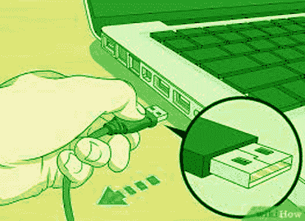

#### 注意:一旦您将电话线与传真调制解调器连接，在您发送或接收传真之前，任何人都不允许使用电话线。这是因为电话线沉迷于处理传真。

**第三步:**现在，点击电脑上的开始按钮，在搜索栏上搜索“Windows 传真和扫描”。下面显示了一个片段:

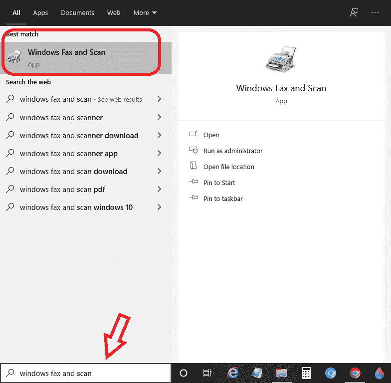

**第四步:**点击“Windows 传真扫描”并打开。相应的窗口打开，如下图所示:

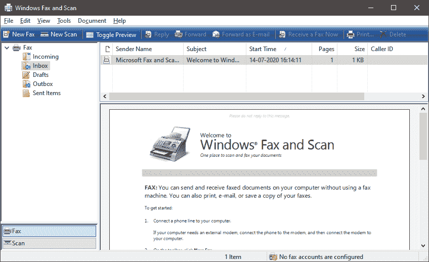

**步骤 5:** 点击屏幕左上角的“新建传真”选项，如下图所示:

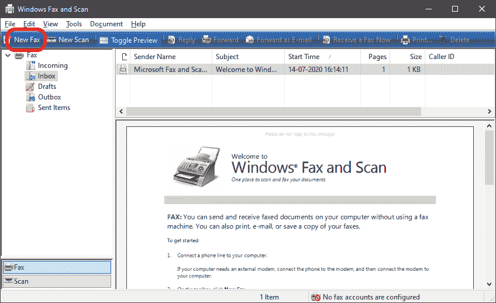

**步骤 6:** 当您点击“新建传真”时，将会打开“传真设置”弹出菜单，要求选择并提供传真调制解调器或服务器，让您发送或接收传真。你可以在它下面看到两个选项，即，

1.  **连接到传真调制解调器:**如果您使用传真调制解调器进行传真，请选择并单击此选项。
2.  **连接到我的网络上的传真服务器:**如果您正在使用传真服务器，请单击此选项。但是，您应该知道所连接的服务器的名称。

在这里，您需要选择传真调制解调器选项，因为在这里，我们将学习使用传真调制解调器进行传真。下面显示了一个片段:

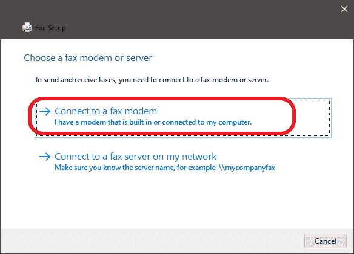

**步骤 7:** 如果您已经连接了传真调制解调器，这样做将会连接您的系统和传真调制解调器。如果没有，它将显示一条警告，说明您的系统上当前没有安装调制解调器。连接后，单击确定继续。

**步骤 8:** 现在，在“收件人”文本框中提供您要向其发送传真的收件人传真号码。然后在下面的“主题”文本框中，根据您发送的传真键入主题。快照如下所示:

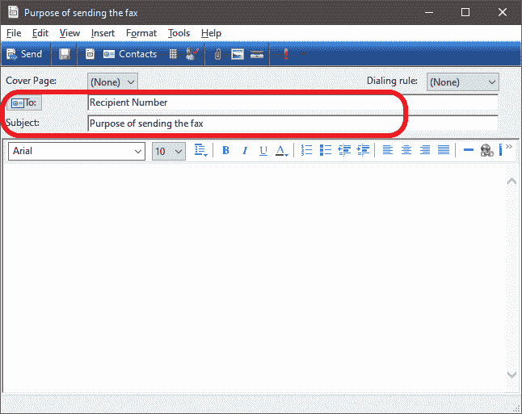

**第 9 步:**是时候写下并创建我们想要发送给收件人号码的传真了。在文本区域，通过书写创建传真并附加任何文档(图像、文件、视频等)。)，单击螺旋形式的“连接”图标，如下图所示:

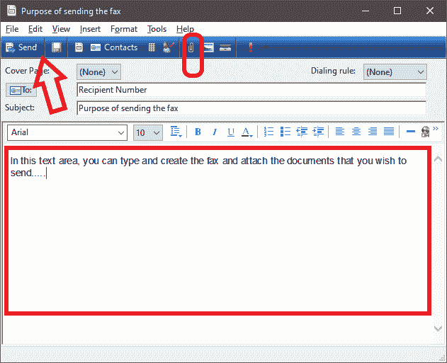

**第十步:**点击确定。

**步骤 11:** 现在，当您通过附加所需文档最终创建并准备好传真时，单击“发送”按钮。传真将发送到您提供的收件人号码。

因此，通过这种方式，您可以使用传真调制解调器向一个或多个收件人发送传真。

### 使用在线服务

使用在线服务传真是一种替代方法，许多服务提供商通过使用他们的服务方便我们向选定的收件人发送传真。在线服务中提供了许多允许我们发送传真的功能。然而，如果我们想向收件人发送少量页面，一些服务提供商提供免费传真服务，但在封面上包含广告和徽标来宣传自己。如果我们需要向收件人传真一份包含太多页面且不想让广告杂乱无章的重文档，我们可以通过支付一些费用来利用这些传真服务。某些服务按月或两个月收费，有些服务提供这样一段时间的试用。各种在线服务使我们能够发送或接收传真，在这些传真中，我们每月可以发送或接收的页数有自己的限制。下面提到了其中的一些服务:

| 在线服务 |
| **eFax** |  |
| **传真。加〔t1〕** |  |
| **metrofax** |  |
| **地狱之眼** |  |
| **环中心传真** |  |
| **传真零** |  |
| mfax |  |
| **密传真** |  |
| next iva |  |
| 齐塔传真 |  |
| **OpenText RightFax** |  |

这些是一些被评级的在线传真服务提供商。要查看评级、限制和其他要点，请访问网站并满足您的要求。除了这些服务，可能还有其他服务。

让我们讨论一下一个人将传真发送到目的地的步骤。

**使用在线服务发送传真的步骤**

由于我们已经讨论过有各种传真服务提供商，这里我们将学习通过 faxZERO 服务传输传真的步骤。

**步骤 1:** 如果文档是硬拷贝格式，扫描这些文档，并以 pdf 或 tif 文件格式保存在您的计算机上。建议将文档保存为 pdf 格式，以便将其存储为电子版本。

**第二步:**打开电脑上的网络浏览器，访问 faxZERO.com 网站。您可以使用以下链接直接访问网站:[https://faxzero.com。](https://faxzero.com/)下面是一个片段:

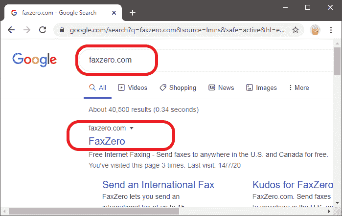

**第三步:** faxZERO 允许一天内免费发送 5 份传真，最多 3 页，包括每份传真的封面。意思是总共 15 页，有 5 个封面可以发。当您打开网站时，您将看到如下页面，如下所示:

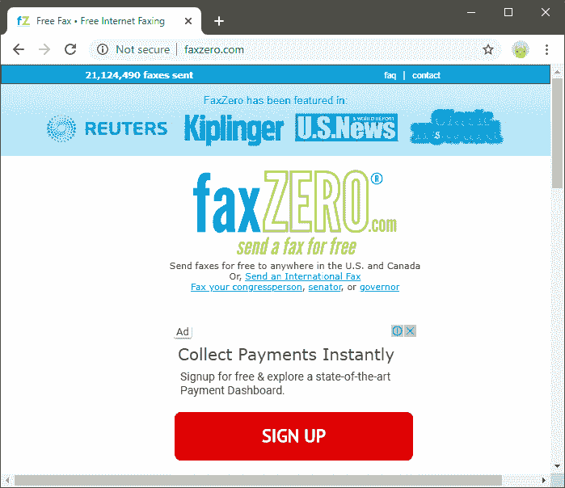

**第四步:**faxZERO 打开，你可以看到下面的页面，你将在其中创建和发送你的传真。

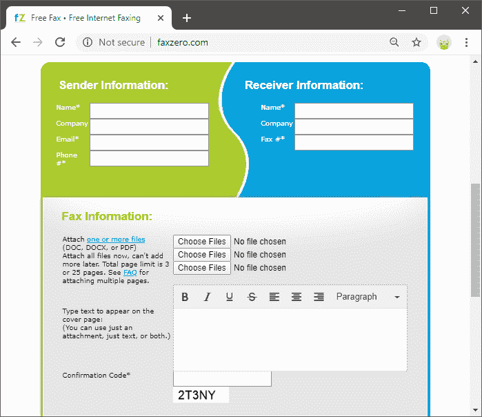

**第五步:**可以看到两列，即发送方信息和接收方信息。在发件人信息下，在相应的文本框中提供您的姓名、公司名称(可选)、电子邮件地址和电话号码。快照如下所示:

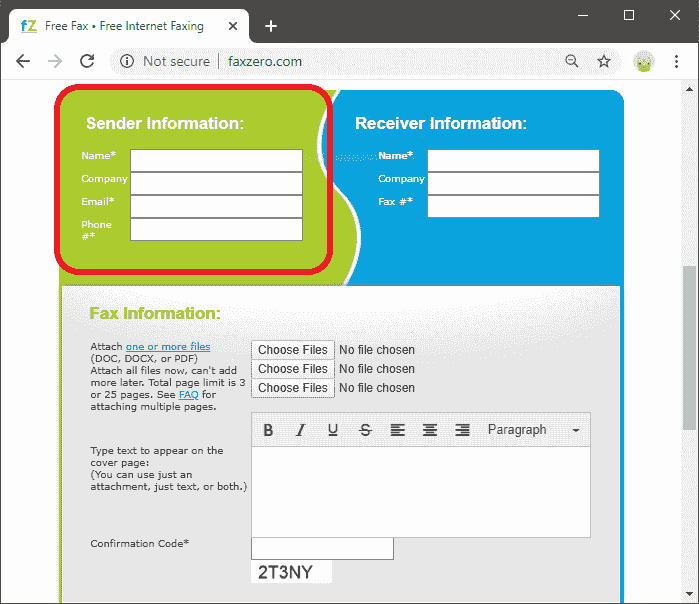

**步骤 6:** 现在，在收件人信息中输入您需要向其发送传真的收件人的详细信息。提供收件人姓名、公司名称(可选)以及传真将发送到的传真号码。在相应的文本框中输入这些详细信息。快照如下所示:

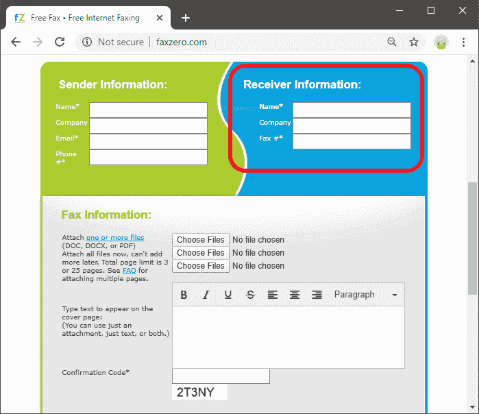

**第七步:**向下滚动，会看到三个按钮，分别为‘选择文件’。在这里，您最多可以上传和附加三个文档。单击“选择文件”并从其位置选择文档，然后将其附加到传真中。快照如下所示:

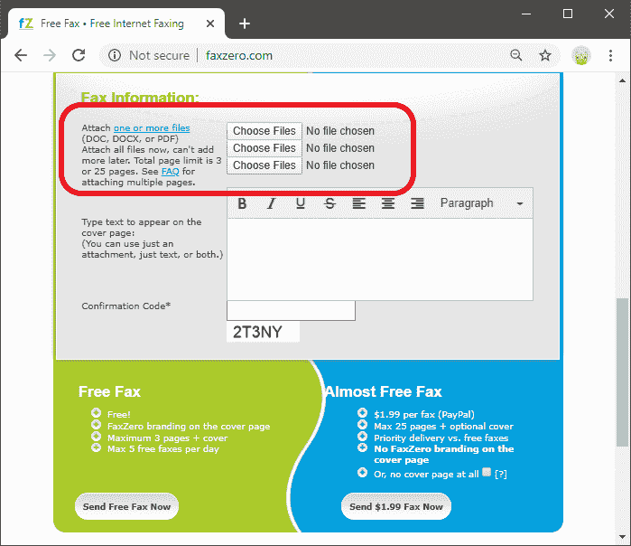

#### 注意:由于我们使用的是免费服务，文档最长不得超过三页。另外，最好是 pdf 格式的文档。

**第 8 步:**如果想在传真中附加更多的文件，移动，再次选择文件。

**第九步:**之后，在文本区添加封面信息，如下图快照所示:

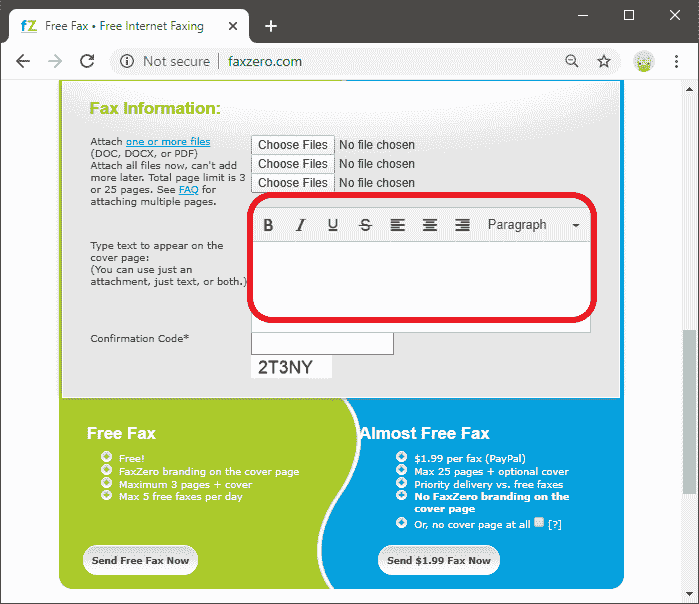

**第 10 步:**最后，输入最后给出的‘确认码’。确保您在“确认码”文本框中正确输入了代码。该代码是一个五位数的字母数字组合。确认码通常用于确认您不是垃圾邮件服务。下面给出了一个快照，确保您正确输入了代码:

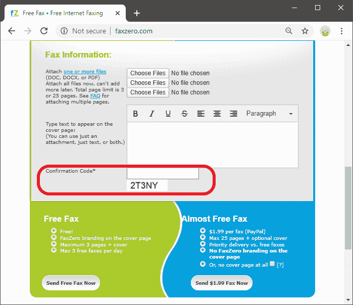

**步骤 11:** 现在，向下滚动并点击传真页面左下角的“立即发送免费传真”按钮。一旦我们点击页面，创建的传真将被发送到所列收件人的传真号码。快照如下所示:

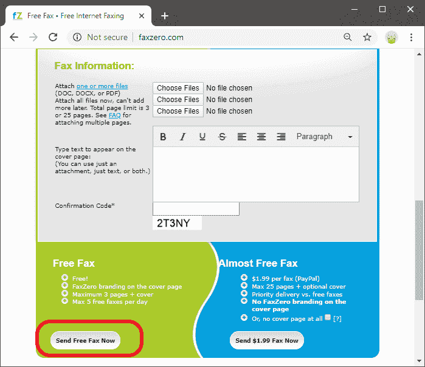

如果您需要发送的传真多于您可以通过支付给定的额外费用购买的服务。

## 接收在线传真

到目前为止，我们已经讨论了从我们的系统向我们选定的收件人发送传真的方法。但仍有一个问题是“如果有人给我们发传真，我们将如何接收传真”。就像发送传真提供在线传真服务一样，其他服务也允许我们接收发件人发来的传真。这些服务提供一个虚拟传真电话号码，并以 pdf 或 tif 的形式通过我们的电子邮件帐户向您发送传真。这样的在线服务是 **FaxBetter** 和 **eFax** ，可以让我们接收传真。我们可以查看收到的传真，打印它们，并保存在我们的计算机系统上。但是，正如我们看到的，我们可以发送给收件人的传真数量有限，同样，我们也只能免费接收有限数量的传真。但是，如果我们需要接收更多的传真，我们可以通过支付所需的金额来购买高级包。

* * *