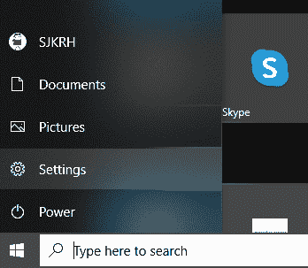
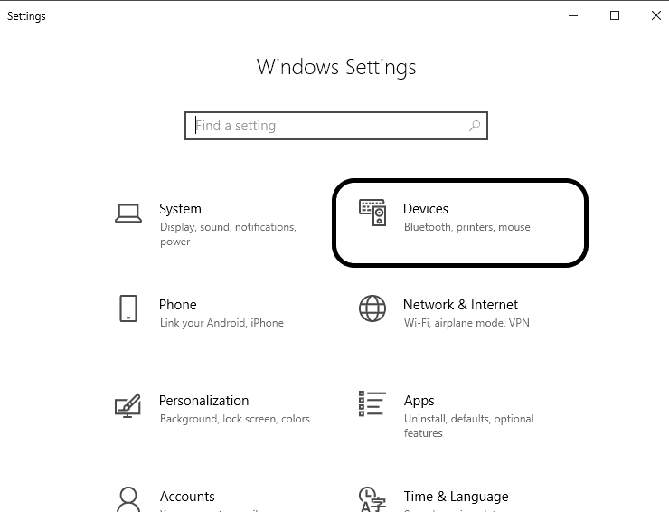
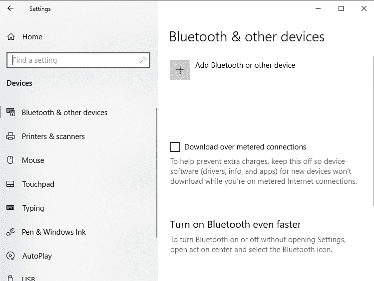
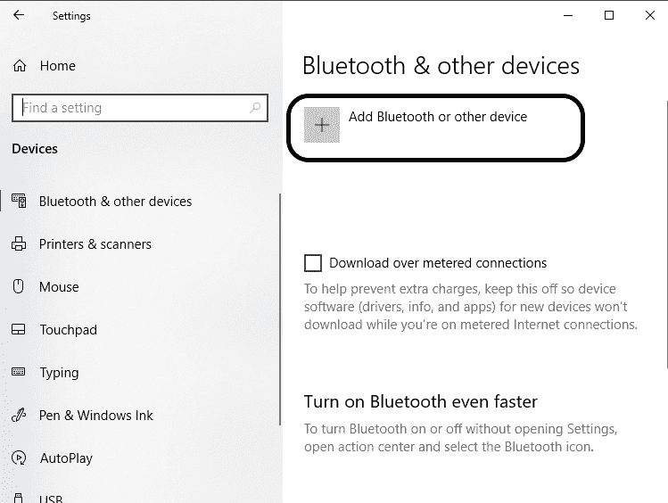
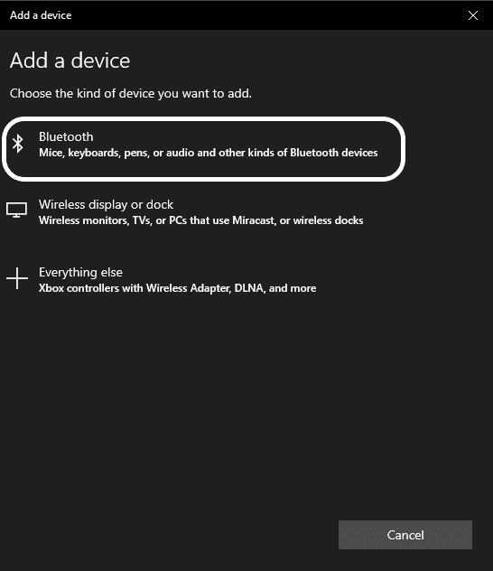
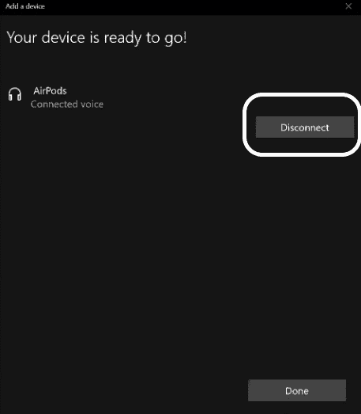

# 如何将天线连接到计算机

> 原文：<https://www.javatpoint.com/how-to-connect-airpods-to-computer>

Airpods 是耳机设备，让我们听到来自电脑或手机的声音。一般来说，AirPods 是指 iPhone 和 iPads，因为它是苹果支持 iOS 设备的集合。但是我们可以和其他设备连接使用 AirPods，包括安卓手机和 Windows PC。Airpods 是无线蓝牙设备，需要蓝牙配对系统才能与其他设备建立连接。Airpods 麦克风功能支持背景声音过滤，这可能会在通话时造成干扰。市场上有各种不同价格区间的 Airpods。

在这里，我们将讨论用户将 Airpods 连接到[视窗操作系统](https://www.javatpoint.com/windows)的步骤。

## 将光盘连接到计算机

将 Airpods 连接到 Windows 电脑有以下步骤:

1) Airpods 是可充电设备，请确保 Airpods 已充电。如果没有，请在继续下一步之前充电。

2)打开电脑系统上的蓝牙。

3)在您的电脑上打开“设置”，方法是直接在搜索选项卡上搜索或按下窗口键，然后从那里选择“设置”，如下所示:

4)将打开“设置”窗口。选择并点击其中的“设备”，如下所示:

5)从“设备”窗口下的左侧菜单窗格中选择“蓝牙和其他设备”，如下所示:

6)点击下图所示的(+)按钮 a，点击“添加蓝牙或其他设备”:

7)将打开一个黑色窗口，要求“添加设备”。点击“蓝牙”，因为 Airpods 是蓝牙设备，需要蓝牙连接。快照如下所示:

8)打开 Airpods 盖子，按住 Airpods 外壳背面的按钮。按住不放，直到您看到 Airpods 机箱前面有一个闪烁的灯。

9)现在，计算机将分析并搜索出机场。如果您的 AirPods 已打开，该名称将显示在“添加设备”列表中。只需点击“机场”。

10)现在，Airpods 将配对并连接到您的电脑。将 Airpods 连接到耳朵上，打开电脑上的任何音频或视频。你也可以和某人打电话。

11)最后，享受系统的声音。

12)如果您想断开 Airpods，请单击“断开”按钮。否则，您可以通过按住 Airpods 外壳背面的按钮来关闭 Airpods。坚持到灯关掉。

所以，通过这种方式，我们可以将 Airpods 连接到计算机。

* * *