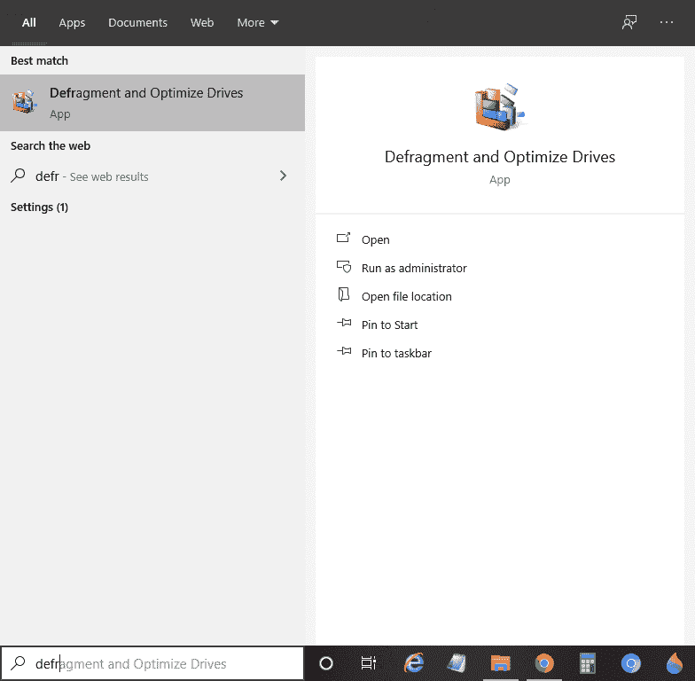
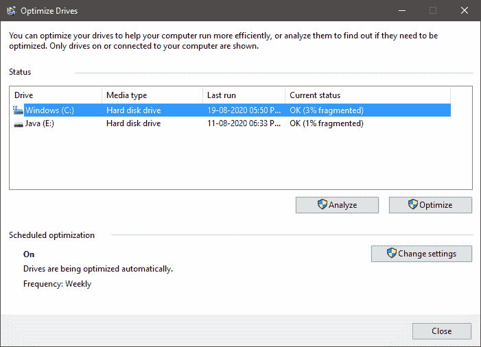
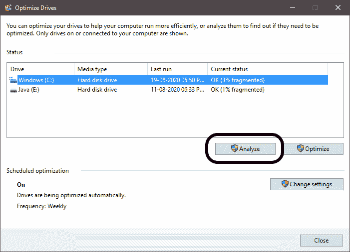
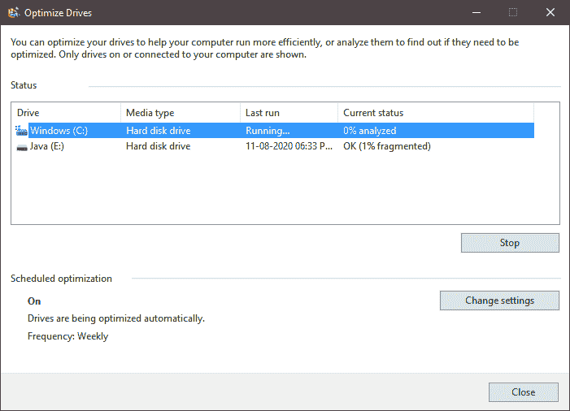
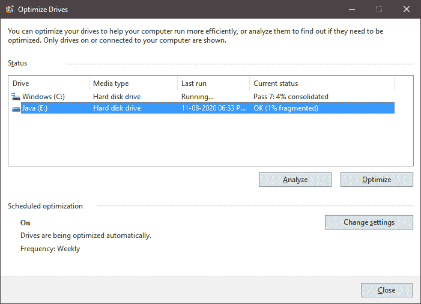

# 如何整理电脑

> 原文：<https://www.javatpoint.com/how-to-defrag-a-computer>

碎片整理是**碎片整理**的缩写，通过组织存储在硬盘中的数据来降低碎片化程度。对计算机进行碎片整理意味着对计算机硬盘进行碎片整理。通过碎片整理，未使用的空间被过滤掉，这就造成了浪费，将更多的数据调整到空间中。碎片整理是对计算机硬盘进行碎片整理的过程，这是维护系统硬盘所必需的。碎片整理有助于系统平稳、快速、高效地工作。一般来说，人们发现不同的操作系统都有内置的定期整理硬盘碎片的系统。但是可以看出，这些内置系统并不能完美地完成任务。因此，每当计算机挂起、降低速度或减慢执行过程时，对硬盘进行碎片整理是很好的。

在这里，我们将讨论用户可以轻松地对计算机硬盘进行碎片整理，从而对计算机系统进行碎片整理的步骤。我们将学习整理视窗操作系统的步骤。

## 对 Windows 硬盘进行碎片整理的步骤

尽管碎片整理的目标对于每个操作系统和版本都是相同的，但是根据 Windows 版本的不同，碎片整理的名称也不同。需要遵循以下步骤:

1)在开始碎片整理过程之前，请确保应该持续向计算机供电，因为碎片整理过程不应该在两者之间停止。否则，可能会对计算机造成重大危害。另外，你不应该在两者之间停止这个过程。

2)打开系统上的碎片整理工具。

2.1.如果您是 Windows 7 用户，则:

打开**控制面板>系统和安全>管理工具>整理**硬盘。

2.2.如果您是 Windows 8 或 10 用户，则:

**步骤 1)** 在搜索选项卡上，搜索“碎片整理”，搜索结果将显示名称为“碎片整理和优化设备”。快照如下所示:

**步骤 2)** 将打开“优化驱动器”弹出窗口，如下所示:

**步骤 3)** 从给定的名称中选择要进行碎片整理的特定驱动器，然后单击“分析”，如下所示:

**步骤 4)** 工具会分析碎片百分比，分析完全后，结果会显示在“当前状态”下，如上图所示。

**步骤 5)** 如果碎片百分比为 10%或更高，则有必要对特定驱动器进行碎片整理。否则这是你的选择。但是建议及时对驱动器进行碎片整理，因为碎片百分比越高，对驱动器进行碎片整理的时间就越长。

**第 6 步)**分析完毕，点击【优化】，碎片整理过程开始，分析如下:

**步骤 7)** 优化过程完成后，硬盘会进行碎片整理，如下图所示，碎片百分比会降低，如下图快照所示:

**步骤 8)** 碎片整理过程完成后关闭工具。

3)最后，系统将进行碎片整理。

#### 注意:如果碎片驱动器百分比太高，则碎片整理可能需要一整夜/一天。

### 需要注意的几点

在以下情况下，用户应执行硬盘碎片整理:

*   速度降低了很大一部分，即系统运行太慢。
*   文件加载速度比正常速度慢。
*   游戏加载时间很长。

* * *