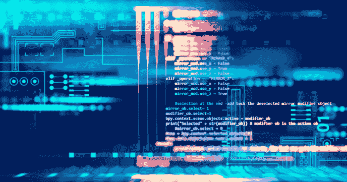
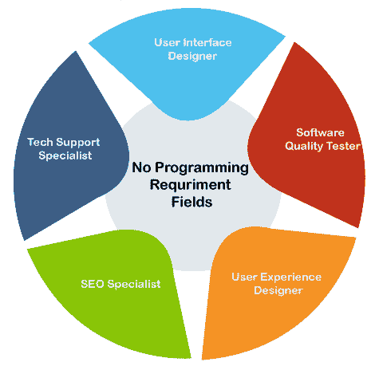

# 计算机科学难吗

> 原文：<https://www.javatpoint.com/is-computer-science-hard>

亚太及日本地区的阿卜杜勒·卡拉姆博士曾引用“如果你想像太阳一样发光，首先要像太阳一样燃烧”。如果你想在生活中有所成就，你必须努力工作，因为努力工作是成功的关键。关于计算机科学，它是我们学习的一部分，当我们从某件事开始时，它似乎很难。但是当我们开始觉得有趣的时候，这个词就变成了“太简单了”。首先，让我们讨论计算机科学。

## 什么是计算机科学

计算机科学是对计算机及其技术的研究。必须对[计算机编程](https://www.javatpoint.com/what-is-computer-programming)和技术(包括硬件和软件)有深刻的理解。它涵盖了计算机的所有核心概念，包括算法、设计、开发以及[计算机科学](https://www.javatpoint.com/what-is-computer-science)的应用。计算机科学领域广阔，前景光明。如果一个人擅长解决问题和数学，计算机科学是一个不错的选择。

### 计算机科学是一门难学的学科吗

这个问题可以有两个条件，即

*   是的，计算机科学很难。
    因为这门学科涵盖了复杂问题、设计、开发、问题解决以及逻辑编程的研究。所以，如果你擅长数学或解决问题，计算机科学对你来说并不难。另一方面，不擅长数学的人不会觉得计算机科学太容易。但是，人们应该知道，计算机科学不仅限于编程和开发。计算机科学领域过于广阔，涵盖了其中的众多领域，在这些领域中，擅长编程或算法并不是强制性的。不学习编码，你可以选择很多职业。并非其他选择不面向未来。有人在编程中前进，是因为世界在向编程前进，但不应该是这样的。一个人应该追随自己的激情和兴趣。
*   准备好了！
    在这样的条件下，当一个人最终已经决定他/她要进入计算机科学领域的时候。那么这个人就不应该后退。这是因为有时看似困难的事情变得容易，反之亦然。还有，生活中没有什么是容易的，没有通向成功目标的捷径。如果你积极地做一些事情，在经历了一些失败之后，如果你保持着实现人生目标的热情，你一定会成功。在计算机科学中，大多数人开始发现编程很难。因此，下面我们讨论了计算机科学中不需要编码或编程知识的各个领域:
    
*   **用户界面设计师:**负责设计 ui 的设计师。设计师设计并创建软件界面的外观。如果一个人擅长设计和创意，可以去学习 UI 设计师。
*   **软件质量测试人员:**又称 *SQT* ，是负责在软件产品向公众发布之前对其质量进行测试和分析的人员。SQT 确保开发的软件产品运行良好，并能满足客户的要求。这些测试人员执行几个压力测试、可伸缩性测试和压力测试，以便在发现错误时移除错误并提高软件产品的质量。虽然，软件质量测试人员是一个测试领域，但不同于质量保证。
*   **用户体验设计师:**又称 *UX* 是按照最终用户设计产品的设计师，即把最终用户放在心上。这是因为他们的主要目标是让用户满意。他们创造出能让用户满意的产品。然而，名称是相同的，但未爆炸弹药的工作领域可能有所不同。有些设计师参与用户研究，专注于用户研究，有些 UXers 专注于产品原型。
*   **搜索引擎优化专家:**这样的称呼也以*一个搜索引擎优化专家*而闻名。以处理市场而闻名的人。搜索引擎优化专家负责处理和增加搜索引擎中任何特定网站的排名。这些专家与设计师和开发人员合作，为网站实施最佳实践。因此，搜索引擎优化专家的主要任务是维护和增加网站在各种搜索引擎上的排名。所以，在 SEO 领域对编程没有要求。
*   **数据分析师:**分析师是拥有庞大数据集进行分析的人。要成为一名数据分析师，需要很强的数学和分析技能。在这个领域，可能对编程也有一定的要求。
*   **企业软件销售:**这是一份特殊的工作档案，在这份档案中，员工还可以获得带薪的佣金和奖金。这些人处理企业对企业的服务，称为 B2B 服务。不需要编程或编码。
*   **Web 分析师专家:**这些专家也与 SEO 和数字营销相关，他们的角色是专注于网站流量的衡量，网站元素的目标设置。这些分析师通过代理机构工作，他们代表多个客户，因此处理多个网站。
*   **技术支持专员:**这是一个人可以在家工作的最灵活的工作。这项工作是帮助客户解决与任何软件或服务相关的问题。需要有很强很好的沟通能力。

如果害怕编程，可以在这些领域建立自己的事业。但是，有句话说得好，“不可能本身就说‘我是可能的’。因此，如果你害怕计算机科学由于人们的流言蜚语，知道你自己的行为，然后决定。

* * *