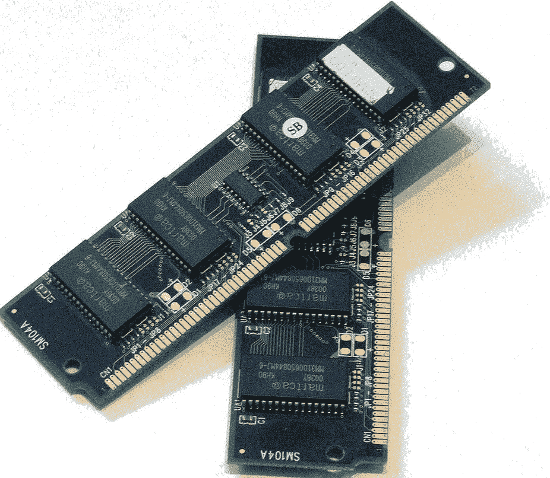
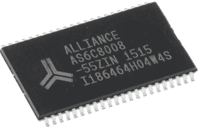
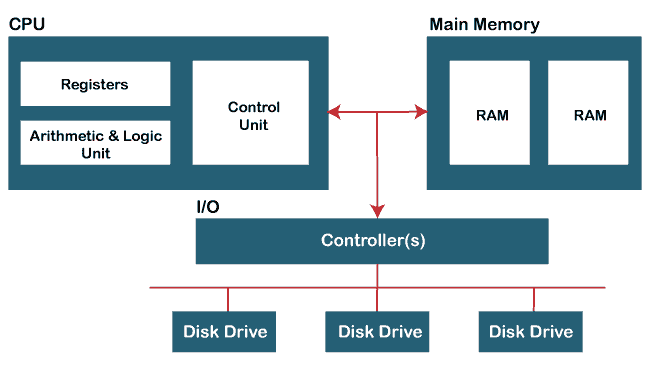

# 内存在计算机中起什么作用

> 原文：<https://www.javatpoint.com/what-does-ram-do-in-a-computer>

**随机存取存储器**的缩写是计算机系统的主存储器。它是负责读写数据的主存储器。随机存取存储器是一种可以随机存取的易失性计算机存储器。这就是它名字背后的原因。它是每个设备必不可少的组件，不仅对于计算机系统如此，对于移动电话、服务器、平板电脑等也是如此。它是数据临时存储的短期存储。当设备断电或设备出现故障关机时，数据不会被保存，也会丢失。电脑[内存](https://www.javatpoint.com/ram-full-form)是一个让我们能够执行日常任务的内存，比如加载网页、执行代码、上网和玩游戏。所有这些都在系统的主存储器上执行。

在这里，我们将对内存进行简单的[介绍，并了解其工作功能。](https://www.javatpoint.com/ram)

### 随机存取存储器的特点

以下几点最能描述内存的特性:

*   RAM 是易失性存储器，这意味着它不允许永久存储数据。这是一种短期内存，因为它只能容纳处理器所需的数据量。**例如**如果玩游戏，所有必要的数据都从硬盘加载到 RAM 中，游戏结束后，处理器切换到其他任务。
*   读/写数据所需的时间取决于数据在内存中的物理位置。
*   它是中央处理器的内部部分。
*   无论是物理上还是存储空间上，内存的大小都太小了。
*   我们可以随机访问任何存储单元。
*   它由多路复用和解复用电路组成，能够将数据线连接到寻址存储器，以读取/写入数据条目。
*   随机存取存储器是集成芯片或集成电路与金属氧化物半导体存储单元的组合。

### 内存类型

内存本质上是易失性的，但有些数据需要永久存储，即使系统崩溃或电源关闭，这些数据也可能永远不会丢失。对于这样的问题，非易失性存储器也被开发出来，它们有自己的限制。一种这样的非易失性存储器包括**只读存储器**，其随机读取数据但不能写入数据。

除此之外，还有以下类型的易失性 ram 可用:

*   **动态随机存取存储器:**为**动态随机存取存储器**拍摄，其中“动态”一词表示存储器是动态的。这意味着如果系统断电，您的所有数据都将丢失，因此需要不断刷新内存。应该知道，在我们的系统中，动态随机存取存储器是作为具有 **4GB** 或 **8GB**
    
    的主存储器(即随机存取存储器)存在的。动态随机存取存储器是由一个电容器和一个晶体管组成的存储单元的集合。因此，动态随机存取存储器的寿命很短，需要刷新数百万次。RAM 的物理尺寸也很小，价格便宜，功耗很小。
*   **SRAM:** 代表**静态 RAM** 或**静态随机存取存储器**，其中“静态”一词表示它是一种静态类型的存储器。它主要用于缓存。对于每个存储单元，静态随机存取存储器使用 **4 - 6 个晶体管**，其中没有任何电容器，因此我们不需要连续刷新静态随机存取存储器。
    
    SRAM 的尺寸比 DRAM 大，需要更多的空间。因为它在一个芯片上占据了更多的空间，所以我们在每个芯片上获得的内存更少。这使得 SRAM 价格昂贵。它比 DRAM 更快更贵。快速的工作能力使得它可以为系统的中央处理器创建一个缓存。

两种类型的随机存取存储器都有自己的特性和商业用途。在 **1965 年，IBM** 为他们的计算机制造了 **SP95 静态随机存取存储器**芯片，即**系统/360 型号 95** 。另一方面，DRAM 被**东芝(一家日本跨国公司)**用于名为 **BC-1411** 的电子计算器。

### 内存的功能

内存本质上是易失性的，这使得它无法永久存储数据。当内存充满时，计算机的处理器会反复移动到硬盘上，以便用新数据覆盖旧数据，从而降低计算机的运行速度。在硬盘和内存的情况下，硬盘可能会耗尽存储空间，但在内存的情况下不会。计算机内存永远不会耗尽，只会降低运行速度。

上图显示了计算机系统的内存组织，其中显示了内存与系统其他组件的连接。

随机存取存储器以这样一个概念而闻名，即存储数据的任何位置都可以被随机访问。它将常规核心内存与**离线内存**区分开来。离线存储器指的是一种磁带，在这种磁带中，通过从开始到结束以顺序的方式提供地址，可以访问特定的数据集。内存的组织是以这样一种方式完成的，即数据被存储到特定的位置或从特定的位置获取。计算机内存存储在**微芯片**中。为了理解随机存取存储器的工作原理，可以把它看作一组可以携带 1 或 0 值的盒子(即..二进制数字)。在集合中，每个盒子都有它唯一的地址，可以通过计算盒子的列数和行数来识别。因此，这组盒子被称为一个**阵列**，而盒子就是该阵列中的单元。阵列(随机存取存储器阵列)中的每一行和每一列都有自己的地址线，任何读取的数据都会在单独的数据线上返回。为了找到特定的单元，列和行地址由**随机存取存储器控制器**发送到蚀刻在芯片中的细电线。由于内存的物理尺寸太小，很容易将其存储在微芯片中。此外，随机存取存储器的数据保持容量也很小，因此，与能够存储高达 10 TB 数据的硬盘相比，它能够存储更少的数据量。现在，在将内存放入微芯片后，这些芯片被放入内存模块。这些内存模块插入计算机主板上的插槽。主板的这些插槽通过总线或一组电气路径连接到计算机处理器。在硬盘驱动器的情况下，数据存储在磁化表面上，固态硬盘将数据存储在本质上非易失性的存储芯片上。这样就完成了计算机内存的工作。

但是，我们不需要担心内存存储容量，因为大多数计算机系统允许我们用现有的内存添加更多的内存模块，但有一些限制。计算机系统的速度与内存大小成正比，即内存越大(数据存储)，计算机处理器的速度越好。因此，数据操作以及应用程序的执行和加载时间加快了。

### 我们到底需要多少

内存的实际大小取决于我们对计算机系统施加的负载量。更多的负载意味着需要更多的内存。如果你是游戏玩家，对内存的要求更高，最低 16GB 或更高。如果你是一个视频编辑器，使用类似 Photoshop 的软件，你需要大量的内存。因为如果内存少，处理器负载多，速度会自动降低。因此，为了完成繁重的任务，需要更多的内存。即使您有 4GB 内存系统，您也可以购买额外的内存，并将其包含在现有的内存中。建议购买至少有 4GB 内存的笔记本电脑或台式机。

* * *