# 如何将音乐下载到电脑

> 原文：<https://www.javatpoint.com/how-to-download-music-to-computer>

音乐太强大了，它要么让我们快乐，要么让我们悲伤，要么让我们兴奋，要么让我们情绪化。每天我们都会听到不同类型的音乐，有时是根据我们的心情，有时是想改变心情。希望有某些种类的音乐可供选择，并且有很多在线方法可以听完它们。更早听到歌曲，我们需要购买各种磁带，光盘，DVD，或依靠收音机听音乐。然而，今天我们都依赖于互联网，对于每一项任务，我们都利用互联网。因此，为了下载音乐或听歌，我们使用 YouTube、谷歌播放音乐、永利音乐和许多其他软件。我们中的许多人都想把音乐保存到我们的电脑上，这样我们就可以随时在离线模式下听到它们。因此，有几个平台可以让我们在电脑上下载音乐。

在这里，我们将讨论一些下载音乐到我们的计算机系统的方法。

## MP3JAM 音乐下载器

MP3JAM 是一款免费使用的音乐下载软件。我们可以很容易地下载并安装在计算机系统上，并在我们的计算机上下载许多歌曲。它是一个免费的 MP3 下载器。使用 MP3JAM，我们还可以搜索 YouTube 链接。它使我们能够下载一首单曲或完整的 MP3 格式的专辑到我们的电脑。MP3JAM 支持 hashtag (#)功能，通过它我们可以输入诸如#love、#dance、#sad 等标签。这样做，我们得到了一个根据我们给定的标签可用的顶级歌曲的列表。它还有一个内置的播放器，可以让我们在下载到系统之前先听歌。使用 MP3JAM 下载器下载音乐有以下步骤:

1)最初，您需要下载并安装 **MP3JAM** 软件到您的系统。不需要担心。这是一个轻量级和快速的软件。您可以从其官方网站或提供的链接下载:[https://www.mp3jam.org/](https://www.mp3jam.org/)。快照如下所示:

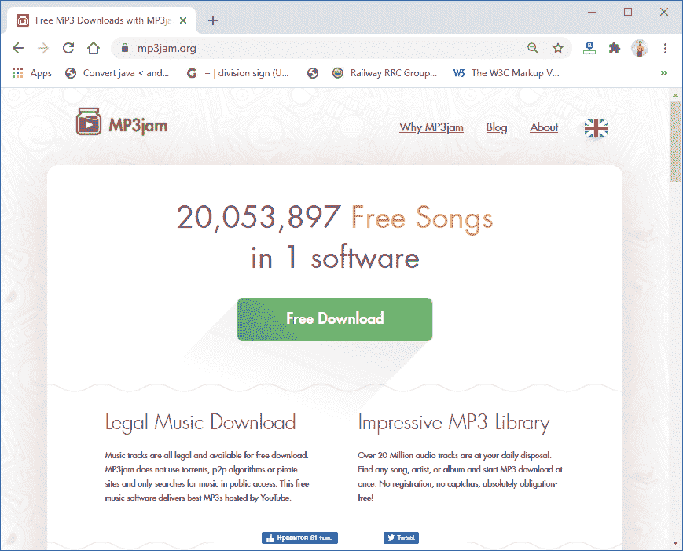

2)软件下载成功后，移动到下载的位置，双击安装程序。

3)按照安装说明，单击“下一步”和“下一步”，最后单击“完成”，软件将安装到您的计算机上，如下所示:

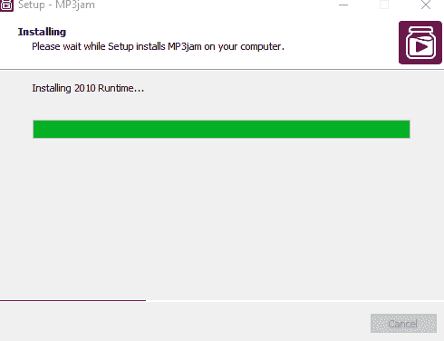

4)最后，MP3JAM 设置成功安装后，软件会打开，如下图:

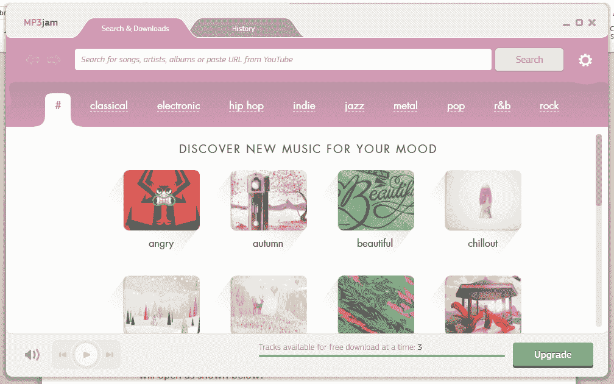

5)通过在搜索选项卡上搜索或向下滚动可用音乐来搜索要下载到计算机的歌曲或专辑。

6)搜索歌曲时，您将看到您提供的歌曲的某些相关搜索，如下所示:

7)只需点击“播放”按钮听一遍歌曲，然后点击“下载”按钮。两个按钮一起出现，如下所示:

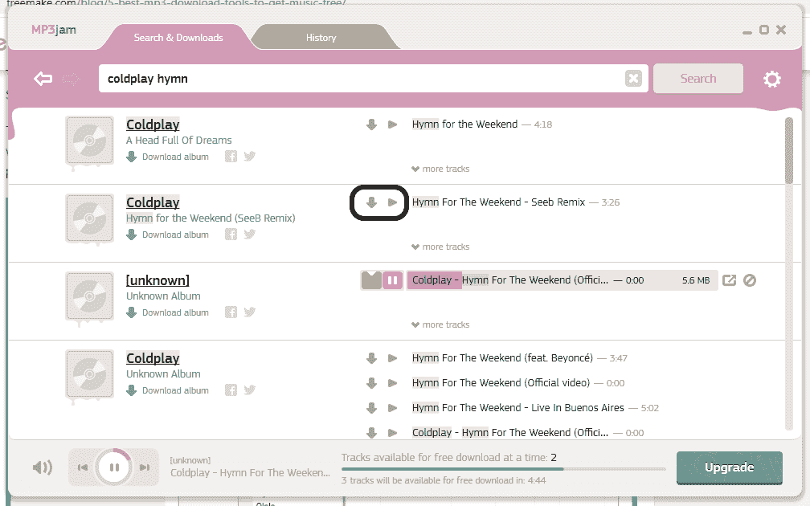

8)歌曲下载完成后，会保存在电脑的“历史”页面和“音乐”文件夹中。要知道文件夹的位置，请点击歌曲名称下方的“打开文件夹”选项。快照如下所示:

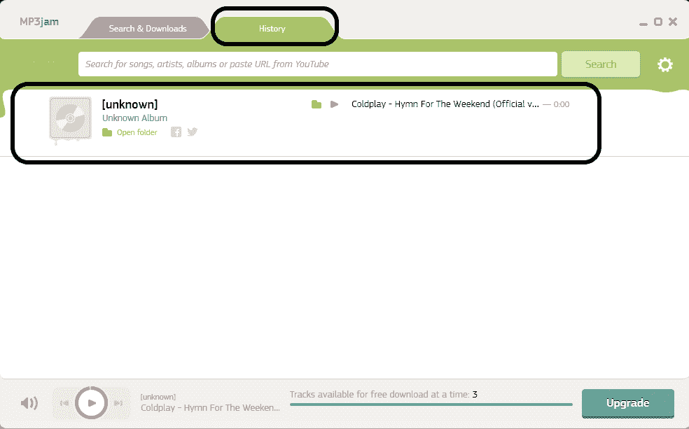

9)如果你想从 YouTube 链接下载音乐，也可以使用 MP3JAM 软件进行下载。只需要在 YouTube 上打开特定的歌曲，并复制视频的链接/地址。

10)将复制的地址粘贴到 MP3JAM 设置窗口的搜索选项卡中，如下所示:

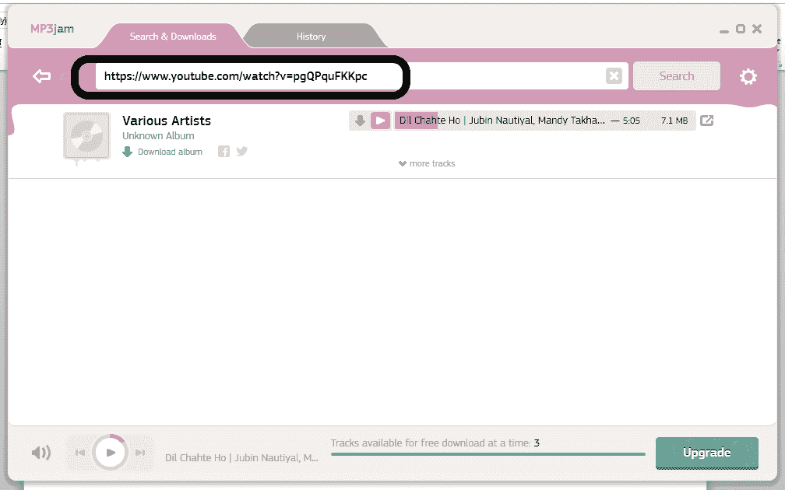

11)点击“播放”按钮听完歌曲，满意后点击“下载”按钮将歌曲下载到电脑。想什么时候享受就什么时候享受。

因此，我们可以使用 MP3JAM 下载器轻松地将任何音乐下载到我们的计算机上。

#### 注:我们可以免费下载 3 首曲目。此外，要将完整的专辑下载到我们的电脑上，需要付费的 1 天终身订阅。

## FROSTWIRE MP3 音乐下载器

FROSTWIRE 是另一种类型的音乐下载器，可以让你听和下载任何你想要的音乐。它是一个免费的 MP3 音乐抓取器，遵循点对点或 p2p。早期它并不安全，因为它的一些工具是面向病毒的，但是在 2017 年，这些广告被开发者删除了，现在它可以安全地欣赏真正的音乐。要使用 FROSTWIRE 下载音乐，您需要遵循以下步骤:

1)最初，您需要将 FrostWire 软件下载并安装到您的计算机系统，或者您可以从提供的链接下载:[https://www.frostwire.com/](https://www.frostwire.com/)。快照如下所示:

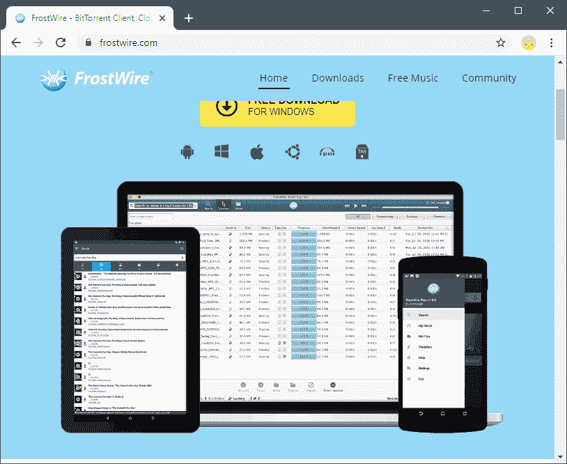

2)成功下载 FrostWire 软件后，您需要将其安装在您的计算机上。它将显示一个“欢迎”屏幕，如下所示:

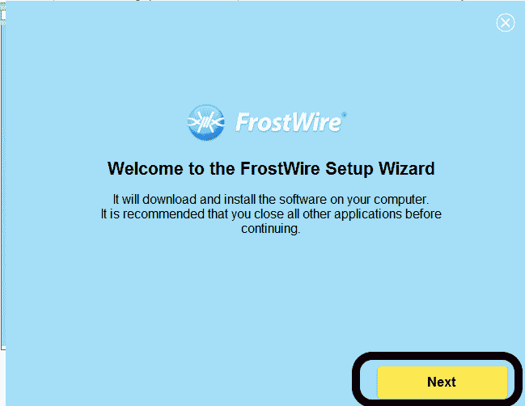

只需点击“下一步”。

3)然后，将打开“许可协议”页面。只需点击“接受”按钮接受许可协议。快照如下所示:

4)霜之火设置的安装将开始，如下所示:

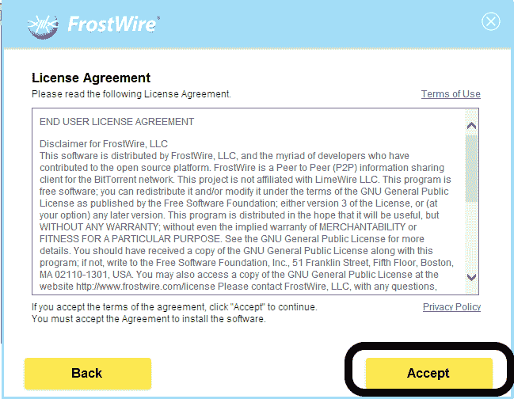

5)安装成功后，单击“完成”并启动软件。将会打开“霜火安装向导”欢迎页面。点击“下一步”，如下所示:

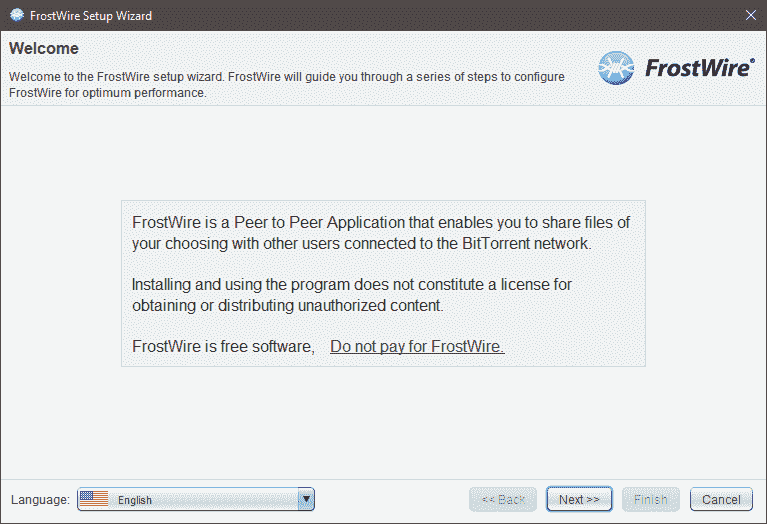

6)现在，选择要保存数据的位置。在“种子设置”下，选择“种子完成下载”，然后单击“下一步”，如下图所示:

7)单击“下一步”，然后单击“下一步”，然后单击“完成”。

8)霜火设置将打开，如下所示:

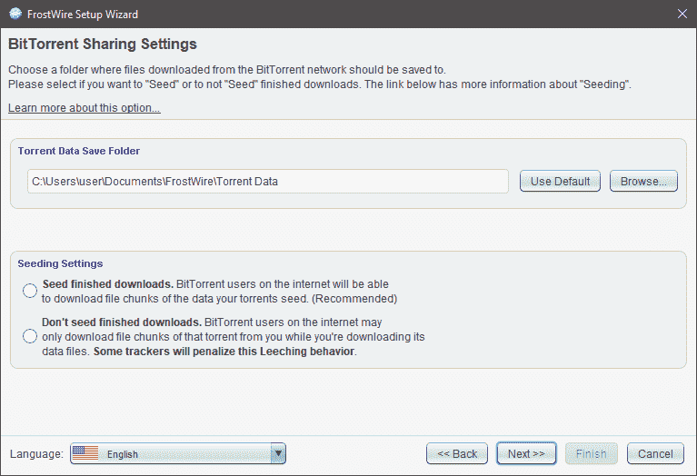

9)现在，通过在搜索栏中搜索歌曲名称来选择您想要下载的歌曲，相关关键词歌曲列表将出现，如下图快照所示:

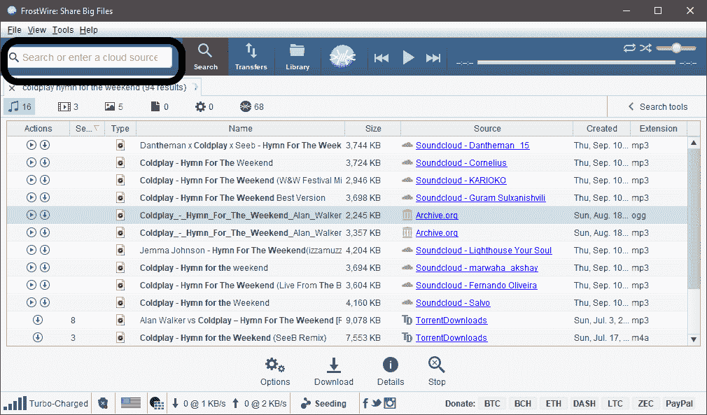

10)从列表中选择你想听和下载的歌曲。要播放歌曲，请单击“播放”按钮，要收听歌曲，请单击“下载”按钮，如下所示:

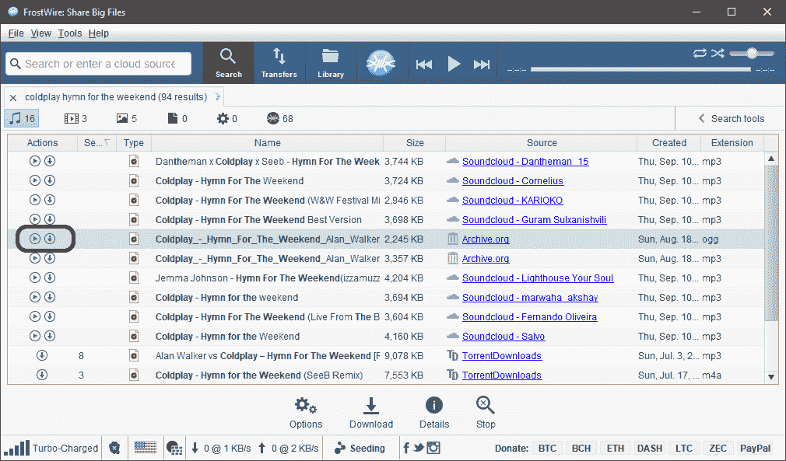

11)当您点击“播放”按钮时，您将被重定向到加载歌曲的浏览器选项卡，您可以听到如下所示:

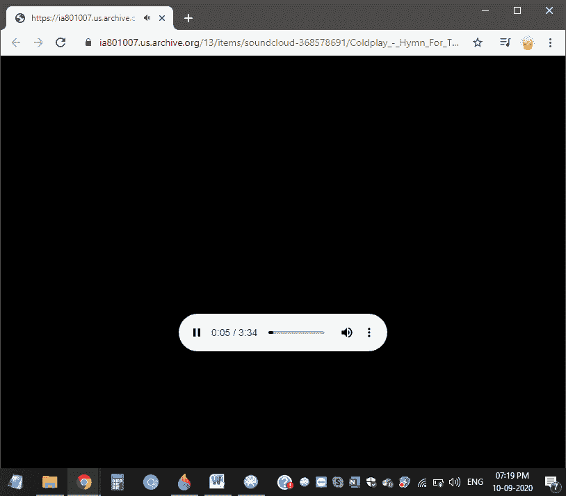

12)你会看到三个垂直的点。点击点，它将提供一个“下载”选项。点击它，如下图所示:

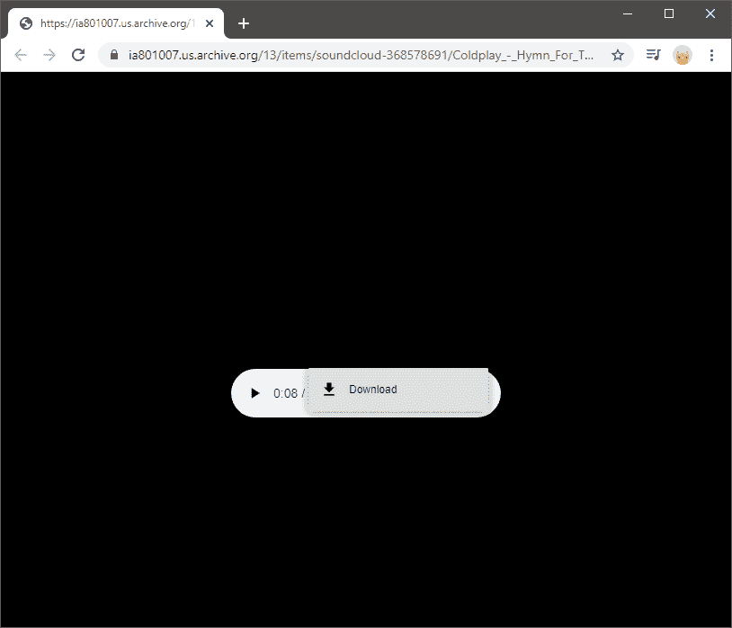

13)只要点击“下载”，歌曲就会被下载到你的电脑上，歌曲下载成功后，就会被保存到你的电脑上。你可以随时听这首歌。

14)下载完成后，关闭设置并“退出”。

除了这些方法，还有各种其他的 MP3 下载工具可以帮助你下载音乐并保存到你的电脑上。

* * *