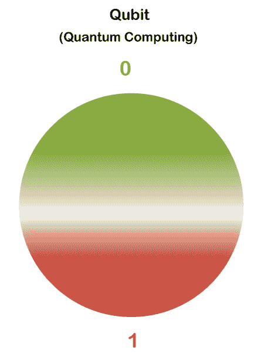
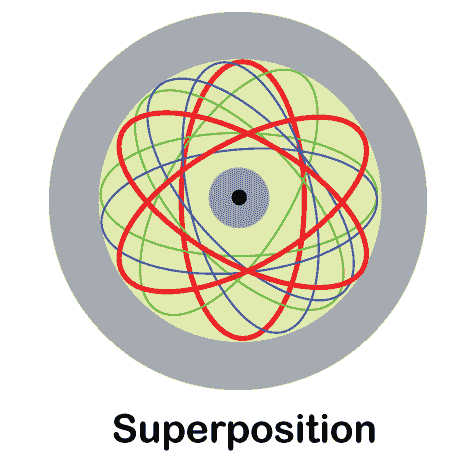
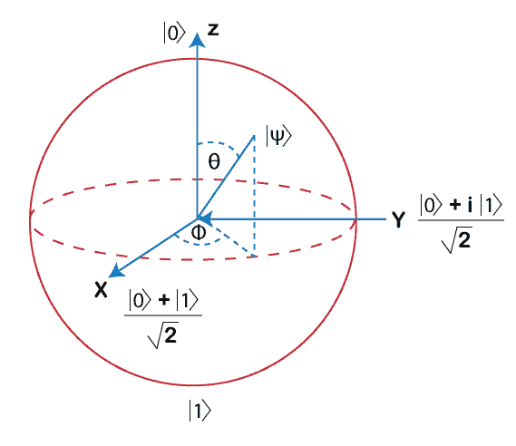

# 量子计算机是如何工作的

> 原文：<https://www.javatpoint.com/how-does-a-quantum-computer-works>

量子计算机正以极快的速度进入信息技术领域，并为这些技术带来福音。量子计算机的概念是基于物理学的量子理论。

预计量子计算机将提高计算能力，这意味着用普通计算机系统求解时至少需要一年才能求解的计算可以在几秒钟内由量子计算机求解。这就是量子计算的力量。在一些大品牌，如谷歌，量子计算机已经成功开发和实验。虽然这是一个非常强大的计算机系统，但它的结构和使用方法太复杂了。因此，非技术人员将无法操作和理解它。目前，它只被研究人员和科学家使用。尽管如此，这项工作仍在进行中，以便为即将到来的时代建立一个非常迷人和强大的计算机系统。这项研究是在这样的计算机上进行的，因为它是一个非常优化的、复杂的、迄今为止最快的计算机系统之一。未来可能成为障碍的挑战仍在发生，因此需要做更多的工作来使量子计算机达到最佳版本。

在这里，我们将讨论量子计算机系统的工作过程及其基本概念，了解量子计算机的工作应该很好地理解这些概念。

## 量子计算机导论

在了解量子计算机的工作原理之前，应该先简单介绍一下量子系统。量子计算机是一种计算机系统或设备，用于计算普通计算机系统无法处理或可能需要一百年才能解决的复杂问题。量子计算机遵循物理学的量子理论。物理学的量子理论深入描述了自然。这种特性使量子计算机能够工作和处理复杂的问题。到目前为止，我们已经了解并理解了一台计算机，它能以两个二进制位(0 和 1)的形式理解数据。在量子计算机的情况下也是如此，但是量子计算机以量子比特(0 或 1)的形式接受输入。这意味着它只接受一个值作为输入。因此，在经典计算机系统中，比特是最小的单位，而在量子计算机中，量子比特是数据处理的最小单位。这种差异使得量子计算机的性质和行为更加复杂。

## 量子计算机的概念

量子计算机依赖于量子计算的概念，量子计算进一步基于量子信息科学。基本上，在讨论量子计算机的量子计算机概念时，应该记住以下基本原则。

因此，量子计算机有以下基本现象:

**1)量子比特:**也称为量子比特。如上所述，这些量子位是量子计算机中的存储单元和数据表示单元。在传统计算机中，它使用位来存储和表示 0 和 1 形式的数据。在量子计算机中，数据要么以 0 或 1 的形式表示，要么同时以 0 和 1 的形式表示。此外，量子位因位而异，因为量子位可以保持在中间状态，直到不被读出。除非被测量，否则量子位有概率为 0 和 1。这些量子位用于表示原子、离子、光子或电子及其相关的控制设备，这些设备一起处理和工作，充当计算机处理器或计算机存储器。

**2)叠加:**用户提供的数据在量子计算机中以量子比特的形式编码，这些量子比特继承了并行性。由于这种并行性，量子系统能够在一次尝试中计算数百万次计算。

叠加的概念是量子位的同时定位。这意味着量子位(0 和 1)是硬币的两面，当旋转硬币时，任何一个结果都会被定位。它可以是 0 或 1。量子位的默认状态是 0，这意味着它从 0 开始，并随着测量而变化。

**3)纠缠:**在量子物理学中，有一个纠缠的概念，没有这个概念，量子比特和叠加就不够强大。量子计算机的真正魔力只从纠缠开始。“纠缠”这个词描述了距离对于量子比特来说并不重要。这意味着量子位之间的联系非常紧密，以至于这些量子位即使相距很远也会相互影响。阿尔伯特·爱因斯坦说，量子物理的这一方面被称为“远距离的幽灵行为”。这些量子比特相互依赖。

根据纠缠，当增加量子比特的数量时，这些关联的数量以指数方式增长。例如，n 个量子比特有 2 n 个关联。这使得量子计算机有可能解决高度复杂的问题，而这恰恰是经典计算机的希望。

因此，量子物理的这三个方面构成了量子计算机的力量。其中三个完成了量子计算机的工作。

## 量子计算机的工作

数据表示单位是量子系统的量子比特。系统通过在测量物体之前确定其状态的概率来执行计算。这些量子位既相互叠加又相互纠缠。为了制造功能量子位，这些系统应该被冷却到接近绝对零度。在这种情况下，量子比特是过冷的，它们不能长时间保持它们的相干性(纠缠态)。这就是创造额外复杂程序背后的原因。因此，为了对量子系统进行编程，不同种类的逻辑门以顺序的方式使用。然而，这些程序需要执行得太快，以至于量子比特的相干状态在测量之前保持不变。量子比特的状态可以用三轴 x、y 和 z 来表示，其中状态是沿着这三个轴的值的组合，即叠加。

因此，当量子位处于叠加态时，事件发生的概率为 1 或 0。一旦一个量子位在任何状态下被读取，它就会丢失关于另一个状态的信息。例如，如果量子位的状态被读取为 0，那么它将丢失关于状态为 1 的所有信息。众所周知，一个量子比特的起始状态是 0。后来，使用哈达玛门(一种逻辑门)，它被移动到一个中间状态，由于这个中间状态，量子位的状态值在一半的时间里被读取为 0，然后在另一半的时间里被读取为 1。其他逻辑门用于在三个轴上以不同的量在不同的方向翻转量子位状态。有三个，其中两个轴是 0 和 1，第三个轴表示相位，并且还提供了一些额外的可能性来表示信息。你可以在下图中看到量子比特状态的工作原理。

但是，如果没有纠缠，量子位和叠加的力量是不完整的，因为这个概念会产生多个巨大的潜在增益，如:

1.  距离在执行操作时不会造成任何障碍。
2.  有可能执行一个庞大而高度复杂的程序，不是针对所有问题，而是针对某些类型的问题。
3.  创建一个复杂分子和材料的模型，这是不可能的，或者用经典的计算机系统来模拟似乎很困难。
4.  在即将到来的量子系统将变得强大到足以大规模维持量子状态的时代，创新长距离安全通信。

在编程的情况下，具有纠缠的量子计算机通过一个 c-NOT 逻辑门开始，该逻辑门通常被编程并用于翻转纠缠粒子的状态，如果它的伙伴值被读出为 1，但是它只在被测量时执行。

## 量子计算机的类型

量子计算机有以下几种类型，这些类型是由 IBM 制造的:

### 量子退火器

与其他两种类型的量子计算机相比，它是功率最小的类型。然而，它是要构建的最简单的类型，只能执行一个特定的功能。该系统由 **D-Wave 9** (一家加拿大公司)开发，但不确定它是否获得任何真实的定量。2015 年 12 月，谷歌在对 D-Wave 量子系统进行测试后也对其表示赞赏，并称 D-Wave 系统在测试时，解决问题的速度比超级计算机快 3600 倍。尽管如此，量子退火器的优势并没有被传统计算机所证明。

### 模拟量子

它比安乃尔系统更强大，安乃尔系统能够模拟复杂的量子相互作用，可以与任何传统系统相互作用。还预计模拟量子系统将能够容纳 50 至 100 个量子比特。

### 通用量子

它是三种量子计算机中最强大的一种。因为这是最强大的手段，也是最难建立的手段。建立一个足够强大的系统的工作正在进行中。因此，它需要应对某些困难的挑战。根据目前的情况，通用量子计算机将能够容纳 10 万个物理量子比特。宇宙量子比普通的经典计算机快指数倍。但是，它需要面对和拥有各种挑战。该系统使用量子力学处理大量数据，并以最强大的方式进行计算。

因此，量子计算机的未来太光明了，肯定会大幅增长市场。它将能够与[人工智能](https://www.javatpoint.com/artificial-intelligence-tutorial)、密码学、机器人学、制药学以及国防协调和合作。量子计算机的市场可以达到万亿美元，但预计通用量子将于何时上市。然而，量子计算机领域的工作和进展正在进行中，预计它将在未来五年成为世界的趋势。

* * *